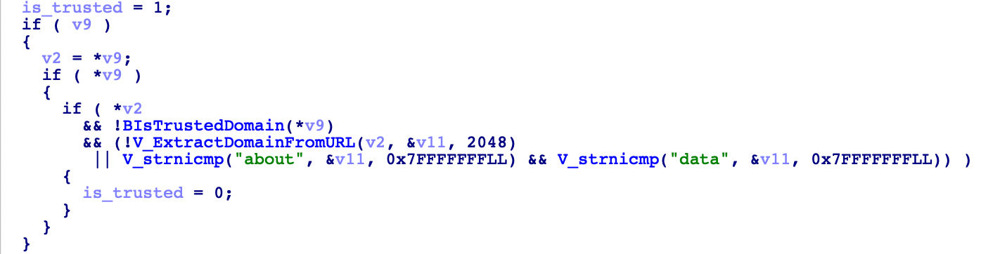
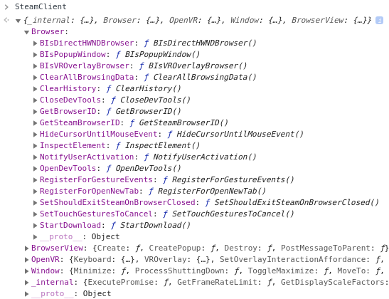
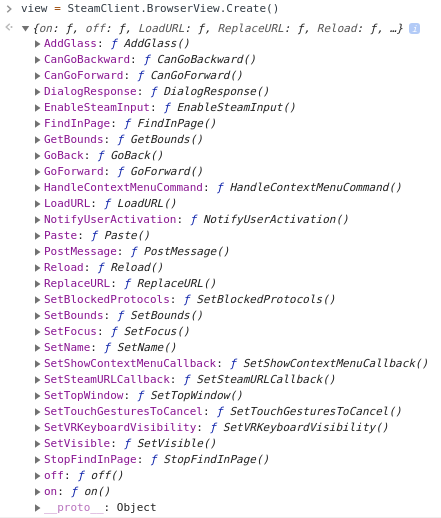
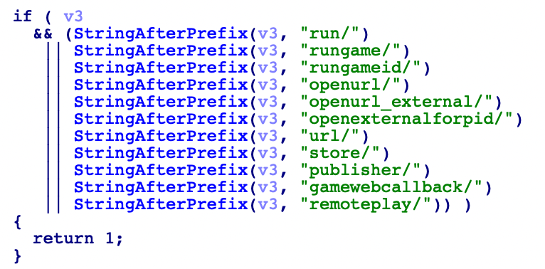
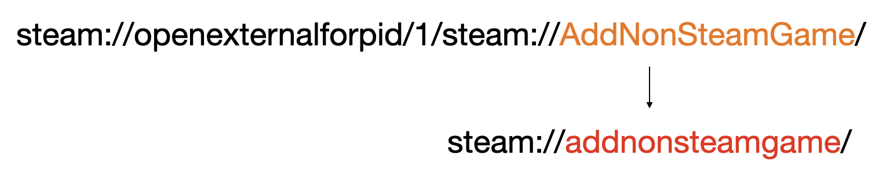
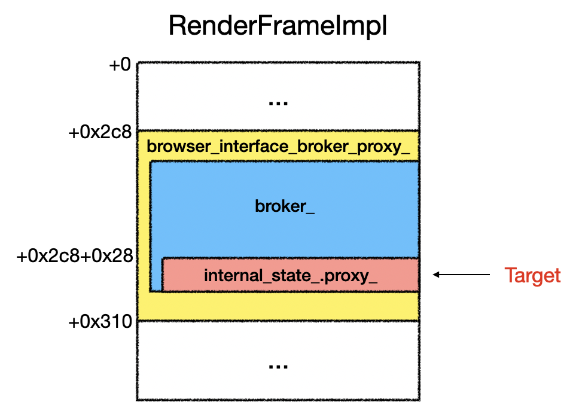

+++
title = 'Exploiting Steam: Usual and Unusual Ways in the CEF Framework'
date = 2024-06-27T11:39:32+08:00
draft = false
+++

## Introduction

The Chromium Embedded Framework (CEF) is an open-source framework that allows developers to embed the Chromium engine in their applications. Although CEF is widely employed in a range of popular software, including WeChat and the Epic Games Launcher, there has been little security research on it. In this article, we will use the Steam Client Browser (a CEF-based application) as an example to present the vulnerabilities we found and how we exploited them to build three Remote Code Execution (RCE) chains.

## RCE#1: Multiple Issues in `steamwebhelper` Leading to RCE

`steamwebhelper` is a built-in browser within the Steam client, used for rendering pages such as the store, community, and friends. It is developed based on `CEF` and has added some features on top of `CEF`. We have found a series of logical vulnerabilities and issues caused by these additional features, eventually leading to RCE.

### Obtaining the `SteamClient` Object in External Pages

When `steamwebhelper` loads certain specific pages, such as `steampowered.com` and `steamloopback.host`, it injects a **privileged object** `SteamClient` into the JavaScript environment. Upon reverse engineering this process, we discovered that for URLs with a domain name, `steamwebhelper` calls `BIsTrustedDomain` to check if the domain is in the whitelist. For URLs without a domain name, it checks whether the domain  is a `data` or `about` protocol.



Loading a domain in the whitelist from an external page will be restricted by the same-origin policy, however, loading pages like `about:blank` will not be. So we can open "about:blank" on our own controllable page, obtain and use its `SteamClient`.

PoC:

```javascript
ab_page = open("about:blank");
s_client = ab_page.SteamClient;
alert(s_client);
```

### Loading the File Protocol Using `BrowserView`

`SteamClient` is a privileged object used by internal pages in Steam, which has many privileged functions, such as operating the current Browser object, managing window position, downloading any file and etc.



Through `SteamClient.BrowserView`, we can create and manage `BrowserView`. Testing revealed that `BrowserView` is a subpage embedded in the original webpage, similar to an iframe in a normal web page, but interaction with this object is implemented by Steam itself.



In testing the functionality of `BrowserView`, we discovered that calls to `BrowserView.LoadURL` are not restricted by any security policies and can load URLs with any protocol or domain, including high-privilege protocols like `chrome://` and `file://`.

PoC:

```javascript
b_view = s_client.BrowserView.Create();
b_view.LoadURL("file:///etc/passwd");
b_view.SetBounds(0, 0, 1000, 1000);
b_view.SetVisible(true);
```

### Accessing the Content of Pages Loaded in `BrowserView` to Read Arbitrary Files

At this point, we can use `LoadURL` to load any local file, but we still can't directly read the page content. By testing and reverse engineering the `BrowserView` object, we found its `FindInPage` feature can search for specific strings in the page, and by calling `BrowserView.on("find-in-page-results", callback)`, we can register a callback function to process the search results. The question then becomes: if we can search for a controlled string in the page and obtain the search results, can we access the page content? (Sounds like a CTF problem)

The answer is affirmative. By brute-forcing byte by byte, we can achieve the effect of reading arbitrary files eventually,.

PoC（Obtain usernames by reading `file:///home/`）:

```javascript
async function is_str_in_bv(bv, s, count) {
  window.stage = 0;
  bv.FindInPage(s, true, true);
  while (window.stage < 3) { await sleep(10); }
  return window.count > count;
}

b_view.on("find-in-page-results", (a, b) => {
  if (window.stage == 0) {
    if (a == 0 && b == 0) { window.stage = 3; window.count = 0; }
    else window.stage++;
  }
  else if (window.stage++ == 2) window.count = a;
});
baseuser = "/";
charset = "abcdefghijklmnopqrstuvwxyz";
while (true) {
  found = false;
  for (c of charset) {
    teststr = c + baseuser;
    count = 0;
    if ("home/".endsWith(teststr)) count = 1;
    if (await is_str_in_bv(b_view, teststr, count)) {
      found = true;
      break;
    };
  }
  if (!found) break;
  baseuser = teststr;
}
alert(baseuser);
```

### From arbitrary file reading to arbitrary file creation

In this [vulnerability report](https://hackerone.com/reports/667242), it is mentioned that arbitrary file creation (with uncontrollable file content) can be achieved through the `list-shortcuts`  and other functions of `steam://devkit-1`. The fix for this vulnerability was to generate a random string in the `~/.steam/steam.token` file, and to verify this token when using `steam://devkit-1` related functions. In fact, this method does not fix the logical flaw in this functionality. If an attacker can read the token, they can easily bypass this fix.

At this point, we can use the arbitrary file reading capability to obtain the content of the token, thus using this functionality to create arbitrary files.

However, as ideal as this sounds, when opening a `steam://` URL from `steamwebhelper`, there is a check, and only functions in the whitelist can be directly opened from the built-in browser. `devkit-1` is not among them.



We found through our research that the `steam://openexternalforpid/` in the whitelist will parse its internal URL and load it. By opening `steam://openexternalforpid/1/steam://devkit-1/`, we can bypass the whitelist check, thereby achieving arbitrary file creation.

PoC:

```javascript
open("steam://openexternalforpid/1/steam://devkit-1/" + token + "/list-shortcuts?response=/tmp/hacked");
```

### From Arbitrary File Creation to RCE

Among the many functionalities offered by `steam://` URLs, `steam://AddNonSteamGame` appears quite interesting. As the name suggests, it allows the addition of a user-provided string as a non-Steam game to the Steam game library. The Steam client executes non-Steam games as shell scripts, so we can insert backticks into the string to create a game that executes arbitrary commands. To use this feature, the `/tmp/addnonsteamgamefile` file needs to be created first. The Steam client checks for the existence of this file and attempts to read the gameid from it. If it reads an invalid gameid, it will generate one randomly, that is to say that the content of the file does not affect the functionality"

Coincidentally, our previous ability to create arbitrary files perfectly meets this requirement, allowing us to add any custom game.

While attempting to trigger this, we found that `steam://openexternalforpid` converts the domain names in the URLs it opens to lowercase. For instance, `steam://openexternalforpid/1/steam://AddNonSteamGame/` would be changed to `steam://addnonsteamgame/`, preventing Steam from correctly recognizing it.



After various attempts, we discovered a workaround, i.e., using an additional layer of `steam://open`:


At this point, we finally can create arbitrary malicious games. However, to run the game, we need to know the gameid of the game, and we do not know this randomly generated 64-bit number. This is not a big problem for us, who already have the ability to read any file. By reading `~/.local/share/Steam/logs/console_log.txt`, we can find the App id of the newly created malicious game.

```go
[2023-11-21 04:11:53] ExecuteSteamURL: "steam://open/steam://AddNonSteamGame/%60gnome-calculator%60"
[2023-11-21 04:11:53] ExecuteSteamURL: "steam://AddNonSteamGame/%60gnome-calculator%60"
[2023-11-21 04:11:53] GLibLog: domain:Gtk  msg:gtk_disable_setlocale() must be called before gtk_init()
[2023-11-21 04:11:53] sanitize shortcut app id "`gnome-calculator`": replacing 0 with 3843969204, reason: k_unAppIdInvalid
```

The final gameid can be calculated from the App id found in the log. The gameid equals `app_id << 32 | 0x2000000`. Once we know the gameid, we can use `steam://rungameid` to launch it.


The complete exploitation code has been publicly released on our [GitHub](https://github.com/DarkNavySecurity/PoC/tree/main/steam-2260570).

## RCE#2: Command Injection in `steam://rungame`

`steam://rungame` is a URL scheme function provided by Steam that can be used to start games and specify their command-line arguments. When opened in the Linux client, it executes the following command:

````bash
/bin/sh -c /home/bob/.local/share/Steam/ubuntu12_32/reaper SteamLaunch AppId={appid} -- /home/bob/.local/share/Steam/ubuntu12_32/steam-launch-wrapper -- {gamepath} {argument}
````

Since it is executed by `/bin/sh -c`, there is a possibility of command injection. We attempted to add `` `ls` `` in the command-line arguments, and found it becomes `` '`ls`' ``. Due to the backticks being wrapped in single quotes, direct command injection is not possible.

We then tried to add single quotes to the command-line arguments to break the pairing of single quotes, but found that the single quotes simply disappeared.

So we analyzed `steam://rungame` logic and performed a simple reverse engineering analysis, finding that its steps are roughly as follows:

1. Call `V_ParseShellCommandLine`, where the single `'` are filtered, and `\'` is replaced with `'`
2. Call `V_EscapeShellArgumentAndAppend` to wrap the argument with single quotes, and replace `'` in the argument with `'\''`
3. Replace `\` with `\\`
4. Concatenate it into the command string for execution

It is apparent that in the third step, all `\` are treated as normal characters. To be processed correctly by `/bin/sh`, an extra `\` is added as escape character, but the possibility of `\` itself being an escape character was not considered. If we set our input as `` \'`gnome-calculator`\' ``, after the above four steps, it will become: `` ''\\''`gnome-calculator`'\\''' ``. It is evident that replacing `\` with `\\` disrupts the correct pairing of single quotes, causing `` `gnome-calculator` `` to appear outside the single quotes, leading to a command injection issue.

Finally, to generate a URL that can be correctly processed by `steam://rungame`, the `\` needs to be URL-encoded. The final PoC:

```html
<a href="steam://rungame/262410/76561202255233023/%5c'`gnome-calculator`%5c'">POPUP gnome-calculator</a>
```

In this PoC, 262410 is the App id for "World of Guns: Gun Disassembly", and it can be replaced with any installed game that parses command-line arguments (most games support this).

## RCE#3: Historical Vulnerabilities in Chrome

The built-in browser in Steam is developed based on the `Chromium Embedded Framework` (CEF) version `85.0.4183.121`. CEF is a framework used to embed Chromium in applications, synchronized with Chromium's version number. The Chromium version `85.0.4183.121` was released in September 2020, and since then, numerous historical vulnerabilities have been found, but almost all of them haven't been patched by Steam.

We selected a v8 vulnerability ([Issue 1234764](https://crbug.com/1234764)) and a sandbox escape vulnerability ([Issue 1251727](https://crbug.com/1251727)) to achieve RCE.

The former is a optimization error of Right Operand Rotating, allowing arbitrary address read and write in the renderer process. The details of exploiting this are thoroughly explained in the attachment of the vulnerability report and will not be reiterated here.

The latter is a logical vulnerability. For the `kPortal` and `kFencedframe` types of frames created via `CreateChildFrame` called by Mojo, their state never changes to `kCreated`. This results in their destructors not calling `WebContentsObserver::RenderFrameDeleted` to notify objects holding the raw pointer of `RenderFrameHostImpl`, leading to UAF. This vulnerability is of excellent quality, as both free and use actions can be triggered at any time, and subsequent exploitation can utilize any Mojo interface under  `RenderFrameHostImpl`. However, since the original PoC in the vulnerability report triggers the bug via a source code patch, achieving this effect requires patching the binary to add shellcode for sending Mojo messages.

In the actual process of writing the exploit, to reduce workload, we aimed to patch the binary as little as possible, preferring to write the exploit in JavaScript. However, we found that frames of type `kPortal` could not load  HTML document by specifying src, thus, it was not possible to execute JavaScript in these frames. One option was to patch and use the `RenderFrameImpl::ExecuteJavaScript` function to execute JavaScript. Then, as suggested by Tim Becker in [Cleanly Escaping the Chrome Sandbox](https://blog.theori.io/cleanly-escaping-the-chrome-sandbox-1c38abd3c9cb), we could use a general approach of sending the Mojo handle from the portal frame to the main frame for exploitation.

However, this method still required patching. Here, we propose a new exploitation technique that allows a portal frame, which cannot execute JavaScript, to send Mojo messages without needing a patch, provided there is arbitrary read and write capability in the renderer.

Our research showed that when sending Mojo messages, the actual routing and handling are managed by the `mojo::Remote` field `internal_state_.proxy_`. We could exploit a v8 vulnerability to read the address of the portal's `RenderFrameImpl` from `g_frame_map` and manipulate it to 'steal' the `proxy_` member and give it to another iframe under our control. This allows us to use the controlled iframe to masquerade as the portal and send Mojo messages using JavaScript.



The overall exploitation strategy is as follows:

1. Use the v8 vulnerability to enable Mojo JS

2. Create an iframe A and hijack its vtable using the v8 vulnerability, modifying its `OwnerType` to pretend to be a portal frame

3. Create another iframe B for executing JavaScript later

4. Use the v8 vulnerability to read the addresses of `RenderFrameImpl` for A and B from `g_frame_map`

5. Use the v8 vulnerability to assign A's `proxy_` to B

6. Use B to create a Mojo connection

7. Remove A, triggering the destruction of `RenderFrameHostImpl`

8. Use B to trigger UAF

9. Use Blob for placeholder, control the vtable, and other subsequent exploitations.


