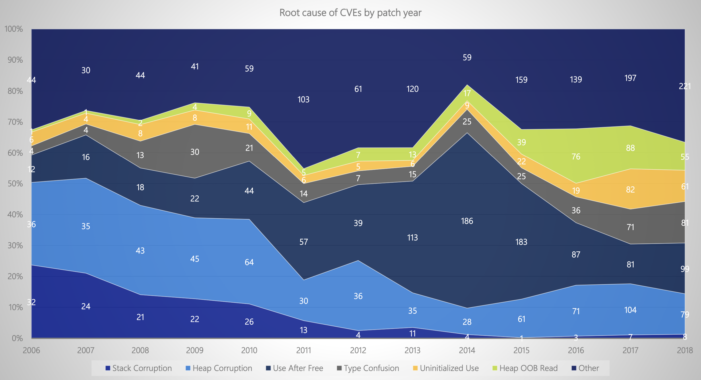

+++
title = 'Strengthening the Shield: MTE in Heap Allocators'
date = 2024-01-03T16:19:13+08:00
draft = false
+++

# Introduction

In 2018, with the release of ARMv8.5-A, a brand new chip security feature [MTE](https://developer.arm.com/-/media/Arm%20Developer%20Community/PDF/Arm_Memory_Tagging_Extension_Whitepaper.pdf) (Memory Tagging Extensions) emerged. Five years later, in 2023, the first smartphone to support this feature was released — [Google Pixel 8](https://blog.google/products/pixel/google-pixel-8-pro/) — marking the official entry of MTE into the consumer market. Although this feature is not yet enabled by default, developers can [turn it on](https://googleprojectzero.blogspot.com/2023/11/first-handset-with-mte-on-market.html) themselves for testing.

As a powerful defense against memory corruption, there has not yet been a comprehensive analysis of MTE's defensive boundaries, capabilities, and its impact on performance on the internet. Previously, Google Project Zero published a series of [articles about MTE](https://googleprojectzero.blogspot.com/2023/08/mte-as-implemented-part-1.html), focusing on the more low-level security aspects of MTE. However, the actual impact of MTE on real software security remains a mystery. To discuss this topic, heap allocators provide an excellent starting point. Heap memory corruption issues have gradually become the mainstream type of binary vulnerabilities. For reference, see the [presentation](https://github.com/microsoft/MSRC-Security-Research/blob/master/presentations/2019_09_CppCon/CppCon2019%20-%20Killing%20Uninitialized%20Memory.pdf) by MSRC at CppCon 2019:



Ordinary developers usually do not directly use MTE-related assembly instructions, but instead rely on the MTE support provided indirectly by heap allocators. Heap allocators act like shields, taking on the task of protecting the software. MTE provides fundamental support for fine-grained memory control. The responsibility of implementing advanced security features based on hardware MTE capabilities is left to software developers. The mainstream heap allocators in the open-source community have responded actively, implementing security enhancements based on MTE features, thereby improving the memory safety of heap space.

This article will target the three main players of MTE: PartitionAlloc in Chrome, Ptmalloc in Glibc, and Scudo in Android, to discuss and compare their respective MTE implementations. In our research, we found issues with the implementation in PartitionAlloc and reported them to Google, which were confirmed by the Chrome team.

# MTE Overview

> Readers who are already familiar with the principles of MTE may skip this section.

MTE utilizes the TBI (Top-Byte Ignore) feature of ARMv8, using the high 4 bits of a pointer to store a tag. In each process, there is a dedicated map of memory for storing these tags. Once a specific tag is assigned to a memory, the program must access the memory with the correct tag; if the tag is incorrect, the program throws the error signal SIGSEGV, as shown below:


The instruction set provides a series of instructions for tag manipulation. Here is an example demonstrating the basic usage of MTE:

```assembly
; x0 is a pointer
irg  x1, x0
stg  x1, [x1]
ldr  x0, [x1]
```

1. The IRG (Insert Random Tag) instruction generates a random tag for the pointer x0 and stores the result in x1.
2. The STG (Store Allocation Tag) instruction applies the tag to the memory, with the effective length depending on the granularity, which is generally 16 bytes.
3. The LDR (Load Register) instruction reads memory using the pointer with right tag.

The instruction set provides underlying support, but there is a great deal of freedom in the use of each instruction. How MTE is specifically utilized still largely depends on software developers.

# Allocator

## Chrome - PartitionAlloc

### Allocation

Allocations in PartitionAlloc can be roughly divided into three cases:

1. Allocation from ThreadCache, return directly without changing the tag.
2. Allocation from a free SlotSpan, return directly without changing the tag.
3. If neither of the above two conditions is met, allocate a new SlotSpan and tag all the free heap slots within it with random tags.

```cpp
    if (PA_LIKELY(use_tagging)) {
      // Ensure the MTE-tag of the memory pointed by other provisioned slot is
      // unguessable. They will be returned to the app as is, and the MTE-tag
      // will only change upon calling Free().
      next_slot_ptr =
          TagMemoryRangeRandomly(next_slot, TagSizeForSlot(root, slot_size));
```

### Release

Increment the tag of the slot to be freed.

```cpp
      void* retagged_slot_start = internal::TagMemoryRangeIncrement(
          ObjectToTaggedSlotStart(object), tag_size);
      // Incrementing the MTE-tag in the memory range invalidates the |object|'s
      // tag, so it must be retagged.
      object = TaggedSlotStartToObject(retagged_slot_start);
```

### (Past) Potential Risks

We have noticed that the operation of incrementing the tag upon release is a deterministic behavior, and it‘s very likely that the tag will not be changed during allocation. These two points make the tag management in PartitionAlloc quite fragile, providing attackers with chances to abuse.

Suppose an attacker now has a UAF vulnerability and can freely control the timing of triggering this UAF (which is common in actual exploits). Then the attacker can bypass the MTE check by the following means:

1. Trigger the vulnerability to obtain a UAF object victim, but do not trigger the UAF at this time.
2. Continuously allocate and free an object of the victim's size 15 times, so that the tag of the object controlled by the attacker is the same as the victim's tag.
3. Trigger the UAF.

In actual attack scenarios, it is easy for an attacker to have the two exploitation primitives required for the above attack:

1. Allocate heap slots of a certain size any number of times and control their contents.
2. Be able to free the heap slots they have allocated.

For example, in the browser process, using the [Blob](https://googleprojectzero.blogspot.com/2019/04/virtually-unlimited-memory-escaping.html) object can achieve the above two points. In the renderer process, using [AudioArray](https://securitylab.github.com/research/one_day_short_of_a_fullchain_renderer/) can also do it.

More detailed report and example PoC are available at [Issue 1512538](https://bugs.chromium.org/p/chromium/issues/detail?id=1512538).

### Analysis

The MTE support in PartitionAlloc is not as powerful as we imagined. It manages tags to a lesser extent, prioritizing efficiency to the greatest degree. Detailed comparisons are provided in the following section.

## Glibc - Ptmalloc

The implementation in Ptmalloc is the most straightforward and rudimentary. Its strategy is so simple that it can be summarized in just a few sentences.

### Allocation

For all allocations, after obtaining the allocation address, a random non-zero tag is generated to mark the entire allocated chunk (the actual logic in the code is to generate a tag value that is different from the chunk header. In the version 2.38 we analyzed, the memory managed by libc such as chunk headers has a fixed tag value of 0. This particular point will not be further specified in the rest of this article).

```C
      victim = tcache_get (tc_idx);
      return tag_new_usable (victim);
  // ...
  victim = _int_malloc (ar_ptr, bytes);
  // ...
  victim = tag_new_usable (victim);
```

### Release

Set the tag of the chunk to 0.

```C
      /* Mark the chunk as belonging to the library again.  */
      (void)tag_region (chunk2mem (p), memsize (p));

      ar_ptr = arena_for_chunk (p);
      _int_free (ar_ptr, p, 0);
```

### Analysis

For such an allocation strategy, there is a sense of overwhelming force with a single move. In the balance between performance and security, Glibc has chosen security: no matter the size of the allocation or the source of the allocation (tcache, fastbin, smallbin...), it will be re-tagged with a random tag.

The memory managed by libc itself, such as chunk headers, freed chunks, and the top chunk, all use 0 as the tag. At first glance, a fixed tag of 0 seems very insecure, as it is information known to the attacker. However, upon closer examination, it is apparent that this is not the case. This mechanism ensures at least the following two points:

1. There is definitely a chunk header or a free chunk (tag 0) acting as a barrier between every two chunks (tag non-zero), playing a role similar to a Guard Page, which can effectively mitigate linear overflows.
2. The tag of a freed chunk (tag 0) is always different from that of a chunk in use (tag non-zero), which can effectively mitigate UAF vulnerabilities.

## Android - Scudo

In comparison, the implementation in Scudo is the most complex.

### Allocation

1. Scudo only tags chunks of the Primary type (size < 0x10000). For the larger Secondary type, it allocates space through memory mapping, and currently does not support tagging such spaces.
2. When Scudo reuses a freed chunk, it directly retains and uses the UAF tag assigned to it at the time of release. Otherwise, it will allocate a random tag.

### Release

Assign a random tag different from the previous one to the chunk to prevent UAF reusing it.

```cpp
      if (Header->ClassId) {
        if (!TSDRegistry.getDisableMemInit()) {
          uptr TaggedBegin, TaggedEnd;
          const uptr OddEvenMask = computeOddEvenMaskForPointerMaybe(
              Options, reinterpret_cast<uptr>(getBlockBegin(Ptr, Header)),
              Header->ClassId);
          // Exclude the previous tag so that immediate use after free is
          // detected 100% of the time.
          setRandomTag(Ptr, Size, OddEvenMask | (1UL << PrevTag), &TaggedBegin,
                       &TaggedEnd);
        }
      }
```

### Analysis

In Scudo's implementation, there is a unique configuration option: UseOddEvenTags. When this option is activated, Scudo takes into special consideration the parity of the tags for each chunk during the memory allocation process. This means that it ensures that the parities of the tags for adjacent heap chunks are different.

To achieve this functionality, `computeOddEvenMaskForPointerMaybe` is used to calculate the odd-even tag mask:

```cpp
  uptr computeOddEvenMaskForPointerMaybe(const Options &Options, uptr Ptr,
                                         uptr ClassId) {
    if (!Options.get(OptionBit::UseOddEvenTags))
      return 0;

    // If a chunk's tag is odd, we want the tags of the surrounding blocks to be
    // even, and vice versa. Blocks are laid out Size bytes apart, and adding
    // Size to Ptr will flip the least significant set bit of Size in Ptr, so
    // that bit will have the pattern 010101... for consecutive blocks, which we
    // can use to determine which tag mask to use.
    return 0x5555U << ((Ptr >> SizeClassMap::getSizeLSBByClassId(ClassId)) & 1);
  }
```

This configuration involves a trade-off between UAF detection and buffer overflow detection. When UseOddEvenTags is enabled, the parity of the tags for adjacent chunks is different, which eliminates the possibility that randomly allocated tags happen to be the same, thereby increasing the likelihood of detecting buffer overflows. However, on the other hand, in this case, the parity of every randomly allocated tag is fixed, which leads to a halving of the tag space, making UAF more difficult to detect.

This design highlights a key consideration in Scudo's implementation: how to balance mitigation strategies for different types of memory vulnerabilities while minimizing performance impact. It demonstrates the preferences and trade-offs that a heap allocator makes when dealing with memory safety.

# Comparison

Disclaimer: This table only compares the implementation of MTE in various heap allocators and **does not** represent the overall security of the heap allocators.

 

* **Max Chunk Size with Tags**

  Ptmalloc applies tags to heap chunks of any size. However, for performance reasons, Scudo and PartitionAlloc only protect heap chunks smaller than 0x10000 and 0x400, respectively.

* **Memory Corruption Defense Capabilities**

  - Linear Overflow

    Both Ptmalloc and Scudo use 0 as the tag for chunk headers, ensuring there is always a red zone between two heap chunks that can effectively mitigate linear overflows; Whereas PartitionAlloc's metadata is not at the start of the heap chunk, thus there is a certain probability that adjacent heap chunks may coincidentally have the same tag.

  - Non-linear OOB

    For non-linear out-of-bounds access, the parity of Scudo's tags ensures that adjacent heap chunks will definitely have different tags, thereby increasing the size of the red zone around the heap chunk, making small-scale OOB more likely to be detected.

  - UAF

    The potential risks of UAF vulnerabilities in PartitionAlloc have been detailed in the above sections. It should be additionally noted that PartitionAlloc does not rely solely on MTE to defend against UAF vulnerabilities. It also has very strong UAF defense capabilities thanks to [MiraclePtr;](https://chromium.googlesource.com/chromium/src/+/main/base/memory/raw_ptr.md) When Scudo enables tag parity, the tag space is halved, increasing the probability of tag collisions.

  - Uninitialized Memory

    MTE does not significantly improve issues with uninitialized memory. Allocators like PartitionAlloc and Ptmalloc do not perform memory initialization.

* **Tag Management Strategy**

  The allocation and release of heap chunks are evaluated as a whole here. PartitionAlloc does not regenerate a new tag when reusing a heap chunk from the cache but continues to use the old tag, and only increments the tag upon release; The other two allocators regenerate tags.

* **Protection of Metadata**

  Neither Ptmalloc nor Scudo use tags to protect metadata such as chunk headers, with the default tag being 0, which can serve as a gap between adjacent heap chunks but at the same time may be at risk of malicious tampering. Notably, PartitionAlloc's metadata is not stored at the start of the heap chunk, making it less susceptible to corruption.

* **Free an Address with Incorrect Tag**

  When releasing a heap chunk, PartitionAlloc and Scudo do not check the correctness of the tag but perform an untag operation directly, thus allowing the release of an address with an incorrect tag. However, the attack scenarios resulting from this flaw are limited and would need to be combined with other attack methods to be exploited, so we do not classify this as a high-risk issue; Ptmalloc, on the other hand, checks if the tag is correct and will raise an exception if it is not.

  ```C
    /* Quickly check that the freed pointer matches the tag for the memory.
       This gives a useful double-free detection.  */
    if (__glibc_unlikely (mtag_enabled))
      *(volatile char *)mem;
  ```

# Conclusions

This article provides a detailed analysis of the implementation of MTE in the three major heap allocators, giving readers an intuitive understanding of their security. MTE is undoubtedly a significant leap forward for memory safety on the ARM platform. It is evident that with MTE enabled, traditional heap memory corruption issues are effectively mitigated, with some even becoming infeasible to exploit. However, memory safety has evolved over many years and is fraught with complex issues, with many open questions still to be resolved:

- Defense against uninitialized memory still relies on software implementation.
- Whether stack variables will be fortified with MTE and whether performance considerations might hinder its implementation.
- Tagging mmapped memory lacks support at the kernel level.
- Large memory buffers, such as ring buffers and shared memory, are difficult to effectively protect with MTE.
- The data segment of programs is not protected by MTE.

The evolution of offense and defense has led attackers from being able to compromise systems with a single stack overflow years ago to now needing a chain of vulnerabilities to break through the layered defenses of systems, reversing the offensive and defensive situation. But we also see that even advanced technologies like MTE have blind spots, and the road to memory safety is still long and challenging. We look forward to more exciting developments in the future.
