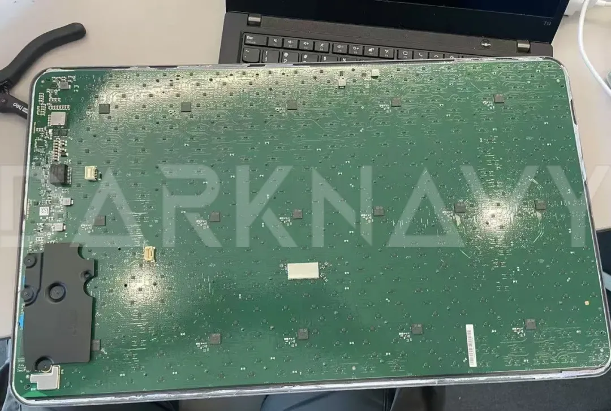
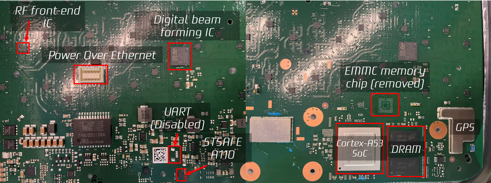
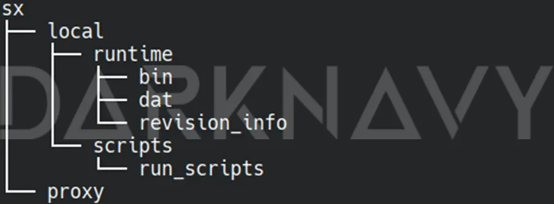
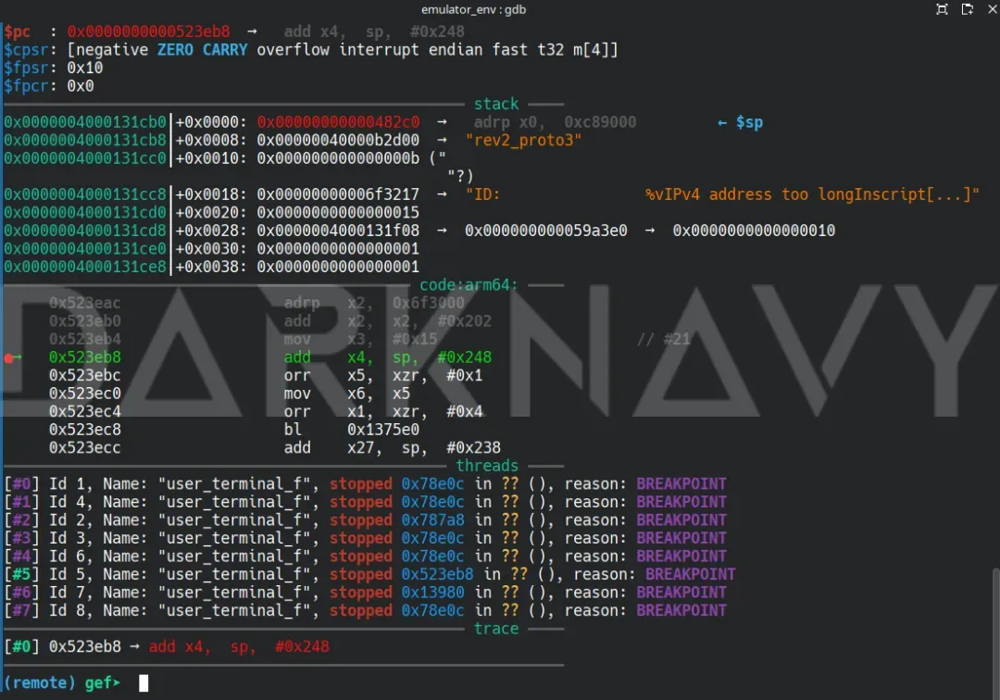
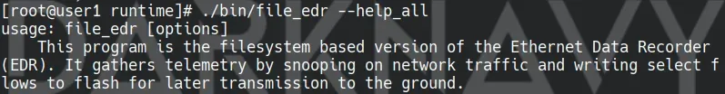

+++
title = 'A First Glimpse of the Starlink User Ternimal'
date = 2025-03-26T10:10:22+08:00
draft = false
images = ["attachments/91f681b3-25c3-4487-a2db-518aedba9a22.png"]
+++

> I think the human race has no future if it doesn't go to space. —— Stephen Hawking

Starlink is a low Earth orbit (LEO) satellite internet service provided by SpaceX. Users connect to near-Earth orbit satellites through a user terminal, which then connects to the internet via ground gateways.

 ![Basic architecture of the Starlink system \[1\]](attachments/d48521bc-861b-4050-82df-1366d6bc01d2.png)

As the new generation of satellites gradually incorporates laser links, some satellites can communicate with each other via laser. This both reduces reliance on ground stations and improves transmission efficiency, enhancing global coverage.

 

Even on the Ukrainian battlefield where there are no local ground stations, Starlink user terminals can indirectly access gateways in neighboring countries through inter-satellite links \[1\].

In this article, we provide a concise overview of DARKNAVY's recent preliminary investigation into the Starlink user terminal.


---

## Hardware Analysis

A complete Starlink user terminal consists of two parts: a router and an antenna. This article focuses on the antenna component (User Terminal Antenna, hereafter referred to as "UTA"). DARKNAVY purchased a Starlink Standard Actuated (also known as Rev3 or GenV2) user terminal in Singapore and disassembled its antenna portion.

 

As shown above, after disassembly, we found that the UTA's PCB is almost as large as its outer shell. Most of the board is occupied by RF front-end chips produced by STMicroelectronics (left side in the photo), while the core control components are mainly concentrated on one side of the PCB.


 

*Starlink Rev3 PCB (core area)*


Aside from the RF antenna, the overall design of the UTA's core area is quite similar to that of a standard IoT device. The main SoC, custom-made by ST for SpaceX, is a quad-core Cortex-A53. Currently, the hardware and datasheet for this chip are confidential and unavailable to the public.

At Black Hat USA 2022, Dr. Lennert Wouters from KU Leuven demonstrated a fault-injection attack against the first-generation Starlink antenna (GenV1) to obtain a root shell of the device. In response, SpaceX disabled the UART debug interface on the PCB via a firmware update to enhance fault-attack resistance. However, Wouters subsequently managed to break in again by refining his approach \[2\].


---

## Firmware Extraction and Analysis

To analyze the UTA in depth, DARKNAVY directly dumped the firmware from the eMMC chip. Since no obvious eMMC debug pins exist on the Rev3 board, we had to desolder the eMMC chip from the PCB and read it using a programmer. Once extracted, we discovered that most of the firmware contents were unencrypted, revealing the boot chain (excluding BootROM), kernel, and the unencrypted portions of the filesystem. Further analysis showed that after the kernel starts, it reads most of the runtime environment from the eMMC and unpacks it to the `/sx/local/runtime` directory.

 

As shown above, the `bin` directory contains the executables required by the Starlink software stack, while `dat` stores configuration files, and `revision_info` records the current software and hardware version. Other than `user_terminal_frontend` (written in Go) for handling user communications, most programs are statically compiled C++ executables without symbols. Drawing on existing research \[3\], our preliminary analysis of these programs and configurations suggests that the network stack architecture is somewhat similar to DPDK \[4\], mainly relying on a user-space C++ program to bypass the kernel for handling network packets. The Linux kernel's primary role is to provide basic hardware drivers and process management.

Interestingly, the core software extracted from the UTA also includes some functionalities that seemingly belong on satellites or ground gateways. Our initial reverse-engineering indicates that, during startup, the system identifies the device type based on hardware peripherals and then loads and executes the corresponding logic.


---

## Emulation

For convenient ongoing analysis of the UTA, DARKNAVY built a basic QEMU-based emulation environment for the Rev3 firmware:


<video src="attachments/starlink.mp4" controls="controls" width="100%" height="auto"></video>


Within this environment, we successfully ran and debugged parts of the software, including `httpd`, `WebSocket`, and `gRPC` services that interact with external entities.

 


---

## Security Chip

Besides the main SoC, the UTA also features a dedicated security chip, `STSAFE-A110`, which claims a CC EAL5+ security rating \[5\]. Unlike the custom SoC, this chip can be legally purchased under an NDA. In the UTA firmware, a user-space program named `stsafe_cli` handles interactions with this chip. Reverse-engineering suggests that STSAFE primarily provides:

* A unique identifier (UUID) for each device
* Management of a public key certificate (`stsafe_leaf.pem`), presumably used for satellite communication authentication
* Derivation of symmetric encryption keys for user data transmission

Overall, this chip serves as an additional root of trust independent of the SoC's secure boot mechanism, which aligns with modern embedded security design practices.


---

## Easter Egg: Is Elon Watching You?

During the analysis, DARKNAVY stumbled upon a program labeled **Ethernet Data Recorder**, which naturally raises suspicions of a backdoor capturing user data.

 

This program's name and functionality hint at potential packet logging. Closer inspection reveals that it leverages a `pcap_filter`-like mechanism to record certain network packets, with capture rules resembling:

```cpp
# name            track   options                type    interfaces       pcap_filter
diagnostics       0       compress,ipcompress    telem   lo               udp and dst port 10017 and (dst host 239.26.7.131 or dst host 239.26.7.130)
```

Based on other clues in the firmware, these packets are related to satellite telemetry. All captured traffic is also encrypted using hardware keys fused into the SoC. From the information we have so far, it does not appear to collect user privacy data.

During device initialization, if the system identifies itself as a user terminal, the initialization script automatically writes 41 SSH public keys into `/root/.ssh/authorized_keys`. Notably, port 22 on the UTA remains open to the local network at all times. Having such a large number of unknown login keys on a user product certainly raises eyebrows.


---

As satellite technology continues to evolve and find applications across diverse industries, every component of Starlink—and other satellite internet systems—may become a critical battleground for future offensive and defensive operations. In space security, developers and hackers contend not only in the digital realm but also against the constraints of cosmic physics: one wrong move could mean losing contact with the target forever.

## References

* \[1\] <https://www.ciscolive.com/c/dam/r/ciscolive/global-event/docs/2024/pdf/BRKSEC-2150.pdf>
* \[2\] <https://i.blackhat.com/USA-22/Wednesday/US-22-Wouters-Glitched-On-Earth.pdf>
* \[3\] <https://blog.quarkslab.com/starlink.html>
* \[4\] <https://www.dpdk.org/>
* \[5\] <https://www.st.com/en/secure-mcus/stsafe-a110.html>