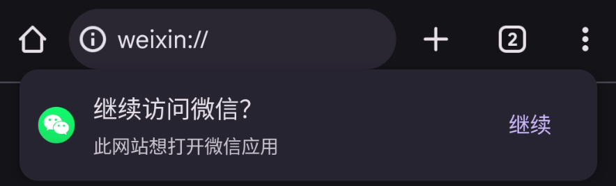
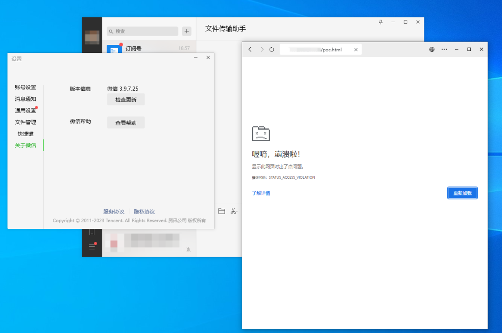
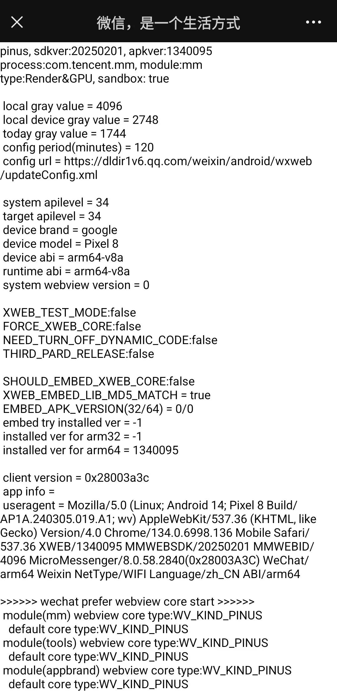
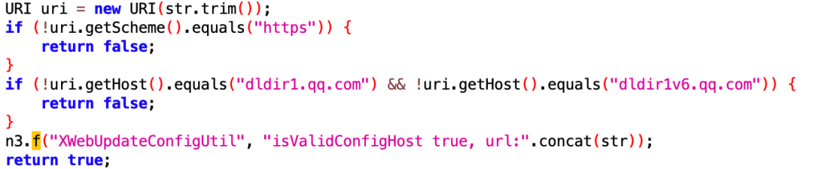
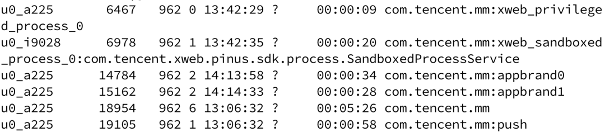
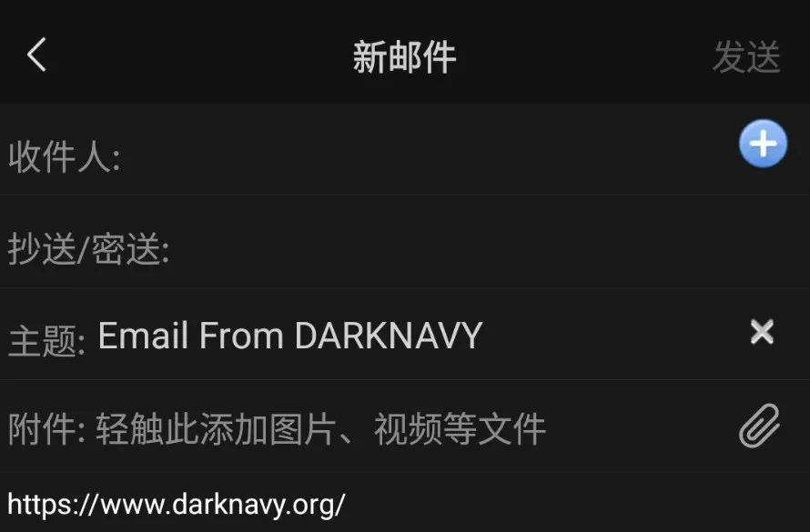
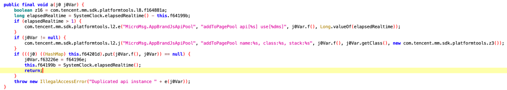
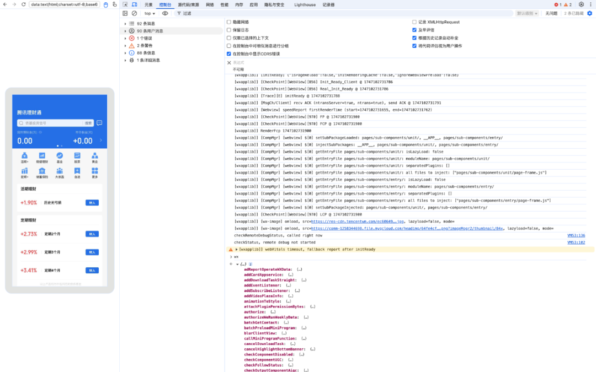

+++
title = 'Achieving Persistent Client-Side Attacks with a Single WeChat Message'
date = 2025-05-30T11:25:22+08:00
draft = true
images = ["attachments/ee59f925-6fe8-4762-aa32-028b09486308.png"]
+++

From White House staff to battlefield journalists, instant messaging (IM) applications are indispensable communication tools for countless individuals. Whether it's WhatsApp, Telegram, WeChat, or QQ, they have become the "digital arteries" of modern society, carrying core activities such as social interaction, payments, and office work for billions of users. Their security directly affects personal privacy, financial assets, and even national security.

In fact, security research on IM platforms has been ongoing for years. In 2019, Project Zero disclosed CVE-2019-8641 in iMessage\[1\], a memory corruption issue. Since iMessage automatically parses rich media content in messages, an attacker could achieve remote code execution by sending a specially crafted file **without user interaction**, gaining complete control over the target iPhone.

In this article, DARKNAVY will take WeChat as an example, exploring typical scenarios such as URL parsing, file processing, and web page access, to systematically examine key attack surfaces in instant messaging clients and analyze the game of offense and defense behind them.

<video src="attachments/demo.mp4" controls="controls" width="100%" height="auto"></video>

##  Overview of IM Attack Surfaces

From an architectural perspective, the attack surface of IM applications can be divided into three main dimensions, namely the client level, the communication protocol level, and the cloud service level. This article will focus on analyzing the attack surface of client level, exploring security issues that could lead to remote code execution or the leakage of sensitive information.

### 1. URL Links

Most IM clients support custom protocols (such as `weixin://`, `tg://`) to achieve in-app navigation. However, attackers can exploit clients' lax URL validation by crafting malicious requests, tricking users into visiting phishing sites. More covertly, attackers can abuse special function URLs. For instance, `slack://settings` can change settings. Attackers could construct links with specific parameters, then trick users into clicking them to steal data\[2\].

 

### 2. File Processing

To enhance user experience, IM clients typically implement their own file processing logic to support file previews and content extraction. Attackers can exploit vulnerabilities in these processing functions by crafting specially designed malicious files to achieve remote code execution. For example, CVE-2019-11932\[3\] and CVE-2025-30401\[4\] are critical vulnerabilities found in WhatsApp's Android and Windows clients, respectively. The former is triggered via a malicious GIF file, while the latter uses an executable file disguised as an image to trick users into running it.

### 3. Built-in Browser Components

3. Most IM clients come with an embedded browser to support web access, typically using a customized Chromium-based engine. The primary attack surfaces of these browsers come from two aspects:

* **JSBridge**: If the client does not implement fine-grained permission controls over the interfaces exposed to web pages, a malicious webpage could exploit this to abuse permissions.
* **Browser Engine Vulnerabilities**: For instance, in a 2023 advisory\[5\], DARKNAVY highlighted that CVE-2023-41064 and CVE-2023-4863 in the `libwebp` component of the Chromium engine affected several mainstream IM applications including WeChat, DingTalk, and QQ.

 

### 4. Mini-Program Ecosystem

To expand service capabilities, IM clients like WeChat and DingTalk have launched mini-program platforms, granting third-party developers extensive system permissions, such as file system access, sensor invocation, and API calls. However, if the client lacks proper permission management or has flaws in feature implementation, attackers can leverage malicious mini-programs to carry out attacks.

## WeChat Attack Surface Analysis

The DARKNAVY conducted a preliminary assessment of the WeChat client's attack surface. The following will introduce the main security risks faced by the WeChat client from multiple dimensions, along with corresponding mitigation mechanisms.

### 1. WeChat URL Links

The WeChat client includes a built-in debugging URL mechanism. When a user accesses a URL containing `debugxweb.qq.com`, different debugging behaviors can be triggered based on the parameters of the URL. For instance, the parameter `show_webview_version` will display the current WebView version and related configuration information on the page.

 

While this mechanism is convenient for debugging, it can pose security risks if an attacker crafts a malicious URL and tricks the user into visiting it. High-risk actions, such as version rollbacks or configuration changes, could potentially be triggered without the user's awareness. To mitigate this, the WeChat client restricts sensitive operations (like `install_embed_plugin`) to only execute when the `bEnableLocalDebug` option is enabled. Furthermore, for functionalities like `set_config_url`, which allow modification of the configuration-fetching URL, WeChat enforces strict validation of domain and protocol: only HTTPS is permitted, and the domain must be either `dldir1.qq.com` or `dldir1v6.qq.com`. This significantly reduces the risk of configuration tampering.

 

Additionally, WeChat supports internal navigation via the `weixin://` protocol. For example, `weixin://dl/` can be used for page routing. For links containing the `ticket` parameter, the WeChat client sends a request to the cloud endpoint `/cgi-bin/mmbiz-bin/translatelink` to retrieve the actual destination URL. This helps prevent attackers from crafting fake links to redirect users to arbitrary pages, thereby enhancing the security of in-app link redirection.

### 2. WeChat's Built-in Browser (XWEB)

The Android version of WeChat uses its self-developed XWEB engine, which is based on Chromium. As of the time of writing, the development version of the XWEB kernel uses Chromium version **134.0.6998.136**, while the version deployed on production is **130.0.6723.103**. In comparison, the official Chrome browser is at **version 136.0.7103.93**. Although XWEB maintains a relatively up-to-date Chromium base, it still lags behind the official release, potentially exposing it to known vulnerabilities that have not yet been patched.

To enhance browser security, WeChat has enabled a multi-process sandboxing mechanism by default. The main process runs in `xweb_privileged_process_0`, while the rendering process is isolated in `xweb_sandboxed_process_0`, effectively mitigating the impact of rendering process vulnerabilities.

 

WeChat also provides a wide range of **JSBridge** interfaces that allow webpages to invoke native functions. For example, `sendEmail` redirects to the email interface, and `scanQRCode` activates the camera to scan QR codes.

 

To prevent abuse, the WeChat client requests a permission array from the cloud when loading a webpage. This allows for fine-grained control over whether each JSBridge interface is available. On certain official test web pages, most interfaces are enabled by default, while on general web pages, only a few are accessible. This permission control strategy, based on the URL of the page, effectively limits the destructive potential of malicious websites.

### 3. WeChat Mini-Program Security Mechanisms

WeChat mini-programs are developed using JavaScript and follow an architecture divided into a **rendering layer** and a **logic layer**, which run in separate, isolated threads. The rendering layer handles the UI display, while the logic layer is responsible for business logic. JavaScript code written for the logic layer cannot access browser-exposed DOM APIs, and scripts running in the rendering layer cannot invoke high-privilege functions intended for the logic layer.

The JSAPI functions exposed by the WeChat client to these two layers differ accordingly. For example, the rendering layer can call APIs such as `insertVideoPlayer` and `insertTextArea`, while the logic layer can access functions like `saveFile` and `addDownloadTask`. This isolation  prevents attackers from leveraging XSS vulnerabilities in mini-programs to execute high-privilege actions in the rendering layer.

 

 

## Conclusion

As one of the most representative IM applications in China, WeChat demonstrates a multi-layered approach to security and fine-grained permission management, especically in its JSBridge access control, browser sandboxing, and dual-thread architecture for mini-programs. These designs reflect WeChat's strong emphasis on security.

As a research team dedicated to IM security, DARKNAVY hopes to drive the IM ecosystem forward in a more robust, secure, and trustworthy manner through continuous vulnerability research, attack and defense analysis, and technical sharing, all while ensuring a smooth user experience.

## Reference

* \[1\] https://googleprojectzero.blogspot.com/2020/01/remote-iphone-exploitation-part-3.html
* \[2\] https://medium.com/tenable-techblog/stealing-downloads-from-slack-users-be6829a55f63
* \[3\] https://awakened1712.github.io/hacking/hacking-whatsapp-gif-rce/
* \[4\] https://www.facebook.com/security/advisories/cve-2025-30401
* \[5\] https://mp.weixin.qq.com/s/zqxkYk7vRvDPKxgoVj1PRw