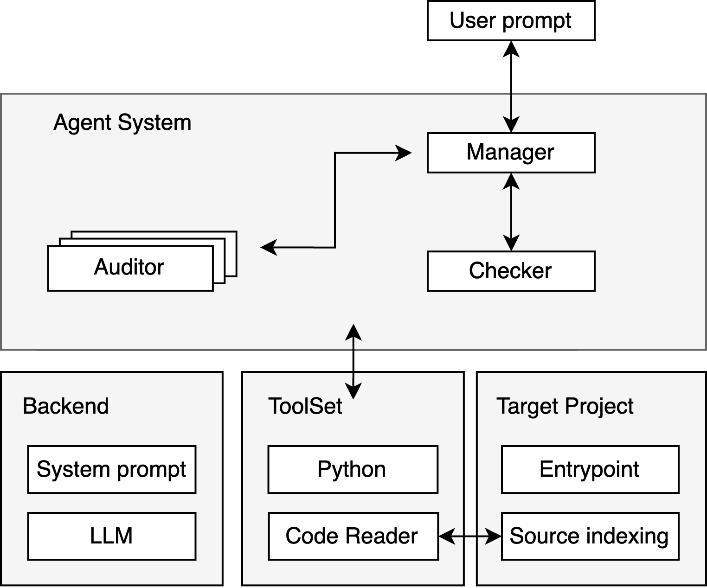
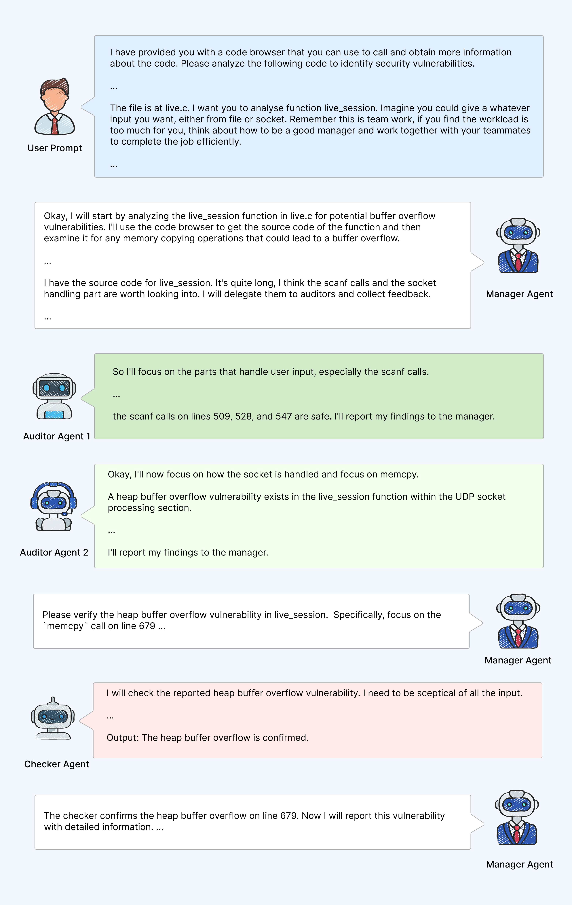
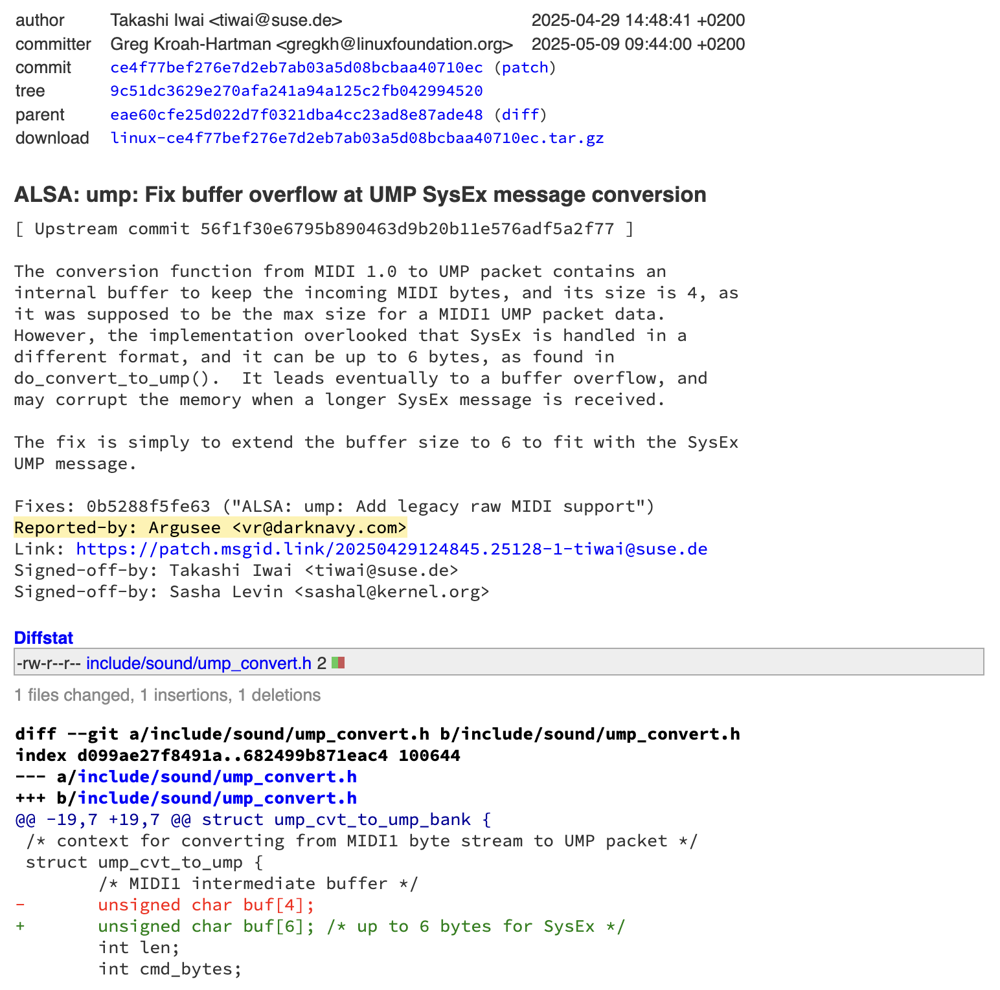

+++
title = 'Argusee: A Multi-Agent Collaborative Architecture for Automated Vulnerability Discovery'
date = 2025-05-23T11:09:50+08:00
draft = false
images = ["attachments/cover.jpg"]
+++

As we envisioned in **[DARKNAVY INSIGHT | The Most Imaginative New Applications of 2024](https://www.darknavy.org/darknavy_insight/the_most_imaginative_new_applications_of_2024/)**:

> The next generation of AI agents will have excellent reasoning and generalization abilities and be skilled at using a variety of security research tools, inheriting a wealth of human expert knowledge. They will be able to discover more 0-day vulnerabilities in the real world, like top security experts.

Unsurprisingly, as Large Language Models (LLMs) demonstrate increasing proficiency in handling complex tasks, Agent technology is emerging as a new paradigm in the field of vulnerability discovery. Since Google Project Zero released Naptime\[1\] last year, an increasing number of Agent-based auditing tools are appearing. By providing LLMs with the necessary toolsets and source code for testing, these tools simulate the behaviour of security researchers to perform code audits and vulnerability confirmation.

However, DARKNAVY has observed that single-agent approaches often suffer from false positives and negatives when auditing medium-to-large codebases, due to **limitations in LLM reasoning** (e.g., incomplete logic, hallucinations). Drawing on years of real-world vulnerability-hunting experience, DARKNAVY has proposed a multi-agent system architecture that simulates the division of labor and collaborative mechanisms within human security teams, and has implemented **an automated vulnerability discovery tool called Argusee.**

In tests on the Linux USB protocol stack, Argusee quickly discovered a high-severity vulnerability introduced since Linux version 6.5. This vulnerability has been assigned **CVE-2025-37891** and has been fixed, affecting multiple mainstream distributions including Ubuntu and Arch Linux. DARKNAVY has exploited this vulnerability to reliably escalate to root privileges on Arch Linux.

<video src="attachments/exp.mp4" controls="controls" width="100%" height="auto"></video>


## Argusee: A Multi-Agent Collaborative Architecture

> Argus had a hundred eyes round his head, that took their rest two at a time in succession while the others kept watch and stayed on guard.
>
> ***— Ovid: The Metamorphoses***

Although single-agent tools like Naptime have provided a viable paradigm for LLM-driven code auditing, they often suffer from numerous false positives and negatives when facing medium to large-scale projects. This is due to the insufficiently rigorous logic of the model reasoning  and limited contextual awareness, making it difficult to flexibly adjust the audit process and meet the demands for precise localisation and in-depth verification.

To address this, Argusee **is not intended to completely replace manual auditing or to discover vulnerabilities from scratch**. Instead, it serves as a powerful assistant tool for security auditors. Given precise entry points (e.g., specific functions or modules) and relevant context from the auditor, Argusee performs in-depth analysis and identifies potential risks, thereby significantly enhancing the efficiency of professional auditors.

Unlike existing work, Argusee's core innovation lies in its **multi-agent collaborative mechanism**, which draws inspiration from the collaborative models of human security teams, decomposing complex audit tasks among agents with different roles. More importantly, compared to some early multi-agent explorations\[2\] where agents operated with rigid, siloed interactions, Argusee grants LLMs greater autonomy, enabling them to dynamically understand and delegate tasks, thus achieving more flexible and efficient collaborative auditing. This aligns with what Richard Sutton, the father of reinforcement learning, wrote in **The Bitter Lesson**: "**We want AI agents that can discover like we can**, not which contain what we have discovered. Building in our discoveries only makes it harder to see how the discovering process can be done."

As an implementation prototype, Argusee's architecture, shown in the figure below, primarily includes the following core agents:

 

* **Manager Agent**

  The Manager is the interaction point for the user, who provides analysis entry points (e.g., target files or functions). The Manager is responsible for understanding the task at a macro level, for example, determining the core functionality of a function, identifying potential critical code segments, and performing task decomposition and dispatch. It distributes different code snippets along with necessary contextual information to multiple Auditors.
* **Auditor Agent**

  Auditors focus on analysing the typically smaller code snippets assigned by the Manager. They combine contextual information to delve into code details, searching for potential vulnerabilities such as Buffer Overflows, Use After Free, etc.
* **Checker Agent**

  To reduce false positives and negatives, before consolidating audit results and outputting the final conclusion, the Manager requests the Checker to review and verify the entire logical chain, identifying omissions and making corrections. Finally, the Manager integrates the information and outputs the audit report.

During task execution, all Agents can call upon a predefined toolset as needed; the timing and method of tool use are autonomously decided by the Agent. On the other hand, the effective operation of the backend toolset depends on adaptation to the target project and environment. For example, the variable localisation feature of the Code Reader relies on the source code indexing capabilities established by a backend Language Server Protocol (LSP).

To better understand Argusee's workflow, the figure below illustrates Argusee's chain of thought during an actual run:

 

When a user specifies a target file and entry function, the Manager analyzes the task and dispatches it to two Auditors. One Auditor discovers a suspected buffer overflow risk and reports it to the Manager. Subsequently, the Manager requests the Checker to review this vulnerability. The Checker ultimately confirms it as a genuine heap buffer overflow vulnerability, and the Manager produces a vulnerability audit report.


## Evaluation

To validate Argusee's effectiveness, we conducted tests and evaluations on benchmark datasets, small to medium-scale open-source projects, and very large-scale open-source projects (like the Linux Kernel).

### Benchmark Evaluation

On standard single-file test cases from META CyberSecEval 2\[3\], Argusee demonstrated near-perfect vulnerability identification capabilities, achieving **100% accuracy** on test cases for categories like Buffer Overflow.

### Auditing of Medium-Sized Open-Source Projects

For medium-sized real-world open-source projects, Argusee also achieved significant results, cumulatively discovering **15 previously unknown security flaws** in several well-tested projects. These projects included open-source software libraries that parse complex file formats, such as GPAC and GIFLIB.

Taking the open-source multimedia framework GPAC\[4\] as an example, this project has undergone long-term Fuzz testing, and relatively few new vulnerabilities have been discovered in recent years. However, **Argusee quickly identified several new vulnerabilities that are difficult to discover through traditional methods**. DARKNAVY observed that Argusee performs particularly well on targets like GPAC, which have clear input formats and content parsing as their core function.

For instance, the code snippet below shows a **memory corruption vulnerability** caused by an **integer overflow**, discovered by Argusee. For a Fuzzer, constructing an input sample that can trigger this vulnerability (requiring zlib compression format and sufficiently large raw data to cause an overflow) is extremely difficult. Argusee, by simulating the logical reasoning process of manual auditing, successfully located this deeply buried defect.

```c
while (d_stream.total_in < data_len) {
	err = inflate(&d_stream, Z_NO_FLUSH);
	if (err < Z_OK || err == Z_NEED_DICT) {
		e = GF_NON_COMPLIANT_BITSTREAM;
		break;
	}
	if (err==Z_STREAM_END) break;

	size *= 2;  // u32 size, int overflow to small number
	*uncompressed_data = (char*)gf_realloc(*uncompressed_data, sizeof(char)*(size+1));  // realloc to small memory
	if (!*uncompressed_data) return GF_OUT_OF_MEM;
	d_stream.avail_out = (u32) (size - d_stream.total_out);  // breaking the whole zlib structure
	d_stream.next_out = (Bytef*) ( *uncompressed_data + d_stream.total_out);
}
```

### Auditing of Linux Kernel

Furthermore, Argusee has also been tested on massive codebases, such as the large and complex **Linux Kernel USB protocol stack**. During its use, although it requires providing Agents with richer contextual information, Argusee still demonstrated strong potential in areas like assisting code comprehension and pinpointing high-risk areas, significantly accelerating audit workflows.

The image below shows the patch for vulnerability CVE-2025-37891\[5\], found by Argusee in the Linux Kernel USB protocol stack:

 

This vulnerability occurs on the host side of the Linux kernel's USB subsystem. A malicious user can carry out an attack by inserting a simulated device that supports the USB MIDI2 protocol. For USB devices supporting MIDI2, Linux internally converts MIDI1 packets into UMP packets. **Due to improper length checks, the buffer used to store the MIDI byte stream during conversion can overflow**, allowing an attacker to achieve an arbitrary kernel heap overflow primitive. After being provided with the relevant functions and files for the USB MIDI2 entry point, Argusee quickly found this vulnerability and provided a clear analysis of its principle and reproduction.

Of course, Argusee's capabilities are not limited to this. Given that building comprehensive datasets and metrics for evaluating vulnerability discovery capabilities is a complex task in itself, more detailed evaluations and practical test results will be presented in subsequent research.

Looking ahead, to further unleash Argusee's potential, based on the current prototype, Argusee can be enhanced and supplemented along the following three dimensions:

* **Agent System:** Introduce more specialised roles, such as a Reproducer Agent responsible for constructing PoCs to verify vulnerabilities, and an Exploit Agent to assess exploitability and attempt to write exploits.
* **Toolset:** Integrate a richer set of analysis tools, such as debuggers, to help Agents understand program execution flow and vulnerability triggering processes, as well as other advanced static and dynamic analysis tools, building a powerful arsenal.
* **Target Projects and Environments:** Integrate more information sources to assist code auditing, such as using RAG technology to retrieve relevant source code knowledge and analysing compiled binary files.


## Epilogue

Agent technology is reshaping the paradigm of vulnerability discovery, and Argusee's success demonstrates that multi-agent collaboration can dramatically boost code-audit efficiency. By structuring LLMs with the right framework and toolsets—and combining them with human expertise—we can automate vulnerability discovery far beyond the limits of single agents. Argusee is only the beginning of this trend. At DARKNAVY, we are committed to deepening collaborative AI security research, enabling seamless teamwork between AI agents and human experts.

One day, analysts may be freed from tedious low-level audits to focus on strategy and risk evaluation—and in doing so, drive security research to new heights.


## Reference

* \[1\] https://googleprojectzero.blogspot.com/2024/06/project-naptime.html
* \[2\] https://arxiv.org/html/2409.00899v2
* \[3\] https://arxiv.org/abs/2404.13161
* \[4\] https://github.com/gpac/gpac
* \[5\] https://git.kernel.org/stable/c/ce4f77bef276e7d2eb7ab03a5d08bcbaa40710ec
