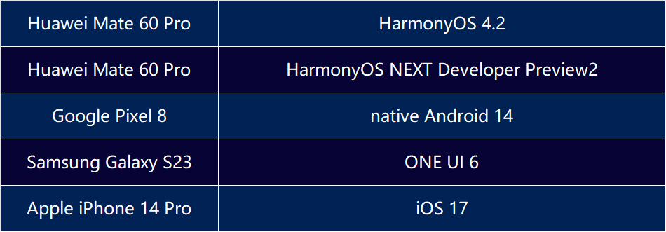

+++
title = 'AVSS Report: System Security Adversarial Capability Preliminary Evaluation of iOS, Android, and HarmonyOS - Kernel'
date = 2024-06-11T15:40:57+08:00
draft = false
+++
As consumers, when faced with five different brands and models of smartphones or ten different smart cars, it's difficult for us to determine which one can effectively prevent our privacy from being stolen or maliciously accessed, such as our location or even hearing our conversations inside the car.

Even as ordinary consumers, we currently have no way of knowing. As technology professionals who have long studied in APT(Advanced Persistent Threat) attacks, we understand that these devices can ultimately be compromised in the face of advanced persistent attacks.

Vulnerabilities can never be completely eliminated. The goal of all security efforts is to increase the cost for attackers as much as possible, including time, computational power, skills, and so on.

This is the original intention of our efforts to promote the AVSS (Adversarial Vulnerability Scoring System) evaluation framework. We hope to promote the measurability and perceptibility of security values through scientific and fair quantification of security, striving to increase the cost for attackers and protect the products and enterprises that should be seen by consumers. Consumers also have the right to make more secure choices more conveniently.

## AVSS Report

This report by DARKNAVY is based on the AVSS concept with an advanced persistent adversarial attack perspective. The following device systems are evaluated from the **five stages** of kernel security countermeasures of mobile operating systems: **1. Locating the attack entry; 2. Construct  primitives; 3. Bypass kernel monitoring; 4. Lateral movement; 5. Full system control.**

 

The operating systems on the tested devices are the latest versions as of May 2024. HarmonyOS NEXT Developer Preview2 is the HarmonyOS with Huawei's self-developed kernel. We will use HarmonyOS NEXT to refer to HarmonyOS NEXT Developer Preview2 in the following text.

## AVSS Conclusion

* HarmonyOS 4.2 demonstrates **slightly superior overall security compared to** operating system kernels such as **native Android 14 and ONE UI 6**. Additionally, in several dimensions, it approaches or matches the capability index of iOS 17.
* HarmonyOS NEXT adopts a new **microkernel architecture**, showing **significant progress in certain dimensions** such as post-exploitation inter-module lateral movement, while there is still **room for improvement** in traditional security aspects, such as memory corruption defense.

   

The quantified indices above are based on adversarial evaluations of the following five major categories of kernel security defense capabilities, comprising over 50 defense quantification dimensions and indicators:

  A. Kernel and user mode attack surface defense capability

  B. Kernel memory corruption vulnerability defense capability

  C. Kernel arbitrary read and write exploit defense capability

  D. Inter-module lateral movement defense capability

  E. Defense-in-depth capability
   

  **Stage 1: Locating attack surface and finding vulnerabilities -- Kernel and user mode attack surface defense capability**

  Attackers first need to determine the kernel resources they can access and identify vulnerabilities within those resources. The fewer unnecessary resources the kernel exposes, the fewer potential vulnerabilities exist.

  **Stage 2: Using the vulnerability to "do evil things" - Kernel memory corruption vulnerability defense capability**

  Attackers typically discover vulnerabilities through coding flaws. Attackers need to craft sophisticated exploits to turn these coding flaws into accesses to sensitive kernel data. The kernel can prevent these coding flaws from evolving into harmful operations by adding checks during design, implementation, and compilation to guard against unexpected code behavior.

  **Stage 3: Bypassing the kernel's "patrolling guards" - Kernel arbitrary read and write exploit defense capability**

  Some kernels set up additional, real-time guards for critical code and data – runtime integrity monitoring. Attackers need to bypass these guards or find alternative routes to complete their attacks.

  **Stage 4: Inter-module lateral movement  -  Lateral movement defense capability**

  Once an attacker breaches a kernel resource within a functional module, the kernel's separation and isolation of functional modules ensure that the compromised module is isolated from other functioning modules.

  **Stage 5: Persistent residence, sensitive information theft - Defense-in-depth capability**

  In some systems, the kernel is the lowest layer managing user data. If the kernel is breached, it means all user data can be controlled by the attacker. However, some advanced operating systems implement multiple measures beneath the kernel to protect critical user-sensitive data.

## AVSS Review

### Kernel and User-Mode Attack Surface Defense Capability Index

> This index corresponds to the first phase: the defense capability against locating attack surfaces and finding vulnerabilities within them.

The kernel of HarmonyOS 4.2 has a defense capability against user-mode attack surfaces comparable to that of native Android 14, One UI 6, and iOS 17 operating system kernels, **all of which deploy mature security defense mechanisms**.

The HarmonyOS NEXT version surpasses other operating system kernels in defending against user-mode attack surfaces. Its microkernel architecture **significantly reduces the amount of code running at privileged levels**, thereby lowering the risk of vulnerabilities.

> The primary threats faced by operating system kernels come from user-mode programs. For attackers, the degree of restriction on kernel resources accessible to user-mode, and the amount of code running at a high privilege level in the kernel, are crucial factors influencing the difficulty of their attacks.
>
> * The kernel provides user-mode programs with extensive resource access interfaces, such as system calls, drivers, procfs, and sysfs. All interfaces exposed to user-mode programs become potential attack surfaces. By implementing access controls on user-mode programs, the kernel can isolate system programs from untrusted applications. This reduces the number of kernel interfaces exposed to untrusted applications, minimizes the direct attack surface, and increases the cost and difficulty for attackers.
> * The amount of code running at high privilege levels is proportional to the number of high-privilege vulnerabilities. Different kernel architectures result in varying amounts of kernel-mode code, which leads to significant differences in the number of vulnerabilities.

HarmonyOS 4.2 uses mature security defense mechanisms such as **SELinux, Seccomp, Namespace, and Capability** (iOS 17 uses Sandbox and Entitlement to achieve similar effects). HarmonyOS NEXT has designed a **CAPABILITY SYSTEM** on top of existing defense mechanisms to restrict access to kernel functions and **verify IPC permissions**.

In HarmonyOS NEXT, kernel objects are used as carriers for data transmission during IPC communication. The CAPABILITY SYSTEM ensures that only those with the capability to read from or write to kernel objects can receive or send messages through these objects. As a result, the content of messages cannot be accessed by malicious processes.

HarmonyOS NEXT adopts a microkernel architecture, effectively reducing the kernel TCB (Trusted Code Base). Compared to traditional monolithic kernels, the kernel code in HarmonyOS NEXT is **less than one-fourth in size**, significantly reducing the occurrence of vulnerabilities. Below is a comparison of the TCB sizes of the evaluated operating system kernels:

 

### Kernel Memory Corruption Vulnerability Defense Capability Index

> This index corresponds to Phase Two: the capability to defend against exploiting vulnerabilities to "do evil things."

For memory corruption vulnerabilities, the HarmonyOS 4.2 kernel is exceptionally well-defended compared to conventional mobile kernels. In addition to standard kernel defense mechanisms, HarmonyOS 4.2 employs Pointer Authentication Codes (PAC) and Control Flow Integrity (CFI) for more comprehensive protection. However, these PAC and CFI defense mechanisms are not utilized in HarmonyOS NEXT, leaving it vulnerable to attacks that could compromise the execution logic of kernel code. It is recommended that HarmonyOS NEXT adopt these mature defense mechanisms to further enhance its kernel security.

> At present, the main way of kernel attack is still to use memory corruption vulnerability to escalate privilege through kernel data reading and writing and kernel code execution. Therefore, the kernel's defense against memory corruption vulnerabilities is an important part of kernel security.
>
> * The occurrence of vulnerabilities is inevitable, but after long-term development, some vulnerability types can be eliminated from the source by relying on compilers, heap allocators and various parameter settings, and the use of these defense mitigations can prevent attackers from mining this type of vulnerabilities.
>
> * The degree of the security defense mechanism is closely related to the difficulty of the attacker to carry out attacks. For example, with the same stack overflow vulnerability, it is much more difficult for an attacker to attack targets with the stack canary than targets without the canary.
>
> * The causes of vulnerabilities are various, but the means of exploiting vulnerabilities are relatively traceable. Discovering and blocking such means in time during exploitation will increase the attack cost and difficulty of attackers.


In addition to enabling established kernel defense mechanisms such as **NX/DEP, PXN/PAN, and Canary**, HarmonyOS 4.2 also **employs CFI to protect indirect jumps and PAC to safeguard the return addresses of non-leaf nodes**. Compared to native Android 14 and One UI 6, HarmonyOS 4.2 offers **more comprehensive protection**.

During testing, DARKNAVY found that **HarmonyOS NEXT does not utilize PAC, CFI**, and other defense mechanisms already deployed in HarmonyOS 4.2.


> PAC (Pointer Authentication Code) is a security feature introduced in the ARM architecture. It is signed by inserting an additional signature into the pointer to verify the integrity of the pointer, thus resisting JOP, ROP and other attacks.
>
> HarmonyOS Version 4.2 uses PAC to protect the return addresses of non-leaf nodes as follows:
>
> There is a `ptrauth_keys_kernel` structure in the kernel code, and there is a `ptrauth_key` structure in the structure. When each process is created, the kernel will execute a `ptrauth_keys_init_kernel` function. This function writes the random number 16 bytes to the `key_kernel` field of the thread struct of `task_struct` by `get_ramdom_bytes`. When the process invokes the kernel system call, Perform `switch_to` will write `__pki_v.lo` and `__pki_v.li` in  `key_kernel` field in `task_struct` . The PACIASP instruction and AUTIASP instruction use the register __pki_v to calculate values written to the stack to ensure that the return address is not tampered with.

HarmonyOS version 4.2 Separates the user PAC key from the kernel PAC key, both algorithms are the same. If an attacker can modify the user PAC key to the kernel PAC key, it may lead to control of the kernel execution flow. User-mode kernel mode algorithm isolation is recommended.

```C
struct ptrauth_keys_kernel {
  struct ptrauth_key apia;
};

static __always_inline void ptrauth_keys_init_kernel(struct ptrauth_keys_kernel *keys)
{
  if (system_supports_address_auth())
    get_random_bytes(&keys->apia, sizeof(keys->apia));
}

static __always_inline void ptrauth_keys_switch_kernel(struct ptrauth_keys_kernel *keys)
{
  if (!system_supports_address_auth())
    return;

  __ptrauth_key_install_nosync(APIA, keys->apia);
  isb();
}
```

Contemporary kernel attack methods have evolved significantly from traditional techniques. The introduction of Stack Canary, PAC, and CFI has greatly improved control flow integrity, making direct control flow hijacking attacks on the kernel increasingly rare.

In recent years, kernel privilege escalation attacks have more commonly targeted data-oriented attacks. These attacks exploit UAF (Use After Free) and OOB (Out Of Bounds) vulnerabilities to modify data pointers within the kernel, enabling arbitrary kernel address reads and writes, altering critical data structures, and escalating privileges. iOS 17 leverages hardware security features provided by its processors to implement Data PAC, and Pixel 8 uses ARM MTE in native Android, significantly enhancing defense capabilities against data-oriented attacks. However, HarmonyOS has not yet adopted these mechanisms.


### Kernel Arbitrary Read/Write Exploit Defense Capability Index

> This index corresponds to stage 3: the ability to bypass the "patrolling guards" in the kernel

The kernel code and key data protection in HarmonyOS 4.2 is more advanced than in HarmonyOS NEXT and far ahead of native Android 14. It utilizes the self-developed HKIP mechanism (similar to RKP) to protect the critical kernel data. Additionally, SPTM for iOS, implemented based on hardware features, has a smaller attack surface.

> With the continuous improvement of defense mechanisms such as PAC and CFI, the integrity of kernels control flow has been better protected, and the attack mode of hijacking kernel control flow has become rare. In recent years, a more common method is through data-oriented Attack, that is, by obtaining the arbitrary data reading and writing ability of the kernel, modifying the critical kernel data to escalate privilege. Therefore, after the attacker obtains the arbitrary read and write ability of the kernel, how to counter further attacks is the core capability of kernel security.
>
> There are a large number of sensitive data and segments in the kernel, such as kernel code segments, which are the most priority targets for attackers. Once an attacker can tamper with the data of kernel code segments, he can obtain arbitrary execution permission of the kernel. The operating system can protect the integrity of kernel data from a higher level, which can effectively increase the difficulty of the attacker.

RKP stands for "Real-time Kernel Protection" and is the name of Samsung's EL2 Layer defense mechanism, which is part of Samsung KNOX. The emergence of the RKP mechanism has significantly increased the difficulty for attackers, making traditional exploit methods even less effective against RKP. The following is the page table address translation diagram in RKP:

 

HarmonyOS 4.2 also uses HKIP mechanism to protect the integrity of kernel code segments and read-only data segments from the EL2 level. It creates read-only memory through mmap to store important structural data and pointers in the kernel and uses HKIP to protect the integrity of the memory. The principle is similar to RKP. In both cases, an additional layer of page table mapping is made at the EL2 layer to ensure that changes to the page table at the EL1 layer can be captured and intercepted by the EL2 layer.

The HKIP mechanism in HarmonyOS version 4.2 has the same protection capability as the RKP mechanism, which protects code segments, read-only data segments, and important structures of the kernel from tampering. However, for the lack of protection of the application page table, the attacker can arbitrarily read and write the physical address that is not protected by HKIP by modifying the application's page table. This exploitation method has also been verified to be feasible on Pixel and Samsung Galaxy.

In HarmonyOS NEXT, HKIP provides various protection mechanisms. However, actual research has found that, apart from the code segment, read-only data segment, and kernel page table, other critical structures are not protected by HKIP.

The following is a comparison of the coverage of defense capabilities in some HKIP mechanisms and RKP mechanisms:

 

（o : cover x : not cover | : incomplete cover）

### Lateral Movement Defense Capability

> The index corresponds to stage 4: the defense capability of the inter-module lateral movement

The HarmonyOS 4.2 kernel is similar to the native Android 14 and ONE UI 6 kernel, and there is no strict permission isolation between major kernel modules, while iOS is based on a hybrid kernel architecture of Mach and BSD.

HarmonyOS NEXT uses a microkernel architecture with finer-grained kernel module isolation, which divides kernel resources into multiple types, different types are managed by corresponding modules, and modules communicate with each other through the IPC mechanism, which has a better effect on multiple modules defense against attacks.

> The kernel of the traditional operating system is responsible for the scheduling of all resources of the entire system, and once the corruption of any module of the kernel will lead to the loss of the entire operating system. With the birth of the microkernel, the permission division of the kernel module is finer-grained, so how to reduce the influence of post-exploitation diffusion has become a new measurement index of kernel security.
>
> Network module, file management module, memory management module, driver module, etc. are the main attack targets of attackers. The fine-grained division of their permissions can effectively prevent attackers from spreading attacks from the point to the surface.

HarmonyOS NEXT divides the permissions between modules in a fine-grained manner and communicates between modules through IPC, making it difficult for attackers to evolve the attack results of one module into the attack results of the entire system.

HarmonyOS NEXT loads the driver in user mode, making it difficult to convert an attack against the driver to an attack against the kernel EL1 layer by obtaining only EL0 permissions.

 

### Defense-in-depth capability

> The index corresponds to stage 5: persistent resident, information theft defense capability

Both HarmonyOS 4.2 and HarmonyOS NEXT adopt a defense-in-depth design under the kernel. They are hardened with higher-privilege hypervisors, secure monitor, TrustZone, security elements, and security chips that are isolated from the kernel. Even if an attacker can compromise the kernel, it can still protect sensitive information such as biometric information and critical keys.

HarmonyOS NEXT also improves file system protection, using different keys for different contexts to protect the confidentiality and integrity of code and data files, and key management with the Secure Enclave (TrustZone, security chip) isolated from the kernel.

Defense in depth has been widely practiced on mobile devices, and manufacturers and system developers can use hardware security primitives and chip designs provided by processors to achieve a higher level of security privileges than the kernel. Even after an attacker compromises the kernel, the system relies on a hypervisor or secure monitor that is lower than the kernel and has a smaller TCB. The TrustZone and security chip, which are isolated from the kernel, still ensure the security of users' sensitive data.


## Description and Notice

This report provides a preliminary adversarial analysis of the kernel defense mechanisms of each mobile operating system and does not conduct AVSS best practices, so the current version of the report does not contain evaluation scores and composite scores for all indicator subitems.

In addition, DARKNAVY based on the DAF (DarkNavy Adversarial Framework) framework, obtained the root permission of HarmonyOS NEXT system, to make the above horizontal and vertical preliminary quantitative evaluation analysis.

 


\[Next Episode Preview\] How does the security capability of new operating systems perform against malicious exploit methods such as intrusive pop-up ads, background process persistence, and privacy theft? Stay tuned for the upcoming AVSS research report: "Multi-Mobile Platform Operating System Security Adversarial Capability Preliminary Evaluation Report - Application" as well as the release of the HarmonyOS NEXT APP Decompiler.