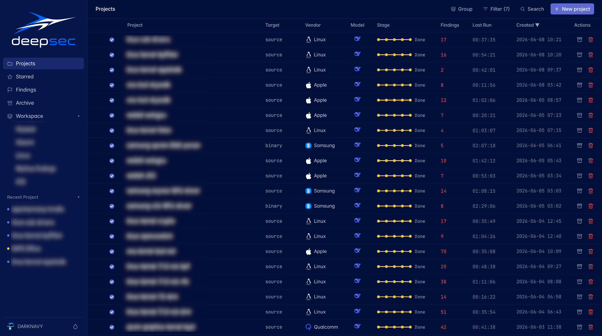
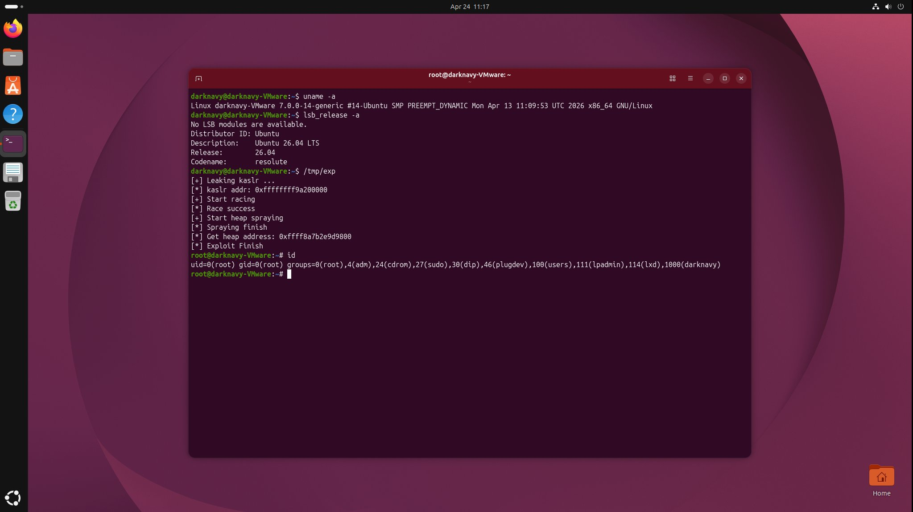

+++
title = 'deepsec: Chasing Mythos with Open-Source LLMs'
date = 2026-06-09T13:43:59+08:00
draft = false
images = ["attachments/cover.png"]
twitter-card = "summary_large_image"
+++

On April 7, Anthropic introduced Claude Mythos Preview. The announcement quickly drew attention from the AI industry, the security community, and even Wall Street.

The framing was unusually strong: Mythos was presented as a powerful cybersecurity AI capable of finding and exploiting vulnerabilities, but "too strong to release broadly." Anthropic provides Mythos access only through Project Glasswing to selected companies, governments, and organizations, describing it as a way to protect those defenders before attackers can weaponize similar capabilities.

In subsequent months, AI capabilities in cybersecurity truly amazed everyone:

- In April, Microsoft's security-related updates covered 247 CVEs in total. Microsoft later announced plans to integrate AI into its internal security development lifecycle.

- Pwn2Own Berlin, held May 14–16, hit maximum capacity for the first time in its history. ZDI had to close submissions ahead of schedule because there were more exploit entries than the event could process.

- In May, Linux vulnerability volume also spiked. Around the same period, high-impact Linux local privilege-escalation issues such as Copy Fail, Dirty Frag, and Fragnesia were disclosed in close succession.

- On June 2, a single Google Chrome stable-channel update fixed 429 security issues, including 22 Critical vulnerabilities.

Mythos made it clear that AI for security is moving beyond code scanning and toward real targets, exploitability, and validation. Tasks that once took days or weeks can now be compressed into much shorter cycles.

However, many defenders outside Project Glasswing are still operating on human-speed workflows, while AI is making vulnerability research faster and cheaper for attackers. Cost is another barrier: Mythos pricing was leaked at $25 per million input tokens and $125 per million output tokens.

At the same time, open-source LLMs such as DeepSeek are improving quickly in code understanding, reasoning, and cost efficiency. They are not yet at the same level as the strongest closed models, but they offer security researchers a real alternative.

That led us to a hard question:

**Can we rely only on open-source LLMs, combined with a security-tailored harness, to produce real-world results comparable to Mythos?**

**deepsec** is DARKNAVY's attempt to answer that question.

<strong>deepsec</strong> dashboard

## Observation: The Model Is Not the Only Bottleneck

Our goal is not to frame this as a direct "contest" with Mythos, which is still a black box to us. Instead, we try to infer the gap from the outside and explore how much of it can be closed.

The first question we asked was simple:

**Where is the gap between open-source LLMs and Mythos on security tasks?**

Because Mythos is not available to us yet, we cannot run a full direct comparison. Instead, we conducted controlled experiments on a subset of vulnerabilities that Mythos has publicly claimed to have found.

We collected those vulnerabilities, manually sliced and assembled the relevant code context, and sent the resulting materials to open-source LLMs such as DeepSeek for analysis, with online search disabled.

The results show that, **with sufficient context and reasonable prompts, open-source LLMs are able to identify many of the key issues found by Mythos**.

However, when we gave the corresponding repositories as a whole to open-source LLMs through general-purpose agent frameworks such as Claude Code or OpenCode, the results were far less stable. The model often spent tokens on irrelevant paths, converged too early on weak hypotheses, or produced conclusions that looked plausible but could not be verified.

Those experiments suggest that, in many cases, the model is not missing all of the required security knowledge. **What is missing is an external system that can turn that knowledge into effective exploration.**

Our follow-up work pointed in the same direction. When the system provides a reasonable harness, the agent's behavior changes noticeably. It starts to reason around attack surfaces, reachability, trigger conditions, and evidence.

This became our base assumption:

**The base model provides the underlying potential, while the harness determines how much of that potential can be unleashed in the cybersecurity task.**

## Method: Teaching AI How Human Researchers Work

To help open-source LLMs approach Mythos-level vulnerability research, we focused on three areas while building **deepsec**.

### 1. A Real Security Knowledge Base for AI

We converted DARKNAVY's years of security research experience, including real-world work with major industry customers, into structured knowledge that AI can recall during research.

The knowledge base contains both general techniques and domain-specific differences across targets. Its value is not just background information. More importantly, it helps prune the search space: a useful security knowledge base helps the model decide which paths are worth pursuing, which signals are likely noise, and how to spend a limited budget more effectively.

### 2. Distilling Experience from Real Research Behavior

Public training data for common LLMs contains many write-ups of successful exploits. However, it contains much less of the "failure" knowledge generated during real trial-and-error research: paths that were inspected and abandoned, anomalies that were ruled out, exploitation hypotheses that failed, and signals that convinced a researcher to keep digging.

Starting earlier this year, we deployed an internal AI recording system in authorized research environments to capture key behaviors from our team members' research processes.

Our goal is to let the agents learn not only what a vulnerability looks like at the end, but also how researchers approach one.

### 3. A Self-Evolving Closed-Loop Architecture

**deepsec** is not a fixed prompt or a static workflow. It is an agent architecture designed to evolve.

The system summarizes both successful and failed paths, then updates itself. Human experts can also feed new knowledge, samples, and research experience back into the system for later reuse.

We also built a PoC Agent platform for automated PoC generation and verification across virtualized environments and real devices. It currently supports Linux, Android, HarmonyOS, and iOS runtime environments. It can allocate test devices, generate PoCs, run verification, and iterate based on runtime feedback.

In the Linux runtime environment below, the PoC Agent platform automatically verifies the vulnerability and triggers a kernel crash [2].

## Evaluation: High-Impact Vulnerabilities Under a Limited Budget

When evaluating **deepsec** internally, we care most about vulnerability quality.

**To us, one truly exploitable vulnerability or exploit chain is often more important than 100 low-impact bugs.**

Below are some publicly or partially disclosable results from our AI systems. The first was found by [Argusee](https://www.darknavy.org/blog/argusee_a_multi_agent_collaborative_architecture_for_automated_vulnerability_discovery/), **deepsec**'s predecessor; the rest were found by **deepsec**.

- **CVE-2025-37891: the first Linux kernel local privilege-escalation vulnerability automatically discovered by AI.**

- **CVE-2026-3195: a QEMU virtual-machine escape vulnerability**, confirmed and acknowledged by Red Hat [1].

- **CVE-2026-????: the first Ubuntu 26.04 local privilege-escalation vulnerability automatically discovered by AI.** The issue then remained under discussion in the kernel community for about a month [2].

- **CVE-2026-20698: an XNU kernel memory-corruption vulnerability**, affecting iOS and macOS released over roughly the past five years, confirmed and acknowledged by Apple [3].

- **CVE-2026-28847: a Safari JavaScriptCore remote-code-execution vulnerability**, confirmed and acknowledged by Apple [4].

- **CVE-2026-????: the first Android local privilege-escalation vulnerability automatically discovered by AI.** To our knowledge, it achieved the world's first root on Samsung's latest S26 Exynos flagship and has not yet been publicly disclosed.

These results cover virtualization, kernels, browsers, flagship mobile devices, and desktop OSes. With **deepsec**, the user can start with prompts such as:

> 💬 "Audit the XXX module of Linux kernel version XXX."
>
> 💬 "Find vulnerabilities in this binary."
>
> 💬 "Find a privilege-escalation vulnerability in this firmware."

The system then automatically runs the research workflow.

Since Mythos's cybersecurity capabilities are still unavailable to us, we cannot objectively evaluate whether it would have found the same issues under the same setup.

Of course, these cases do not prove that **deepsec** has matched Mythos. They do suggest that **deepsec** plus open-source LLMs has a practical foundation for conducting Mythos-level vulnerability research.

Cost is another important factor. Even under the conservative assumption that Mythos would need only half as many tokens as **deepsec** to find the same issues, a rough calculation based on Mythos's leaked pricing would still make its token cost more than 100 times higher than **deepsec**'s.

## Conclusion

**deepsec** is DARKNAVY's attempt to chase Mythos-level security AI capability on top of open-source LLMs.

It is still evolving, and many problems remain to be solved. But based on our current experiments and results, we believe security researchers have every opportunity to combine open-source LLMs, real offensive and defensive experience, and automatic verification systems to build security AI capabilities for high-value targets.

The **deepsec** research preview, available at <https://deepsec.darknavy.net>, will go online in mid-July. The preview will focus on the following capabilities:

1. Automatic vulnerability research for source-code targets;

2. Diff analysis and automatic patching for source-code targets;

3. Automatic vulnerability research for common binary targets such as ELF, PE, and Mach-O;

4. Automatic vulnerability research for common mobile applications such as APK and HAP;

5. Automatic PoC generation and verification for Linux, Android, HarmonyOS, and iOS environments.

We hope **deepsec** will not remain merely an internal research effort, but will become a security AI system that can help protect real-world systems.

## References

[1] <https://access.redhat.com/security/cve/cve-2026-3195>

[2] <https://lore.kernel.org/all/20260604191916.1713387-1-simona.vetter@ffwll.ch/>

[3] <https://support.apple.com/en-us/126792>

[4] <https://support.apple.com/en-us/127121>
