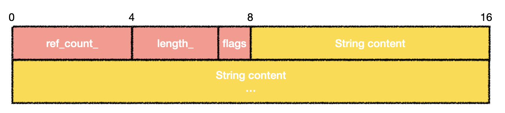

+++
title = 'Exploiting the libwebp Vulnerability, Part 2: Diving into Chrome Blink'
date = 2023-11-03T14:10:17+08:00
draft = false
+++

## Introduction

When we examine a third-party library vulnerability in a real environment, we often encounter numerous complex variables that exist within the vulnerability's context. Exploiting such a vulnerability is not as easy as one might imagine.

Here is the information we know:

- The overflowed variable [huffman_tables](https://source.chromium.org/chromium/chromium/src/+/d53886d694334f194b267db3af165e5cd61ef489:third_party/libwebp/src/src/dec/vp8l_dec.c;l=437), has a size of 0x2f28.
- The heap chunk is allocated in the renderer's ThreadPool, while most objects are allocated in the main thread.
- We can write a partially controlled 4-byte integer with an offset that is a multiple of 8 bytes.

In Chrome, different-sized heap chunks are stored in separate buckets, isolating objects of different sizes to ensure **security**. Typically, achieving heap exploitation in Chrome requires identifying objects of the same size for layout purposes and then utilizing Use-After-Free (UAF) or Out-of-Bounds (OOB) techniques to manipulate other objects, leading to information disclosure or control-flow hijacking. In the following, we will share the objects we have discovered, as well as attempting to bypass this mechanism.

## Infoleak

### Looking for an object

What we are first looking for is a suitable object that can be overwritten by OOB. Since our OOB write cannot control the value very well, writing pointers is basically excluded. The best scenario is to change fields like "length", which has no precise requirement for the value, but it should trigger further memory issues that can be better utilized.

In libwebp, `HuffmanCode` is allocated using `malloc`, while in Chrome it is actually allocated by PartitionAlloc. There are [four partitions](https://source.chromium.org/chromium/chromium/src/+/d53886d694334f194b267db3af165e5cd61ef489:third_party/blink/renderer/platform/wtf/allocator/Allocator.md) in the renderer: `LayoutObject partition`, `Buffer partition`, `ArrayBuffer partition`, and `FastMalloc partition`. FastMalloc actually calls `malloc` in the end, so the object we are looking for can be allocated using FastMalloc.

We first used the codeql query mentioned by Man Yue Mo in his [blogpost](https://securitylab.github.com/research/one_day_short_of_a_fullchain_renderer/). Since the overflow is in the 0x3000 bucket, the available object size range is 0x2800-0x3000. Unfortunately, the query result is empty, and objects of this size almost do not exist. Another idea is to use the overflow object itself, but changing this object does not produce any special effect, and there are no other good candidate objects in libwebp. At this point, it seems to be somewhat hopeless, as the first step of exploitation has been blocked.

So what other ideas do we have? One idea is to use variable-length objects, such as `AudioArray` mentioned by Man Yue Mo, but this object is pure data and changing it is useless. After examining all the FastMalloc calls, we finally found this [object](https://source.chromium.org/chromium/chromium/src/+/main:third_party/blink/renderer/core/css/css_variable_data.h;drc=d53886d694334f194b267db3af165e5cd61ef489;l=22).

```c++
class CORE_EXPORT CSSVariableData : public RefCounted<CSSVariableData> {
  USING_FAST_MALLOC(CSSVariableData);
```

The size of this object is dynamic

```c++
    wtf_size_t bytes_needed =
        sizeof(CSSVariableData) + (original_text.Is8Bit()
                                       ? original_text.length()
                                       : 2 * original_text.length());
    // ... snip ...
    void* buf = WTF::Partitions::FastMalloc(
        bytes_needed, WTF::GetStringWithTypeName<CSSVariableData>());
```

This object represents a [variable in CSS](https://developer.mozilla.org/en-US/docs/Web/CSS/Using_CSS_custom_properties). It can be defined in the following ways:

```css
element {
  foo: var(--my-var, bar);
}
```

Blink will dynamically allocate the memory of `CSSVariableData` based on the string content of CSS variables. Another good news is that CSS variables can also be easily manipulated in JavaScript.

```javascript
// add a CSS variable
element.style.setProperty('foo', 'bar');
// remove a CSS variable
element.style.removeProperty('foo');
// get the value of a CSS variable
getComputedStyle(element).getPropertyValue('foo');
```

### Cross-Thread Heap Occupation

We can control the size of `CSSVariableData` so that it is allocated in the same size bucket as `HuffmanCode`. A natural plan is to allocate a bunch of `CSSVariableData`, then free one of them, and allocate `HuffmanCode` to occupy the hole, as shown in the diagram below.


The idea is promising, but in reality, PartitionAlloc uses [ThreadCache](https://source.chromium.org/chromium/chromium/src/+/main:base/allocator/partition_allocator/src/partition_alloc/thread_cache.h;drc=9fc872d7a2507b4685051bd6a0d93349f668e6f8;l=241). Object allocation and deallocation are preferentially handled within the ThreadCache. Since the two objects are not allocated in the same thread, we need to find a way to remove `CSSVariableData` from the ThreadCache. By reading the [source code](https://source.chromium.org/chromium/chromium/src/+/main:base/allocator/partition_allocator/src/partition_alloc/thread_cache.h;drc=9fc872d7a2507b4685051bd6a0d93349f668e6f8;l=519) of ThreadCache, we found a way.

```C++
  uint8_t limit = bucket.limit.load(std::memory_order_relaxed);
  // Batched deallocation, amortizing lock acquisitions.
  if (PA_UNLIKELY(bucket.count > limit)) {
    ClearBucket(bucket, limit / 2);
  }
```

When the bucket is full, half of the slots will be moved out to the original SlotSpan. For a bucket size of 0x3000, the limit is 16. Therefore, we can occupy the space of `CSSVariableData` by releasing 16 `CSSVariableData` to trigger `ClearBucket`, and then allocating `HuffmanCode`. In order to ensure that the `CSSVariableData` we want to change are located behind `HuffmanCode`, we need to release them every few times. The diagram below illustrates this (in actual exploit, it is released every 7).


### From OOB to UAF

Now we have successfully allocated `HuffmanCode` to the freed `CSSVariableData`. We need to investigate which fields of this object are worth modifying.

Memory layout of `CSSVariableData`:



Recalling the primitive of our vulnerability - writing 4 bytes at an offset that is a multiple of 8 bytes. Modifying the string within the object doesn't make any profit, so the only thing we can change is the `ref_count_` field. What can we do with `ref_count_`? A natural idea is to transform this primitive into UAF for further exploitation. By reducing the value of `ref_count_` through an OOB write, and then triggering an operation that decreases `ref_count_`, we can get a UAF object.

However, the value written by OOB write is not entirely controllable. We need to find a way to increase the `ref_count_` of `CSSVariableData` to a specific value first.

```javascript
  let rs = getComputedStyle(div0);
  // add ref_count with kOverwriteRef
  for (let i = 0; i < kOverwriteRef; i++) {
    rs.getPropertyValue(kTargetCSSVar);
  }
```

Testing revealed that calling `getPropertyValue` temporarily increases the `ref_count_` of `CSSVariableData`. However, after GC, the temporarily increased `ref_count_` is restored. Therefore, the following steps are needed to create a UAF object:

1. Allocate `CSSVariableData` with an initial `ref_count_` of 2.
2. Call `getPropertyValue` kOverwriteRef times, which will increase the `ref_count_` to `kOverwriteRef + 2`.
3. Trigger the webp vulnerability to overwrite `ref_count_` to kOverwriteRef.
4. Trigger GC, and `CSSVariableData` will be freed.
5. Calling `getPropertyValue` again will trigger the UAF.

In `getPropertyValue`, blink constructs a string based on `length_` and returns it to JavaScript. Therefore, we only need to allocate an object with fully controllable data, such as [AudioArray](https://source.chromium.org/chromium/chromium/src/+/main:third_party/blink/renderer/platform/audio/audio_array.h;drc=9fc872d7a2507b4685051bd6a0d93349f668e6f8;l=45), and forge the `length_` field of `CSSVariableData` to achieve OOB read on the heap.

## Cross-Bucket Allocation

We have turned OOB into UAF, but the UAF object can only cause OOB read on heap. Assuming this can solve the problem of information leakage (which is not actually solved at this point), further exploitation is still not possible.

In previous blink heap exploits, attention was often focused on objects of the same size because they were naturally allocated together. However, at this moment, there are no better objects to exploit within the 0x3000 bucket. Can we attack objects of other sizes? Based on our investigation, the answer is yes.

PartitionAlloc places metadata (`SlotSpanMetadata`) of the heap on isolated pages, and the only remaining management information on user-allocated heap slots is the freelist pointer. If we can change this pointer, we achieve arbitrary address allocation. There are double free checks in the regular free operation in SlotSpan.

```C++
PA_ALWAYS_INLINE void SlotSpanMetadata::Free(uintptr_t slot_start,
                                             PartitionRoot* root)
  // ... snip ...
  auto* entry = static_cast<internal::EncodedNextFreelistEntry*>(
      SlotStartAddr2Ptr(slot_start));
  // Catches an immediate double free.
  PA_CHECK(entry != freelist_head);
```

In ThreadCache, there is no double-free check, and we can free the same address multiple times. However, during allocation, there are checks in place, as stated clearly in the comments.

```C++
  PA_ALWAYS_INLINE static bool IsSane(const EncodedNextFreelistEntry* here,
                                      const EncodedNextFreelistEntry* next,
                                      bool for_thread_cache) {
    // Don't allow the freelist to be blindly followed to any location.
    // Checks two constraints:
    // - here and next must belong to the same superpage, unless this is in the
    //   thread cache (they even always belong to the same slot span).
    // - next cannot point inside the metadata area.
    //
    // Also, the lightweight UaF detection (pointer shadow) is checked.
```

The places where we want to achieve arbitrary allocation cannot belong to metadata (Previously this method was used to obtain arbitrary memory r/w, [Reference](https://securelist.com/the-zero-day-exploits-of-operation-wizardopium/97086/)) and must be within the same superpage as the original slot, both of which can be easily satisfied.

Therefore, assuming `CSSVariableData` is A and the occupied `AudioArray` is B (where A and B actually represents the same address), we can perform a classic fastbin attack to achieve arbitrary address allocation.

1. free(A)
2. free(B)
3. malloc(C), and modify the freelist to address 0xdeadbeef
4. malloc(D)
5. malloc(E), and the allocated address for E will be 0xdeadbeef

But where do we want to allocate?

PartitionAlloc manages objects of different sizes through buckets, which manages SlotSpans consisting of slots of the same size. The basic unit of SlotSpan is Partition Page. For more details on the concepts and strategies, please refer to the [official documentation](https://chromium.googlesource.com/chromium/src/+/refs/heads/main/base/allocator/partition_allocator/glossary.md#slots-and-spans). For example, a SlotSpan with a slot size 0x3000 consists of three Partition Pages, with a total size of 0xc000, allowing for the allocation of four slots.

SlotSpans of different slot sizes may be adjacent in memory. Therefore, we just need to allocate the SlotSpan containing our interested objects near the SlotSpan with slot size 0x3000 to achieve information disclosure and object hijacking. Taking inspiration from Man Yue Mo's blogpost, we ultimately selected `HRTFPanner` (with slot size 0x500) as the object we want to attack.

We spray objects in memory in the following way, modifying the freelist pointer to achieve allocation from a 0x3000 slot to a 0x500 slot.


## RCE

Combining all of our previous knowledge, we can summarize the final steps:

1. Spray a large number of SlotSpans with sizes 0x3000 and 0x500 in the heap.
2. Trigger the webp vulnerability and convert it into `CSSVariableData` UAF.
3. Occupy the freed `CSSVariableData` using `AudioArray`, and exploit the UAF to achieve infoleak.
4. Perform a Cross-Bucket allocation to `HRTFPanner` and forge an `HRTFPanner` object.
5. Trigger the destruction of `HRTFPanner` to achieve arbitrary code execution.

## Conclusions

In this blog post, we have discussed in detail how to exploit an OOB write vulnerability in Chrome, even though the quality of this vulnerability may not be ideal. This testing was conducted solely to demonstrate the exploitability of the vulnerability and did not prioritize optimizing the success rate. The full exploit code can be found [here](https://github.com/DarkNavySecurity/PoC/tree/main/CVE-2023-4863), and the testing environment was based on Chromium compiled on Ubuntu 22.04 using [this commit](https://chromium.googlesource.com/chromium/src/+/b8b9a859ec2117b015d4ca440ab3483f99355f88).

It's still an open question that how to exploit this vulnerability under the mitigation mechanisms such as PAC in iOS environment. It is evident from this case that with the introduction of various mitigation mechanisms, the assessment of vulnerability severity has become increasingly complex, highlighting the limitations of a single-scale rating. DARKNAVY has publicly shared the closed-loop research on vulnerability localization, analysis, early warning, and exploit reproduction for the libwebp vulnerability, with the aim of promoting the development of scientific vulnerability assessment through adversarial assessment research that takes into account attacker perspectives and environmental characteristics.
