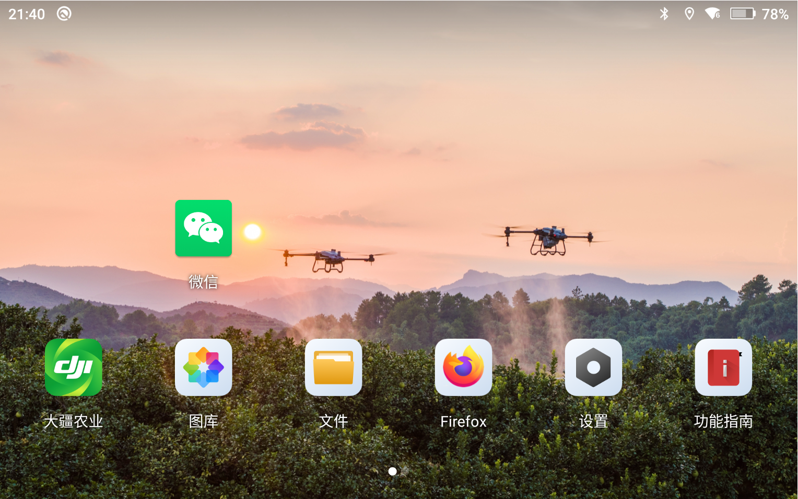

+++
title = 'Fatal Vulnerabilities Compromising DJI Control Devices'
date = 2025-03-21T10:01:19+08:00
draft = false
images = ["attachments/a5d9daf9-7637-4836-8314-05f71f5476f8.png"]
+++

As logistics drones weave through buildings and surveying equipment delineates urban landscapes, the capillaries of the low-altitude economy are sketching the future with millimeter-level precision.

DARKNAVY consistently focuses on the construction and breaching of drone security defenses. In this research, we discovered **a fatal exploit chain in DJI remote control devices**, leading to the complete compromise of the security defenses within the DJI remote controller. How can we assist industry leader DJI in fortifying its security defenses? What potential risks do these vulnerabilities reveal? Welcome to read this article.

---

As drones and their control systems become increasingly complex, modern drone systems are no longer limited to the aircraft and the remote controller. They also include unattended drone ports, cloud management platforms, and other components, enabling managers to remotely dispatch aerial operations without leaving their offices. These systems can be deployed not only in vast deserts to regularly inspect lines but also in cities for automated patrols.

Drone ports, integrating control and take-off/landing functions, have become core nodes for remote dispatch. Users can not only manually operate devices through remote controllers but also issue flight missions to drones through airports connected to the cloud.

 

When we focus on the implementation of complete drone automation, we discover that various attack surfaces exist across remote controllers, airports, the cloud, and the drones themselves.

 

This article will focus on two parts:

* **The DUML protocol used in various DJI devices**
* **An exploit chain composed of 5 vulnerabilities in DJI remote controllers**

## DUML Protocol

The DUML (DJI Universal Markup Language) protocol is one of DJI's core protocols, used for communication between various DJI devices and between different components within DJI devices. The unified DUML protocol format enables DJI devices to process various messages from different channels more efficiently.

We analyzed DUML-related programs on multiple DJI devices and conducted an in-depth exploration of the protocol content.

DUML supports multiple versions of protocol formats and communication channels. Each version has corresponding codecs responsible for encoding it into binary format and recovering from it. The encoded content includes a new header carrying information such as the protocol version, total length, and checksum. DUML data packets include the following key fields:

 

> * "Machine" and "host" are similar to IP addresses and ports in network protocols. DUML handlers create routing tables based on the `dji.json` file on the device. According to the configuration within this file, they forward or distribute DUML data packets to specific consumers based on the "machine" and "host" fields.
> * "Seq id" is the ID of the data packet. A quartet (`machine, host, msg id, seq id`) can be used to distinguish data packets and identify their corresponding response packets.
> * "Attributes" contain additional attribute information of the data packet, such as whether it is encrypted.
> * "Msg id" consists of two parts: "cmd set id" and "cmd id." It is mainly used to differentiate between different functions.
> * "Payload" is the payload content defined by the upper-layer application.

Under black-box testing conditions, it is difficult to obtain the `dji.json` file and therefore impossible to know which valid "msg id" (cmd set id / cmd id) values exist. This makes it challenging to analyze the functional interfaces provided by the device.

We discovered a difference in DUML response packets between normal functional interfaces and non-existent ones. Therefore, we can probe for valid "msg id" values using a method similar to network port scanning:

* One attribute within the "attributes" field of the DUML data packet affects how the DUML handler processes the packet upon reception. When this attribute is set to a specific value (`attributes = 0b0_01_0_0000`), the DUML handler will first respond with an ACK data packet if the corresponding "msg id" is valid (a handler function is registered for it). Additionally, the first byte of the payload in this ACK packet will be 1. Consequently, the validity of a "msg id" can be determined by whether an ACK data packet conforming to this pattern is received.

 

 

By analyzing the list of functionalities supported by the device through DUML, we can further examine the attack surfaces exposed by the device and identify potential security issues within them.

However, DUML communication requires the device to establish a connection with a device controlled by the attacker.

## Remote Controller

DJI remote controllers and drone ports communicate with drones over long distances for control and data transmission through the OcuSync protocol. Therefore, if we could "take over" a remote controller or a drone port, it would undoubtedly help us further our research on drones in operation.

So, we bought a DJI RC Plus remote controller...

 

The DJI RC Plus runs a customized Android system that can install APKs.

It includes a large number of DJI services, ranging from the application-layer "DJI Agriculture" to system services related to drone control, and further down to DJI TA within the Trusted Execution Environment (TEE).

 

The DJI RC Plus has built multi-layered security mechanisms for drone remote control. At its core is the device root key (rootkey) stored within the TEE.

It is called the rootkey because it serves as the foundation for a large number of critical keys in the system. The DJI TA utilizes a Key Derivation Function (KDF) to derive various keys from the rootkey, which are then used by other components during authentication and encryption processes. This approach allows for more convenient and efficient management of various keys within the system, and the security of all these keys depends on the security of the rootkey.

Naturally, the rootkey receives more protection. It is used exclusively by the DJI TA and is never transmitted out of the TEE. Furthermore, when not in use, it is encrypted using the Hardware Unique Key (HUK) and stored in the device's high-security storage area, RPMB (Replay Protected Memory Block). This makes it difficult for attackers to obtain the rootkey, even with advanced chip-level physical attack capabilities.

 

---

This article will describe how we chained together **five vulnerabilities** by installing an app, bypassing multiple layers of defense mechanisms, executing code within the TEE, and ultimately obtaining the rootkey from the RC Plus remote controller.

### 01. CVE-2023-20963 "n-day"

We analyzed the details of CVE-2023-20963 in [the "Most Unforgivable" Vulnerability Exploitation on DARKNAVY Insights](https://mp.weixin.qq.com/s/P_EYQxOEupqdU0BJMRqWsw).

> CVE-2023-20963 is a Parcel Mismatch vulnerability in Android `android.os.WorkSource` class. By exploiting this vulnerability, an attacker can achieve LaunchAnyWhere capability to send arbitrary intents with system privileges.
>
> There are many public analyses regarding the exploitation of CVE-2023-20963, so we will not elaborate further here.

**But why can the already patched CVE-2023-20963 still be exploited on the new version of DJI RC Plus?**

Although Google has released patches for the affected Android 11, 12, 12L, and 13, this vulnerability was actually introduced as early as Android 9. At that time, Google had already ended security patch support for Android 9 and 10, so any vulnerabilities in these two versions would no longer receive patch updates.

 

**And the system version of DJI RC Plus is precisely Android 10.**

Therefore, we leveraged the "n-day" CVE-2023-20963 on the DJI RC Plus to gain LaunchAnyWhere capability, allowing us to send arbitrary intents with system privileges.

### 02. LaunchAnyWhere → System Arbitrary File Read/Write

The impact of sending arbitrary intents with system privileges might be limited, but if…

 

We discovered that the system application Settings APP provides a root-path FileProvider, which **allows access to any file under the root directory**.

By combining LaunchAnyWhere and the root-path FileProvider, we achieved arbitrary file read and write with system privileges.

### 03. SELinux "Permissive"

In the Android system, not only are different permissions distinguished by user ID (uid), but SELinux is also used for more fine-grained file permission management. Through rules, it restricts that only specific context processes paired with the file's label can access the file. However…

 

In RC Plus, SELinux is not configured in Enforcing mode, so its protection is actually ineffective.

This allows us to use a very old (2017) exploitation technique: overwriting the optimized dex bytecode files in the `/data/dalvik-cache/` directory to transform arbitrary system file read/write into arbitrary system code execution.

 

Furthermore, because SELinux is not enabled, the TEE  driver (`/dev/qseecom`), which the `system_app` context originally could not be accessed, but becomes accessible to us.

 

 

At this point, we have obtained the ability to interact with the TA in TEE through three vulnerabilities on the Android side.

So, the next step…

### 04. BYPASS TA ASLR

To achieve arbitrary code execution within the TA, bypassing ASLR is a crucial step.

We discovered an out-of-bounds (OOB) array access vulnerability in DJI TA, which allows for out-of-bounds reading of stack data and returning it.

 

Through this OOB vulnerability, we can dump the return address on the stack, leak the TA's load address, and thus bypass TA ASLR.

 

### 05. STACKOVERFLOW

We discovered another stack overflow vulnerability in DJI TA, which allows for arbitrary-length, arbitrary-content stack overflow.

 

Therefore, we exploited the stack frame of the vulnerable function's parent function to achieve code execution via ROP:

1. Read the root key located in RPMB.
2. Decrypt it using HUK.
3. Copy the plaintext root key to the output buffer.
4. Ensure the program returns normally.

 

Ultimately, by combining five vulnerabilities, we achieved arbitrary code execution capability within the TEE of the DJI RC Plus remote controller and obtained the remote controller's root key. With the root key, we can derive the various keys used by the remote controller for authentication and encryption, thereby enabling further analysis of the communication between the remote controller and the drone.

We submitted this series of vulnerabilities to DJI SRC on December 9, 2023. DJI SRC confirmed them as **fatal** vulnerabilities.

 

## References

* <https://www.ndss-symposium.org/wp-content/uploads/2023/02/ndss2023_f217_paper.pdf>
* <https://www.digidow.eu/publications/2021-christof-masterthesis/Christof_2021_MasterThesis_DJIProtocolReverseEngineering.pdf>
* <https://www.nowsecure.com/blog/2017/06/16/remote-code-execution-as-system-user-on-samsung-phones/>