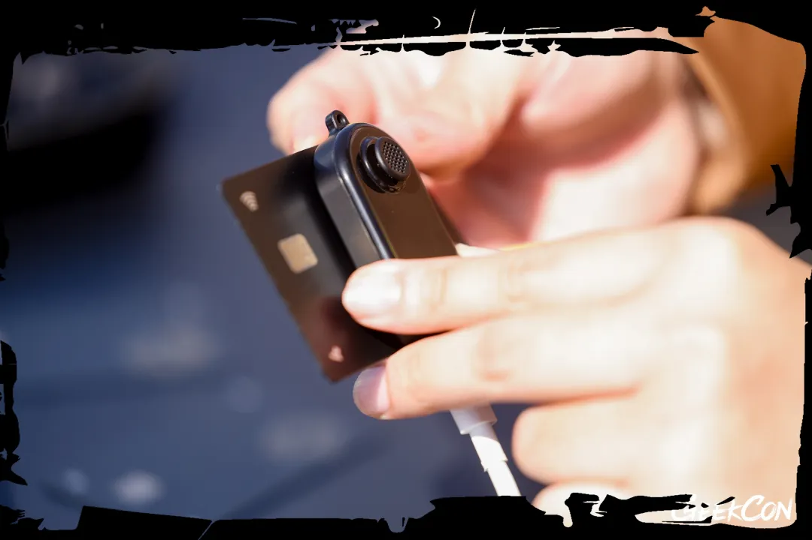
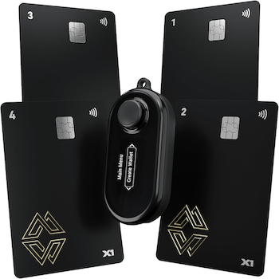
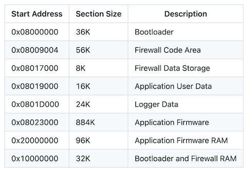
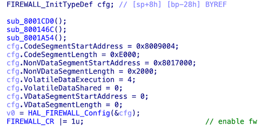
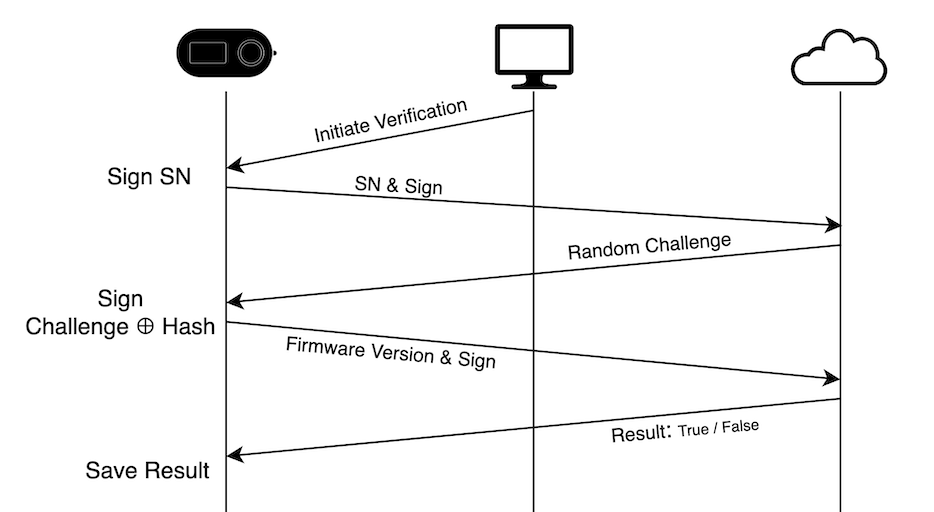

+++
title = 'How And Why We Hacked Cypherock Hardware Wallet: The Full Story'
date = 2025-11-21T15:47:08+08:00
draft = false
images = ["attachments/e9a95181-18af-4ea9-ac8b-14d8fe8f6833.png"]
+++

On blockchains, whoever controls the private key to an address controls the funds in the corresponding account.

In October 2025, the U.S. government announced the seizure of **127,000 BTC** from Prince Group. On‑chain tracing reports indicated that these funds were in fact the assets stolen from the *LuBian* mining pool in December 2020.

A Bitcoin private key is a 256‑bit random number and is, in theory, infeasible to brute‑force. How did the U.S. government obtain *LuBian*'s wallet private key?

In 2023, the Milk Sad research team discovered and disclosed a pseudo‑random number vulnerability in **Libbitcoin Explorer (bx)**: bx used only a **32‑bit** random number as a seed, and from this seed deterministically generated a 256‑bit "random" number. Such insecure randomness can be brute‑forced within hours, and LuBian's wallet key generation suffered from the same issue.

The security threats to private keys do not end there. Beyond algorithmic flaws in software wallets themselves, the devices storing private keys are often online: system vulnerabilities, malicious plugins, phishing sites, remote‑control trojans, and other attack vectors can steal keys or signing authority without the user noticing.

To better protect private keys, hardware wallets emerged. By isolating private keys within a dedicated chip on an offline device, preventing direct exposure to the network, they are regarded as the "safe box" of digital assets.

But are hardware wallets truly absolutely secure?

In the March article *[If the Person Who Finds a Web3 Hardware Wallet is a Hacker](https://www.darknavy.org/blog/if_the_person_who_finds_a_web3_hardware_wallet_is_a_hacker/)*, DARKNAVY already demonstrated an attack displaying "Hacked" on a Cypherock hardware wallet. However, merely displaying this text does not cause any real harm. Therefore, on stage at **GEEKCON 2025**, DARKNAVY showcased real‑world attacks on two hardware wallets. For Cypherock, we simulated a supply‑chain attack, tampering with the firmware, bypassing secure boot and device authenticity verification, and ultimately gaining control over newly generated mnemonic phrases.

 

This article outlines how DARKNAVY discovered multiple vulnerabilities and weaknesses in Cypherock and chained them together for exploitation.

---

## The Unique Architecture

The PIN code and mnemonic are the two most critical pieces of information in a hardware wallet; leakage of either may result in stolen funds. Therefore, many hardware wallets utilise a Secure Element *(SE)* to protect these secrets. Although the Cypherock X1 Vault has an ATECC608A secure element built in, this SE is **only used for device authenticity checks**.

In X1's unique architecture, the mnemonic is split into 5 shares using **Shamir's Secret Sharing** algorithm and stored across the wallet itself *(X1 Vault)* and 4 NFC cards. When a signature is needed, the private key can be reconstructed in the Vault using the Vault and any one of the NFC cards. PIN verification is also performed by the NFC cards.

 

All of the exploitation chain described here takes place on the X1 Vault MCU, and does not involve the SE or the cards.

## **Control Flow Hijacking**

Whether via manual auditing or [LLM‑based automated bug hunting](https://www.darknavy.org/blog/argusee_a_multi_agent_collaborative_architecture_for_automated_vulnerability_discovery/), one can find numerous vulnerabilities in the open‑source firmware repository of the X1 Vault. For example, when the wallet selects an applet based on the `applet_id` in a USB packet, there is an out‑of‑bounds access which makes a function pointer controllable.

```cpp
const cy_app_desc_t *registry_get_app_desc(uint32_t app_id) {
  return descriptors[app_id];    // OOB
}

void main_menu_host_interface(engine_ctx_t *ctx,
                              usb_event_t usb_evt,
                              const void *data) {
  uint32_t applet_id = get_applet_id();
  const cy_app_desc_t *desc = registry_get_app_desc(applet_id);

  if (NULL != desc) {
    desc->app(usb_evt, desc->app_config);

  // ......
}
```

Fixed firmware loading addresses, disabled **Canary**, and the absence of **Execute‑Never** protection allow any vulnerability to be easily converted into **ROP** or **shellcode execution**.

## The Truth About Being "Open‑source"

To research further exploitation methods, we turned to the logic of firmware upgrade and boot verification.

Although Cypherock claims to be "fully open source", only the **"Application Firmware"** is open source. The **Bootloader** and the **Firewall Code Area**, mentioned in the documentation, are not open source. They are designed to be non-upgradeable, so we cannot extract them from firmware update packages either. Crucially, the firmware verification logic resides within these two sections.

 

With a simple attempt we discovered that after hijacking the control flow, the **Bootloader code segment** can be directly read and sent to the computer via USB. However the **Firewall Code** *(and Firewall Data Storage)* cannot be read. By reverse‑engineering the Firewall initialisation logic within the Bootloader, we confirmed that the unreadable memory segment is indeed protected.

> Firewall is a hardware security feature provided by the STM32L4 series, implementing memory access isolation.
>
> STM32L4 allows the user to define one protected region each for Code, Non‑Volatile Data, and Volatile Data; only instructions in the Firewall Code region may access the protected areas.
>
> In addition, Firewall Code can only be called via a Call Gate; directly jumping into an address inside the protected region is treated as an illegal access.

 

As only the Firewall Code can read itself, we turned our attention to analysing the Firewall's functionality in order to discover vulnerabilities.

## Tearing Through The Firewall Protection

The Firewall Call Gate entry is implemented as a function; the parameter `task` distinguishes functionality, along with two address pointers and their size.

```cpp
static uint32_t firewall_func(const uint32_t task,
                              const uint8_t *data,
                              const uint32_t size,
                              const uint32_t address)
```

The Application Firmware mostly uses the Firewall to read and write the Firewall‑protected **NVDATA** region. This region contains 4 pages:

1. Primary Bootloader Data: stores firmware version, firmware hash, device state, etc.
2. Backup Bootloader Data: backup of the above information
3. Permanent Key Storage: stores various device keys
4. Secure Data Storage: stores wallet information, etc.

For the first two pages, the Firewall exposes only limited, restricted read/write interfaces. For the last two pages, multiple tasks are provided for read/write, analogous to `**memcpy**`: the `address` parameter points into the protected region, while `data` points to external data. The Firewall code should have validated the ranges of both pointers and the read/write length, but testing showed that the **WRITE** functionality allows `data` to be any address. By setting `**data**` to point to the Firewall Code, we can copy (**WRITE**) the protected code into **NVDATA**, and then **READ** the **NVDATA** out.

There is one last small obstacle: **WRITE** is not a simple memory copy but a Flash write. Before repeatedly writing to the same address, the entire page must first be erased. To avoid corrupting valid NVDATA and bricking the device, we located a function that erases **Secure Data Storage** and then rewrites the latest full data. At this point, the remaining free space in this page can be safely used to dump Firewall Code.

## Fragmented Upgrade Logic

Having obtained full codes within the MCU, we can now truly analyse the firmware verification logic. Skipping the reverse‑engineering process,  here is a summary of the firmware (*Application Firmware*) upgrade flow:

0. The Application Firmware sets `BOOTSTATE` to "upgrading" via the Firewall and then reboots the device.

1. The Bootloader enters the upgrade process, receives the firmware header from USB, then calls multiple Firewall tasks to:

   a. Set `BOOTSTATE` to "in upgrade".

   b. Verify the signature on the firmware header, then store the firmware version and size in Bootloader RAM.

   c. Store the firmware's signature in Bootloader RAM.

2. The Bootloader receives the full firmware from USB page by page, erasing and writing the corresponding Flash regions.

3. The Bootloader again calls multiple Firewall tasks to:

   d. Hashing the current (newly-written) firmware, and verify it against the signature saved in step 1c.

   e. Hashing the current firmware again, and together with the firmware version and size saved in step 1b, write them into **Primary Bootloader Data**, and restore `BOOTSTATE` to the normal state.

If at any point the USB connection is interrupted or any verification fails, the device reboots immediately and re‑enters the upgrade process.

Note that the upgrade flow has serious flaws: each Firewall task is independent and **can be executed out of order** (in particular, the two signature verifications in **1b** and **1c**); the firmware signature is never written to Flash, and on boot **only integrity is checked, not authenticity**.

Thus, after hijacking MCU control flow, we can directly erase and rewrite the firmware code and then call the Firewall task from **3e** to calculate and store the current (malicious) firmware hash, achieving firmware tampering. As for the parameters saved after verification in step **1b** that **3e** relies on, we can simply modify them—attentive readers may have noticed that the Bootloader and Firewall Code share the same RAM, and the Firewall initialization code does not set any protection for the Volatile Data region.

## **Illusory Authenticity Verification**

At GEEKCON, we simulated what an ordinary user might do when first receiving a newly purchased Cypherock wallet for "inspection": the judge connected the **wallet already compromised by the contestant** to a computer and used Cypherock's CySync software to perform a device authenticity check. Seconds later, this backdoored wallet passed the vendor's check, with "verification passed" shown both on the computer and on the wallet screen.

According to the vendor's design, the first boot after flashing the wallet firmware should trigger a mandatory device authenticity check, and tampered firmware should not be able to pass this check. So how did we achieve the last step in the supply‑chain attack?

Cypherock's authenticity verification process is shown in the diagram; the Vault's SE finally comes into play: it uses a built‑in private key to sign twice—first over the device serial number, then over the XOR of a cloud‑generated nonce and the firmware hash. Once the cloud returns the verification result, the device saves the status.

 

Since the second signature incorporates the firmware hash, and the client PC also submits the device's firmware version, the cloud can determine whether the firmware hash is correct. However, the SE cannot directly read the firmware; what authenticity is there in a hash provided by malicious firmware?

In addition, this check is only **unidirectional**: the cloud verifies the device, but the device does not verify the cloud. If the goal is merely to bypass the device‑side check, the client can simply return "success" locally.

## The Vendor's Attitude

Although Cypherock loudly boasts itself as the "Safest Hardware Wallet" and offers a public bug bounty program on its website, its attitude toward both users and security researchers can be summarised as **silence is golden**.

In March, DARKNAVY reported two vulnerabilities to Cypherock by email. They silently pushed patches to GitHub but did not even bother to send an acknowledgment. Coincidentally, at this year's Hexacon, the session titled "**Breaking the Vault: USB Bugs and Bug Bounty Failures**" explicitly highlighted the experiences of peers reporting vulnerabilities to Cypherock.

Vulnerability fixes also lack transparency, leaving users entirely in the dark about the security state of their devices; when people ask about sessions on conferences, the vendor brushes them off with a perfunctory "already resolved long ago".

Therefore, for the Bootloader and Firewall vulnerabilities involved this time, we chained them to flash a custom firmware, replacing the boot logo and mnemonic display, just for amusement.

[Video](https://x.com/DarkNavyOrg/status/1967884894815854898)

## References

\[1\] <http://milksad.info/>

\[2\] <https://github.com/Cypherock/x1_wallet_firmware>