+++
title = 'If the Person Who Finds a Web3 Hardware Wallet is a Hacker'
date = 2025-03-30T10:00:52+08:00
draft = false
images = ["attachments/7040d7d5-4672-4806-a6e3-ef920e3515da.png"]
+++

In 2024, Web3 security incidents caused by private key leaks have surged, resulting in estimated financial losses exceeding $855 million.

Private keys function as the sole credentials for blockchain accounts, controlling access to all associated on-chain assets like cryptocurrencies and NFTs. Due to the decentralized nature of blockchain, losing the private key means permanently losing account control, while leakage typically results in asset theft. **Hardware wallets**, utilizing techniques like offline private key storage and secure chips, have become the primary choice for asset protection.

But does the moment a hacker's fingertip touches the metal casing of a hardware wallet, the Pandora's box of the digital abyss truly open?

In this brief overview of attack and defense, we outline DARKNAVY's research on Web3 hardware wallets from an adversarial perspective.

 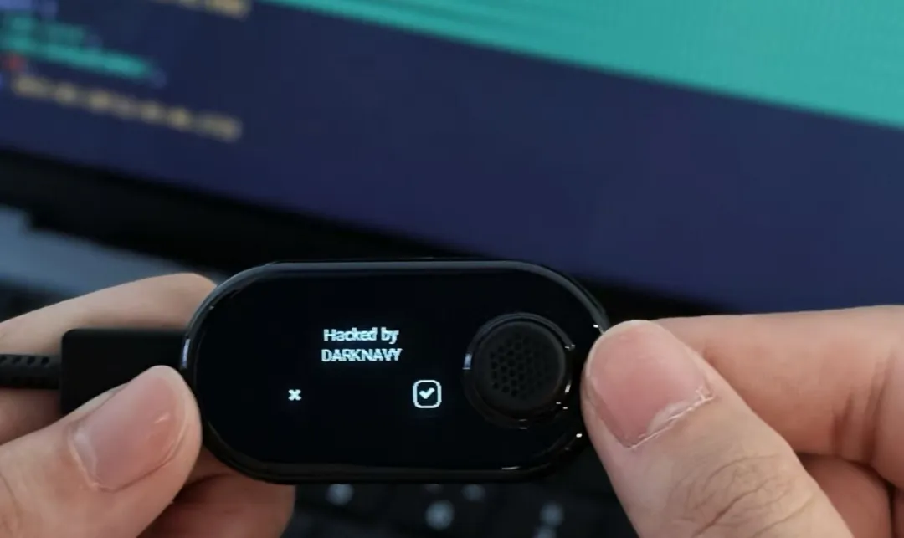

## Attack Surface Overview

Mainstream hardware wallets available on the market, despite variations in form factor, are typically marketed with assertions of robust security designs. However, the efficacy of these proclaimed security features may not consistently meet expectations, and in some cases, might even introduce vulnerabilities. Although hardware wallets effectively reduce numerous attack surfaces through mechanisms like offline signing and simplified functionalities, **this does not guarantee that the security of the remaining attack surfaces.**

Due to their offline nature, hardware wallets require external devices (e.g., browsers, mobile apps) to transmit transaction data for signing and to subsequently broadcast signed results to the blockchain. Certain wallets with small or absent displays provide configuration settings exclusively via an associated application, which in turn transmits the necessary configuration parameters to the wallet.

Based on analysis of mainstream hardware wallets, We classify the typical connection methods between the hardware wallet and external entities and access the associated security risks.

Firstly, three duplex communication interfaces have been identified: USB, NFC, and Bluetooth.

These three methods may harbor vulnerabilities in their data communication protocols and data processing, potentially leading to issues like memory corruption or sensitive information leakage. **When an attacker has physical access to the device, these communication interfaces may further introduce security risks:**

* **USB:** Some wallets can emulate a USB flash drive,thereby increasing the attack surface; Additionally, certain devices support bootloader mode, granting access to lower-level functions via USB.
* **NFC:** Although physical proximity limits its exploitation, NFC communication remains susceptible to Man-in-the-Middle (MitM) attacks, which may allow an attacker to intercept and parse sensitive data.
* **Bluetooth:** Bluetooth communication itself has multiple risk points, such as pairing hijacking, MitM attacks, and data sniffing, and its range limit is much less restrictive than NFC's.

 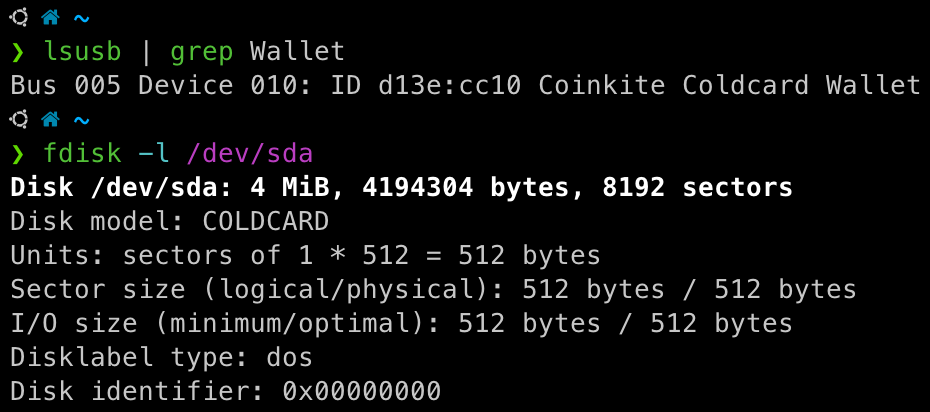

These communication methods connect the offline wallet to networked devices, raising concerns among users: What data is actually being transferred between the external device and the wallet? If the device is compromised, is the wallet still safe? Or, could the wallet and its accompanying app have built-in backdoors that surreptitiously upload wallet data after establishing a connection?

To address these concerns, hardware wallet manufacturers have introduced the concept of "Air Gapped," physically isolating the wallet from network-connected devices. Two primary transmission methods adhere to this principle, both requiring user intervention to execute a one-way data transfer. The specific operation processes and risks are as follows:

* **QR Code:** The client first converts the data requiring a signature into a static or dynamic QR code. The hardware wallet, equipped with a camera, scans the QR code to retrieve the data and confirm the signature, and finally, the client scans the QR code displayed on the hardware wallet. Memory corruption issues might arise during the processes of image parsing and QR code recognition.
* **SD Card:** The client and the hardware wallet exchange signature request and signature result files in a specific format using a single SD card. Memory corruption issues may occur when parsing the file format.

 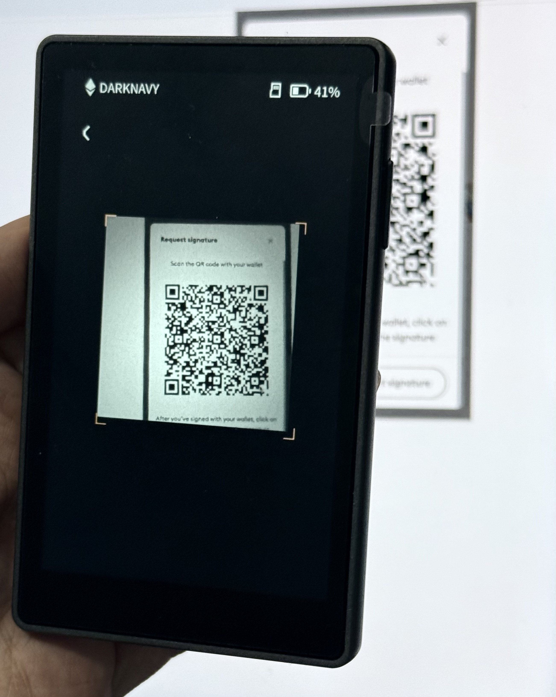

Besides attack surfaces exposed during communication, some hardware wallets also provide firmware update interfaces (commonly via USB, Bluetooth, or SD card mode). The update process typically involves hash calculations, signature verifications to ensure firmware integrity and authenticity, and version checks to prevent rollbacks. If the update process is poorly implemented, an attacker might be able to flash malicious firmware or an older, vulnerable firmware version.

 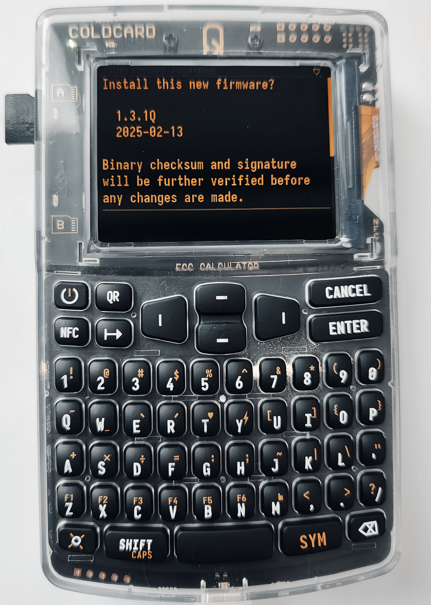

Furthermore, although most hardware wallets employ secure chips for private key storage, they remain vulnerable to physical attacks such as side-channel analysis and hardware fault injection.

The following sections will analyze the **USB and NFC attack surfaces** from an adversary's perspective.

## USB Attack Surface

Many hardware wallets communicate with computers or mobile devices via USB. Based on the underlying USB HID protocol, each hardware wallet implements its own proprietary application-layer protocol that defines specific commands and response formats. Using the Cypherock X1 wallet as a case study, we outline the attack surface associated with USB connectivity.

The X1 runs a **real-time embedded system** that processes incoming USB requests. A complete USB command cycle begins with **the desktop application cySync**, which serializes the request via an SDK and transmits it to the X1 wallet over USB. The wallet processes the request and returns a data packet, repeating this circle until the command is fully executed.

 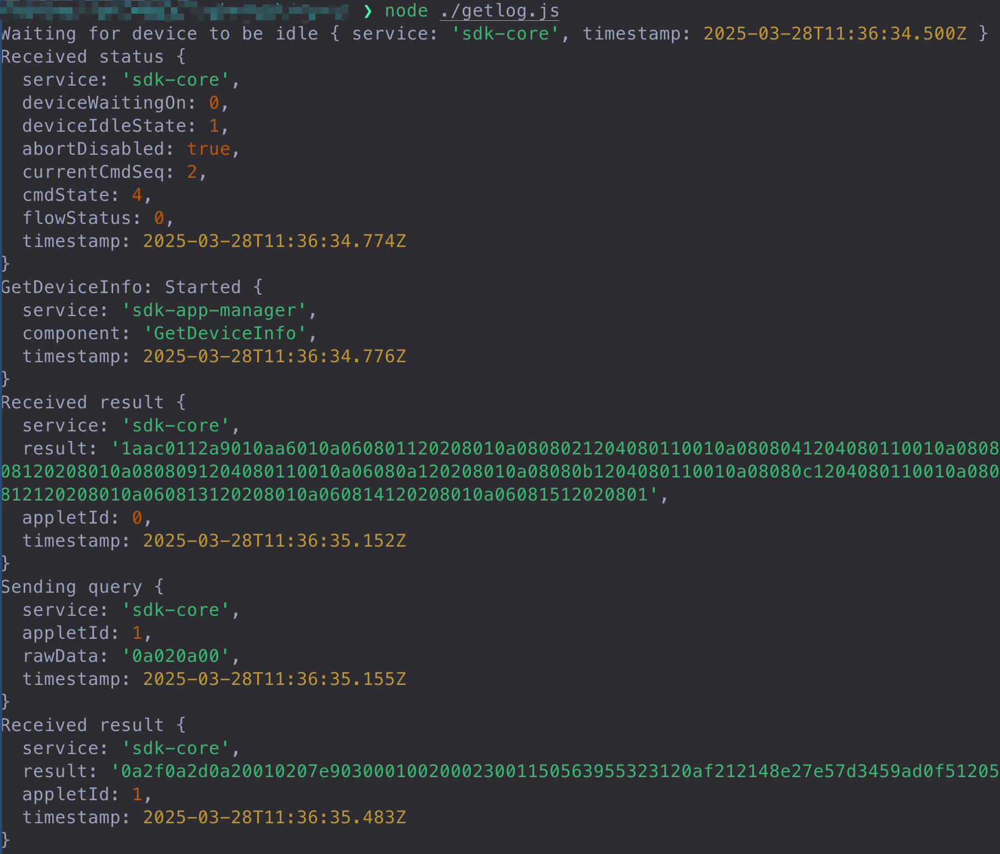

The X1 wallet contains multiple applets. After reading the `applet_id` from the request via a USB event callback, the X1 invokes the corresponding applet for further processing.

From an attacker's perspective, the logic related to the device's communication with the outside world is of greater interest: the device responds to requests via event callbacks, parsing protobuf data into structured data for processing; once request processing is complete, it directly calls an API to return a response to cySync.

In this process, if the X1 wallet lacks rigorous security checks when parsing and handling external request data, it could potentially be exploited by an attacker.

 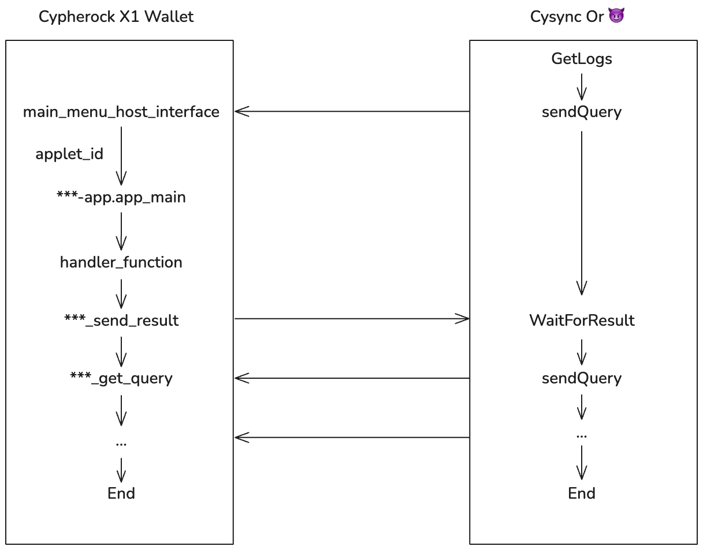

## NFC Attack Surface

The tap-and-go nature of NFC technology has added convenience to modern life, and some hardware wallets have adopted this feature. Unlike entrance guard systems typically use M1 cards with basic storage functions, hardware wallets generally employ CPU cards capable of more complex authentication logic. The following presents our research of the NFC module in the Tangem wallet:

 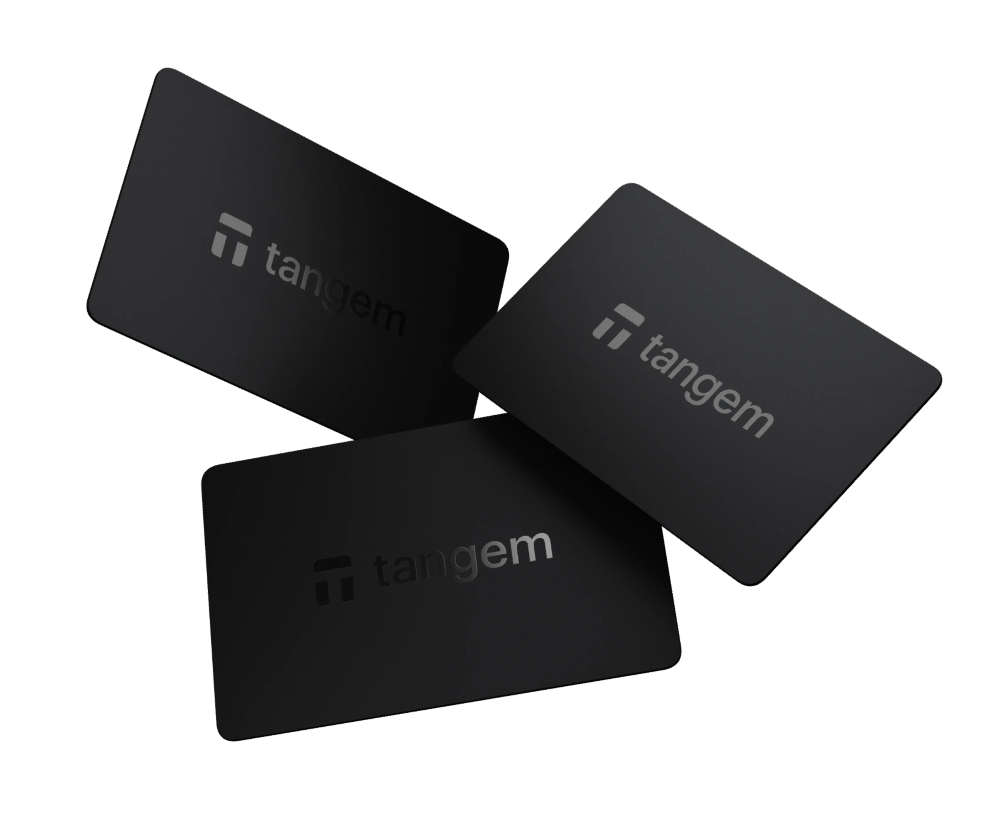

Tangem's NFC communication operates in **unencrypted, Fast encrypted, and Strong encrypted** modes. By default, interactions begin in the unencrypted mode, where data is simply serialized. Encryption is only activated after the card responds with a *NeedEncryption* message, creating a window during which attackers can intercept plaintext data.

 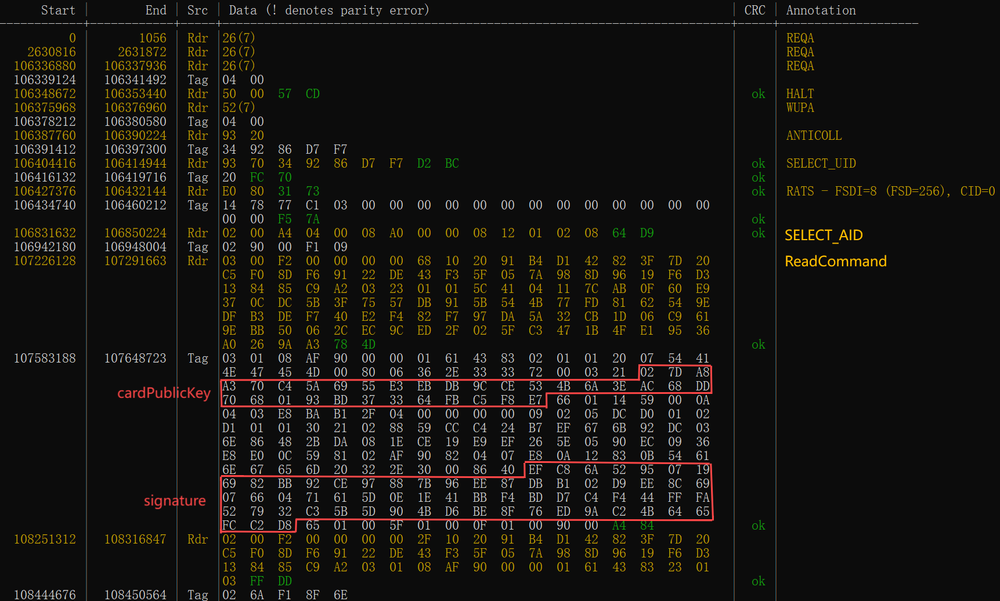

> NFC consists of a Tag side and a Reader side. From an attacker's perspective, one can impersonate either side to communicate with the other.

Every time the Tangem app is launched, two tap operations are required. As shown above, we sniffed the NFC interaction data during the first tap. Following the standardized SELECT_UID and SELECT_AID operations, the Reader sends a ReadCommand instruction. Upon receiving the instruction, the card returns both card information and walletData.

 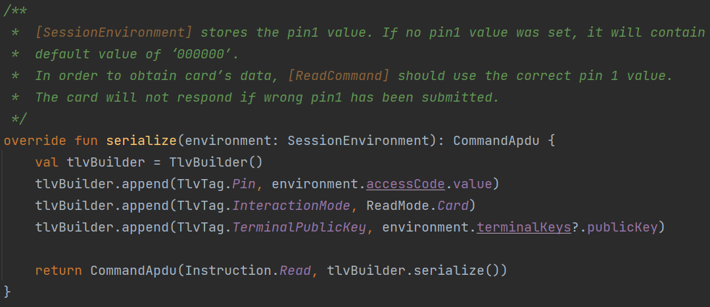

As shown above, the ReadCommand requires three parameters: Pin, InteractionMode, and TerminalPublicKey. However, the card does not validate the Pin for this instruction. Therefore, an attacker can impersonate the Reader and access the card and walletData information simply by 'tapping' the card:

These two pieces of information themselves do not contain highly sensitive data, prompting us to sniff the data from the second tap.

 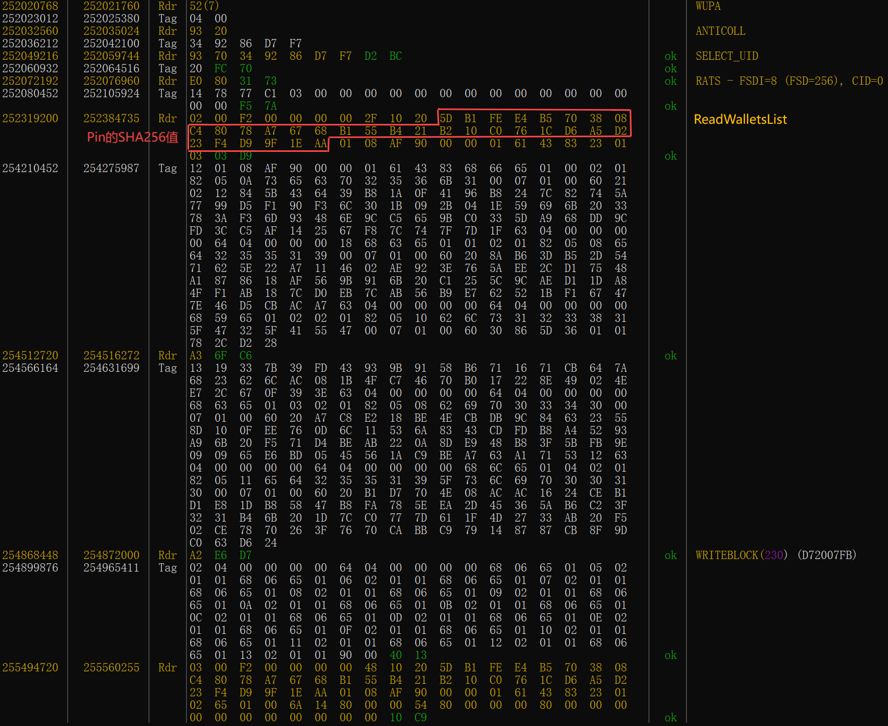

During the second tap, the Reader sends the ReadWalletsList instruction. The card validates the Pin parameter within this instruction upon receipt. if successful, it returns all CardWallet information, and if failed, it returns the error code 6A F1.

Thus, brute-forcing the PIN using the response data appears to be a possible attack scenario. Fortunately, the manufacturer addresses this risk and introduces a security delay in the card: After 6 failed attempts, each subsequent failure increases the card's response time by 1 second. However, according to comments in the client source code, this logic was introduced in version 1.21. Since Tangem cards do not support firmware updates, wallets purchased prior to version 1.21 remain more vulnerable to PIN brute-force attacks if the card is lost.

Tangem supports 33 custom NFC functions. Besides potential flaws in functional logic, memory-related vulnerabilities on the card also present a possible attack surface.

 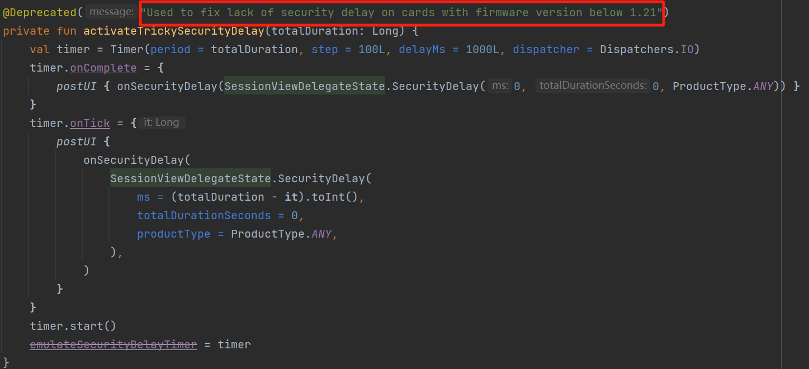

## Conclusion

Asset migration in the blockchain ecosystem never stops. What hardware wallets carry represents far more than a simple combination of physical chips and cryptographic algorithms; they are the ultimate experiment in entrusting 'trust' to code.

As attackers dissect hardware protection layers with surgical precision, the fragile reality of this trust experiment becomes clear: a single unnoticed buffer overflow, an inadequately isolated secure chip, or even a misplaced comment in the firmware code can become a critical flaw capable of undermining the entire system. In this ongoing battle over assets worth trillions, DARKNAVY's research remains relentless.

## Reference

* \[1\] <https://www.certik.com/zh-CN/resources/blog/hack3d-the-web3-security-report-2024>
* \[2\] <https://www.cypherock.com/>
* \[3\] <https://tangem.com/>