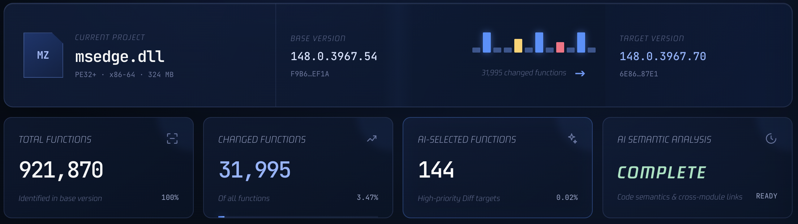
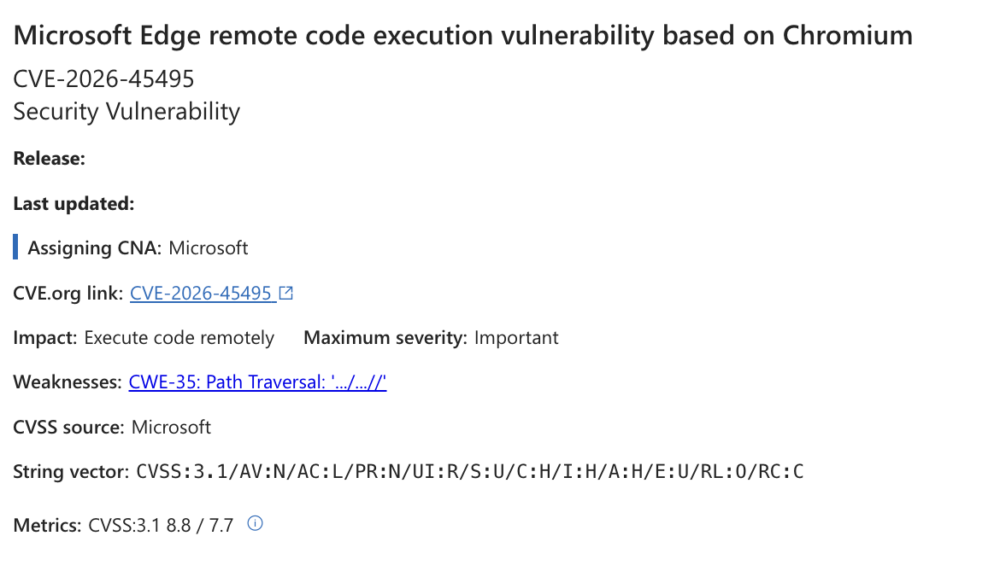
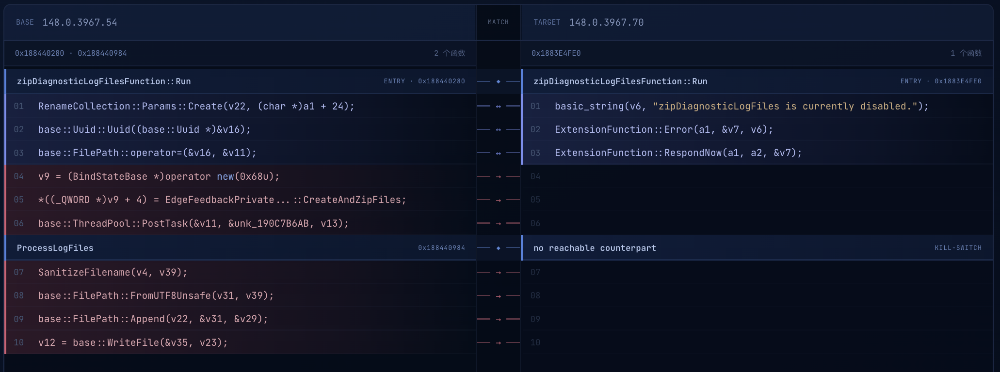
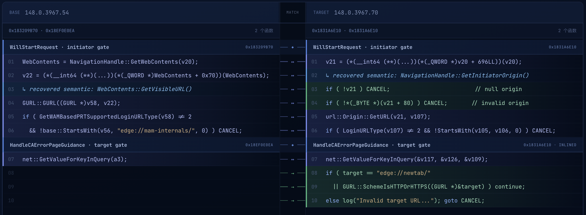
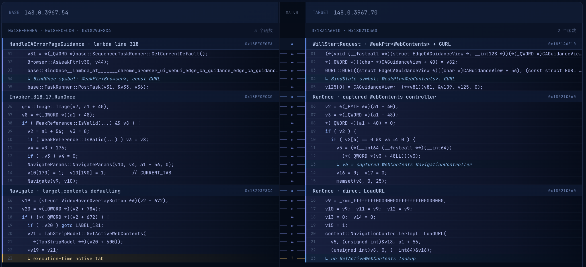
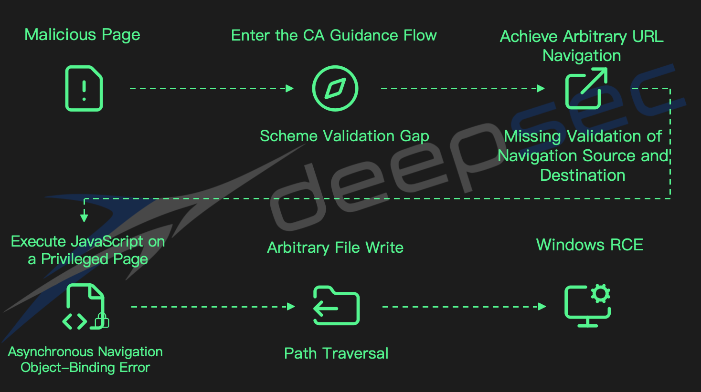

+++
title = 'Patch In, Exploit Out: How deepsec Reconstructed the Pwn2Own Microsoft Edge Sandbox Escape'
date = 2026-07-31T16:12:00+08:00
draft = false
+++

On May 14, 2026, security researcher Orange Tsai demonstrated a Microsoft Edge sandbox escape at Pwn2Own Berlin, one of the world’s premier hacking competitions. He was the only contestant to win the browser category, earning $175,000. The organizers later revealed that his exploit chained together four logic bugs rather than relying on the memory-corruption vulnerabilities commonly used in browser exploitation. The news sparked intense discussion across the global security community, but the mechanics of the attack remained unknown.

For the next two months, technical details remained limited to the information in Microsoft’s security advisories, and no third party publicly reproduced the attack. **Now, for the first time, the PoC Agent in our AI-powered security system, deepsec, has reconstructed every step and produced a working reproduction of the exploit.**

<video src="attachments/edge-pwn2own-exploit-chain-demo.mp4" controls="controls" preload="metadata" width="100%"></video>

## The Limitations of Traditional Patch Analysis

Analyzing security patches from vendors such as Microsoft and Apple is an important part of security programs within enterprises and critical infrastructure organizations. This work helps teams determine the real-world impact of vulnerabilities, assess how quickly attackers may weaponize them, independently verify whether patches fully address the underlying issues, and develop detection and mitigation capabilities.

In this case, however, the vulnerabilities were buried in the massive Edge codebase, with a single binary module exceeding 300 MB. Applying traditional binary diffing at this scale demands substantial expert effort. After loading the target module and its debugging symbols into a tool such as IDA, the resulting IDB can reach 5 GB, making analysis extremely time-consuming.

Moreover, non-semantic changes introduced by compiler optimizations and function reordering generate large amounts of noise unrelated to the target vulnerabilities. In this Edge update, more than 32,000 functions differed between the vulnerable and patched versions, making the security-critical fixes even harder to isolate.

Unlike memory-corruption vulnerabilities, logic bugs depend heavily on code context and application semantics. Examining changed functions in isolation is rarely enough to reconstruct their full security implications.

Our subsequent review found that the logic bugs in this Edge exploit chain were spread across several unrelated modules, including navigation validation, asynchronous tab selection, and feedback-log processing. Even after locating an individual fix, it was difficult to determine what exploit primitive the underlying vulnerability provided, let alone how to chain it with the others.

During our research, we found that AI significantly accelerated semantic analysis and the discovery of relationships across modules. Based on this insight, we implemented an automated differential analysis framework within deepsec, integrating binary diffing tools, the PoC Agent platform, and DARKNAVY’s security research knowledge base into a unified workflow.

We used this complex Edge exploit chain as a test case to determine whether deepsec could reconstruct the full chain using only the pre- and post-patch binaries and the limited information available from Microsoft.

## Working Backward from the End: A Path-Traversal File-Write Primitive

Faced with an unknown exploit chain, deepsec began at the end, using the vulnerability advisories to identify the primitive with the clearest expected behavior.

deepsec first identified a clear security fix in Edge’s feedback component: file-writing functionality present in the vulnerable version had been removed from the patched version. Further analysis showed that the vulnerable interface contained a path-traversal flaw, providing the arbitrary file-write primitive needed at the end of the exploit chain. With additional exploitation techniques, this primitive could be turned into remote code execution on Windows.

deepsec also identified the precondition for triggering the vulnerable interface: the attacker needed to execute JavaScript on a privileged page that exposed the `edgeFeedbackPrivate` API.

The final portion of the exploit chain was now clear:

> JavaScript execution on a privileged page → Call the `edgeFeedbackPrivate` API → Write a file through path traversal → Windows RCE

The next question was how an attacker could reach this privileged execution environment from an ordinary web page.

## Breaking Navigation Restrictions: Arbitrary URL Navigation

Following the advisory’s reference to “navigation handling,” deepsec performed targeted differential analysis of the relevant components. It located the CA Guidance navigation component and identified several security fixes, with the most important changes concentrated in `EdgeCAGuidanceNavigationThrottle::WillStartRequest`.

The vulnerable version used the `switch_profile` parameter directly as the navigation target, without restricting special schemes such as `javascript:`. The patched version introduced a URL-scheme allowlist.

Navigation-source validation also changed. The vulnerable version called `GetVisibleURL` to retrieve the URL currently displayed in the tab and used it to determine whether the navigation originated from a Microsoft sign-in page. The patched version instead called `GetInitiatorOrigin` to validate the navigation’s actual initiator.

At first glance, this appeared to be a simple change in which URL source was used for validation. However, deepsec identified a subtle but important difference between the security implications of the two approaches: in the vulnerable version, an untrusted context could control navigation of the page whose URL was being validated.

An attacker could first navigate a tab under their control to a Microsoft sign-in page, then trigger the subsequent navigation from an untrusted context. This meant that the tab whose visible URL passed validation could differ from the context that initiated the navigation, allowing the attacker to bypass the source restriction.

Even after bypassing source validation, however, the renderer process still could not navigate directly to `edge://guidance-ca-error`. The exploit chain therefore remained blocked at its entry point.

Further analysis by deepsec uncovered an unpatched validation gap that could be used to enter the same processing path: the component compared only the host of the entry URL and did not validate its scheme. An attacker could therefore use `https://guidance-ca-error/` to reach the same logic, bypassing the renderer’s restriction against direct navigation to the privileged `edge://` scheme. Once inside that flow, the attacker could set `switch_profile` to either a privileged page or a `javascript:` URL.

> Malicious page → CA Guidance navigation → Arbitrary URL navigation → `javascript:` URL or privileged page

deepsec now had an arbitrary URL-navigation primitive, but this was still not enough to complete the exploit.

## The Final Piece: Achieving UXSS

The vulnerabilities identified so far suggested the overall direction of the attack:

> Navigation-validation bypass → UXSS → Privileged API access → Path-traversal file write

One critical piece was still missing.

The attacker could initiate arbitrary navigation from a Microsoft sign-in page, execute code on the current page via a `javascript:` URL, or navigate to a privileged page. However, these capabilities could not be combined directly. After navigating to a privileged page exposing the `edgeFeedbackPrivate` API, the attacker still needed a way to execute JavaScript within that page’s context.

For a time, deepsec’s analysis reached an impasse.

deepsec also identified several suspicious fixes in other modules. For example, the vulnerable version of QuickAuth lacked necessary restrictions on navigation targets, while the patched version introduced a target allowlist and other security checks. As the number of candidates grew, determining the true exploit path became increasingly difficult.

At this point, deepsec had to prioritize candidates much like a human researcher: which fixes represented independent issues in adjacent attack surfaces, and which changes could provide the missing link in the current exploit chain?

After exploring several directions in parallel, deepsec concluded that QuickAuth and the other candidates lacked the conditions required for exploitation. It therefore focused its subsequent analysis on the CA Guidance path.

By tracing the flow downstream from `HandleCAErrorPageGuidance`, deepsec found the most subtle flaw in the entire chain: an object-binding error.

When the `email` parameter matched the current profile, `HandleCAErrorPageGuidance` used an asynchronous `PostTask` to navigate to the URL specified by `switch_profile`.

In the vulnerable version, the lambda captured a `WeakPtr<Browser>` referring to the browser window. The navigation used the `CURRENT_TAB` disposition but was not bound to a specific tab. At runtime, `Navigate` called `GetActiveWebContents` to retrieve the tab that was active at that moment and performed the navigation there.

The patched version instead captured a `WeakPtr<WebContents>` for a specific tab, ensuring that the target URL was loaded in that same tab.

At first glance, this appeared to be an implementation detail with no obvious security significance. In the context of the exploit chain, however, deepsec recognized that the vulnerable implementation broke the binding between the object that passed the security check and the object on which the operation was ultimately performed.

Because the lambda executed asynchronously, the browser’s active tab could change between the time the task was posted and the time it ran. Consequently, the tab whose visible URL passed the Microsoft sign-in check and the tab in which JavaScript was ultimately executed did not have to be the same.

An attacker could construct a multi-stage navigation sequence: first, navigate one tab to the Microsoft sign-in page so that its visible URL would pass validation; then, before the asynchronous task executed, make the privileged target page the active tab.

This allowed the attacker to execute arbitrary JavaScript in the context of a privileged page exposing the `edgeFeedbackPrivate` API, completing the UXSS primitive.

The full exploit chain was now complete. First, the attacker initiated a CA Guidance navigation from a malicious page and exploited the entry URL’s host-only validation to reach the relevant processing path. Next, the attacker bypassed the flawed navigation-source validation and missing target-scheme restriction to obtain arbitrary URL navigation. Finally, the attacker exploited the object-binding error in the asynchronous navigation flow to switch the active tab and execute JavaScript on a privileged page exposing the `edgeFeedbackPrivate` API. From there, the attacker could call the vulnerable feedback interface, use path traversal to write an arbitrary file, and ultimately achieve remote code execution on Windows.

deepsec then developed and debugged a working exploit in a Windows virtual machine, validating the complete chain.

## Conclusion

This experiment demonstrates that deepsec can combine patch diffing, semantic analysis, browser security knowledge, and dynamic validation to reconstruct individual exploit primitives and determine how they fit together—even when public information is scarce, the target binaries are exceptionally large, and the vulnerabilities span unrelated components.

The release of a security patch by an upstream vendor such as Microsoft does not mean that every endpoint is immediately protected. Large enterprises often need to complete testing, deployment, and system restarts before an update can be fully rolled out, leaving an exposure window that may last for days or even months.

In the past, downstream organizations often took comfort in the assumption that attackers would struggle to reconstruct complex vulnerabilities quickly and that large-scale exploitation would remain prohibitively expensive.

As AI-driven security capabilities continue to mature, however, the time between patch release and successful weaponization will shrink dramatically.

**Defenses built around that time gap may soon cease to be reliable.**
