+++
title = 'The Biometric AuthToken Heist: Cracking PINs and Bypassing CE via a Long-Ignored Attack Surface'
date = 2026-05-14T16:39:04+08:00
draft = false
images = ["attachments/architecture.png"]
+++

Modern Android devices make biometric authentication feel routine: a touch, a glance, and the device accepts that the user is present. Underneath that convenience is a security boundary that is easy to underestimate. Fingerprint and face authentication are not just UI shortcuts; their Trusted Applications (TAs) participate in the same **AuthToken** ecosystem that protects PIN verification, KeyMint operations, and **Credential Encryption (CE)**.

In this research, we examined biometric authentication implementations on **more than 30 Android devices from 9 independent manufacturers**. The result was a recurring pattern: biometric TAs often receive enough authority to create valid Android AuthTokens, but their interfaces, memory safety, and credential lifecycle controls do not consistently protect that authority.

We validated the attack on **8 devices from 7 manufacturers**. In each case, we recovered the lock-screen PIN. On **6 of them**, the recovery worked in the **Before First Unlock (BFU)** state and enabled CE bypass.

<video src="attachments/all-eight-devices.mp4" controls="controls" width="100%" height="auto"></video>

> This research was presented at [**POC 2025**](https://powerofcommunity.net/2025/talk/darknavy.html) and the [**Qualcomm Product Security Summit (QPSS) 2026**](https://www.qualcomm.com/company/events/product-security-summit). All vulnerabilities discussed here were responsibly disclosed to the affected vendors; details are in the [Disclosure](#disclosure) section at the end.

---

### Background

#### Why the PIN Is the Crown Jewel

On Android, the PIN (or pattern, or password — we use "PIN" throughout for brevity) is far more than a screen lock. A single secret controls:

* **Unlocking the screen**
* **Authorizing payments**
* **Enrolling or changing biometrics** (adding a fingerprint, replacing a face)
* **Decrypting user data** under Credential Encryption

Because of this, compromising the PIN is strictly more damaging than the typical Android privilege-escalation result. Root gets you code execution; the PIN gets you the *user*. With it, an attacker can unlock the device, decrypt everything CE protects, and authorize transactions from the phone's wallet.

#### How Android Protects the PIN

Ten years ago the PIN lived in the REE (the normal world). Android had plentiful kernel bugs, root was easy, and stealing the PIN was easy with it. The response was to push verification into the TEE: today the `gatekeeper` TA checks the credential inside TrustZone, and even an attacker with EL1 (kernel) root cannot directly read or brute-force it.

But verification in the secure world creates a new problem: the *result* has to travel back to the normal world. You cannot simply return `true`/`false` — an attacker with root would flip the byte. The answer is the **AuthToken**: a structure that says *who* authenticated, *what* method they used, and *when*, protected by an HMAC so it cannot be forged or replayed.

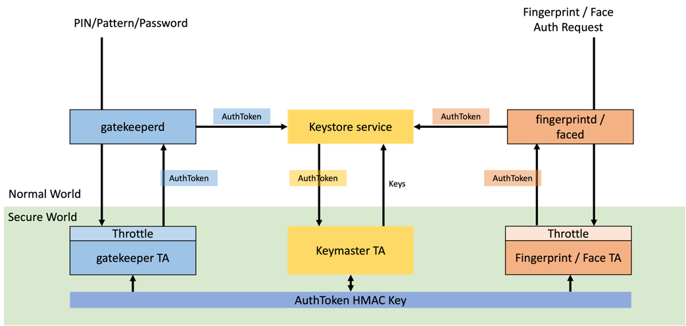

The TEE hosts several cooperating components:

* The **Keymaster TA** (a.k.a. KeyMint) and the Android **Keystore** service manage cryptographic keys, including the keys that protect CE.
* The **Gatekeeper TA** performs PIN verification and enforces throttling.
* The **Fingerprint TA** and **Face TA** handle biometric authentication.

The crucial detail is at the bottom of the diagram above: the **AuthToken HMAC Key** is provisioned by the TEE OS and **shared** between Keymaster and *every* authenticator TA. After a successful check, an authenticator signs an AuthToken with this key; Keymaster later re-computes the HMAC with the same key to decide whether to honor a key-access request. Because the key never leaves the secure world, an Android-side attacker is — in theory — unable to produce an HMAC-valid AuthToken, and therefore unable to bypass authentication or unlock Keymaster-protected keys.

##### Anatomy of an AuthToken

The AuthToken (`hw_auth_token_t`) is a fixed **0x45 (69) byte** structure with six fields plus the trailing MAC:

| Field | Type | Description |
|---|---|---|
| Version | `uint8_t` | Currently `0`. |
| Challenge | `uint64_t` | Random nonce, to bind a request and resist replay. |
| User SID | `uint64_t` | Secure user ID, bound to all of the user's authentication keys. |
| Authenticator ID | `uint64_t` | Binds the token to a specific authenticator policy. |
| Authenticator Type | `uint32_t` | **`1` = gatekeeper, `2` = fingerprint/face.** |
| Timestamp | `uint64_t` | Time since boot, for anti-replay / expiry. |
| AuthToken HMAC | `uint8_t[32]` | Keyed SHA-256 over all preceding fields. |

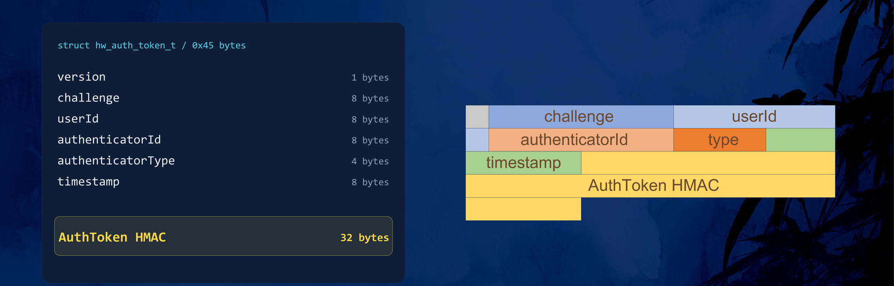

By hooking the gatekeeper components on the Android side, we can intercept the token the Gatekeeper TA returns after a successful PIN check. Note the `Authenticator Type == 0x00000001` (gatekeeper):

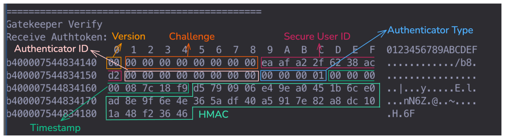

##### The PIN Verification Flow

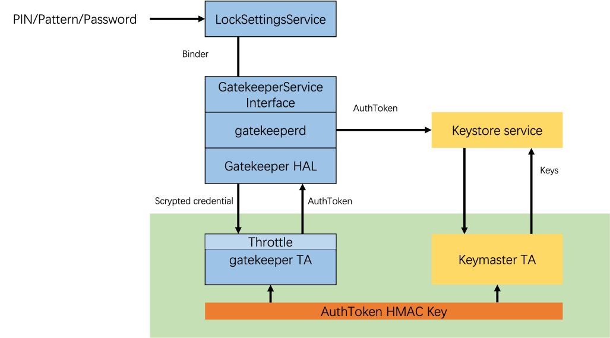

1. `LockSettingsService` receives the credential over Binder and forwards it to `GatekeeperService`.
2. `gatekeeperd` and the Gatekeeper HAL package the request into a TEE-compatible form and pass it to the **Gatekeeper TA** over IPC.
3. The Gatekeeper TA checks the credential against the stored hash, updates the failure counter, and **on success** builds an AuthToken, signs it with the shared HMAC key, and returns it.
4. `LockSettingsService` hands the AuthToken to the **Keymaster TA** to unlock the corresponding key.

Keymaster then validates the incoming token in four steps:

* **Authenticity** — re-compute the HMAC with the shared key and compare.
* **Timeliness** — the timestamp must be within an acceptable window.
* **Identity binding** — for identity-restricted keys, the token's User SID must match.
* **Type check** — for type-restricted keys, the Authenticator Type must match.

The takeaway is simple and consequential: **the AuthToken *is* the gatekeeper's authentication credential.** Anyone who can forge a valid AuthToken can bypass PIN authentication.

---

## The Insight: Biometrics Share the Same Key

Biometric authentication relies on AuthTokens too — in three places:

* **Enrolling a new template.** To prove the owner consented, the biometric TA validates a *gatekeeper* AuthToken (you entered your PIN in Settings first).
* **Resetting biometric throttling.** Likewise gated by a gatekeeper AuthToken.
* **Post-authentication.** After a successful fingerprint/face match, the biometric TA *generates* an AuthToken and returns it as proof — distinguished only by setting the Authenticator Type to `2`.

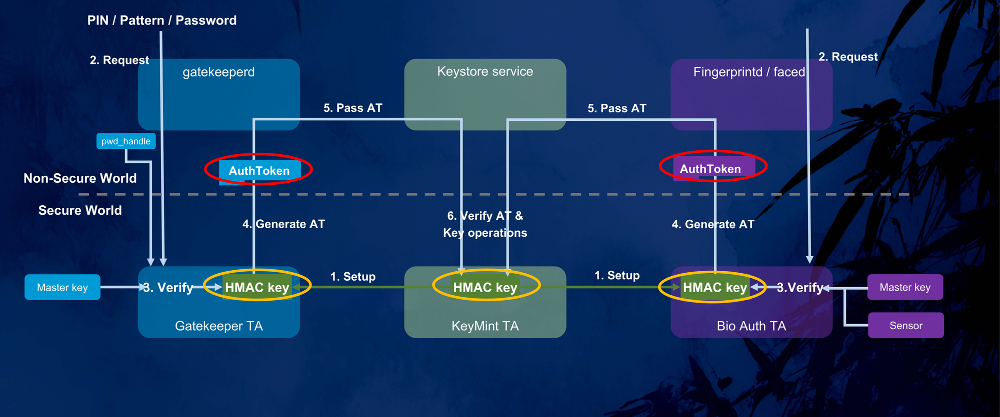

Hooking a fingerprint TA's output confirms it: the token it produces is structurally identical to the gatekeeper's, with the same User SID, differing only in the Authenticator Type (`0x02`) and the Authenticator ID.

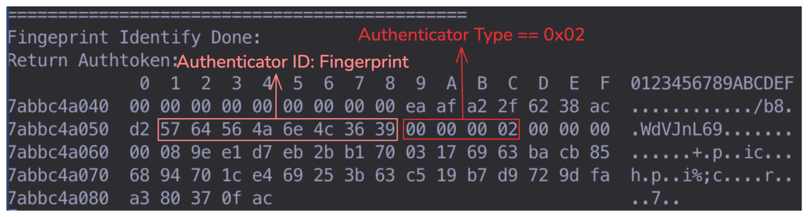

To validate an incoming token, the biometric TA also re-computes the HMAC with the **same shared key**. In other words:

> Same key. Same crypto. Same trust. The gatekeeper and every biometric TA are one failure domain — if any one of them can be made to sign an attacker-controlled token, the entire PIN-authentication guarantee collapses.

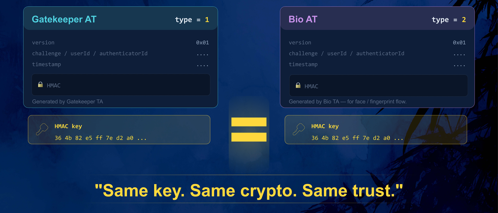

The biometric TAs *have* the ability to mint valid AuthTokens. The question that drives the rest of this research is whether they can **secure** that ability. The answer, across vendor after vendor, is no.

---

## Chaos in the Biometric TA

Android specifies the authentication framework cleanly *above* the HAL. **Below** the HAL — inside the TAs that actually run in the secure world — there is no unified standard, no shared interface specification, and no agreed security requirement for how an AuthToken may be generated or exposed. Maintenance is scattered across three parties with three different incentives:

* **OEMs** integrate and customize.
* **SoC vendors** (Qualcomm, MediaTek, and others) provide the platform TEE.
* **Sensor vendors** (Goodix, FPC, Silead, EGIS, ANC, …) ship the matching IP as closed-source blobs.

The result is that everyone improvises below the HAL, and the implementations diverge wildly in structure and in quality.

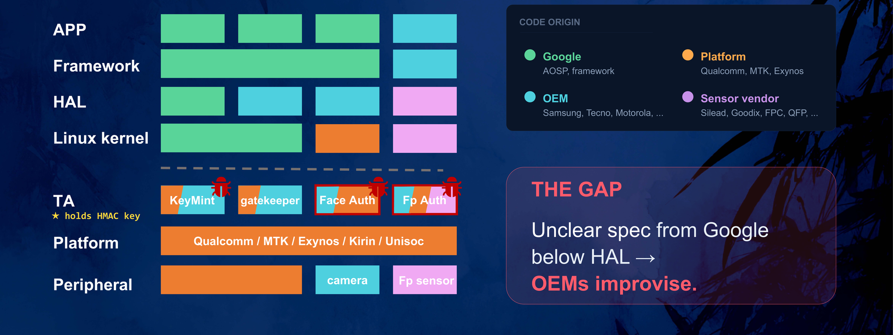

**Face TAs** are written per-OEM. A given OEM may reuse one framework across many of its own models, but across OEMs the implementations differ substantially.

**Fingerprint TAs are far worse**, because OEMs lean directly on whatever SDK the sensor vendor supplies. Across **8 Samsung models from the last three years we counted 7 distinct fingerprint-TA framework families** — and because one phone model may ship with different sensors per region, a single firmware image can carry several *idle* fingerprint TAs. One device contained **four** different fingerprint TAs at once.

| Model | Platform | Fingerprint TA (UUID / name) | Framework |
|---|---|---|---|
| Galaxy A146P | MTK | `…464e53696c65` | Silead (GSL) |
| | | `…464e47667063` | FPC |
| | | `…464e43686970` | HIP / TCI |
| Galaxy E156B / A156U | MTK | `…46494e474502` | Samsung + EGIS |
| Galaxy A5160 / A5560 | Exynos | `…46494e474552` | Samsung + EGIS |
| Galaxy A05s | Qualcomm | `fp_lc_c.elf` | HIP |
| | | `fp_lc_f.elf` | FPC |
| | | `fp_lc_g.elf` | Goodix |
| Galaxy S23 | Qualcomm | `securefp` | Samsung + Qualcomm |
| | | `fingerpr` | Qualcomm |
| Galaxy C550 | Qualcomm | `goodixfp64` / `ancap64` / `securefp` / `fingerpr` | Goodix / ANC / Samsung+Goodix / Qualcomm |

Each of those TAs holds the same HMAC key. **Shipping four fingerprint trustlets is not four times safer — it is four times the attack surface, and an attacker just picks the weakest one.** The sheer size of these TAs reinforces the point. A single fingerprint TA must capture images, extract features, match templates, manage storage, and drive the sensor; the `securefp` TA in one Samsung flagship dispatches **over 30 command handlers** from a single entry function:

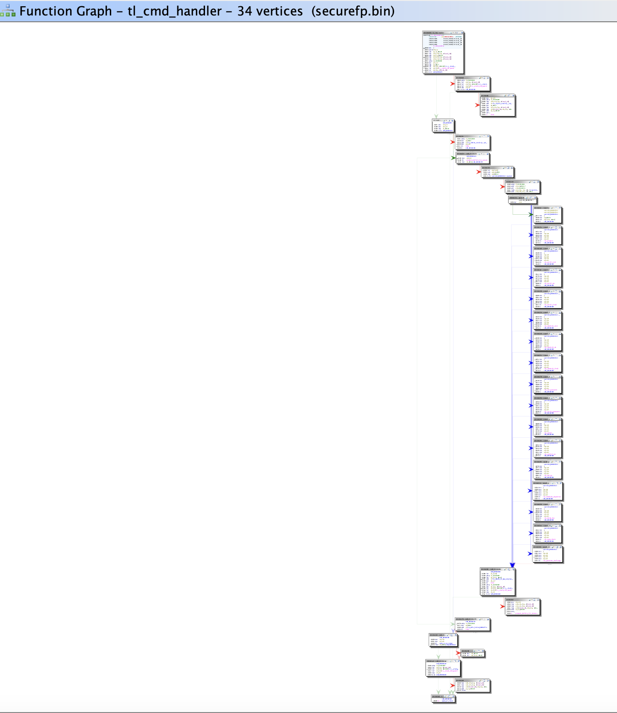

Three recurring root causes turn this chaos into vulnerabilities:

1. **Closed-source sensor IP, thinly wrapped.** Fingerprint matching is the sensor vendor's IP, dropped in as a prebuilt blob. Many TAs are little more than a wrapper over the vendor API, with the real logic left to the client in Android — so functions that *should* be gated behind a successful match end up directly callable.
2. **Multi-TA coexistence.** Multiple sensor variants per model mean multiple TAs, each holding the shared key.
3. **Debug and log leftovers in production.** Factory-test commands, debug interfaces, and log statements that print sensitive material — including the HMAC key, the AuthToken, and recognition thresholds — survive into shipping firmware.

---

## Four Paths to Forge a Valid AuthToken

If a biometric TA can be made to hand us an HMAC-valid AuthToken — ideally a *gatekeeper-typed* one — we can pretend a PIN was verified and walk straight past the throttle. Across the devices we examined, we found **four distinct paths** to do exactly that, ranging from "call one API" to classic exploit development:

| Path | Primitive | Difficulty |
|---|---|---|
| **1** | `GET_AUTH_OBJ` — an interface that signs an *arbitrary* AuthToken you hand it, no biometric required | Easy |
| **2** | `GET_AUTH_RESULT` — an interface that returns a valid token (type forced to `2`), combined with Keymaster type confusion | Easy (AFU) |
| **3** | The HMAC key printed in plaintext to an **error log** | Trivial |
| **4** | A **memory-corruption** bug in the TA, used to leak the key from memory | Medium |

Under our threat model (root on the Android side — see [Impact and Threat Model](#impact-and-threat-model)), an attacker can reach a TA directly via `libTEEC` and invoke arbitrary commands. With that, each path below ends in the same place: a forged, HMAC-valid AuthToken.

### Path 1 — The Signing Oracle (`GET_AUTH_OBJ`)

With root we can hook the traffic between the fingerprint HAL and the TA, and call the TA ourselves. A normal fingerprint authentication on a Silead-based Samsung device (the **Galaxy A14**, model A146P) walks through roughly five commands:

| # | Command | Purpose |
|---|---|---|
| 1 | `CHK_ESD` | sensor health check |
| 2 | `CAPTURE_IMG` | capture the fingerprint image |
| 3 | `AUTH_STEP` | compare against the enrolled template |
| 4 | **`GET_AUTH_OBJ`** | **return the signed AuthToken** |
| 5 | `AUTH_END` | session cleanup |

Command #4 is the interesting one. The signing routine, reversed, looks like this:

```c
__int64 get_auth_obj(__int64 buffer, int size) {
    if (size != 69 || buffer == 0)
        return generate_hmac(0);
    // no match check, no nonce check,
    // no biometric verification at all
    return generate_hmac(buffer);          // <-- signs whatever you give it
}
```

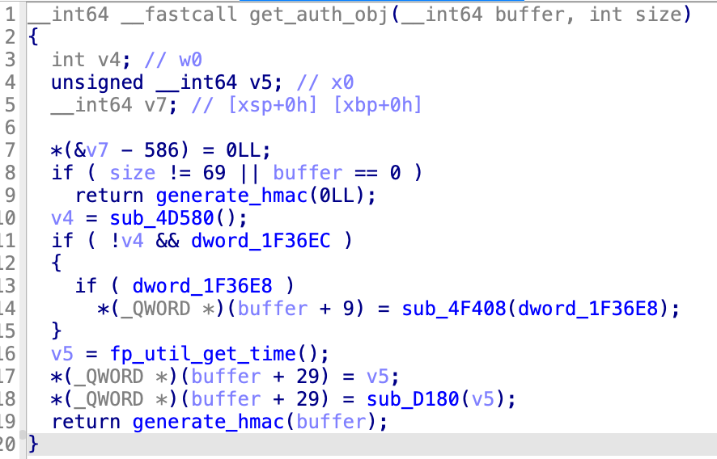

It validates the *size* (69 bytes — an AuthToken) and the pointer, and **nothing else**. It does not check that a fingerprint matched. It signs the caller's buffer with the shared HMAC key and returns it. So we hand it any 69 bytes we like — with `Authenticator Type = 0x01` — and receive a fully valid **gatekeeper** AuthToken:

```text
root@a14:/data/local/tmp # ./poc_get_auth_obj
[+] TEEC ctx + session opened (silead_fp_ta)
[+] Invoking TA: CMD_GET_AUTH_OBJ
[+] Result: 0x0 · 69-byte AuthToken received.

DECODED FIELDS
  Version            = 0x00
  Challenge          = 0x0000000000000000
  UserId             = 0x0B0B3AC86C9CE683
  AuthenticatorId    = 0x0000000000000000
  AuthenticatorType  = 0x00000001  (GATEKEEPER)
  Timestamp          = 0x000000000034ABF0
```

That single, unauthenticated call just bypassed the entire Gatekeeper throttle. Because the vulnerable trustlet is essentially the **sensor vendor's SDK**, the same flaw travels with the sensor: we reproduced identical `GET_AUTH_OBJ` exposure — and identical end-to-end PIN recovery — on two further devices built on the same Silead fingerprint SDK, including the **TECNO Camon 30s Pro** and a third device from another vendor.

### Path 2 — The Result Oracle (`GET_AUTH_RESULT`)

A close cousin of Path 1 appears in some **face** TAs. Here the interface returns a freshly built, signed token without any prior authentication — but with less attacker control over the fields:

```c
case CMD_GET_AUTH_RESULT: {
    hw_auth_token_t at = {0};
    at.version   = 0x01;
    at.user_id   = internal_user_id;
    at.auth_type = 0x02;          // FACE — forced, not attacker-controlled
    at.timestamp = now_ms();
    hmac_sign(&at, hmac_key);     // signed with the shared key
    return at;                    // 69 bytes, no challenge / match check
}
```

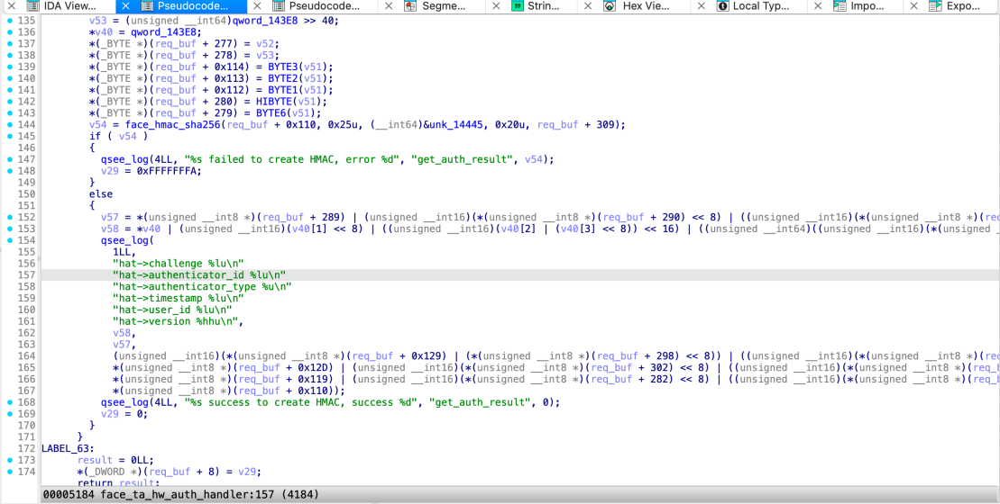

The catch is the `Authenticator Type`, which is hard-wired to `2` (biometric) and cannot be changed; only the User SID is influenceable (through a separate interface). A type-`2` token *should* be useless for unlocking a gatekeeper-protected CE key — biometrics play no part in deriving the CE key, so Keymaster ought to reject it.

It often does not. Keymaster is itself vendor-implemented, and on a Qualcomm-platform device from another major vendor we found that **after first unlock, Keymaster stops distinguishing biometric tokens from gatekeeper tokens**. We submitted both a type-`1` and a type-`2` AuthToken to decrypt the same `spblob`, and both passed validation and returned the same plaintext:

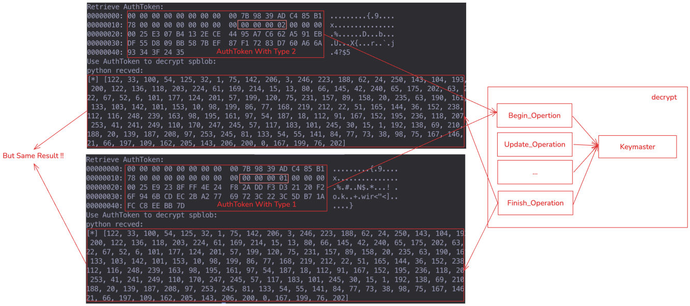

Before first unlock, that device's Keymaster *does* insist on a gatekeeper-origin (type `1`) token, so this path works only **after first unlock (AFU)** there. But it is a clean illustration of how a single missing check — "is this token's type allowed for this key?" — turns a biometric convenience feature into a CE bypass.

### Path 3 — The Key in the Log

The first two paths lean on the TA to sign for us. The next two let us sign *ourselves*, by recovering the 32-byte HMAC key. The cheapest way is when the TA simply prints it.

On the **Samsung Galaxy A05s** (Qualcomm), the fingerprint TA `fp_lc_c` exposes `validate_incoming_token`, which checks the HMAC of a token sent from the REE (this is the enrollment path, where the TA verifies a gatekeeper token). When the HMAC comparison **fails**, the error handler dumps the stored key, byte by byte, into the TEE log:

```c
int validate_incoming_token(at_t *at) {
    if (!hmac_verify(at, ta->hmac_key)) {
        for (int i = 0; i < 32; i++)
            log_internal(LOG_ERR,
                "fp_ta_hw_auth.c validate_incoming_token ta->hmac_key[%d]: %d",
                i, ta->hmac_key[i]);     // <-- the entire key, in plaintext
        return -1;
    }
    return 0;
}
```

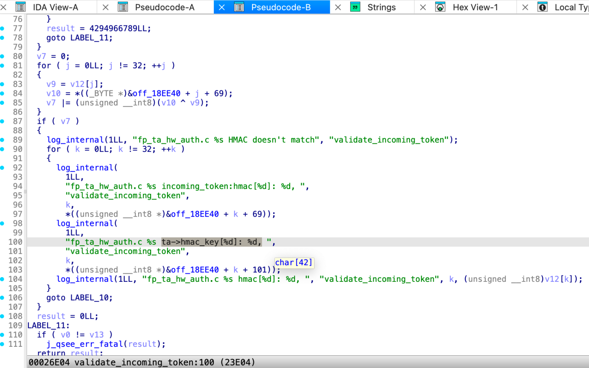hmac_key byte by byte" title="validate_incoming_token logs the HMAC key on verification failure" style="display:block;margin-left:auto;margin-right:auto;width:90%;background:#ffffff;"/>

The exploit is to *deliberately* submit a token with a bad HMAC, then read the key back from the log. Qualcomm encrypts TrustZone logs, but this TA also spills them into shared memory; on MediaTek platforms, secure-world logs land in the kernel ring buffer and can be read with `dmesg`. Triggering the failure on purpose makes the key pour out:

```text
fpCoreTA [ERR] fp_ta_hw_auth.c validate_incoming_token HMAC doesn't match
fpCoreTA [ERR] fp_ta_hw_auth.c validate_incoming_token ta->hmac_key[0]: 54,
fpCoreTA [ERR] fp_ta_hw_auth.c validate_incoming_token ta->hmac_key[1]: 75,
fpCoreTA [ERR] fp_ta_hw_auth.c validate_incoming_token ta->hmac_key[2]: 130,
...
Reconstructed HMAC key:
  36 4b 82 e5 ff 7e d2 a0 76 b4 8d 42 51 27 0f 88
  aa c7 e9 96 2d 5f 98 90 31 da 28 f6 91 8c b5 2d
```

Those 32 bytes are the same key Keymaster uses. From here we can sign *any* AuthToken offline — including a gatekeeper token before first unlock. The full chain, from triggering the leak to decrypting CE data, is shown end-to-end below:

<video src="attachments/samsung-A05s-CE-bypass.mp4" controls="controls" width="100%" height="auto"></video>

### Path 4 — Old-School TA Memory Corruption

When a TA doesn't simply hand over the key, we fall back to exploitation. Biometric TAs are unusually soft targets:

* **Large, complex codebases** — many subcommands, intricate handlers, and (notably) data-transfer routines that fragment large buffers to cross the secure-world boundary. Insufficient length checks in those fragmentation paths are a recurring source of memory corruption.
* **Weak mitigations** — most deploy only a stack canary and a few bits of ASLR; some omit the canary entirely. There is little defense against buffer overflows or forward-edge control-flow hijacking.
* **Plaintext keys resident in memory** — the shared HMAC key frequently sits in the clear on the heap, stack, or BSS for the life of the session. On one device — the **Meizu 18x** fingerprint TA (Qualcomm), built on the ArcSoft fingerprint stack — the key is allocated on the heap and written there as `g_hFP + 88`:

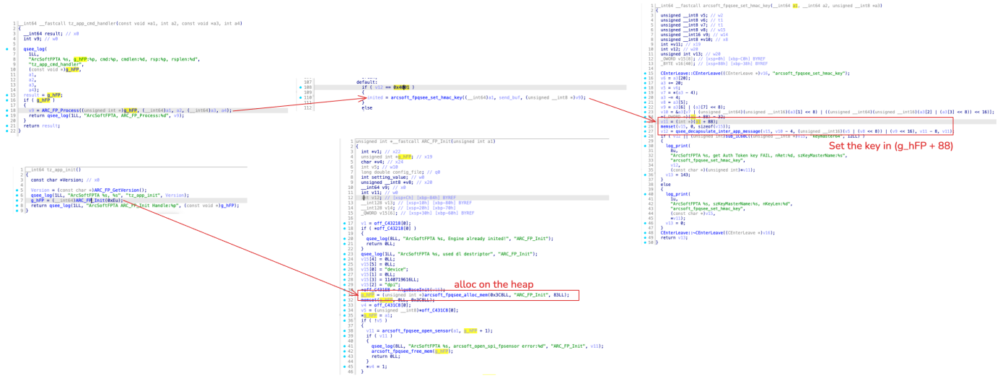

So a single read primitive is enough. On the **Motorola Edge 40 Neo** (MediaTek), the fingerprint TA `08080000000000000000000000000000.tlbin` gives us two stacked bugs.

First, an out-of-bounds **stack read**. Command `723` in `inline_handler_runtime` copies a 4-byte stack local back to the REE using an attacker-controlled length:

```c
if (buff == 723) {                 // FP_INLINE_7XX_GET_PRODUCT_ID
    v34 = sub_636C();              // product_id — a 4-byte stack local
    plat_mem_move(a3, &v34, *a4);  // *a4 is REE-controlled — no upper bound!
}
```

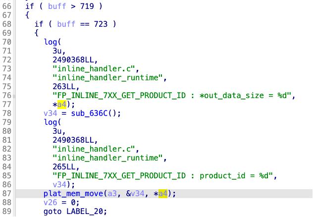

`plat_mem_move` is a `memcpy`, and `*a4` has no upper bound, so we read past the 4-byte local and recover the **saved Link Register** sitting in the same frame. That LR points back into the TA, which gives us the TA's base address and **defeats ASLR**.

Second, an arbitrary-address **read**. In `patch_ta_info_api` (one of those buffer-fragmentation routines), the bounds check guards itself with a value the REE supplies:

```c
if (g_ta_receiver_patch_offset + a1->patch_len > ta_out_size)  // ta_out_size is REE-controlled!
    patch_len = ta_out_size - g_ta_receiver_patch_offset;
else
    patch_len = a1->patch_len;
a3[5] = patch_len;
plat_mem_move(a3 + 10, outputptr + g_ta_receiver_patch_offset, a3[5]);  // arbitrary src + len
g_ta_receiver_patch_offset += a3[5];   // global, never reset
```

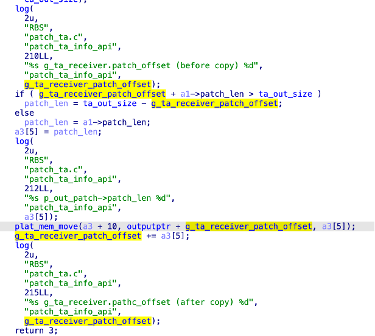

Because `ta_out_size` comes from the untrusted side and the global offset accumulates across calls without ever being reset, we control both the source offset and the length — an arbitrary-address read across the TA's address space. (The same routine has a symmetric write branch, which extends to a full arbitrary-write primitive and TA code execution — but reading is all we need here.)

Chaining the two: leak the LR to defeat ASLR, then walk the arbitrary-read primitive to the HMAC key in the BSS and exfiltrate 32 bytes. With the key, we forge a gatekeeper token (`authenticator_id = 0`, `authenticator_type = 1`) and crack the PIN — **before first unlock**:

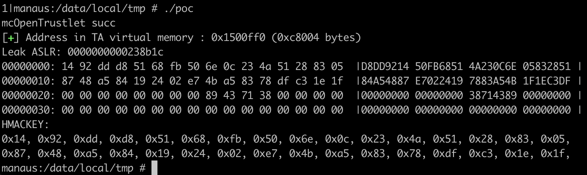

---

## From a Forged AuthToken to the PIN

A valid AuthToken is enough to unlock Keymaster, but it is not the PIN itself. Recovering the PIN means defeating **Credential Encryption**, and that is where the forged token pays off.

Android derives the CE key from the user's credential through an intermediate value called the **Synthetic Password**. The Synthetic Password is stored encrypted in the filesystem and requires *two* sequential decryptions — and critically, the first is gated by Keymaster, which is exactly what the AuthToken unlocks.

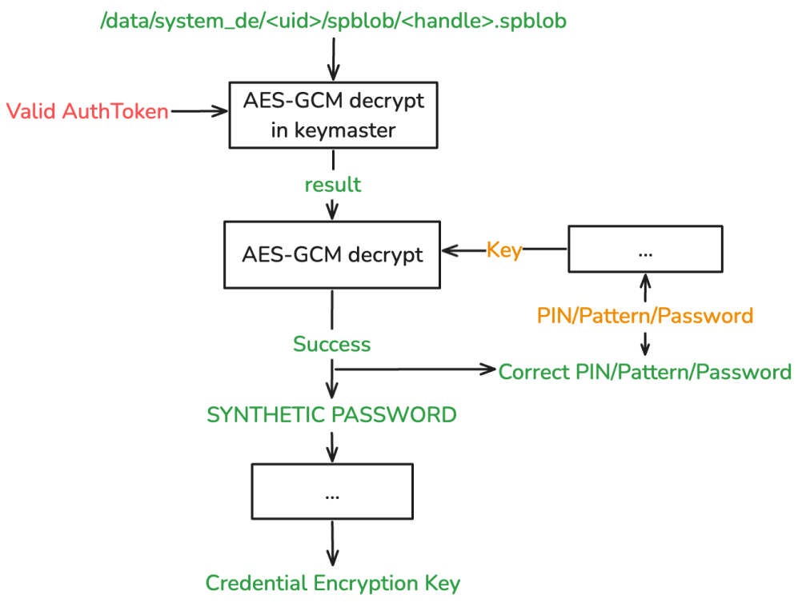

* **Stage 1 — inside Keymaster.** The encrypted `spblob` (created at PIN enrollment) is decrypted with a Keymaster-managed key whose access is gated by a valid AuthToken. Normally that token only exists after a genuine PIN check. With a forged token, Keymaster validates the HMAC, decrypts the blob, and returns the **intermediate** result to us — no real credential required.
* **Stage 2 — in the REE.** The intermediate is decrypted again with a key derived from the *actual* PIN plus on-device files. Success yields the Synthetic Password, and from there the CE key.

Both stages use **AES-GCM**, and that is what makes Stage 2 tractable: GCM authenticates its ciphertext, so a wrong key fails the tag check *immediately*. Once Stage 1 has handed us the plaintext intermediate, Stage 2 becomes an **offline brute-force with a definitive correctness oracle** — and the search space for a six-digit PIN is only 1,000,000 candidates. The throttle in the gatekeeper, which was the entire point of the design, is never consulted:

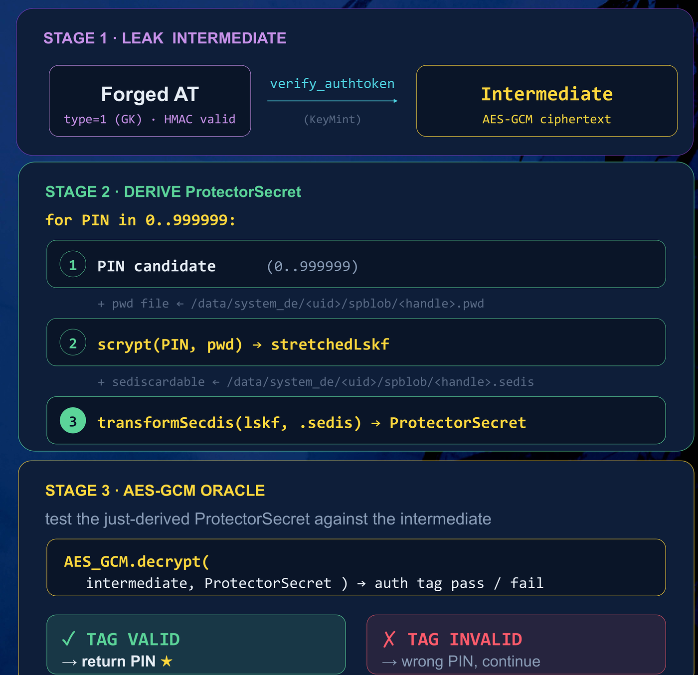

```python
def crack_pin(spblob_path):
    # Stage 1: forge a gatekeeper AuthToken (any of the four paths) and
    # ask Keymaster to decrypt the spblob for us
    at           = forge_gatekeeper_authtoken()          # type = 1, HMAC valid
    spblob       = read(spblob_path)                     # /data/system_de/<uid>/spblob/<handle>.spblob
    intermediate = keymaster_decrypt(at, spblob)         # on-device, returns plaintext

    # Stage 2: offline brute-force, validated by the AES-GCM tag
    for pin in range(1_000_000):
        key = derive_synthetic_pw(intermediate, pin)     # scrypt + on-device files
        if aes_gcm_decrypt(intermediate, key):           # tag OK == correct PIN
            return pin
```

```text
$ python3 brute_pin.py
[+] Dumped spblob successfully
[+] Stage 1: intermediate recovered via forged AuthToken
[+] Stage 2: brute-forcing PIN ...
[+]   500000/1000000
[+] Found! PIN: 123456
```

That is the whole attack: forge a token, unlock the intermediate, and let GCM tell you when you've guessed right.

---

## Impact and Threat Model

In current mobile TrustZone designs, talking to a TA requires privilege on the non-secure side. **Our attack assumes Android root** — arbitrary kernel (EL1) read/write, enough to invoke arbitrary TA commands through `libTEEC`. It is important to be precise about what that buys an attacker *without* this work: even with root, TrustZone-protected keys keep CE data encrypted and block sensitive operations like payments. **Recovering the PIN is a separate, additional step** — and it is the step that turns "rooted phone" into "decrypted phone."

That distinction is exactly the gap this research fills. Prior work reaches root through, for example, USB driver bugs (the class used by commercial forensic tooling) or boot-chain compromises — but USB bugs alone do not decrypt user data, and the commercial CE-bypass methods that follow have never been published. Boot-chain and EL3 attacks that *can* leak a PIN (such as Quarkslab's work on Samsung's MediaTek boot chain and Secure Monitor) are powerful but **device-specific**, and newer firmware that encrypts the EL3 monitor raises the bar further. By contrast, the attack surface we describe is reached *after* root and produces the same outcome — PIN recovery and CE decryption — **generically, across vendors and chipsets**.

We confirmed it on 8 gatekeeper-based devices from 7 vendors, recovering the PIN in every case:

| # | Device | Platform | Path | Result |
|---|---|---|---|---|
| 1 | Samsung Galaxy A14 | MediaTek | Path 1 | BFU PIN cracked, CE decrypted |
| 2 | Samsung Galaxy A05s | Qualcomm | Path 3 | BFU PIN cracked, CE decrypted |
| 3 | TECNO Camon 30s Pro | MediaTek | Path 1 | BFU PIN cracked, CE decrypted |
| 4 | Meizu 18x | Qualcomm | Path 4 | AFU PIN cracked |
| 5 | Motorola Edge 40 Neo | MediaTek | Path 4 | BFU PIN cracked, CE decrypted |
| 6 | *Undisclosed vendor* | MediaTek | Path 1 | BFU PIN cracked, CE decrypted |
| 7 | *Undisclosed vendor* | Qualcomm | Path 2 | AFU PIN cracked |
| 8 | *Undisclosed vendor* | MediaTek | Path 4 | BFU PIN cracked, CE decrypted |

**8 / 8 PINs recovered — 6 before first unlock, 2 after first unlock.** Different bugs, but the same simple shape every time, which is precisely why we call it an attack *surface* rather than a collection of bugs.

---

## Mitigations

We reported every issue below to the affected vendors, but the structural inconsistency of biometric TAs means similar problems almost certainly remain in many more devices. Our recommendations, mapped to the four paths:

* **Path 1 — never sign on demand.** AuthToken generation must be strictly tied to a verified authentication event. There should be no callable TA command that signs (or returns) an AuthToken without a real, fresh biometric match, and the TA — not the caller — must own every field of the token.
* **Path 2 — validate the type in Keymaster.** Security-sensitive operations (CE-related keys above all) must require an AuthToken from the designated authenticator. Keymaster must enforce the Authenticator Type strictly, in *both* BFU and AFU states, and never confuse a biometric token for a gatekeeper one.
* **Path 3 — never log secrets.** The HMAC key, the AuthToken, and recognition thresholds must never reach any log, on any build, encrypted or not.
* **Path 4 — harden TA memory.** No plaintext keys resident in TA memory — derive per session and wipe immediately — and deploy real memory-safety mitigations (full ASLR, canaries, bounds checks on every fragmentation path).

More fundamentally, the ecosystem needs a **standard and a reference framework for biometric authentication below the HAL**, with explicit security requirements for how AuthTokens are generated, validated, and exposed. OEMs should stop shipping sensor-vendor TAs verbatim; the more robust pattern we observed is a vendor's *own* biometric framework into which sensor APIs are integrated, which both shrinks the attack surface and standardizes the interface. Vendors such as Huawei, Honor, and Samsung have demonstrated proprietary frameworks of this kind. In the longer term, moving PIN verification to a **Secure Element / Weaver** design is intended to remove the offline-brute-force oracle: Weaver only releases its secret when supplied the correct key derived from the user credential, so the Synthetic Password is no longer exposed to the offline guess-and-check loop that CE permits today.

---

## Disclosure

All vulnerabilities described here were responsibly disclosed through the respective vendors' security response programs, and have been officially confirmed; the majority are already fixed.

* **Samsung** — reported February 2025, confirmed and fixed.
  * `SVE-2025-0024` / **CVE-2025-20987** — `GET_AUTH_OBJ` arbitrary AuthToken signing (Path 1)
  * `SVE-2025-0133` / **CVE-2025-20988** — TrustZone log HMAC-key leak (Path 3)
  * `SVE-2025-0134` / **CVE-2025-20989** — fingerprint TA out-of-bounds read (Path 4)
* **Meizu** — reported February 2025, confirmed. ID: **CNVD-2025-08623**.
* **Motorola** and **TECNO** — reported February 2025, confirmed.
* Three further vendors — reported 2024–2025, confirmed and fixed; not named here.

### Vulnerability list

* Samsung Galaxy A14 (A146P) — `GET_AUTH_OBJ` arbitrary AuthToken signing
* Samsung Galaxy A05s — AuthToken HMAC key leakage (log)
* TECNO Camon 30s Pro — `GET_AUTH_OBJ` arbitrary AuthToken signing
* Meizu 18x — heap overflow read (HMAC key leak)
* Motorola Edge 40 Neo — stack overflow read; buffer overflow read / write
* Undisclosed vendor (Qualcomm) — AuthToken acquisition interface exposure
* Undisclosed vendor (MediaTek) — `GET_AUTH_OBJ` arbitrary AuthToken signing
* Undisclosed vendor (MediaTek) — heap overflow read / write

---

## Closing Thoughts

Biometric authentication was added for convenience, and convenience usually expands the attack surface rather than shrinking it. Here the cost was structural: by sharing one HMAC key across the gatekeeper and a fleet of inconsistent, under-hardened biometric TAs, the platform collapsed several trust boundaries into a single failure domain — and then left the doors to that domain unlocked, in four different ways, across vendor after vendor.

The individual bugs are easy to fix. The harder problem is the gap they all grow in: the absence of a shared standard and security baseline for what happens below the HAL. Until that gap is closed, a "long-ignored attack surface" is exactly where the next generic CE bypass will be found.

---

## References

* DARKNAVY — *The Biometric AuthToken Heist* — presented at POC and QPSS 2026
* Quarkslab — *Attacking the Samsung Galaxy A\* Boot Chain, and Beyond*
* Quarkslab — *Android Authentication: Core Escalation*
* Amnesty International — *Cellebrite zero-day exploit used to target the phone of a Serbian student activist* (2024)
* Android Open Source Project — *Data encryption in depth* / *Authentication*
* Advisories: **CVE-2025-20987**, **CVE-2025-20988**, **CVE-2025-20989**, **CNVD-2025-08623**
