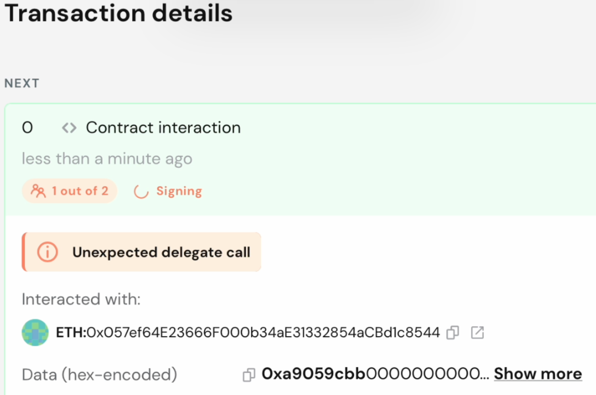
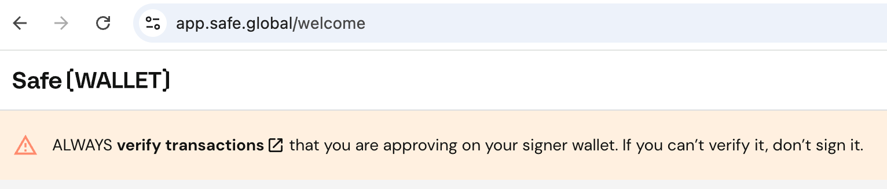

+++
title = 'Reconstructing the $1.5 Billion Bybit Hack by North Korean Actors'
date = 2025-03-24T15:34:29+08:00
draft = false
images = ["attachments/a1917edb-c408-419f-a7bf-2ee294e2fda8.png"]
+++

> Both the Attackers and Victims Made Critical Mistakes

---

On February 21, 2025, the cryptocurrency exchange Bybit experienced the most significant financial loss in Web3 history when nearly $1.5 billion was illicitly transferred from its multi-signature wallet by North Korean threat actors.

The DARKNAVY team has been closely monitoring security developments within the Web3 ecosystem. Following the Bybit incident, we conducted a reconstruction of the attack, analyzing it from the perspectives of the attackers, the developers, and the transaction signers.

<video src="attachments/Bybit.mp4" controls="controls" width="100%" height="auto"></video>

---

## **Analysis of the Attack and Defense**

Safe{Wallet}, widely used as cold wallets for asset custody, is considered secure due to its multi-signature mechanism. Bybit has relied on this system to manage substantial ETH holdings since the Gnosis Safe era (the predecessor of Safe{Wallet}), and the $1.5 billion compromised in this incident was held within such a Safe wallet.

> Safe{Wallet} is a prevalent asset management solution within the Ethereum ecosystem. Its foundational component, Safe{Core}, implements smart contract-based accounts with multi-signature verification, commonly referred to as Safe wallets. Users can designate multiple signers (owners) and define a quorum of required signatures to authorize transactions. This decentralized approach to private key management mitigates single points of failure and enhances governance flexibility.
>
> Beyond the smart contracts, Safe{Wallet} also includes an off-chain web interface providing users with an intuitive platform to create and manage the wallets, initiate and approve multi-signature transactions, and interact with decentralized applications (dApps). This frontend is supported by a robust backend infrastructure that handles transaction queuing, signature aggregation, and audit logging.

### **Social Engineering → Supply Chain Attack**

The initial target of this attack was not Bybit directly, but rather a developer on the Safe{Wallet} team.

The threat actors identified a Safe team developer and employed social engineering techniques to deceive them into executing a Trojanized malicious program. Following the compromise of the developer's workstation, the attackers exfiltrated AWS session tokens and other sensitive credentials, thereby gaining unauthorized access to the S3 storage hosting the Safe website's frontend resources.

 

The ultimate objective of the threat actors was the illicit acquisition of Bybit's funds held within the Safe{Wallet}. To achieve this, they injected targeted malicious JavaScript code into the Safe website.

### **Tampered Routine Transactions**

Bybit's Safe wallet was configured with six designated signers, requiring a threshold of three approvals for any transaction. Bybit also designated a proposer role, authorized to submit new transaction requests after their own signature, although the proposer's signature did not contribute to the required quorum.

The proposer initiated a routine transfer to their warm wallet and subsequently notified the designated signers.

While reviewing the transaction parameters displayed on the webpage, the signers proceeded to click the sign button. However, the injected malicious JavaScript intercepted and manipulated the transaction data transmitted to their hardware wallets. The signers failed to conduct adequate verification of the transaction details on the hardware wallet sides and consequently approved the malicious request. **All three Bybit signers made this critical oversight.**

 

Upon the completion of all three required signatures, the entire wallet balance was drained almost instantaneously. Upon refreshing the webpage, it became apparent that even the wallet's fundamental information was no longer accessible.

### **On-Chain Attack Analysis**

The proposer's intended transaction invoked the `transfer(address,uint)` method of the token contract. However, the tampered transaction instead called a malicious contract, deceptively employing what appeared to be the same innocuous `transfer(address,uint)` signature. The critical distinction lay in the `Operation` field, which was altered from `0` to `1`, effectively changing the call type from a standard call to a `delegatecall`.

> In the context of Ethereum smart contracts, a `delegatecall` allows the execution of code from another contract within the calling contract's storage context. This means that any state changes resulting from the delegated code execution directly affect the state of the calling contract.
>
> Proxy contracts leverage `delegatecall` functionality to enable contract upgradability. The proxy contract serves as the storage layer, while the execution logic is delegated to a separate logic contract. Upgrading the contract in this paradigm simply involves updating the address of the logic contract.
>
> However, if a `delegatecall` is directed towards a malicious contract, the attacker can execute arbitrary code within the caller's context, leading to the unauthorized transfer of funds or manipulation of data.

A Safe wallet instance is fundamentally implemented as a proxy contract, with its core logic residing in the Safe MasterCopy contract, the address of which is stored at storage slot `0`. The attacker exploited this architecture by utilizing a malicious contract to effectively 'upgrade' the Safe wallet, replacing its logic implementation address and thereby enabling unrestricted withdrawal capabilities.

 

## **Flawed Deception Tactics**

Throughout the attack, deception served as the primary modus operandi of the North Korean threat actors. Had their social engineering attempt targeting the Safe team been unsuccessful, they might have resorted to alternative technical attack vectors. However, their reliance on frontend tampering and the expectation that Bybit signers would overlook the manipulation was inherently precarious.

Forensic analysis conducted by Verichains on the signers' workstations revealed the presence of two modified frontend JavaScript files.

During our replication of this tampering process, we identified several anomalies within the user interface that could have potentially alerted the signers to the ongoing attack:

* The **success notification** after signing included a 'human description' generated by the Safe client gateway, which typically summarizes transaction details such as the amount, token name, and recipient address. In this instance, none of these details aligned with the actual transaction—the attacker had modified the implementation address in the parameters, set the transfer amount to zero, and the malicious token contract lacked a registered name.

* Clicking **'View transaction'** would reveal the actual signed data, including an obvious delegate call indicator.

* Following the first signer's confirmation, the second signer's homepage would have exhibited several changes: the number of pending transactions in the queue would have increased from one to two; the description of the pending transaction would have changed from the original routine transfer to 'Contract interaction'.
From this interface, should the signer have inspected the transaction queue or the 'Contract interaction' entry, they might have identified the discrepancy. However, the notification displayed in the upper right corner would have continued to direct them to the confirmation page of the original, legitimate transaction.

  

* Furthermore, after the first signer's confirmation, the transaction queue would have displayed a nonce conflict between the 'Contract interaction' and the original routine transfer. The former would show one confirmation, while the latter would remain in an unconfirmed proposal state.

  

* Given that all signatures were being applied to the malicious request, each signer, upon reviewing the original routine transaction, would have consistently observed that the number of confirmed signatures remained at zero.
* Following the completion of the attack, the Safe interface would have displayed a zero balance and indicated a compromised wallet.

  

To enhance the stealth of the attack, a more sophisticated threat actor would have further modified the frontend interface, potentially hooking various API endpoints or frontend rendering components to ensure that all displayed information and prompts appeared consistent and normal. Simultaneously, they would have minimized the discrepancies between the malicious transaction and the original one, preserving the original `data` field and deploying a malicious token contract with an address exhibiting a similar prefix and suffix to the orignal legitimate token.

However, as this incident demonstrates, even a poorly executed deception can be effective against unsuspecting targets.

## Missing Defense Mechanisms and Security Awareness

While Safe is fully open-source, its off-chain infrastructure deployment lacks complete transparency. Although the multi-signature mechanism inherently mitigates single points of failure at the smart contract level, the Safe frontend became a critical single point of failure in this incident.

Despite the direct cause of the financial loss being the negligence of Bybit's signers, several preventative security measures could have been implemented but were not.

### Over-Reliance on Third Parties

Bybit CEO Ben stated in an interview that many exchanges employ internal solutions for safeguarding their assets, a practice Bybit also follows for non-Ethereum-based cryptocurrencies. However, concerning Ethereum assets, they had not allocated sufficient resources to in-house smart contract development, a decision Ben now considers a significant oversight.

Mitigating over-reliance on third parties does not necessitate complete self-sufficiency. The transparent, on-chain components of Safe{Wallet} have undergone extensive scrutiny and are inherently robust—the vulnerability in this case originated from the off-chain infrastructure. Even if Bybit lacked in-depth smart contract expertise and did not intend to develop a proprietary off-chain platform, simply deploying a locally hosted instance of Safe's open-source platform would have allowed them to leverage third-party expertise while maintaining greater control over their security posture.

The Safe{Wallet} platform itself integrates various third-party tools. On the transaction confirmation page, a dedicated 'Transaction checks' section provides transaction simulation capabilities. This feature enables users to preview fund movements, event logs, and state changes before transaction execution. Had this tool been utilized to simulate the malicious transaction, the concealed attack would likely have been detected.

 

### Lack of Smart Contract Knowledge

Bybit, along with its several partners, not only lacks the independent capability to develop secure smart contracts but also possesses a limited understanding of Safe's underlying contract execution logic. Following the attack, Bybit contacted the Safe{Wallet} team to request the temporary suspension of certain services, which consequently caused complications for the partners attempting to provide loans to Bybit and for Bybit's attempts to withdraw USDT from another Safe wallet.

However, only the off-chain platform services were suspended. Individuals with a fundamental understanding of smart contracts could have reviewed Safe's publicly available source code and determined how to independently sign and execute transactions without reliance on the platform's interface.

### Resistance to Change

As previously mentioned, Bybit was an early adopter of Safe, and the compromised contract was still operating on version 1.1.1, deployed four years prior to the incident. While this specific version did not contain inherent vulnerabilities, it lacked security enhancements introduced in subsequent versions, such as the Guard mechanism.

More recent versions of Safe implement a modular Guard system, which introduces hooks that are executed before and after transaction execution to invoke Guard verification functions. These checks can detect anomalous behavior and automatically revert the entire transaction if necessary.

## Safe's Post-Incident Remediation

In its post-incident investigation report, Safe detailed its implemented remediation measures, including a complete infrastructure reset, the implementation of enhanced malicious transaction detection algorithms, the deployment of a comprehensive monitoring system, the resetting of transaction queues, user interface improvements, and other security enhancements.

On the frontend, multiple secondary confirmation prompts were implemented, along with the integration of a direct link to OpenZeppelin's Safe Utils within the transaction simulation check section.

 

On the backend for multi-signature transaction processing, strict limitations were imposed on the use of `delegatecall`, restricting its invocation to a predefined whitelist of trusted contracts such as MultiSend, SignMessageLib, and SafeMigration.

 

However, once a sophisticated threat actor initiates another targeted attack, all off-chain security mechanisms can potentially be circumvented, and even on-chain defenses relying on user interaction can be defeated through deception. Therefore, the fundamental principle of security remains the secure management of private keys — *Not Your Keys, Not Your Coins*.

## Reference

<https://coinacademy.fr/wp-content/uploads/2025/02/Bybit-Incident-Investigation-Report.pdf>

<https://x.com/safe/status/1897663514975649938>

<https://followin.io/en/feed/16568414>

<https://mp.weixin.qq.com/s/rB4XeIBATAb1zHZ9WVyxAg>