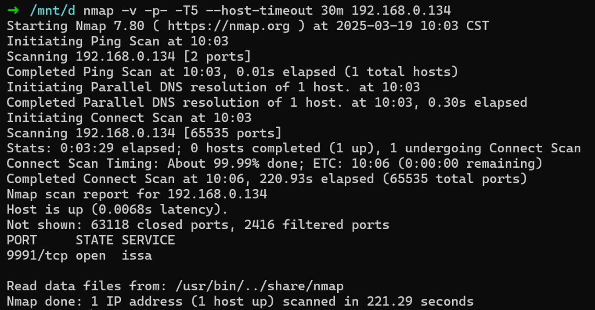
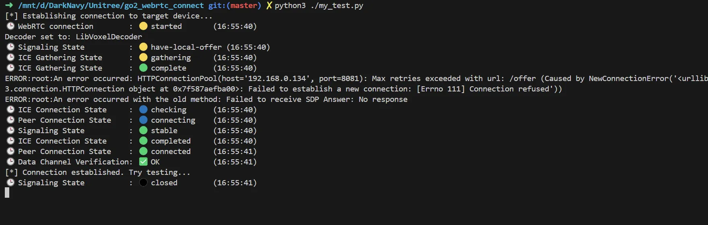
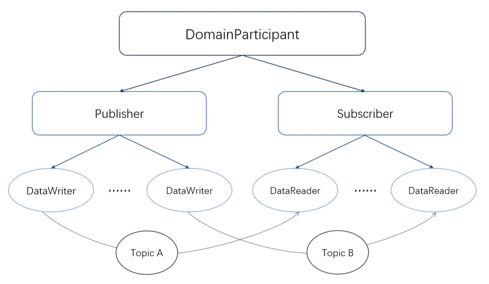
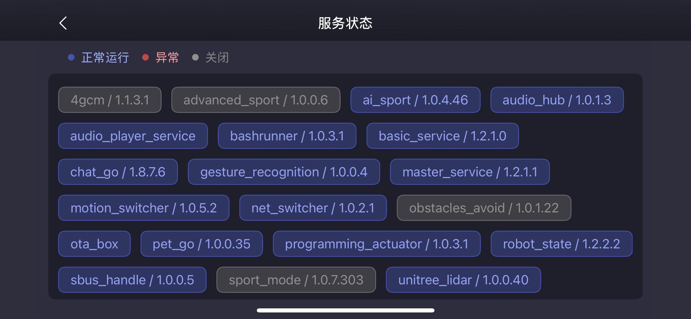
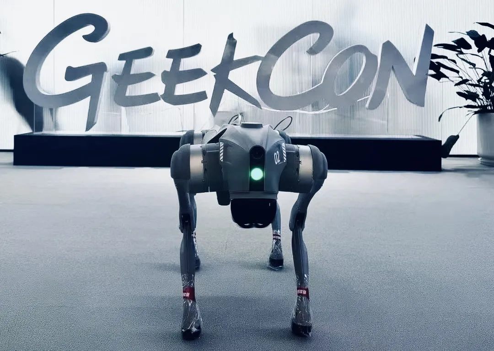
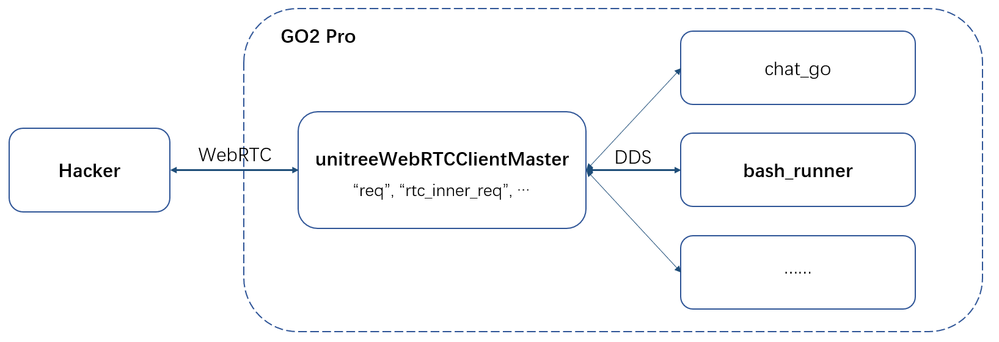
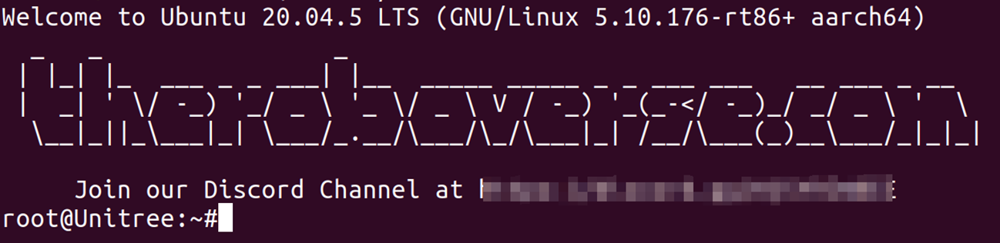
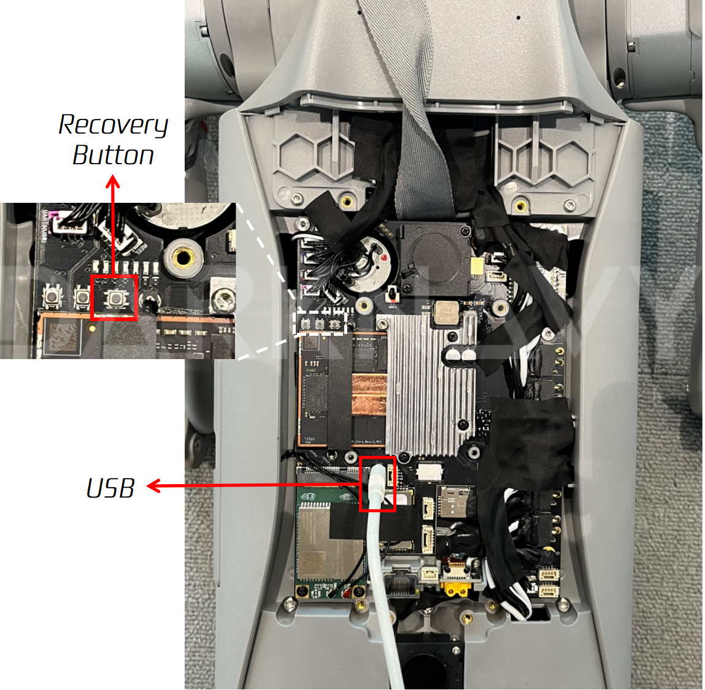
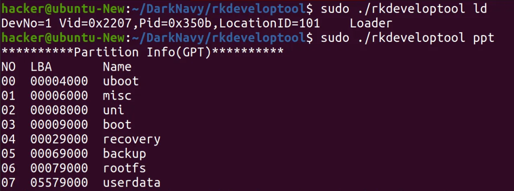

+++
title = 'The Jailbroken Unitree Robot Dog'
date = 2025-03-28T10:00:17+08:00
draft = false
images = ["attachments/54c66f49-112b-432f-8c26-e611c12ea986.png"]
+++

The history of humanity's domestication of wolves has spanned forty thousand years – we used firelight and patience to soften the wildness in their eyes, transforming their fangs into the loyalty that guards our homes.

When various robot dogs created by America's Boston Dynamics and China's Unitree Robotics leap and flip gracefully under the spotlight, this ancient symbiotic relationship seems to take on a new meaning in the cyber age: trust that once required thousands of years of genetic selection to build can now be achieved with just a line of code.

DARKNAVY, who has continuously **followed robot/dog security issues** through GEEKCON/GeekPwn for many years, can't help but wonder: when we replace the reins with data cables, are those **"vulnerabilities"** lurking deep within the algorithms replaying evolutionary history? What if a hacked robot dog suddenly tore through its obedient facade, its pupils gleaming with the cold light of a mechanical wolf?

 

In GeekPwn 2022, we verified the existence of security vulnerabilities in the Unitree robot dog GO1 and contacted Unitree for responsible disclosure (but received no response). In July 2023, Unitree released the new generation robot dog GO2, which features a more advanced processor, sensors, and AI capabilities. Does the new version of the robot dog have better security performance?

In this quick sketch, we will share our preliminary security exploration of the Unitree robot dog GO2.

## GO2 Attack Surface Overview

The GO2 robot dog primarily interacts with the Mobile APP and the Cloud Service during its operation. Simultaneously, various modules and services within the device also collaborate through a data distribution service middleware.

 ![GO2 System Architecture \[1\]](attachments/51839639-eca0-46b3-af04-540716f8a404.png " =936x489")

The functional interfaces through which the GO2 interacts with the mobile app are the most extensive, making it a significant attack surface. There are two connection modes between the robot dog and the Mobile APP:

* AP Mode: The mobile phone directly connects to the robot dog's built-in hotspot.
* Wi-Fi Mode: The mobile phone assists the robot dog in network configuration, connecting it to an existing Wi-Fi network.

Regardless of the mode used, the APP and the GO2 device establish a WebRTC connection for communication. This connection is used to transmit audio and video data, device status information, and some control commands. It's worth noting that any client located on the same network as the GO2 can directly establish a WebRTC connection with the device without requiring specific user credentials. Only when connecting remotely through the cloud server is it necessary to provide a username and password.

In addition to this, other attack surfaces are also worth noting. The GO2's OTA module is implemented based on Paho MQTT and is mainly used to receive system update pushes from the cloud's MQTT server. This process may have authentication issues and backdoor risks. The GO2 uses Bluetooth protocol for initial communication and network configuration with the APP, similar to many IoT devices, which may have Bluetooth authentication and parsing problems.

After scanning the ports of the GO2, we found that only port 9991 is open by default, which is used to receive signaling messages from clients during the initial establishment of the WebRTC connection.

 

To understand the interaction logic between users and the robot dog, we further analyzed the WebRTC and DDS protocols used by the GO2, based on the publicly available 1.0.24 version of the historical firmware.

### WebRTC Protocol

> Web Real-Time Communication protocol specifies how two WebRTC agents negotiate and conduct bidirectional secure real-time communication. WebRTC itself primarily emphasizes peer-to-peer (P2P) communication, and a central server is not mandatory. However, in practical use, signaling servers and TURN (Traversal Using Relays around NAT) servers are often employed. In addition to transmitting audio and video and other media, WebRTC also supports establishing DataChannels for data transmission.

The GO2's WebRTC client implementation is located within the `/unitree/module/webrtc_bridge/bin/unitreeWebRTCClientMaster` program in the `webrtc_bridge` module. This service acts like a "transfer station." It registers a series of DDS Topics. Upon receiving messages from the APP, the client can further forward user requests to other modules via the DDS DataWriter. After obtaining the processing results from other modules using the DDS DataReader, it then transmits various data back to the APP through the WebRTC channel.

Using the open-source tool go2_webrtc_connect \[2\] on a PC, we were able to establish a connection with the GO2 robot dog over the local network. Based on this, researchers can simulate the interaction behavior between the APP and the GO2 device, thereby testing the relevant functional interfaces.

 

### DDS Protocol

> Data Distribution Service is a data-centric publish-subscribe communication protocol. It employs a distributed architecture and typically doesn't need a central server. The Robot Operating System ROS 2.0 introduced DDS middleware to replace the self-developed publish-subscribe mechanism of ROS 1.0.
>
> In the DDS protocol, a Publisher is responsible for publishing data. It does this by creating different DataWriters to publish specific types of data to different Topics. A Subscriber is responsible for subscribing to and receiving data by creating different DataReaders to subscribe to different data types. A Topic is identified by a unique name, data type, and a set of Quality of Service (QoS) policies.

 

The GO2 utilizes the CycloneDDS protocol, which is one of the default DDS implementations for ROS 2.0. Various services within the GO2 interact with each other through DDS, and their status can be viewed through the Mobile APP (as shown in the image). Additionally, the official SDK tools \[3\] provided by Unitree also allow users to directly interact with the DDS Topics created by these services, thereby supporting more in-depth testing and secondary development.

 

## Historical Jailbreak Analysis

In fact, a technical community is already dedicated to research such as jailbreaking the GO2 robot dog \[4\]. After jailbreaking the robot dog, users can obtain root access shell, enabling the basic version of the robot dog to unlock some features of the EDU version, thus gaining greater freedom for secondary development.

 

DARKNAVY conducted a technical analysis of the defunct third-party jailbreaking tool PawRoot and fully reconstructed its attack implementation logic:

1. **Establish Connection**

   Establish a WebRTC connection via the user-specified IP address of the GO2 device, creating a communication channel for subsequent command transmission.
2. **Detect Version**

   Send a message (`type="req"`, `topic="rt/api/bashrunner/request"`) to the GO2's WebRTC client, triggering the `bash_runner` module to execute the built-in `get_whole_packet_version.sh` script. This verifies whether the device firmware version is within the supported range of the jailbreaking tool.
3. **Replace Script**

   Send a control message with `type="rtc_inner_req"` and specify `req_type="push_static_file"` in the data field. This achieves file upload and overwrites the device's built-in `test_success.sh` script.
4. **Obtain SSH Access**

   Trigger the `bash_runner` module again to execute the replaced `test_success.sh` script. This script resets the root user password and modifies the `/etc/ssh/sshd_config` configuration file to allow root login.
5. **Restore Files**

   After completing the above operations, the tampered script files are automatically restored.

 

Steps 2 and 4 leverage the inherent feature of the `bash_runner` module in GO2, which can execute built-in scripts in a specific directory and return the results. The key to the jailbreak lies in step 3, where the vulnerability allows **uploading files to the GO2's file system** via WebRTC, overwriting the built-in scripts. After completing the jailbreak and restarting the device, it's possible to log in to the robot as root via SSH.

 

In versions 1.1.2 and later, the `push_static_file` interface used in step 3 has been officially removed, rendering this jailbreaking method ineffective. However, we can still see the importance of the security design and implementation of WebRTC and its related modules.

## SecureBoot

The GO2 robot dog utilizes the RK3588S chip. Its original U-Boot program restricts the firmware reading range (less than 32MB). Content exceeding this range will be replaced with 0xCC upon reading.

However, for earlier released GO2 robot dogs (with firmware version 1.1.1 or earlier at the time of purchase), users can bypass the above limitation by modifying U-Boot and thus use the USB-Type-C to extract and flash device firmware.

Specifically, we first connect the GO2 robot dog to a computer using a USB data cable and, while powering it on, long-press the rightmost of the three buttons on the left side to enter Loader Mode. In this mode, the robot dog will not stand up after being powered on.

 

Then, after backing up the original U-Boot image using the rkdeveloptool \[5\], we can flash the patched U-Boot image onto the device, thereby allowing the reading of firmware content of any length. After restarting the device and entering Loader Mode again, all firmware partitions can be read and write.

 

However, for newer GO2 robot dogs, Unitree has enabled the **SecureBoot** feature for the device. SecureBoot is used to verify the integrity of important image files in the system, thereby preventing related images from being tampered with or replaced. Therefore, the aforementioned firmware operation method based on patching the U-Boot image is no longer effective. This change also reflects the manufacturer's gradual emphasis on device security.

## Conclusion

With the rapid development of AI technology, the future of intelligent robots deeply integrated into our lives is no longer distant. Compared to traditional IoT devices, these intelligent robots possess greater behavioral freedom and can engage in more complex and diverse interactions with their surrounding environment. Historical experience shows that the rise of any technological ecosystem is inevitably accompanied by the emergence of new security risks.

As the earliest team and community to focus on and achieve jailbreaking of iOS, Android, and HarmonyOS, the preliminary exploration of DARKNAVY & GEEKCON has found that, similar to the low-altitude drones, the cybersecurity defenses of intelligent robot products are still at a very early stage. We are willing to continuously stand in the perspective of simulated attackers to assist the related domains in discovering and eliminating potential risks as much and as early as possible.

## Reference

* \[1\] <https://support.unitree.com/home/en/developer/Architecture%20Description>
* \[2\] <https://github.com/legion1581/go2_webrtc_connect>
* \[3\] <https://github.com/unitreerobotics/unitree_ros2>
* \[4\] <https://wiki.theroboverse.com/>
* \[5\] <https://github.com/rockchip-linux/rkdeveloptool>
