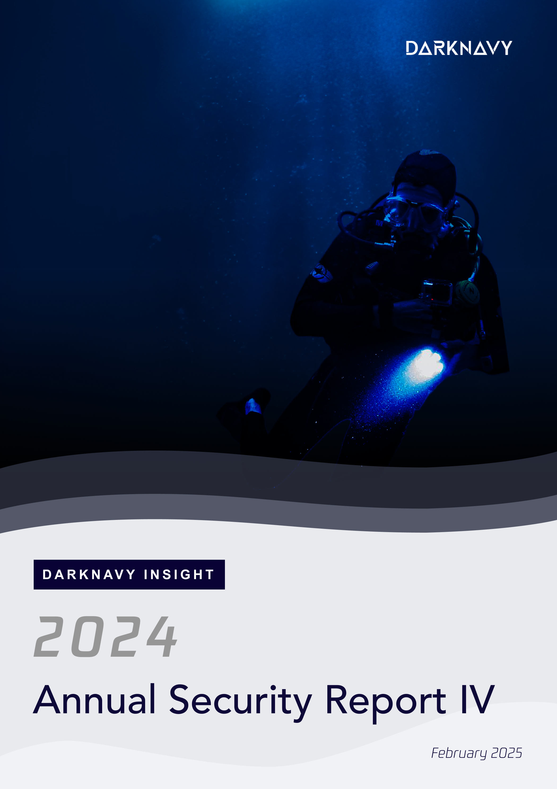
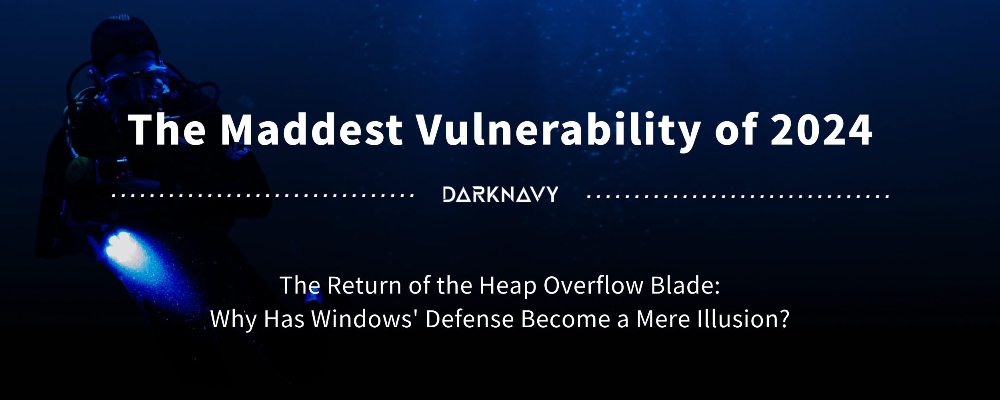
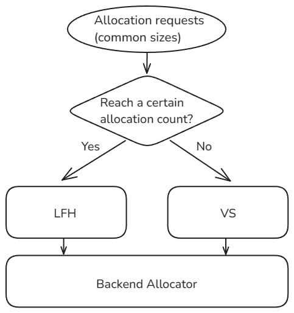

+++
title = 'The Maddest Vulnerability of 2024'
date = 2025-02-11T11:41:45+08:00
draft = true
images = ["attachments/8671fafe-16f3-46b2-bf66-846bf748cc02.png"]
+++

Under the collective efforts of security researchers and increasingly stringent security mitigations, most memory vulnerabilities have been nipped in the bud.

Is it time to declare memory vulnerabilities a thing of the past?

In July 2024, a "nuclear bomb" from the Windows camp shattered the illusion of security. We can't help but ask: When faced with threats from memory, just how much can the walls in front of us really defend against?

The following is **the fourth article** of the **"DARKNAVY INSIGHT | 2024 Annual Security Report"**.

 

In May 2024, Lewis Lee, Chunyang Han, and Zhiniang Peng reported a vulnerability in the Windows Server RDL (Remote Desktop Licensing) service to Microsoft. In July, the vulnerability was patched and made public.

The announcement caused quite a stir. As a **memory corruption vulnerability** that could trigger **remote code execution** without authentication or user interaction, it immediately drew attention from security vendors and professionals. It was even referred to as a "nuclear bomb-level vulnerability."

This is the main topic of this article—**MadLicense**.

Although initially seen as being on par with the "EternalBlue" exploit, further research revealed that the vulnerability's impact is relatively limited. It exists in the RDL service on Windows Server, not the commonly thought-of RDP protocol. The service is an optional installation that allows multiple users to connect to a server via RDP, and **it is largely unrelated to most individual users**. Additionally, the vulnerability resides in user space, so its potential to threaten the system is somewhat constrained.

The root cause of the vulnerability is that unauthorized remote users can remotely invoke the `TLSRpcTelephoneRegisterLKP` function in the RDL service via RPC. Within that function's sub-functions, some user inputs are decoded from base24 to base10 without any length restrictions, leading to an **unbounded heap overflow vulnerability**.

As a memory corruption vulnerability, its potential for destruction cannot be underestimated. We immediately set out to reproduce the exploit and investigate what obstacles and challenges might arise when trying to exploit this classic heap overflow vulnerability on the latest Windows platforms, with security mitigations becoming increasingly stringent.

<video src="attachments/f718340d-56d1-4946-8a59-e099ddc12cb7.mp4" controls="controls" width="100%" height="auto"></video>

The reproduction results are shown in the video. The attacking machine (on the right) runs a malicious script, and without any action from the victim's machine, remote control of the target machine (left shell) is easily achieved.

Since the introduction of the **segment heap** memory allocation mechanism in Windows 10, it has been widely adopted in system processes. For the allocation of commonly sized memory blocks, the **VS (Variable Size)** or **LFH (Low Fragmentation Heap)** allocators are used.

 

The VS allocator has relatively strong protections against overflow. For each heap block, critical information in the block header is encrypted, and the connections between free heap blocks are replaced by more secure data structures. These protections mean that exploiting the vulnerability requires some degree of information leakage, significantly raising the threshold for exploitation.

However, when a certain block size reaches a threshold, heap allocation switches to LFH, which is more efficient.

Compared to VS, LFH has more lenient protection mechanisms. LFH heap blocks do not have headers, allowing for uncontrolled overflows into adjacent blocks. To mitigate this, LFH employs full randomization: heap block layouts are randomized, and recently freed blocks are not reliably reused. This can be bypassed using heap spraying techniques.

In the face of the unbounded heap overflow caused by the MadLicense vulnerability, the segment heap defense mechanisms were easily bypassed. We could still easily overflow into the target heap block, fake objects, and gain **arbitrary address read/write/call** primitives.

At this point, the exploitation is not over. What will the general memory mitigations look like in the face of this challenge?

Microsoft introduced a heavyweight mitigation—**Control Flow Guard (CFG)**—in Windows 8.1 Update 3 and Windows 10. With CFG enabled, indirect calls are validated using bitmaps generated during compilation to ensure that only functions within the loaded modules of the process can be called. This effectively blocks traditional code reuse attacks.

Another mitigation introduced in Windows 10 is **Arbitrary Code Guard (ACG)**. ACG prevents modification of existing code and blocks the dynamic allocation of executable memory. With both ACG and CFG enabled, bypassing both defenses becomes extremely difficult, virtually eliminating the possibility of traditional shellcode injection.

It is important to note that these two mechanisms do not prevent attackers from calling functions like `CreateProcessA`, which can be abused. Without bypassing the above memory mitigations, arbitrary function calls are sufficient to allow arbitrary command execution on the target machine.

One of the original authors of the vulnerability, Associate Professor Zhiniang Peng from Huazhong University of Science and Technology, revealed to us that they were able to **almost 100% reliably exploit and execute arbitrary shellcode**. This means that the above memory mitigations can still be bypassed.

So why is it that even on the latest Windows Server 2025, with all security mitigations enabled, this memory vulnerability can still be fully exploited?

> **Zhiniang Peng answered**: "Currently, with all the latest mitigations fully enabled on Windows, it is extremely difficult to remotely exploit a memory corruption vulnerability. Many vulnerabilities no longer have exploitable paths, or the paths that remain are very few and very obscure."
>
> "But this does not mean that all vulnerability exploits are dead. Whether an exploit succeeds often depends on: the amount of time an attacker is willing to spend, his familiarity with the relevant code modules, and the specific conditions of the vulnerability and module."

---

## **DeepSeek Insight**

Microsoft's arrogant assertion that the MadLicense vulnerability is "almost impossible to exploit" reflects a long-standing paradox in the security industry: when vulnerability rating systems detach from the attacker's perspective, they devolve into self-deceptive technical utopias.

Defenders measuring dynamic attack and defense with static metrics, and negating real-world possibilities using theoretical models, is precisely the greatest blind spot in security defense. The exploitation chain demonstrated here, which bypasses multiple memory protections, proves that security assessments should not be a "disclaimer" from vendors but a dynamic measure of the attack-defense struggle. If we fail to acknowledge the "technical brute force" that attackers can employ, no matter how perfect the mitigations are, they will become the Maginot Line of the digital age.

---