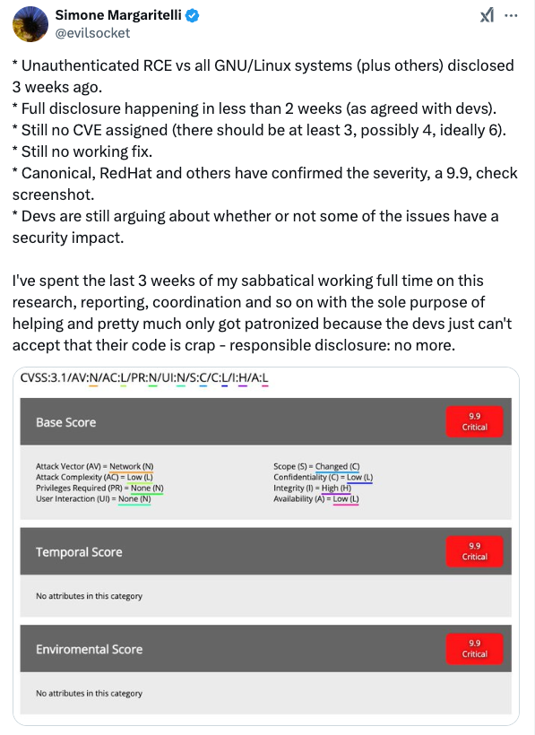

+++
title = 'The Most Frustrating Vulnerability Disclosure of 2024'
date = 2025-02-16T17:58:16+08:00
draft = true
images = ["attachments/6353e63c-00ec-4c9a-802a-3cdd47c39847.png"]
+++

In the field of cybersecurity, vulnerability disclosure has long been regarded as a crucial step in safeguarding users. However, in practice, this process is fraught with controversy and contradictions. What truly constitutes "responsible disclosure"? When vendors dominate the public release of information and patch deployment, while security researchers invest substantial time and energy in negotiations, can this model still fulfill its intended purpose of protecting user security? In an era of rapidly advancing technology and escalating cyber threats, has the traditional vulnerability disclosure process become outdated?

This report will use a recent widely discussed vulnerability disclosure event as a starting point to explore the issues within the current responsible disclosure framework, aiming to find a fairer, more efficient solution that balances the interests of all parties involved.

Below is the ninth article from this year's "DARKNAVY INSIGHT | 2024 Annual Security Report"

 

For a critical security vulnerability, the vulnerability details, PoC (Proof of Concept), or exploit are typically disclosed only after the vendor has released a security update and pushed it to users for a period. This is the Coordinated Vulnerability Disclosure (CVD) model, often referred to as responsible disclosure in the cybersecurity research community.

At the end of September 2024, something unusual occurred within the security research community: a remote code execution vulnerability, deemed capable of affecting all Linux systems, was disclosed in detail on the same day that major Linux distribution vendors published their security notices. Prior to this, the vulnerability's discoverer had expressed frustration on social media, complaining that vendors like Red Hat had rated the vulnerability at CVSS 9.9, yet the developers of the relevant components had shown little regard for the vulnerability he had reported. He ended his tweet with: "responsible disclosure: no more."

 

## Vulnerability Disclosure Controversy

The key figure in this story is the renowned security researcher Simone Margaritelli. In early September 2024, he began investigating the CUPS component within Linux systems and, on September 5, disclosed the vulnerability to the relevant vendors and OpenPrinting developers. Red Hat assigned a CVSS score of 9.9 to the vulnerability, but the OpenPrinting developers failed to grasp Simone's research. Simone engaged in a 22-day-long communication process with OpenPrinting, and it wasn't until three weeks later that OpenPrinting acknowledged the correctness of Simon's research.

During this time, on September 23, Simone published the now-infamous tweet. In it, he did not specify the exact component of the vulnerability. Ironically, just one day later, on September 24, the BreachForums leaked Simone's original vulnerability report submitted to CERT's VINCE, along with the exploit.

 

On September 26, 2024, OpenPrinting released fixes for libppd, libcupsfilters, and cups-browsed, along with temporary mitigations. Linux distribution vendors, including Ubuntu and Red Hat, began issuing security advisories and fixes. On the same day, Simone disclosed the full details of the vulnerability and its exploit on his blog. Ultimately, the vulnerability received a CVSS score of 9.0.

 

## Vulnerability Disclosure: Ideals vs Reality

In the process of disclosing security vulnerabilities, researchers generally follow the CVD model, which aims to give vendors ample time to prepare fixes or mitigations, thereby minimizing the impact of the vulnerability as quickly as possible. It also ensures that users are informed about vulnerabilities in the products they use.

However, this model shows certain limitations in real-world practice: vendors hold significant control over the disclosure process, and researchers are required to devote a substantial amount of time and effort to communicating vulnerability details. In this case, communication between Simone, an independent researcher, and the OpenPrinting developers was far from smooth. As noted in Simone's blog, their communication logs spanned 50 pages over a period of three weeks, consuming a great deal of time and effort from both sides. Ultimately, Simone violated the "responsible disclosure" guidelines and publicly disclosed the vulnerability prematurely.

> The lack of a vulnerability evaluation standard is one of the reasons vendors maintain control over the disclosure process. The commonly used CVSS vulnerability rating system tends to rely on overly simplistic metrics, which fail to accurately assess the difficulty of exploiting a vulnerability or its potential impact. This makes it difficult for security researchers and vendors to reach a consensus.
>
>  

To address this challenge, organizations such as P0, ZDI, and CERT have incorporated a deadline mechanism into the CVD model. For example, Google Project Zero proposed a 90-day disclosure timeline. This approach involves researchers immediately reporting vulnerability details to vendors, and then, after 90 days or upon the release of a security patch, disclosing the vulnerability and its mitigation measures to the public.

The Deadline mechanism serves as a practical supplement to the CVD model, effectively improving the speed of vulnerability mitigation and enhancing the security of end users. However, the Deadline mechanism remains a passive warning system and does not sufficiently limit the power vendors hold in the disclosure process. Vendors still maintain absolute control. In fact, even when some security researchers announce that they will disclose vulnerability details after 90 days, certain vendors still fail to actively push forward the patching process, leading to vulnerabilities being exposed in the wild. There are several such cases in P0's reports.

 

---

## DARKNAVY INSIGHT

In today's highly interconnected world, the impact of active, high-risk vulnerability exploits is becoming increasingly widespread and complex. The timely disclosure of vulnerabilities by researchers, swift vendor responses, and prompt updates for users are all crucial in mitigating the damage caused by such vulnerabilities.

Responsible disclosure, in this context, appears somewhat idealized. Due to issues like the deficiencies in the CVSS rating system, vendors and developers maintain control over the disclosure process, while third-party security researchers and end-users have limited influence over the fixes. Researchers often expend significant time and resources trying to reach an agreement with vendors on vulnerability ratings.

Responsible disclosure, in this context, appears somewhat idealized. Due to issues like the deficiencies in the CVSS rating system, vendors and developers maintain control over the disclosure process, while third-party security researchers and end-users have limited influence over the fixes. Researchers often expend significant time and resources trying to reach an agreement with vendors on vulnerability ratings.

The introduction of the Deadline mechanism has effectively accelerated the patching process and enhanced end-user security. Yet, this system still does not provide sufficient checks on vendor authority. A more comprehensive vulnerability disclosure system will require the collaborative efforts of all parties involved.

---

## References

* <https://x.com/evilsocket/status/1838169889330135132>
* <https://www.akamai.com/blog/security-research/guidance-on-critical-cups-rce>
* <https://www.evilsocket.net/2024/09/26/Attacking-UNIX-systems-via-CUPS-Part-I>
* <https://googleprojectzero.blogspot.com/2015/02/feedback-and-data-driven-updates-to.html>
* <https://github.com/OpenPrinting/cups-browsed/security/advisories/GHSA-rj88-6mr5-rcw8>
* <https://github.com/OpenPrinting/cups-filters/security/advisories/GHSA-p9rh-jxmq-gq47>
* <https://project-zero.issues.chromium.org/issues/368695689>
* <https://x.com/guhe120/status/1856844617846817004>