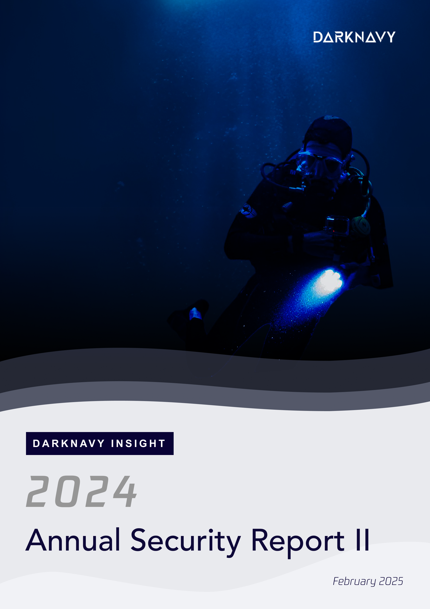
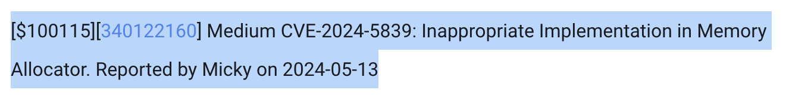
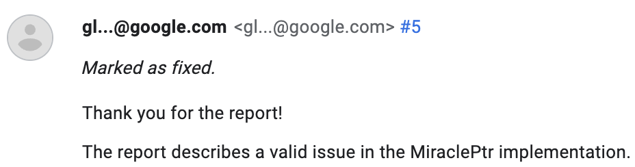
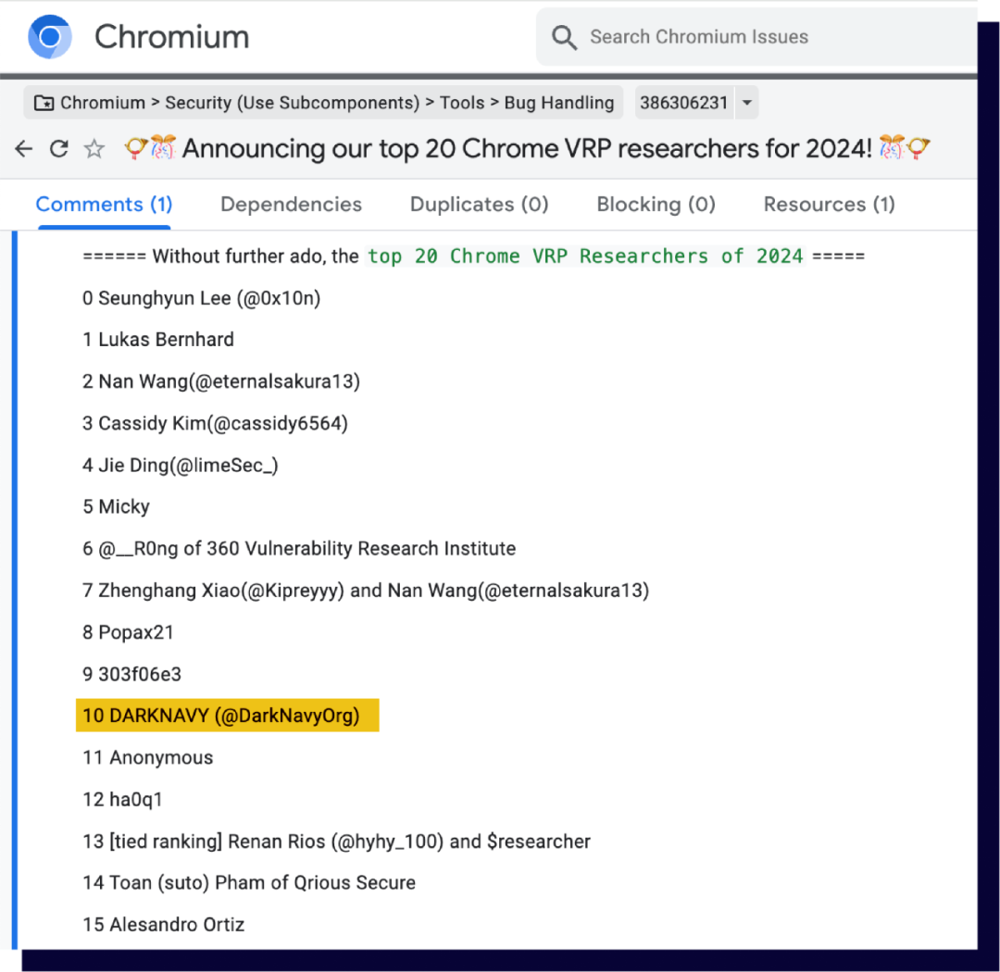

+++
title = 'The Most "Golden" Bypass of 2024'
date = 2025-02-09T17:13:30+08:00
draft = false
images = ["attachments/cover.png"]
+++

 

Since the early 2000s, attacks based on browser vulnerabilities have remained a mainstream, effective, and versatile attack method. The following is the second article from the "DARKNAVY INSIGHT | 2024 Annual Security Report".

 

According to the latest report from market research firm Statcounter, Chrome has unquestionably secured its position as the most dominant browser in terms of market share.

 

Chrome is renowned for its exceptional security, with the Google security team continuously researching and implementing cutting-edge vulnerability mitigation mechanisms. One of the most well-known among them is MiraclePtr, designed to prevent attackers from exploiting Use-After-Free (UAF) vulnerabilities in the browser.

The PartitionAlloc heap allocator in Chrome maintains a user-transparent refcount field when allocating and freeing objects. In simple terms, the MiraclePtr mitigation mechanism works as follows: If an object is freed while its refcount is not zero, this indicates the presence of a dangerous reference in the code, meaning the object is a potential UAF target. At this point, the heap allocator isolates the dangerous object, preventing potential exploitation.

- June 2022: The new MiraclePtr security mechanism was officially enabled in the browser process on Windows and Android.
- September 2022: The scope was expanded, enabling MiraclePtr in all processes except the renderer process.
- June 2023: MiraclePtr was fully enabled across all platforms (ChromeOS, macOS, and Linux).
- July 2024: The Chrome VRP announced that UAF vulnerabilities protected by MiraclePtr would no longer be considered security issues.

What gives Chrome the confidence to "ignore" UAF vulnerabilities?

To answer this, we must look at one particular MiraclePtr bypass in 2024.

In May 2024, Chrome announced a high-reward vulnerability bounty that caught everyone's attention—a **$100,115 bounty** specifically for a MiraclePtr Bypass under Chrome VRP Rules.

 

Once the issue was fully disclosed, researchers finally understood the bypass details.

Inside PartitionAlloc, after the refcount is incremented, the code checks for an overflow condition. If an overflow occurs, the process is supposed to crash immediately:

```cpp
CountType old_count = count_.fetch_add(kPtrInc, std::memory_order_relaxed);
// Check overflow.
PA_CHECK((old_count & kPtrCountMask) != kPtrCountMask);
```

However, security researcher Micky discovered that when an overflow occurs, the CHECK does not immediately crash the process. Instead, the process takes a short amount of time to handle the crash logic. In a test environment, the program continued running for about 180ms before stopping completely.

This tiny window of time gave attackers a race condition opportunity. If an attacker could complete heap spraying, memory layout manipulation, and PC control within this window, they could successfully exploit a UAF vulnerability despite MiraclePtr's protection.

Conditions required for a successful attack:

- Precisely overflowing a 29-bit refcount field.
- Ensuring that the object release code and attack execution code run on separate threads, both under some level of attacker control.
- Gaining control over the target object's refcount freely.
- Winning the race condition within a very short time window.

Given these strict conditions, this bypass technique was almost theoretical, yet the Chrome team still generously rewarded the discovery.

In November 2024, DARKNAVY also discovered an implementation flaw in MiraclePtr, reported it to the Chrome team, and received confirmation.

 

Thanks to this discovery, along with several other high-quality vulnerability reports, DARKNAVY ranked among Chrome VRP's Top 20 Security Researchers/Organizations of 2024.

 

With this background in mind, it's clear that the only existing MiraclePtr bypass methods are highly constrained, and the mitigation has been running successfully for over two years. Google's decision to no longer treat protected UAF vulnerabilities as security issues was likely made after careful consideration.

After two years of continuous improvements, Chrome has effectively eliminated one of its biggest security concerns, which is great news for consumers.

Chrome's Q3 security report also highlighted several memory security enhancements, including:

- Removing dependence on the C library libpng and replacing it with Rust-based PNG and JSON decoding.
- Moving the graphics rendering module (ANGLE) into the renderer process for stronger sandbox protection.

All of these efforts indicate that future Chrome versions will be even harder to exploit using memory corruption vulnerabilities.

---

**DARKNAVY INSIGHT**

From the deployment of MiraclePtr, to the appearance of bypass techniques, and finally to its continuous improvements, Chrome has demonstrated not only technical advancements but also a philosophy of security:

- Encouraging vulnerability discovery through bounty programs.
- Strengthening the overall system rather than focusing on individual vulnerabilities through iterative technology improvements.

This approach reflects Chrome's deep understanding of cybersecurity—security is not a one-time achievement but an ongoing battle.

As security research and defense techniques evolve together, Chrome may never achieve absolute security, but through a systematic approach, it can continuously reduce risks to an acceptable level, earning users' trust and making security a core competitive advantage of the product.

---

***References:***

\[1\] https://gs.statcounter.com/browser-market-share#monthly-202412-202412-bar
\[2\] https://chromereleases.googleblog.com/2024/06/stable-channel-update-for-desktop.html
\[3\] https://issues.chromium.org/issues/386306231