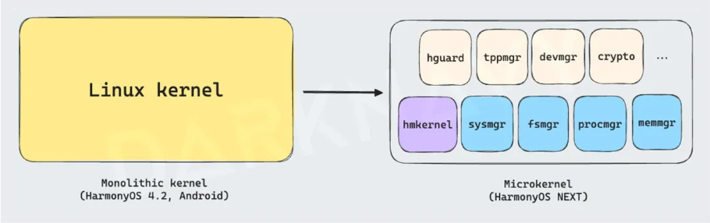

+++
title = 'The Most Groundbreaking New Security Ecosystem of 2024'
date = 2025-02-08T17:10:13+08:00
draft = false
images = ["attachments/f349496e-e1f5-4d6b-b4a2-7c939b50aa80.png"]
+++

In the "DARKNAVY INSIGHT | 2023 Annual Security Report", we noted: "As we stand on the precipice of the next decade, 2023 will undoubtedly be a year of profound transformation. The deployment of new defense mechanisms and the rise of novel attack technologies will fundamentally reshape the digital security landscape."

The year 2024 arrived like a swift gust of wind, only to fade away like a brief storm. The AI revolution, breakthroughs in mobile operating systems, and challenges in supply chain security that we discussed in 2023 continue to unfold in 2024, leaving little room to catch our breath.

The relentless wave of disruptive change sharply contrasts with the traditionally sluggish security market. In the age of AI, does traditional memory security research still have relevance? What direction will new attack methods take? How should user privacy be safeguarded in this ever-evolving digital landscape?

In the 2024 edition of DARKNAVY INSIGHT, we have already embraced the future and invite you to explore and share these developments with us.

Below is the first article from this year's "DARKNAVY INSIGHT | 2024 Annual Security Report".

 

Huawei launched the first version of HarmonyOS, HarmonyOS 1.0, in 2019, and the operating system has been continuously updated, with HarmonyOS 4.2 being the latest version. While the initial versions provided dual compatibility with both Android and Harmony frameworks at the application layer, the underlying system still relied on the Android kernel, which raised significant skepticism within the industry.

With the release of the 2024 HarmonyOS NEXT version, and the subsequent 5.0 version, HarmonyOS has shifted to a "single framework" at the application layer, with the core now entirely based on Huawei's proprietary HongMeng kernel. This marks the official end of its reliance on the Android application framework and kernel.

 

As early as June 2, DARKNAVY released the world's first public jailbreak video based on HarmonyOS NEXT Developer Preview 2. On June 12, we published another video demonstrating an application persistence issue in the same version. Leveraging the system privileges, we conducted further analysis on HarmonyOS NEXT, examining the application framework and kernel in detail. We discovered that both the application framework and the kernel of HarmonyOS NEXT differ significantly from Android. In this report, we will reveal the true nature of HarmonyOS NEXT from a security research perspective, focusing on key aspects such as "single framework" application development, permission management, the Internet of Everything (IoE), kernel architecture, and syscalls.

## HarmonyOS "Single Framework"

The "single framework" of HarmonyOS signifies a complete break from Android. The system no longer supports APK installation packages and no longer uses Java as the application development language. The "single framework" has replaced APK with the HAP (Harmony Ability Package) for deployment, and the application development language has shifted to extended TypeScript (eTS).

To prevent the proliferation of malicious applications, which plagued the traditional Android system, HarmonyOS "single framework" introduces significant improvements over its predecessor. For instance, applications are restricted to installation only from official app markets using application signing mechanisms, thus eliminating the risk of non-official third-party apps; it enforces stricter background persistence policies, where any application is forced to suspend after 10 seconds; sensitive permissions are granted on a one-time basis, ensuring minimal access, such as allowing an app to access only the image selected by the user instead of the entire photo gallery.

In addition to these optimizations, HarmonyOS "single framework" introduces several bold innovations.

* The underlying foundation of the "Internet of Everything" is the Distributed Soft Bus (DSoftBus), which enables seamless communication between various device models and types. The underlying transmission media supports Wi-Fi, Bluetooth, and other protocols, and the protocol layer covers various stages, including discovery, authentication, and transmission. From the user perspective, new services like distributed file systems and clipboard synchronization significantly enhance user convenience. For developers, the system even supports remote IPC calls to other devices, facilitating distributed binder calls. Given the power of these features, the security of this module is of paramount importance.

 

* The newly introduced XPM (eXecutable Permission Manager) module enforces a robust code protection mechanism, ensuring that applications can only load code that is signed with a valid certificate. Once an application is installed, its code files (.abc and .so) cannot be modified arbitrarily; any modification will result in the code being rejected. Additionally, integrity protection prevents tampering with executable code.
* The AccessToken mechanism enables finer-grained permission control by categorizing token types into Hap, Native, Shell, and others, thereby separating the management of system program and app permissions. An application's access token contains crucial information such as the app ID, sub-user ID, app clone index, app APL, and authorization status, enabling the system to implement more granular authentication.

These mechanisms operate at the operating system kernel level, ensuring end-to-end control across the entire system.

> It is worth noting that while HarmonyOS "single framework" no longer supports APK installation packages, applications like "出境易" and "卓易通" have made it possible to run Android apps on this system. During practical analysis, the encryption support in the kernel and TEE (Trusted Execution Environment) made reverse-engineering the installation packages from these app markets exceedingly difficult. DARKNAVY, utilizing our accumulated research, successfully decrypted these packages with our proprietary decompiler, revealing that these applications use HarmonyOS system container interfaces to simulate the Android application and framework layers.

 

## HarmonyOS NEXT Kernel

 

HarmonyOS NEXT kernel (referred to as the HongMeng kernel hereafter) is designed based on a microkernel architecture. The traditional kernel functionalities are split into a streamlined core kernel and several independent system components. Some or all of these components operate in user mode, depending on the security requirements, offering enhanced security compared to the monolithic kernel architecture of Linux.

> * In a monolithic kernel, all modules are tightly coupled. For example, if an attacker exploits a vulnerability in the network module, they can gain control over the entire kernel.
> * In contrast, with a microkernel architecture, even if a module (such as the network module) is compromised, the attacker cannot easily escalate the attack to other system modules due to the isolation between components.

 

This isolation between system components inevitably results in performance overhead. To minimize the cost of frequent context switches between components, the HongMeng kernel moves frequently accessed functionalities, such as file system management (fsmgr), memory management (memmgr), and process management (procmgr), into kernel mode, while isolating high-risk functionalities, such as network communication and device drivers (devhost), into user mode, thereby sacrificing a small amount of performance for improved security.

 

To maintain compatibility with the Linux software development ecosystem, the HongMeng kernel supports Linux syscalls and drivers. Specifically, it maps Linux system call numbers to its own and reconstructs the corresponding functionality within the new microkernel architecture, ensuring seamless compatibility between the kernel and applications. Additionally, a user-space driver container is introduced to load and execute various Linux drivers, enabling Linux-based software to run smoothly without extensive adaptation for the HongMeng kernel.

This also explains how Android apps can run on HarmonyOS NEXT using container virtualization technology.

 

syscalls in the HongMeng kernel are categorized into two types: lsyscall and archsyscall.

> * lsyscall refers to the Linux-compatible syscalls, but due to the microkernel architecture, these functionalities are divided into multiple components. Specifically, lsyscall is subdivided into nine different types, and depending on the type of system call, the core kernel dispatches the request via a class RPC mechanism to the appropriate functional component.
> * archsyscall, on the other hand, is specifically designed to support the microkernel's features, enabling critical functionalities such as IPC (inter-process communication) and RPC (remote procedure calls). Moreover, the HongMeng kernel implements a fine-grained capability-based control mechanism for resource management, similar to SEL4. For example, access to core kernel resources, such as ACTV and ACTVPOOL for the RPC mechanism, requires a capability check, thus adding another layer of security against potential attacks.

 

Our in-depth analysis of the HongMeng kernel reveals that significant efforts have been made in its architectural design. Compared to the Linux kernel, it achieves a notable enhancement in security, albeit with a slight performance trade-off.

However, it is regrettable that, unlike the open ecosystem of Android, the HongMeng kernel has remained closed-source. Starting in the second half of 2024, the HongMeng kernel within HarmonyOS NEXT firmware has been encrypted, significantly increasing the challenges for security researchers. It is noteworthy that this closed approach presents a stepwise challenge to the "purebred HarmonyOS" ecosystem: the key issue lies in whether the core system capabilities will be made available to third-party smartphone and device manufacturers—only by making the underlying system open-source can this be addressed. Furthermore, considering the firmly established Android ecosystem, it remains uncertain whether other manufacturers will invest resources in adapting to this entirely new system, posing a potential challenge for ecosystem development.

> Much like how macOS was once criticized as being based on FreeBSD and Linux was accused of being a derivative of UNIX, it is inevitable that a nascent operating system will bear some resemblance to others due to adaptation and inspiration. However, it is clear that HarmonyOS NEXT diverges significantly from native Android in its development trajectory, and we believe that its future evolution will be markedly different.

---

## DeepSeek Insight

When HarmonyOS erects high walls through code signing, are we witnessing the twilight of an open ecosystem? The closed-source kernel and encrypted firmware create a "security fortress"—is this a shield against attacks, or a prison that stifles technological evolution? With the microkernel architecture trading performance for security promises, can it withstand the downpour of zero-day vulnerabilities in the torrent of the Internet of Everything? Do the Android "ghosts" lurking in containers hint at a dual personality of ecosystem fragmentation? As distributed IPC breaks down device boundaries, is the attack surface expanding exponentially? Is HarmonyOS, claiming to be "purebred," truly paving the way for technological independence, or has it fallen into the dead-end of ecological isolation? When every permission becomes a digital shackle, are we guarding user privacy, or strangling the potential for innovation? Will this operating system's rebirth ultimately give rise to an ark of digital security, or become just another specimen of a closed garden?

---
