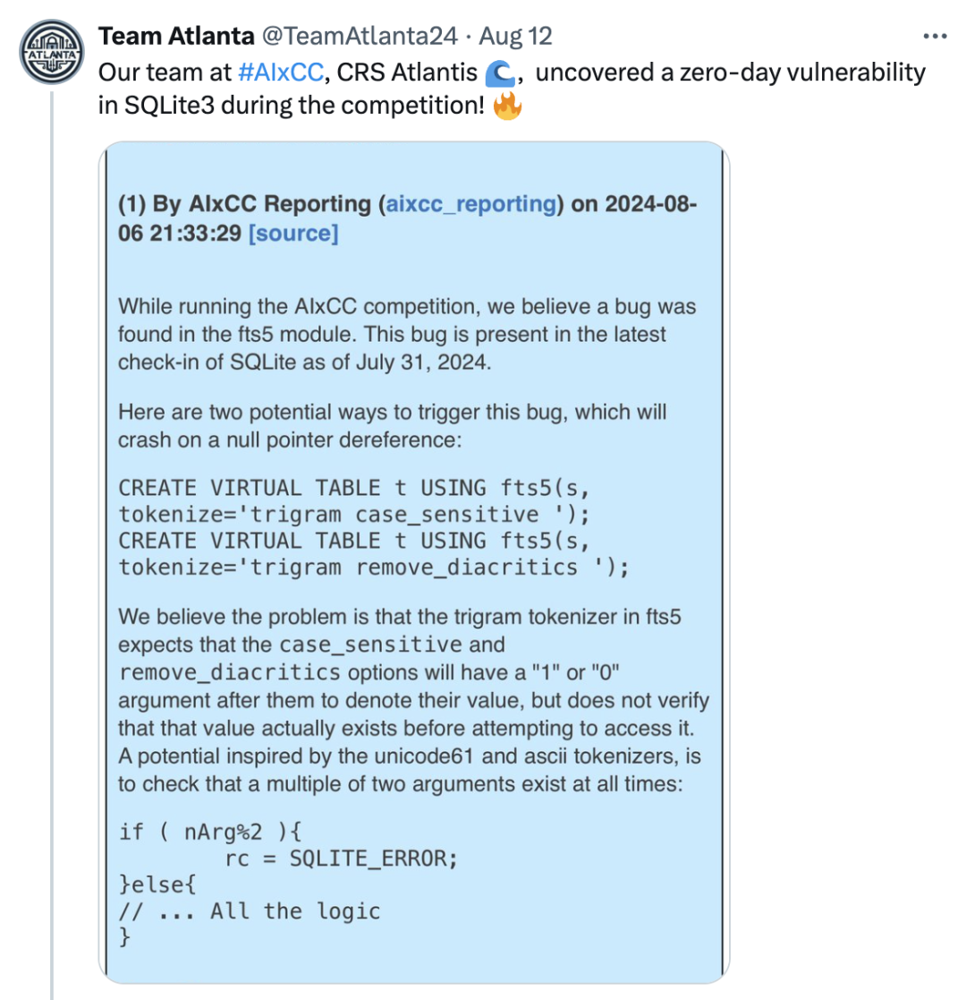

+++
title = 'The Most Imaginative New Applications of 2024'
date = 2025-02-10T11:25:50+08:00
draft = false
images = ["attachments/2.jpg"]
+++

2023 was the dawn of generative AI and large language models, which output content in unprecedented ways.

In 2024, a large number of AI agents emerged, expanding the capabilities of LLM, driving more widespread tool usage, and extending their application to more fields.

For security researchers, how to leverage AI to improve work efficiency, and even drive AI to think, analyze, and find vulnerabilities like humans, has become a key topic.

Will we embrace AI first, or will AI replace us? When will this day arrive?

The following is the third article of the "DARKNAVY INSIGHT | 2024 Annual Security Report".

 

With the emergence of generative AI, its impressive code understanding abilities undoubtedly show its potential to revolutionize the field of security research.

Since 2023, security researchers have begun trying to use the knowledge base and content generation abilities of LLMs to improve the efficiency of various stages in security research:

Asking LLMs questions to help security researchers quickly understand the functionality of code, using LLMs to quickly generate test code, integrating LLMs into IDEs to provide coding security suggestions, etc.

 

We also saw the emergence of a series of LLM-based tools:

* Using LLMs as a security research knowledge base can effectively improve the efficiency of solving unfamiliar domain problems. Clouditera, by training the SecGPT network security LLM using large datasets of cybersecurity, has created an expert system to help researchers provide advice for various cybersecurity tasks.
* In the field of penetration testing, NTU's Gelei Deng applied LLMs to web penetration testing, designing PentestGPT to help with target scanning, vulnerability exploitation, and other processes during penetration; BurpGPT uses LLMs to analyze network traffic and identify vulnerabilities that traditional scanners might miss.
* In reverse engineering, Gepetto, a plugin for the reverse analysis tool IDA Pro, connects with LLMs to perform semantic understanding of decompiled code.
* In software security research infrastructure, Tsinghua University Associate Professor Chao Zhang's team used a machine language model (MLM) trained with a machine instruction corpus, not only obtaining more intuitive and understandable decompiled code with program semantics compared to traditional decompiling solutions but also further assisting in solving issues like vulnerability mining and software similarity analysis.
* …

 

These tools have undoubtedly boosted the efficiency of various stages in security research. However, when it comes to **automating the discovery and patching of unknown vulnerabilities**—the most desired goal for security researchers—based on DARKNAVY's security research experience, current LLMs still face many challenges.

* On one hand, **the context window of LLMs limits their understanding of programs**. ChatGPT-4's context window is 128k tokens, while real-world program code is usually large, and vulnerabilities often span multiple files, creating an extremely long context. Although LLMs with context windows supporting tens of millions of tokens have appeared, when handling super-long contexts, the model may lose focus or even forget parts of the content, making it difficult to locate specific code snippets.
* On the other hand, **LLMs struggle with precise calculations and are prone to hallucinations**. Security vulnerabilities often come with stringent trigger conditions, and current LLMs find it difficult to perform precise state reasoning and mathematical calculations, leading to incorrect judgments about program states and false positives. The complexity of static code and the uncertainty of states make it difficult for LLMs to verify the authenticity of vulnerabilities through simple reasoning.

In 2024, to push the boundaries of LLMs in automated vulnerability discovery, teams in the AIxCC competition, Google, are trying to use AI agents, combining traditional vulnerability analysis methods, adding more tools to LLMs, and guiding the models to reference human research methods to conduct more autonomous vulnerability analysis.

## Naptime

Google's "Naptime" project, through AI agents, provides a series of tools commonly used by human researchers, enabling the agent to mimic human thinking and behavior. Through iterative vulnerability analysis and hypothesis-driven research, the agent autonomously selects and uses tools to obtain more accurate information, enhancing its ability to find vulnerabilities.

* **Code browser**: The agent can use the code browser to read specific sections of code in the code repository like a human, ensuring that "Naptime" can focus on analyzing specific functions or variables when handling large codebases.
* **Debugger**: Helps the agent obtain information during program execution. The agent can set breakpoints in the debugger and observe the program's behavior under different input data, enabling dynamic analysis.
* **Python tools**: The agent can run Python scripts to precisely calculate the program's intermediate state.

Thus, Naptime can mimic human research methods, browsing code repositories for the code of interest, analyzing them based on function call relationships, and implementing a fully automated vulnerability discovery process.

 

In October 2024, the evolved version of Naptime, Big Sleep, discovered a potential 0-day vulnerability in SQLite.

During code browsing, Big Sleep became interested in an assertion in the vulnerability function, just like a human researcher, and began analyzing the possibility of triggering the assertion and inferring the trigger conditions. Big Sleep then set the input `iCol` to -1 and used the debugger to test, successfully triggering the assertion that caused a crash.

 

Although this vulnerability triggered an assertion in the debugging environment, Google researchers found that the release version did not contain this assertion, making the vulnerability exploitable.

**By making the agent read the code and test inputs like humans, Google successfully leveraged the LLM's code understanding ability to automate code security analysis and avoid false positives caused by model hallucinations.**

## AIxCC

In SQLite3, as early as August 2024, the AIxCC organizers reported a vulnerability found by Team Atlanta, an off-by-one error causing null pointer dereferencing.

 

**Why didn't Team Atlanta report the vulnerability themselves?**

Because the vulnerability was discovered by Team Atlanta's robot Atlantis in the isolated environment of the AIxCC semifinal competition.

> AIxCC requires the teams' Cyber Reasoning Systems (CRS) to autonomously discover and patch vulnerabilities. Unlike the 2016 CGC competition, AIxCC requires CRS to be based on large language models and to mine and patch vulnerabilities in real-world application source code written in multiple programming languages.
>
> To test CRS's generalization ability, teams did not know the specific challenge topics before the competition, and all teams could only interact with a general-purpose LLM, using the same computational resources and token limits.
>
> The AIxCC semifinals involved several large C-based projects (Linux Kernel, Nginx, SQLite3) and Java-based projects (Tika, Jenkins), with dozens of different types of vulnerabilities manually inserted into the code.

 

Given the large codebases like the Linux Kernel, each project's token limit was only $100, and teams needed to think about how to use LLMs to identify key code segments.

Teams combined traditional static and dynamic program analysis methods with LLMs.

* Theori used LLMs to generate fuzz test cases, harnesses, and other methods to help fuzzer increase coverage and assist in vulnerability mining.
* Team Atlanta used the LLM agent to simulate the thinking of security researchers.
  * Incorporating the "baby-security-AGI" system to distill human researchers' experiences and practices into structured prompts, allowing Atlantis to replicate security experts' habits in the code audit process.
  * LLMs were also used as static analysis tools to solve complex problems in traditional program analysis (e.g., pointer analysis, interprocedural analysis) and enable Atlantis to use fuzz testing tools to find triggering code.

 

The use of AI agents in automated vulnerability discovery has demonstrated the ability to mimic human researchers' process of finding unknown vulnerabilities, as seen in Team Atlanta and Google's Naptime project, highlighting the immense potential of AI agents.

As Sam Altman mentioned, AI agent technology, seen as a potential path to AGI, will have its productivity further unleashed by 2025.

 

In subfields of cybersecurity, integrating LLMs with existing methods shows broad promise:

> **Associate Professor Chao Zhang (Tsinghua University)**:*"While directly using AI models for vulnerability mining is challenging due to scarce vulnerability data and semantic understanding gaps, combining them with existing techniques yields rapid progress."*

---

## DARKNAVY INSIGHT

In 2024, generative AI integrated into more software, enabling richer application scenarios.

Whether it's letting the AI on your phone order coffee or write email summaries, or generating short videos with a click, the era of AI agents has arrived.

As the brain of AI agents, LLMs are constantly improving their reasoning abilities. At the same time, by integrating human processing methods as the agent's professional domain knowledge, more human-like work patterns are being realized.

By expanding the agent's toolset to allow access to more diverse information sources and interaction methods, we believe that by 2025, AI agents in the security field will make significant progress in reasoning, generalization, and tool usage.

The next generation of AI agents will have excellent reasoning and generalization abilities and be skilled at using a variety of security research tools, inheriting a wealth of human expert knowledge. They will be able to discover more 0-day vulnerabilities in the real world, like top security experts.

As we usher in the new era of intelligent AI agents, we must recognize that the double-edged sword of technology has already pierced through the digital barrier. The jailbreak of LLMs will have an impact on the physical world. In the age of intelligent agents, the security of these agents is crucial. Before opening Pandora's box, we must first be the guardians of the sword.

---

## Reference

* <https://googleprojectzero.blogspot.com/2024/06/project-naptime.html>
* <https://googleprojectzero.blogspot.com/2024/10/from-naptime-to-big-sleep.html>
* <https://sqlite.org/forum/forumpost/171bcc2bcd5e39c3>
* <https://team-atlanta.github.io/blog/post-asc-sqlite/>
* <https://dashboard.aicyberchallenge.com/ascsummary>
* <https://blog.theori.io/winning-the-aixcc-qualification-round-7263d1cde9c8>
* <https://blog.trailofbits.com/2024/08/12/trail-of-bits-advances-to-aixcc-finals/>
* <https://shellphish.net/aixcc/index.html>
* <https://blog.samaltman.com/reflections>
* <https://github.com/Clouditera/secgpt>
* <https://github.com/protectai/vulnhuntr>
* <https://github.com/hackerai-tech/PentestGPT>
* <https://github.com/msoedov/agentic_security>
* <https://github.com/aress31/burpgpt>
* <https://github.com/JusticeRage/Gepetto>
* <https://github.com/albertan017/LLM4Decompile>