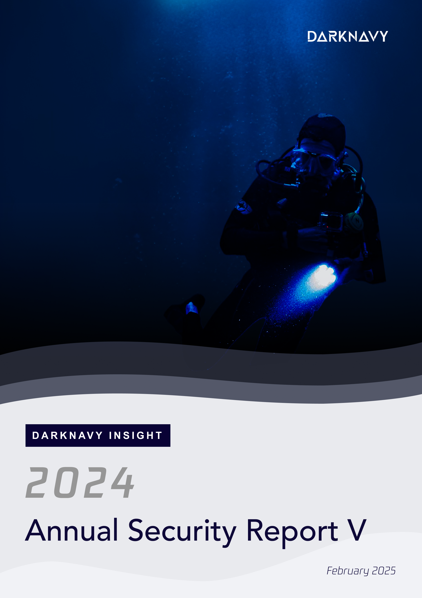
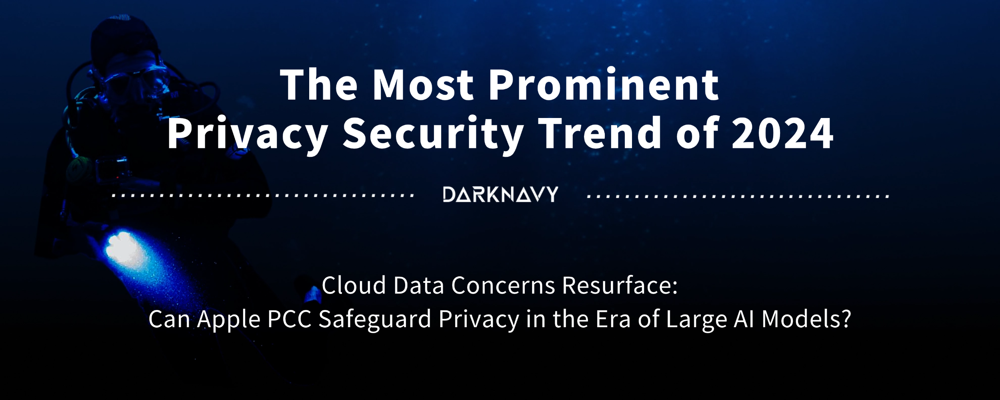
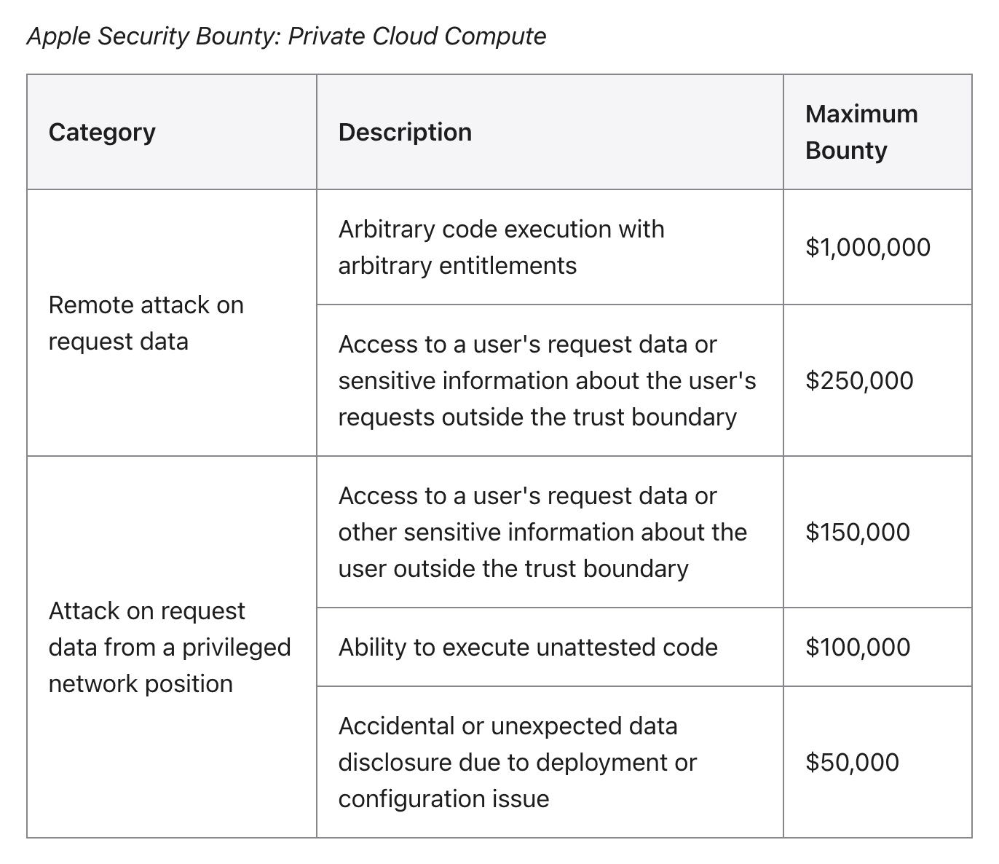
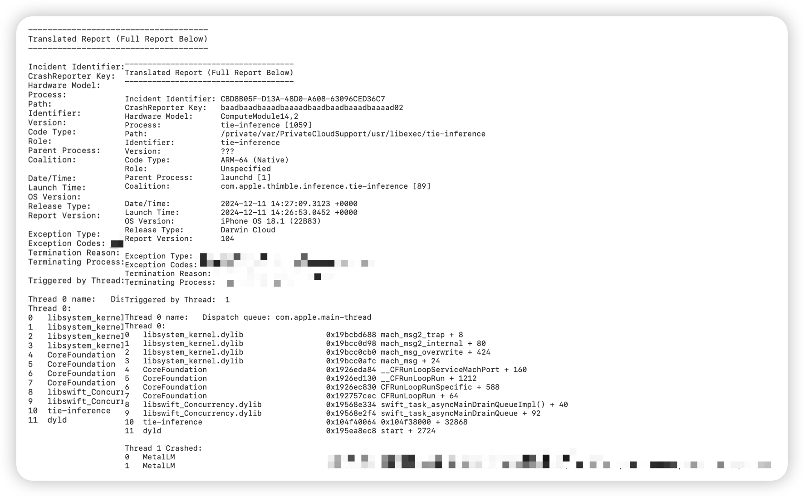
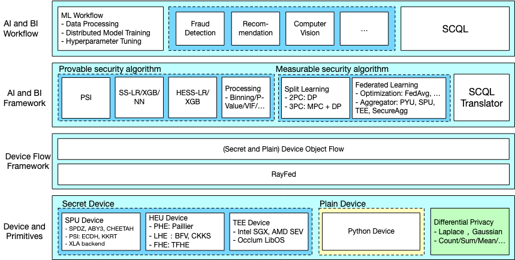

+++
title = 'The Most Prominent Privacy Security Trend of 2024'
date = 2025-02-12T16:40:12+08:00
draft = true
images = ["attachments/6390442c-44f0-4659-96d6-6e2bae29382c.png"]
+++

At the beginning of 2025, the five-year "Siri Eavesdropping Scandal" finally came to an end. Apple settled a class-action lawsuit with the plaintiffs for $95 million.

This well-known privacy case started when users accused Siri of accidentally capturing and recording their everyday conversations without permission, and leaking the data to third-party advertisers.

Even though Apple firmly denied these claims, public concern over privacy security is growing day by day. **Now, we share massive amounts of personal data with AI every day. Are these privacy data really secure enough?**

Below is the fifth article from this year's "DARKNAVY INSIGHT | 2024 Annual Security Report".

 

Imagine this scenario:

Early in the morning, you walk into a café and find that your phone has already ordered a latte for you. As you enjoy a quiet moment with your coffee, your phone screen plays a loop of auto-generated album videos—each frame seems to capture a special memory stored on your phone. Soon after, you receive an international call; as soon as you answer, a "Fraud Alert" pops up on your screen.

You can't help but wonder:

* Why did the café know your favorite coffee flavor so well?
* Are the auto-generated album videos processed on your phone, or have they been uploaded to the cloud?
* Is that photo of mnemonic words now also quietly stored in some unknown cloud?
* And does the sudden fraud alert mean that your call is being monitored in real time by a third party?

…

If five years ago the privacy issue originated from the immaturity of smart assistant technology, then today, with the widespread adoption of large AI models, privacy challenges are sweeping in with a broader form.

**In the era of everything being AI, it means that massive amounts of user data need to be collected, processed, and utilized, with user privacy data having higher value. Moreover, due to the limitations of terminal computing power, the vast majority of data processing tasks must rely on the cloud.** Can user data truly be securely protected in the cloud? From voice assistants to large models, privacy issues have not disappeared with the advancement of technology but have become increasingly prominent. Sloganeering privacy promises are no longer convincing; only technical guarantees that can be proven and verified can truly uphold privacy standards.

## Privacy Computing: The Security Foundation in the Era of LLM

Privacy computing is a key solution to the conflict between AI and privacy.

From finance to healthcare, the phenomenon of data silos still persists like a stubborn stone in the way. Competitive relationships, privacy issues, and technical barriers make it difficult for data to be interchanged between different institutions, and thus the full value of data has not been fully released. For individuals, ensuring that their privacy is not leaked or misused when interacting with countless models and applications on a daily basis is an urgent matter.

Privacy computing technology has emerged, with its core goal being to maximize the value of data under the premise of data invisibility.

* **First**, techniques like secure **multi-party computation** \[1\] and **homomorphic encryption** \[2\] allow sensitive data to be processed and analyzed while it remains encrypted. In other words, the data can be used without being exposed.
* **Second**, **federated learning** \[3\] technology enables collaborative computation of multi-party data while ensuring privacy security, further enhancing the value of the data.
* **Third**, **trusted execution environments** \[4\] offer a hardware-based security foundation for data processing by isolating the computing environment, ensuring the process is safe and reliable.

With the rapid growth of LLM, moving to the cloud has become inevitable. Because devices have limited processing power, complex tasks are usually handled in the cloud, and cooperation between devices and the cloud has become key for model applications. Solutions like **Apple PCC (Private Cloud Compute)** \[5\] have set a benchmark in this area.

However, whether the data uploaded by users to the cloud is truly secure remains an unresolved issue: **Once data is uploaded, will it be stolen or misused? How can users trust the security of cloud facilities?**

 ![Runtime Security Architecture for Apple PCC\[6\]](attachments/254f2987-d595-4706-aaac-2e9ebb4235c7.png)

To address these issues, the application of privacy computing in the cloud is particularly important, but this requires overcoming various challenges:

* **Firstly, the cloud and the edge need to have equal security capabilities**. To achieve this, manufacturers need to ensure that user data is not leaked during the computing process through trusted execution environments and hardware isolation technologies. For example, Apple PCC's specially designed Apple Silicon servers and customized iOS systems, from secure boot, code signing, to various hardware and software protections during runtime, are all carefully designed. At the same time, end-to-end encrypted communication ensures that data is only visible to the user, and cache data is cleared regularly after the inference is completed.
* **Secondly, strict restrictions must be placed on privileged access in the cloud environment**. There have been numerous cases in the past where user privacy data has been misused, such as the 57 million user data leak that occurred with Uber in 2016, which originated from an internal employee using privileged access to steal data. Therefore, the administrators of servers and databases need to be strictly controlled and restricted in their permissions to ensure that access privileges are not misused. Apple PCC not only does not provide shell or debugging interfaces, but all logs and events must also be strictly filtered before leaving the node.
* **Third, the reliability of cloud-based privacy computing capabilities needs to be transparently verified**, which is also a key driver for the application of models. However, there is currently no unified third-party verification standard in China, which to some extent hinders the promotion of cloud-based privacy computing. Apple PCC publicly discloses the binary measurement data of cloud nodes (including the measurement values of the operating system and all code firmware) in the transparency log, accepts verification by third-party experts, and establishes a high bounty program, setting a benchmark for trust.

 

Moreover, even if the security features of cloud hardware can ensure the integrity of software, **how can the integrity of the hardware itself be guaranteed?** The manufacturing process of cloud server hardware is often not fully transparent, and it is difficult to verify whether the hardware instructions are executed as recorded.

For Apple PCC, each server is counted and photographed before being sealed, and is then re-verified by multiple teams in the data center. However, this process is not entirely open and transparent. On closer inspection, users still cannot fully trust the transparency measurement values generated by hardware instructions to be genuine, even whether there exists a hardware backdoor like the Operation Triangulation. This is still a problem that current manufacturers need to think about.

 

To verify whether Apple PCC is as absolutely secure as claimed in the white paper, DARKNAVY conducted in-depth research based on its released virtual research environment (VRE) and some open-source code. The research results show that thanks to its unique integrated hardware and software security mechanism, Apple PCC can effectively prevent the risk of privacy leakage and significantly reduce the possibility of remote attacks. However, DARKNAVY's research also found some inputs that could cause the cloud-based inference engine to crash, indicating that Apple PCC is not absolutely secure.

## Domestic Exploration and Future Trends

In the era of large models and cloud computing, **privacy security and confidential computing have become key topics in the security industry**. Individuals, businesses, and even countries are looking for practical ways to protect their data. Imagine if private data were left unprotected in the cloud, even the most powerful AI would be called into question.

In China, **Ant Group's open-source trusted privacy computing framework "SecretFlow" \[7\]** as a pioneer, integrates various technologies such as trusted execution environment, multi-party secure computing, and federated learning into a generalized solution, attempting to break the limitations of mainstream frameworks with a single technology route. SecretFlow abstracts various technologies into "Secret Devices" and provides a unified SDK interface, allowing developers to quickly implement algorithm applications with privacy protection features without delving into the underlying layers.

 

At the same time, domestic smartphone makers are also exploring ways to combine LLMs with privacy computing. Unlike Apple PCC's integrated ecosystem, the Android world is more fragmented due to different brands and system versions, making user privacy issues even more complicated.

Currently, Android systems mainly use virtualization frameworks and chip TEEs to isolate data, but issues with permission control and privacy leaks during user interactions still exist. To fill these gaps, solutions such as **vivo's BlueLM** and **OPPO AI Private Cloud Computing** are trying to fill these gaps.

In the current era of large models, user privacy issues will be the Pandora's box. Once opened without proper protection, it may unleash endless troubles and threats. Apple PCC undoubtedly has set a good precedent by proposing multiple key security standards in the edge-cloud collaboration model, and also provides a reference for global manufacturers.

Although domestic manufacturers do not have the inherent advantage of highly self-developed hardware and software like Apple, they can leverage the successful experience of PCC and combine their own technical accumulation to provide users with a highly efficient and reassuring LLM application experience, thereby avoiding privacy and security concerns from becoming a bottleneck for the implementation of LLMs.

> **Industry Expert Opinions**
>
> **Wei Tao, Vice President and Chief Technical Security Officer at Ant Group and a member of the GEEKCON Organizing Committee**, said: "Although Apple PCC has introduced a new privacy protection solution, whether its claim of 'absolute privacy security' can be achieved still needs further study. Challenges such as ensuring hardware integrity, keeping a secure boundary, and allowing users to verify everything end-to-end remain. To achieve truly reliable full-chain privacy protection, the whole industry still needs to overcome many technical challenges."

---

## DARKNAVY INSIGHT

A new era of confidential computing has quietly begun, and cloud privacy security will become the core focus of the next tech revolution. As LLMs unleash their full potential, many traditional and new methods of attack and defense are also emerging in the cloud and at the edge.

**The experience gained from operating systems, virtualization, and sandboxing is now being tested and improved in the cloud privacy field. While the battle between attackers and defenders may remain fierce, the rise of confidential computing means that more innovative security ideas and practical methods will soon follow.**

Whether it's the hardcore attempt of Apple PCC or various explorations within the domestic industry, security and privacy are driving technological progress with unprecedented urgency. We have stepped into this brand new "secret computing" territory, just as we did at the intersection of the great tide of mobile internet and the rise of domestic systems, once again seizing a key opportunity for the future, which may be right in front of us.

---

## References

* \[1\] <https://en.wikipedia.org/wiki/Secure_multi-party_computation>
* \[2\] <https://en.wikipedia.org/wiki/Homomorphic_encryption>
* \[3\] <https://en.wikipedia.org/wiki/Federated_learning>
* \[4\] <https://en.wikipedia.org/wiki/Trusted_execution_environment>
* \[5\] <https://security.apple.com/blog/private-cloud-compute/>
* \[6\] <https://sensiblesecurity.xyz/p/apple-pcc-is-the-future-of-cloud >
* \[7\] <https://github.com/secretflow/secretflow>
* \[8\] <https://security.apple.com/documentation/private-cloud-compute>
* \[9\] <https://www.secrss.com/articles/68163>
* \[10\] <https://ironcorelabs.com/blog/2024/apple-confidential-ai/>