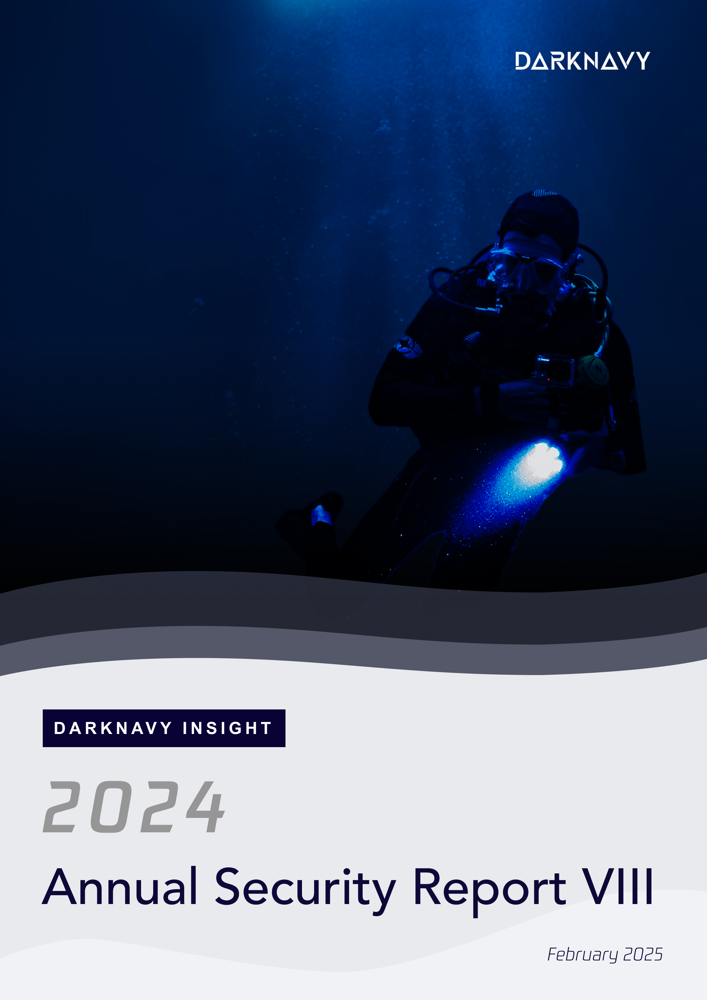
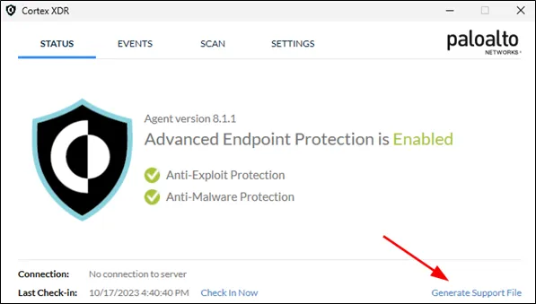
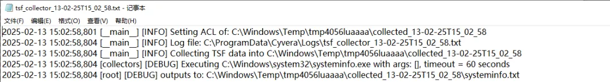
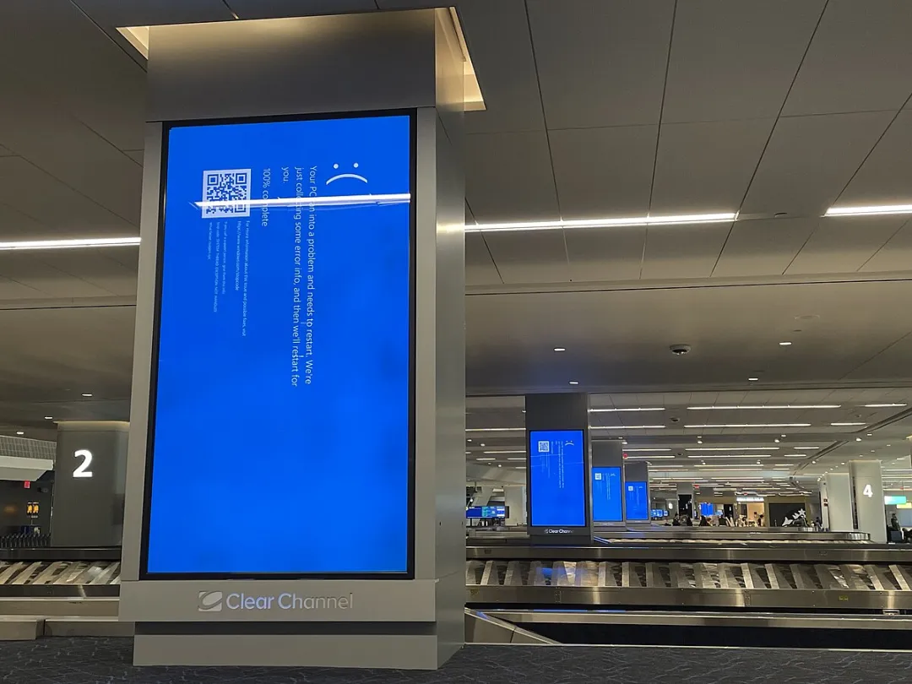

+++
title = 'The Most "Secure" Defenders of 2024'
date = 2025-02-15T17:54:34+08:00
draft = false
images = ["attachments/e2e789da-ca85-4e1f-8977-cc0b82136a79.png"]
+++

In the increasingly intense offense and defense confrontation of 2024, security software has always been regarded as an important cornerstone of the corporate security defense line. However, these security softwares themselves may also have vulnerabilities and could be exploited by attackers as a springboard for intrusions to harm users. Over the years, incidents caused by security software have raised a question — can security software really be trusted?

The following is the **eighth article** of the **"DARKNAVY INSIGHT | 2024 Annual Security Report"**.

 

## Security softwares are being abused by attackers

In the current environment where APT (Advanced Persistent Threat) organizations are frequently active, EDR/XDR has become a core component of enterprise security defense systems, responsible for monitoring millions of endpoints and servers. However, with great power comes great responsibility. These security software solutions, once they have security vulnerabilities, may become weapons in the hands of attackers for deploying ransomware and stealing sensitive information, which are difficult to detect and remove.

Recently, security researchers at SCRT discovered a privilege escalation vulnerability (**CVE-2024-5907**) in Palo Alto Networks Cortex XDR products through reverse engineering and dynamic analysis. On devices protected by Cortex XDR, users can request a Cortex service (cyserver.exe) to generate logs used by administrators to troubleshoot potential issues with agents.

 

The core of the **CVE-2024-5907** vulnerability is leveraging the log generation mechanism of Cortex XDR to achieve privilege escalation. The cyserver.exe service runs with SYSTEM privileges, and attackers can use a non-privileged user to request it to generate logs. During log generation, this service creates temporary folders in the `C:\Windows\Temp` directory, with names following a predictable `tmp<process PID><incrementing ID>` pattern, where the ID increments based on dictionary order and can be inferred from historical log files, allowing attackers to predict the paths of future temporary directories.

 

These temporary folders inherit the loose access control list of `C:\Windows\Temp`, so all users have write permissions, enabling attackers to preemptively create malicious NTFS Junction soft link at the predicted path, redirecting that directory to a **high-privilege sensitive location**, such as `C:\Config.msi`. The specific attack process is as follows:

* First, when the cyserver.exe service performs cleanup for log generation, it recursively deletes the temporary files. However, it does not adequately validate the paths when handling Junction links, and directly deletes the target directory pointed to by a Junction link with SYSTEM privileges, thereby erroneously deleting files in the critical system directory `C:\Config.msi`.
* Secondly, attackers further exploit a race condition vulnerability in the Windows Installer service when handling the `C:\Config.msi` folder, by repeatedly triggering log generation and directory deletion operations, interfering with the system's locking mechanism for the Config.msi resource.
* Lastly, when the Windows Installer service attempts to recreate the directory, a file writing process can be hijacked, which causes executing operations with SYSTEM privileges, achieving local privilege escalation.

A successful exploitation of this vulnerability heavily relies on multiple race conditions, such as the accuracy of predicting temporary directory names, the precise timing of soft link injection, and the synchronization of file deletion operations. Although the exploitation process may need multiple attempts, this vulnerability remains highly dangerous. It means that under circumstances where user permissions are limited, attackers can infiltrate seamlessly, bypassing the layers of protection provided by XDR, directly threatening sensitive data and critical infrastructure within the corporate intranet, rendering security software's defenses ineffective.

## A Global Software Protection Disaster

On July 19, 2024, the well-known American cybersecurity company CrowdStrike caused the crash of millions of computers worldwide due to the distribution of abnormal updates, severely impacting operations in sectors such as aviation, banking, and media, with expected losses of billions of dollars globally.

CrowdStrike offers a range of security softwares to help customers protect their computers from cyberattacks. Its Falcon Sensor installs sensors at the kernel level of the Windows operating system to detect and prevent cyberattacks, and this special protection is a significant reason for this incident. When security software gains **kernel privileges**, its protective capabilities are greatly enhanced, but the risks also increase —if an issue occurs, the impact on users can be exceptionally severe.

Despite CrowdStrike's official claim that this incident is not a security vulnerability but a driver error, this event undoubtedly serves as a wake-up call for users: **even the top security software can lead to unpredictable disasters due to its own flaws.**

 

## "Backdoor" on the defense line

In 2024, Fortinet's FortiManager (a tool for centralized management of FortiGate devices) product experienced a serious CVSS 9.8 vulnerability ("FortiJump" **CVE-2024-47575**), which is an authentication vulnerability in the FortiGate to FortiManager (FGFM) daemon (fgfmsd) due to the lack of authentication in FortiManager and FortiManager Cloud.

By exploiting the FortiJump vulnerability, unauthenticated remote attackers can register unauthorized devices in FortiManager using valid FortiGate certificates, allowing the attackers to execute arbitrary code or commands through specially crafted requests.

The official announcement from Fortinet also acknowledges: "The FortiManager fgfmd daemon has a serious functional authentication vulnerability that may allow remote unauthorized attackers to **execute arbitrary code or commands** through specially crafted requests." According to a recent report by Mandiant, the FortiJump vulnerability has been widely exploited in 0Day attacks since June 2024, affecting more than 50 potentially compromised FortiManager devices across various industries.

This is not the first time a vulnerability has appeared in Fortinet's products. Previously, there were vulnerabilities such as the Fortinet FortiOS directory traversal vulnerability (**CVE-2018-13379**), the Fortinet firewall authentication bypass vulnerability (**CVE-2022-40684**), and the formatting string vulnerability in Fortinet FortiGate SSL VPN (**CVE-2024-23113**). **This time, the FortiJump vulnerability once again raises the question: Is security software really secure?**

**Vulnerabilities of Security Software**

Vulnerabilities in security software are not uncommon; this is not just an incidental issue on a technical level but also a persistent security challenge. Amid the trend of escalating attack and defense technologies, vendors are committed to updating and optimizing their security products, yet attackers' exploitation of vulnerabilities has never ceased. The following vulnerabilities not only highlight the technical complexity of security products but also reflect the **long-term nature and dynamism** of the confrontation between attack and defense:

* In 2015, ESET NOD32, the only product in history to achieve 100 VB100 awards, had a heap-based buffer overflow in its archive support module that allowed remote attackers to execute arbitrary code via a type of SIS_FILE_MULTILANG in the EPOC installation file. (**CVE-2015-8841**)
* In 2017, a Russian company with over 25 years of experience in the security industry, Kaspersky, discovered a memory corruption vulnerability in its product Kaspersky Embedded Systems Security (KESS), which is used to secure embedded systems, allowing attackers to achieve local privilege escalation through one of its drivers. (**CVE-2017-12823**)
* In 2021, there was an improper permission management vulnerability in the maconfig of McAfee Agent for Windows that allowed local users to access sensitive information. This program could be run by low privilege users anywhere on the file system. (**CVE-2021-31836**)
* In early 2025, Ivanti's Connect Secure product had a stack buffer overflow issue that allowed remote unauthenticated attackers to achieve remote code execution. (**CVE-2025-0282**)

 

Security protection software delves deep into the operating system's core to achieve better protection effects and possesses system permissions. However, once such high-permission security software is breached, attackers can use its permissions to execute arbitrary operations.

These security incidents are not isolated cases but instead raise a deeper question: **Why does the security software, which is at the core of defense, frequently become a breakthrough point for attackers?**

With the continuous development of technology, security protection is gradually shifting from single-point defense to a multi-layered, multi-dimensional comprehensive system, but this inevitably leads to an increase in the complexity of security software. As an important part of the defense system, the security of the software itself is directly related to the overall security of the system, and the future development of security software needs to achieve a better balance between functionality and security.

---

## DARKNAVY INSIGHT

As a tool for security protection, this software was originally designed to fend off threats, but in the complex and ever-changing network environment, it can ironically become a breakthrough for attackers. From historical vulnerabilities to newly discovered exploits, all of these reflect the dynamic reality of the spiral of offensive and defensive confrontation.

This phenomenon not only reveals the vulnerabilities of security software in specific situations but also indicates that this is not a temporary issue, but rather a persistent challenge that permeates the entire industry, reminding us that we must reexamine network security defense strategies from a more comprehensive and in-depth perspective.

---

## References

* \[1\] [https://blog.scrt.ch/2024/12/05/attacking-cortex-xdr-from-an-unprivileged-user-perspective/]()
* \[2\] <https://en.wikipedia.org/wiki/2024_CrowdStrike-related_IT_outages>
* \[3\] [https://www.anquanke.com/post/id/301285]()
* \[4\] [https://security.paloaltonetworks.com/CVE-2024-5907]()
* \[5\] [https://www.fortiguard.com/psirt/FG-IR-24-423]()
* \[6\] [https://www.tenable.com/blog/cve-2024-47575-faq-about-fortijump-zero-day-in-fortimanager-fortimanager-cloud]()