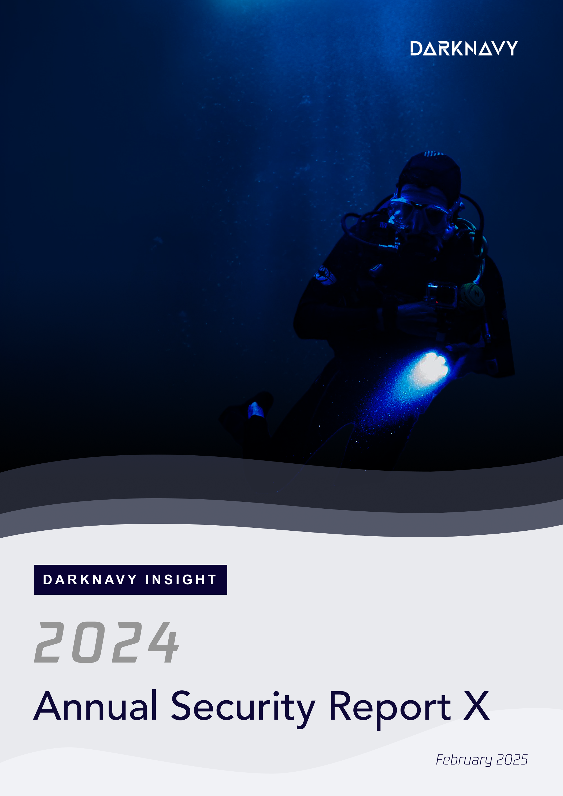
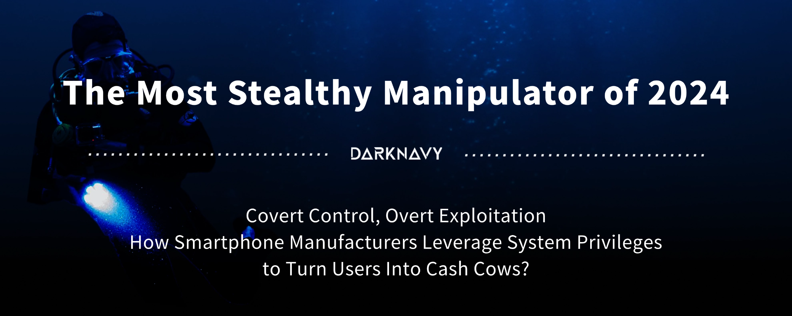
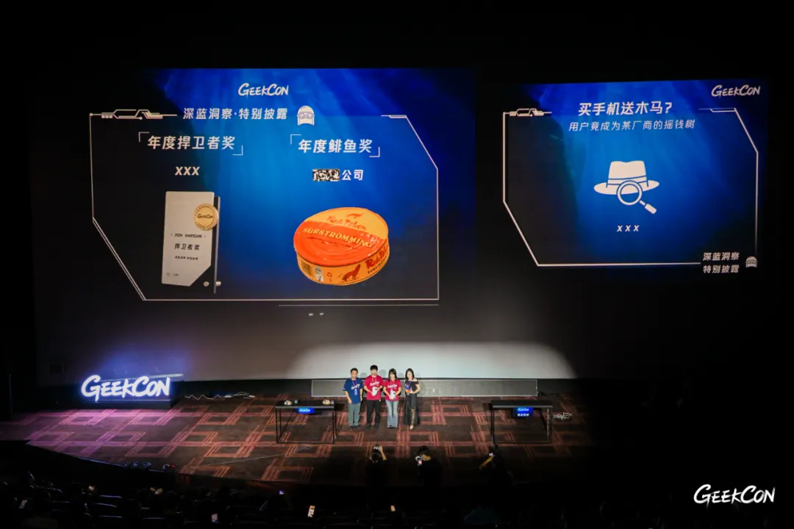
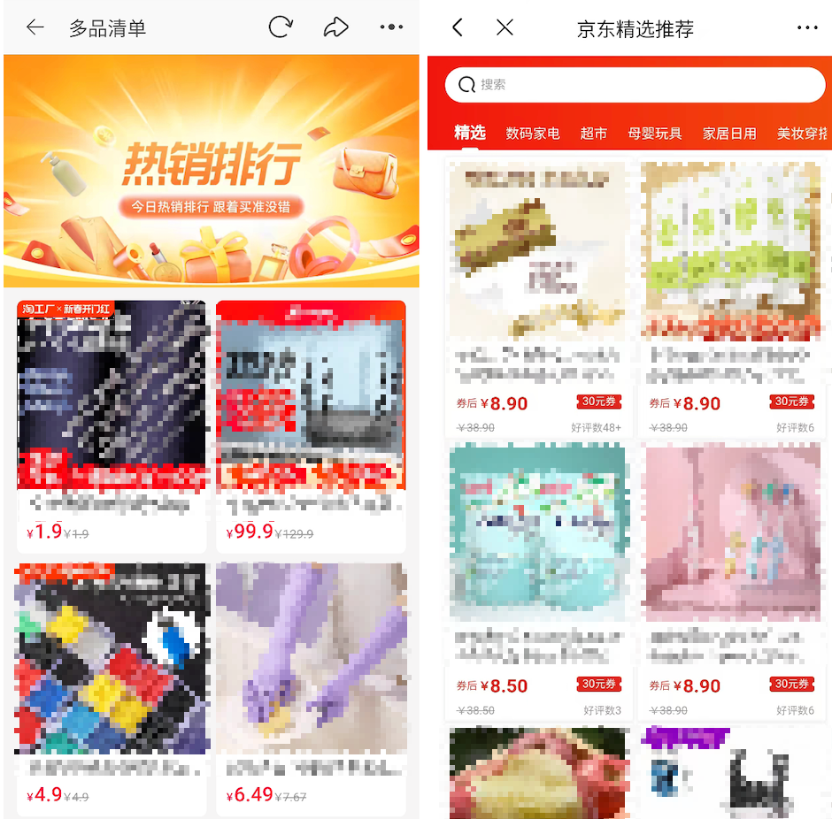
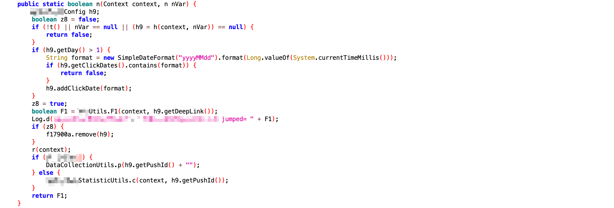
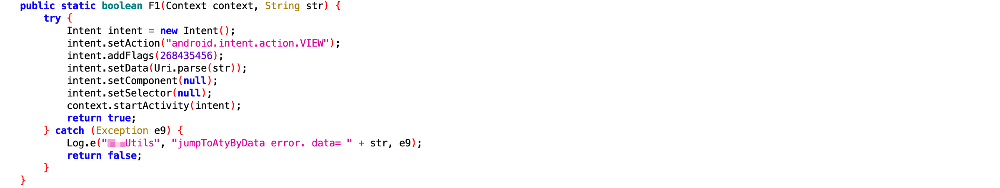

+++
title = 'The Most Stealthy Manipulator of 2024'
date = 2025-02-17T18:00:44+08:00
draft = true
images = ["attachments/6f4d6b51-fae4-472f-8cc9-f4c9b7340655.png"]
+++

In the era of mobile internet, user traffic is the lifeline of manufacturers. In this battle for traffic, smartphone manufacturers hold the most overwhelming advantage — ultimate control over the operating system. By deeply customizing AOSP, manufacturers not only gain precise control over user and app activities but can even manipulate and interfere with user choices.

Ordinarily, few companies would choose to violate regulations and abuse their privileges to harm consumers. However, in 2024, a well-known Chinese smartphone brand crossed the ethical bottom line of business. By leveraging non-security technological means, it covertly manipulated its own smartphone system, turning millions of users into mere tools for profit.

The following is the tenth article of the "DARKNAVY INSIGHT | 2024 Annual Security Report".

 

For Chinese Android gaming enthusiasts, this scenario may be familiar: when attempting to download a game from its official website, the system persistently pushes the built-in app store's download link, appearing "helpful". However, if you insist on downloading from the official site, the process becomes unnecessarily complicated and tedious. You must repeatedly reject the app store's recommendations, ignore multiple security warnings, and endure additional security scans.

Why is it that downloading from the official site involves such a hassle, while using the app store allows for a seamless one-click installation?

The answer lies in the financial interests of smartphone manufacturers. If they successfully steer users into downloading games via their app stores, they can take a 20-30% cut from the game's revenue, sometimes even splitting it in equal parts. However, if the game is installed directly from the official website, the game developer retains 100% of the revenue.

Thus, manufacturers optimize the user experience of their own app stores while deliberately making other download methods more difficult, subtly funneling user traffic to maximize their profits.

This form of traffic manipulation still falls within the realm of overt commercial competition. However, some manufacturers have gone further, secretly exploiting system privileges for more concealed and malicious activities, completely disregarding business ethics.

 

At *GEEKCON 2024 Shanghai*, two participants delivered a special disclosure session titled **["Buy Phone, Get Trojan Free"](https://mp.weixin.qq.com/s/FegV2RuyNT0uwIb2QEnmWA)**, exposing the unethical practices of a Chinese smartphone manufacturer. This company leveraged system privileges to insert advertisements into multiple third-party apps without user consent. While millions of users suffered degraded experiences, the smartphone manufacturer pocketed tens of millions in ad revenue from app companies.

On this brand's smartphones, some apps exhibited highly unusual behavior: When a user tapped an app icon on the home screen, instead of being taken to the app's homepage after the splash screen, they were redirected to an **ad-filled page**. Only by pressing the back button could they finally access the actual app homepage, significantly degrading the user experience.

At first glance, it might seem as though the app itself was serving an unskippable splash ad. However, the truth is far more insidious: the smartphone manufacturer **hijacked the user's tap action**!

The targeted apps all shared a common trait: their business model included an affiliate marketing mechanism, meaning they were willing to pay for external traffic referrals. Normally, external promoters distribute tracking links with embedded parameters. When a user clicks one of these links, they are redirected to a relevant in-app landing page. The app then identifies the traffic source via the referral code and compensates the promoter accordingly.

The "ad-filled pages" users encountered were, in fact, these promotional landing pages. This means the manufacturer **replaced the** **user-initiated** **app launch** **with a referral launch, thereby profiting from the app's affiliate program!**

 

According to Android system standards, when tapping an app icon on the home screen, the app should launch the Activity registered in AndroidManifest.xml with the flags `android.intent.action.MAIN` and `android.intent.category.LAUNCHER`. The promotional page clearly does not meet these criteria.

Observing the example images, small browser-like buttons are visible on sides of the page title, indicating that the page is actually a webview loaded within the app's built-in browser. Such page can be easily load using **Deep Links**.

> **Deep Links** are special URLs designed for seamless app-to-app navigation, content sharing, and marketing conversions. They enable direct access to specific in-app pages or functions rather than just launching the app's main interface.

So, how did this manufacturer modify system logic to execute this hijack? By analyzing their home screen launcher, we discovered that:

The manufacturer customized its home screen launcher based on `Launcher3` of AOSP, but **inserted additional logic** into `ItemClickHandler.onClick`, the function handling tap events.\nBefore starting an app, the launcher checks whether a hijacking rule exists for the original intended Activity. If a match is found, the app will be launched via the **Deep Link** specified, resulting in directly opening a promotional page instead of the homepage. If no match is found, then the launcher fallbacks to normal luanching process.\nTo prevent repeated hijacking, the launcher removes any used rules after activation, therefore the hijack for each targeted app only occurs at the first launch. This also makes users more likely to mistake it for a built-in splash ad, directing their frustration at the app rather than the manufacturer.

 

 

 

These stealthy actions not only undermine fair competition but also **severely infringe on user rights and app companies' interests**, potentially violating relevant laws and regulations.

> Article 12 of ***Anti-unfair Competition Law of the People's Republic of China*** explicitly prohibits businesses from performing acts that impede or disrupt the normal operation of network products or services legally provided by other business operators, by taking advantage of technical means to influence users' choices or otherwise.

Similar to [another major violator previously exposed by DARKNAVY INSIGHT](https://mp.weixin.qq.com/s/P_EYQxOEupqdU0BJMRqWsw), the manufacturer in this case deployed several technical obfuscation methods to cover its tracks.

The Deep Link hijacking rules were not preloaded onto devices but dynamically pushed from the manufacturer's servers based on specific conditions.

GEEKCON participants found that, not all of this brand's devices received the hijacking rules, suggesting the manufacturer may have targeted users based on profile data, geographical location, or other factors to **aim at less tech-savvy users in smaller cities**.

What's more, the hijacking rules were stored in the luancher's private data directory, making external extraction difficult due to Android sandbox protections. Remote pushing capabilities also allowed the manufacturer to erase evidence, complicating tracking and forensic efforts.

We assume we are using our smartphones freely, but every step could be a meticulously designed trap.

> **Flanker, Senior Director and Chief Security Researcher of JD Group and a member of the GEEKCON Organizing Committee** said:
>
> Memory corruption vulnerabilities, despite their complexity, can still be mitigated with advanced techniques. However, security and privacy risks stemming from business models are like deeply rooted ailments, much harder to eradicate. As the saying goes, "Defeating an external enemy is easy; conquering internal desires is hard." Technology, in its purest form, is neutral — it is merely a tool shaped by human intent. Yet, the depths of human ambition and morality are an unfathomable abyss, where the line between right and wrong often blurs.

---

## DARKNAVY INSIGHT

The mission of digital technology should be to bring convenience and well-being to people, fostering a win-win relationship between users and manufacturers. When technology is misused—or worse, weaponized for private gain—it not only harms users' rights but also erodes the foundation of trust in the entire ecosystem.

Why has iOS become synonymous with security and privacy? It is not just due to its tightly integrated hardware and robust security framework but also because of its ecosystem's strong emphasis on privacy protection and its restrained approach to commercialization. Apple's high hardware profit margins may indeed enable its privacy-focused stance, but from another perspective, this restraint has cultivated immense brand loyalty and consumer willingness to pay a premium.

Today, with the rise of next-generation operating systems like **HarmonyOS NEXT**, the industry faces new challenges and opportunities. Will these systems withstand external pressures and avoid repeating past mistakes, genuinely protecting users' security and privacy? Can major manufacturers engage in self-reflection and emulate the best practices of iOS? These are critical questions that consumers and industry stakeholders alike are eager to see answered.

---