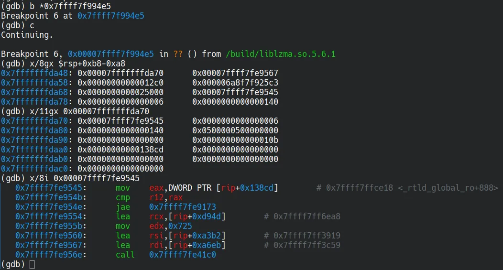

+++
title = 'The Most Unfortunate Backdoor of 2024'
date = 2025-02-13T17:07:28+08:00
draft = true
images = ["attachments/f4924b5c-b046-42e2-9f80-45f00f4a132c.png"]
+++


> Does open source guarantee that there are no backdoors?

At the 1983 Turing Award ceremony, Ken Thompson raised this question. As one of only three legends to win the Turing Award before the age of 40, he demonstrated how to hack Unix systems compiled from harmless source code by implanting backdoors in compilers, remaining a tale frequently cited by hackers to this day.

In 2024, the XZ backdoor incident resurfaced this question. Under the nose of the open-source community, attackers successfully pushed the backdoored xz-utils 5.6.1 package into official repositories of several distributions like Debian and Fedora. Fortunately, engineer Andres Freund discovered and reported the abnormal behavior of xz-utils 5.6.1 in time. Although the community effectively stopped the backdoor's spread, this heart-stopping crisis made every open-source user rethink the trust model in collaborative development.

In this report, we will analyze the XZ backdoor from a technical point of view, from how it was planted to how it was discovered.

The following is the sixth article of the "DARKNAVY INSIGHT | 2024 Annual Security Report".

 


-----

## XZ backdoor: The Collapse of Trust in the Open-Source World

Launched in 2005 by Lasse Collin and others, the XZ project gradually became the default compression tool for many open-source projects like Linux Kernel and FreeBSD. Some critical components like `openssh-server` (on some distributions like Debian) rely on its `liblzma` library directly or indirectly. However, a document from 2013\[1\] already mentioned that Lasse's "personal issues" caused slow project maintenance - making this widely used but under-maintained software an ideal target.

After identifying the target, attackers started the hunt:

* **Oct 2021**: An account named "Jia Tan" submitted patches to xz-devel mailing lists, describing himself as a "helper elf"\[2\]. He has also committed contributions to projects like `wasmtime` and `cpp-docs`, earning initial trust from Lasse.
* **May 2022**: The attackers, using the accounts named "Dennis Ens" and "Jigar Kumar", repeatedly complained on the mailing list about the slow progress of the project, pressuring Lasse to delegate more tasks to the "helpful" Jia Tan.
* **Dec 2022**: Jia Tan merged several patches into the XZ, proving that **the attackers had already obtained code modification privileges for the XZ repository.**
* **Jun 2023**: An account named "Hans Jansen" submitted a patch that employed glibc's indirect function (`IFUNC`) mechanism to select the CRC function, laying the groundwork for the subsequent backdoor.
* **Feb 2024**: Jia Tan merged a batch of binary test files containing the backdoor and released version xz-5.6.0 with a trigger script **included in the Debian unstable repository**. At the same time, Jia Tan emailed Fedora 40 maintainers to request an upgrade of the xz package.
* **Mar 4, 2024**: The RedHat community reported\[3\] a bug in `liblzma`, with Valgrind's output pointing to the backdoor entry function `_get_cpuid`. Attackers quickly released `xz-5.6.1` with two "bugfix" patches: the first being a disguised patch claiming to fix the bug, and the second a binary patch that actually fixed the bug in the backdoor. For the latter, Jia Tan claimed the modification was due to switching to new test data generated with a deterministic random seed.
* **Mar 28, 2024**: Several accounts led by Jia Tan complained on the Debian/Ubuntu bug list, pushing for the upgrade of the xz package in Debian to the backdoored `xz-5.6.1`. On the same day, engineer Andres Freund discovered the abnormal behavior in `liblzma-5.6.1` and reported it to the Debian community.

In order to implant a backdoor into a widely used open-source software like XZ without getting noticed, the attackers carefully designed and prepared the attack beyond the technical aspects:


1. **Long-term infiltration:** Advancing the plan on a semi-annual cycle to minimize suspicion and reduce the risk of exposure.
2. **Social engineering:** Leveraging Jia Tan's identity as a trusted contributor while deploying multiple forged user accounts to psychologically manipulate and pressure the maintainers.
3. **Distributed poisoning:** Fragmenting malicious code into smaller components, embedding them within routine contributions, and submitting them gradually under multiple identities.
4. **Psychological Exploitation**: Targeted maintainer burnout and users' blind trust in source-binary consistency.

The attack alerted us to rethink the trust architecture beyond technical security: How can we rebuild resilient, sustainable trust models between humans, technologies, and systems?

> The open-source community continues to function collaboratively. Yet, if these trust vulnerabilities remain unaddressed, what happens when the next Jia Tan emerges?

## "A near miss" — Bad Luck or Skill Issue?

Nine months have passed since the disclosure of the XZ backdoor, there is no lack of reverse engineering of how it works on the Internet\[4,5\]. However, a mystery remains: after the attackers spent more than two years meticulously hiding the backdoor, why was it discovered in such a short time?

Andres Freund mentioned on social media that he initially only noticed that a malicious attacker was **brute-forcing the server's SSH password**, which resulted in abnormally high CPU usage. He conducted a performance analysis on `sshd` and discovered that after updating `liblzma.so`, the processing time per SSH connection increased from 0.3 seconds to 0.8 seconds. Recalling a Valgrind report he had seen earlier by chance, Andres delved into an in-depth analysis of the `liblzma.so` in `xz-5.6.1` and its source build scripts, ultimately identifying the implanted backdoor.

 

However, prior reverse engineering analyses indicate that the backdoor in XZ 5.6.1 operates by intercepting the RSA decryption function and executing commands based on fields in the SSH client's certificate - **password logins will not trigger it** \[4\]. Why, then, did brute-force password attempts expose anomalies?

To reproduce Andres' discovery process, we used `perf` to conduct a performance analysis on `sshd`. It was evident that the backdoored `liblzma.so` was consuming an abnormally high amount of computational resources.

 

After further analyzing the hot instruction at `liblzma.so:0x2bbb0`, we discovered that it was located in an **x86_64 instruction disassembler** function in the backdoor. This disassembler parses x86_64 instructions, once upon a time, at a given memory address. Invoked by other higher-level functions, it helps to locate function gadgets or global structures in stripped `sshd` and `ld` based on assembly pattern matching.

For example, during the initialization phase, the xz backdoor needs to modify the global variable `dl_audit` to a forged `audit_iface` structure, enabling it to hijack the `symbind64` function. To determine the address of `dl_audit`, it scans `ld`'s memory for the `MOV reg, DWORD PTR [RIP+imm]` instruction in `dl_main` function and parses the referenced memory offset.

 

Interestingly, the analysis revealed a "flaw" in the disassembler: while some higher-level functions advance the memory address based on the parsed instruction length, the disassembler's internal implementation simply sets the length of each parsed instruction (a field in the parse result structure) to **zero**. As a result, the backdoor almost always disassembles the target binary **byte by byte** instead of instruction-by-instruction, leading to excessive runtime overhead.

 

In addition, there are also pattern-matching functions that explicitly call the disassembler byte-by-byte.

 

Dynamic analysis shows that the disassembler function was invoked **9.44 million times**. In each call, the instruction `liblzma.so:0x2bbb0: rep stosd`—used at the very beginning to initialize the parsing result structure—is executed 22 times. That single line of code is therefore executed over **200 million times**, causing `liblzma.so` to stand out in the `perf` output. We deduce that the implementation flaws in the disassembler and its pattern-matching callers are the root cause of the massive resource consumption by the backdoor during runtime.

We boldly speculate that the attacker may have assumed that the extensive invocation of the disassembler would occur only once during `ld`'s execution, impacting performance only at `sshd` startup. However, starting from version 3.9, openssh-server by default adopts a `re-exec` mode, in which every child process of `sshd` will call `execv` to reinitialize the process address space \[6\]:

```c
static int rexec_flag = 1;
...
/* This is the child processing a new connection. */
setproctitle("%s", "[accepted]");

/*
 * Create a new session and process group since the 4.4BSD
 * setlogin() affects the entire process group.  We don't
 * want the child to be able to affect the parent.
 */
...

if (rexec_flag) {
...
    execv(rexec_argv[0], rexec_argv); // Make sshd(8) re-execute itself on accepting a new connection.
```

Consequently, Whenever a new ssh client tries to connect, `sshd` re-executes the entire initialization process of the backdoor code, consuming about 0.5 seconds of CPU time. We conducted SSH brute-force tests on `sshd` and confirmed that the backdoored version exhibited dramatically higher CPU usage than the clean version (**9.6% vs. 0.7%**).

 

Therefore, when another group of attackers attempted to brute-force SSH passwords during Andres' usage, the extra CPU consumption caught his attention immediately and eventually led to the exposure of the backdoor.

 

By now we have finally confirmed the root cause behind the rapid discovery of the XZ backdoor. As one of the most (nearly) successful open-source supply chain attacks in recent years, Jia Tan's "failure" highlights a key takeaway for attackers: Your code must survive stress testing.

> This time, luck was on our side. But what if the attacker had been patient enough to optimize their code further?


---

## DARKNAVY INSIGHT

Beyond XZ, 2024 also witnessed incidents such as CrowdStrike's global BSOD and the pager explosion in Lebanon. Unlike EternalBlue or Log4j, these threats exploit trust chains more than technical vulnerabilities. On the other hand, the exploitation of traditional binary vulnerabilities such as memory corruption has become increasingly difficult due to the widespread adoption of various hardware and software mitigations, further pushing security researchers into new domains. In this asymmetric battlefield, redefining security boundaries and building resilient trust architectures become a challenge for every security researcher.


---

## References

* \[1\] <https://github.com/kobolabs/liblzma/blob/87b7682ce4b1c849504e2b3641cebaad62aaef87/doc/history.txt>
* \[2\] <https://www.mail-archive.com/xz-devel@tukaani.org/msg00518.html>
* \[3\] <https://bugzilla.redhat.com/show_bug.cgi?id=2267598>
* \[4\] <https://securelist.com/xz-backdoor-story-part-1/112354/>
* \[5\] [https://gist.github.com/smx-smx/a6112d54777845d389bd7126d6e9f504](https://gist.github.com/smx-smx/a6112d54777845d389bd7126d6e9f504)
* \[6\] <https://sources.debian.org/src/openssh/1%3A9.2p1-2%2Bdeb12u4/sshd.c/#L2200>