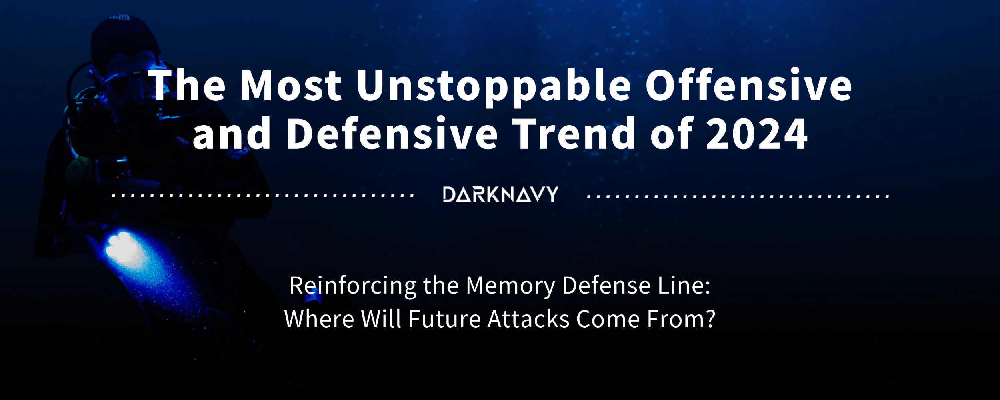
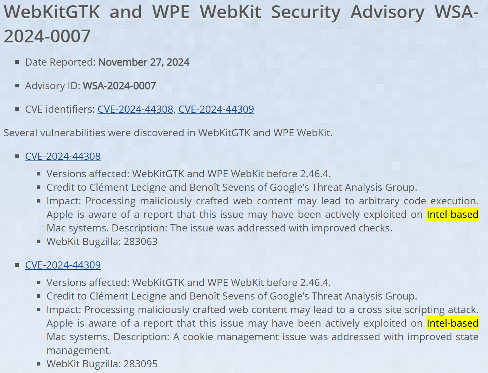
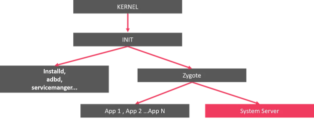
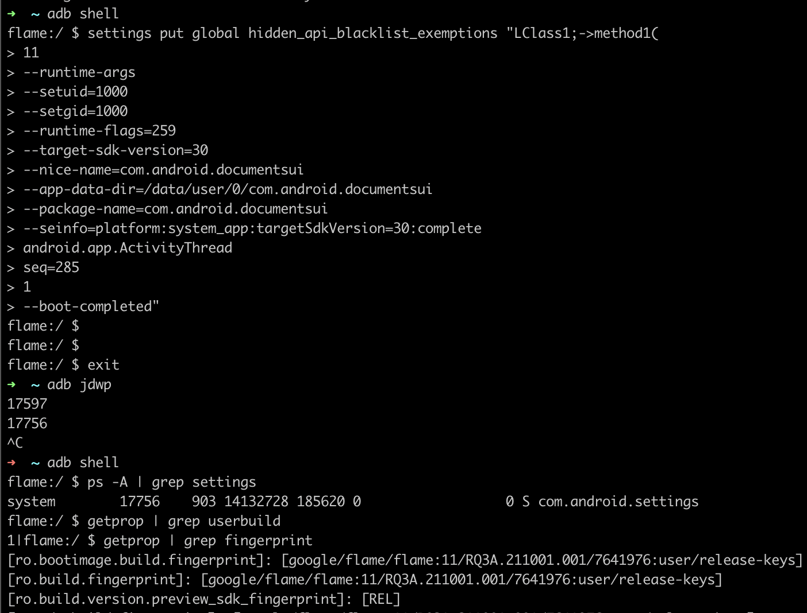

+++
title = 'The Most Unstoppable Offensive and Defensive Trend of 2024'
date = 2025-02-14T17:47:00+08:00
draft = false
images = ["attachments/83d545c3-11db-4b85-97cb-926c59a7f1b7.png"]
+++

In recent years, the evolution of vulnerabilities and defense techniques has been continuous. From the days when a simple stack overflow could compromise a system, to the present day, where sophisticated techniques are necessary to bypass multiple layers of defense. The "shield" and the "spear" are in dynamic confrontation: whenever new defense measures are introduced, new attack methods emerge in response. The enhancement of defense mechanisms compels attackers to seek out new vulnerabilities, while the innovation of attack techniques propels the development of defense technologies

The following is the seventh article of the "DARKNAVY INSIGHT | 2024 Annual Security Report".

 

---

## The increasingly resilient "shield"

Each defense mechanism introduced is a targeted response to the exploitation of memory vulnerability exploitation. Years ago, the introduction of ASLR significantly heightened the difficulty and complexity of exploiting vulnerabilities. To this day, bypassing ASLR remains the primary step in most exploitations. By 2024, defense mechanisms aimed at preventing memory corruption have become increasingly diverse.

The Google Pixel 8, released in 2023, supports the Memory Tagging Extension (MTE) feature, which is regarded as the "ultimate weapon against memory issues". MTE, a hardware feature added in ARM v8.5, associates pointers with memory utilization tags to prevent illegal memory access. This marks the first time MTE has been introduced to consumer devices. **In January 2024, security researchers from DARKNAVY published a [research](https://www.darknavy.org/blog/strengthening_the_shield_mte_in_memory_allocators/) on the impact of MTE on software security**. The research demonstrated that MTE effectively mitigates heap memory vulnerabilities (such as UAF, heap out-of-bounds reads/writes, etc.), and nearly eliminates the potential for exploitation in linear overflow scenarios. As a long-time victim of UAF vulnerabilities, Google has also introduced the MiraclePtr mechanism for Chrome, confidently asserting that UAF vulnerabilities protected by MiraclePtr are no longer considered security flaws.

As one of the most widely used operating systems, Linux has also introduced various defense measures in recent years to prevent memory corruption exploits. To address heap memory corruption in the kernel,the Linux Kernel has implemented a series of defense mechanisms, including "SLAB VIRTUAL," "RANDOM_KMALLOC_CACHES," and "AUTOSLAB". To enhance the security of user-space program, the Linux Kernel 6.10 introduced the mseal syscall (memory seal), which allows developers to protect memory regions from illegal modifications during program execution.

So, do these various defense mechanisms effectively prevent certain exploits?

In November 2024, Apple disclosed two in-the-wild exploits targeting WebKit; however these exploits were limited to Intel-based Mac devices. Why were these vulnerabilities only exploited on earlier system versions in 2024? This is likely due to the advanced defense mechanisms present in M-series chips, which effectively prevent attackers from exploiting these vulnerabilities.

 

From software to hardware, and from user space to kernel space, memory vulnerabilities have become increasingly challenging to exploit, even with layered defense mechanisms in place. All indications suggest that the prevalence of memory vulnerabilities may be nearing its conclusion.

## The "spear" of the future

Vulnerabilities will not disappear, and security issues continue to persist. In an era where memory vulnerabilities are declining, what does a "powerful" vulnerability and its exploitation entail?

In June 2024, Meta's Red Team disclosed the vulnerability CVE-2024-31317, which allows attackers to execute arbitrary code under any application identity. This vulnerability can be exploited on Android 9 and later versions, resulting in a system-wide compromise of the Android operating system.

It is important to note that CVE-2024-31317 is not a memory corruption vulnerability; rather, it is a command injection vulnerability in Zygote. Zygote is one of the core components of the Android system, responsible for spawning all processes in the Java world of Android, including the system_server.

 

In reality, Zygote receives instructions from the system_server through a command socket and spawns child processes based on those instructions. However, Zygote indiscriminately parses the buffer received from the system_server without conducting any additional validation. Consequently, if an attacker can manipulate the content written by the system_server into the command socket in a controllable manner, command injection can occur!

Researchers discovered that `denylistexemptions` provides this capability. In this mechanism, when `hidden_api_blacklist_exemptions` is modified, the newly written values are directly written into the Zygote command socket after parsing. As a result, controlling this value allows for command injection.

The diagram below illustrates one of the consequences of exploiting this vulnerability, which is to launch a debuggable injected settings process:

 

As we can see, this vulnerability does not involve memory corruption; however, it still affects numerous Android systems. The essence of this vulnerability lies in issues at the program logic level, and its impact is no less, or even greater, than traditional memory vulnerabilities. As the barriers to exploiting memory vulnerabilities continue to increase, non-memory-corruption vulnerabilities are gradually becoming the "shortcut" for attackers to achieve their objectives:

* In February 2024, the infamous "XZ Utils backdoor" incident was revealed, in which a malicious developer had infiltrated the community for years, eventually becoming the core maintainer and embedding a hidden backdoor into the project.
* In April 2024, the globally renowned firewall software PAN-OS was discovered to have a command injection vulnerability, identified as CVE-2024-3400. This vulnerability enabled attackers to achieve unauthorized RCE (Remote Code Execution) on devices running the system and gain root access.
* In June 2024, DEVCORE disclosed the vulnerability CVE-2024-4577, which reveals a parameter injection flaw in PHP-CGI running in Windows environments.
* In November 2024, WatchTower Labs disclosed the "FortiJump" vulnerability, highlighting a command injection flaw in the network management platform FortiManager.
* In December 2024, DEVCORE's Orange Tsai revealed at Black Hat EU 2024 the security risks associated with the Windows ANSI API. Numerous software applications failed to properly handle Windows' "Best-fit" feature, leading to path/filename, command line, and environment variable injection issues that potentially impacted all versions of Windows globally.

A bold prediction: Given the difficulty in exploiting memory vulnerabilities, the "spear" of the future may very well be concealed within various logic flaws and supply chain attacks.

---

## DARKNAVY INSIGHT

As memory security defenses build layers of protection, attackers' "spears" have subtly transitioned to more covert battlegrounds. "There is no such thing as a perfectly secure system" and memory security is gradually becoming the baseline for infrastructure. Security defenses now confront, more profound and systematic challenges: How can we establish trust verification mechanisms that encompass the software supply chain? How can we achieve automated security modeling for business logic? These will be the critical issues in next-generation security defenses.

Security confrontations are perpetual; they are continually reshaped across evolving dimensions. Security researchers must adopt a more comprehensive perspective on security boundaries. As memory corruption vulnerabilities approach their twilight, the fog of logic vulnerabilities begins to emerge at dawn.

---

## References

* \[1\]: <https://en.wikipedia.org/wiki/Address_space_layout_randomization>
* \[2\]: <https://source.android.com/docs/security/test/memory-safety/arm-mte>
* \[3\]: <https://www.darknavy.org/blog/strengthening_the_shield_mte_in_memory_allocators/>
* \[4\]: <https://blog.trailofbits.com/2024/10/25/a-deep-dive-into-linuxs-new-mseal-syscall/>
* \[5\]: <https://lore.kernel.org/lkml/20230915105933.495735-15-matteorizzo@google.com/>
* \[6\]: <https://chromium.googlesource.com/chromium/src/+/ddc017f9569973a731a574be4199d8400616f5a5/base/memory/raw_ptr.md>
* \[7\]: <https://webkitgtk.org/security/WSA-2024-0007.html>
* \[8\]: <https://support.apple.com/en-us/121752>
* \[9\]: <https://en.wikipedia.org/wiki/XZ_Utils_backdoor>
* \[10\]: <https://security.paloaltonetworks.com/CVE-2024-3400>
* \[11\]: <https://rtx.meta.security/exploitation/2024/06/03/Android-Zygote-injection.html>
* \[12\]: <https://devco.re/blog/2024/06/06/security-alert-cve-2024-4577-php-cgi-argument-injection-vulnerability-en/>
* \[13\]: <https://labs.watchtowr.com/hop-skip-fortijump-fortijumphigher-cve-2024-23113-cve-2024-47575/>
* \[14\]: <https://worst.fit/>
* \[15\]: <https://blog.flanker017.me/the-new-mystique-bug-cve-2024-31317/>