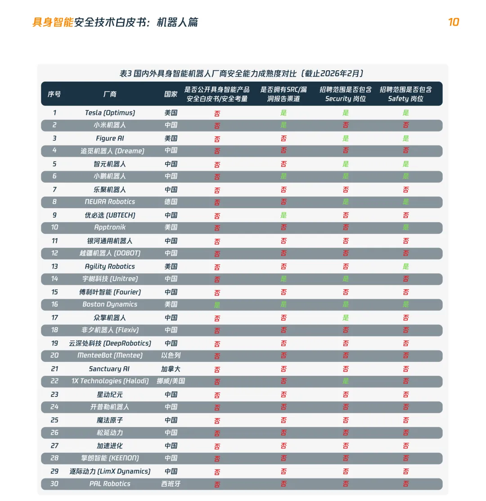
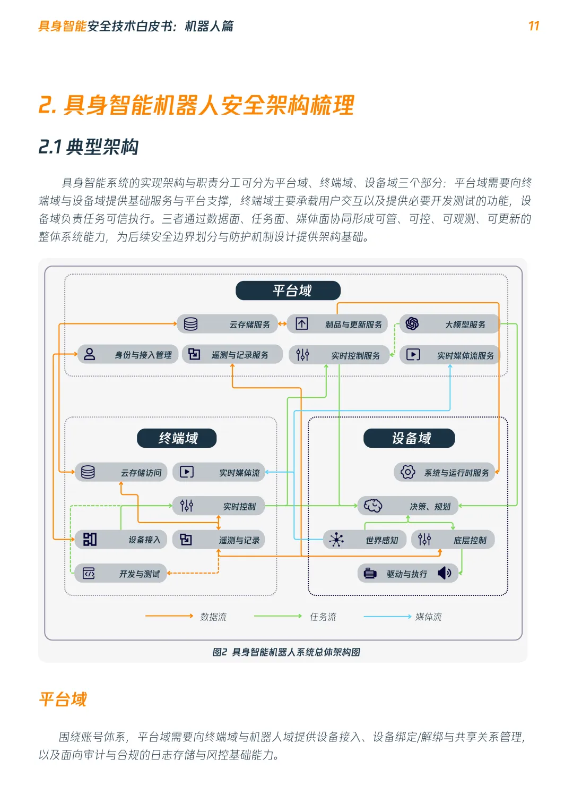
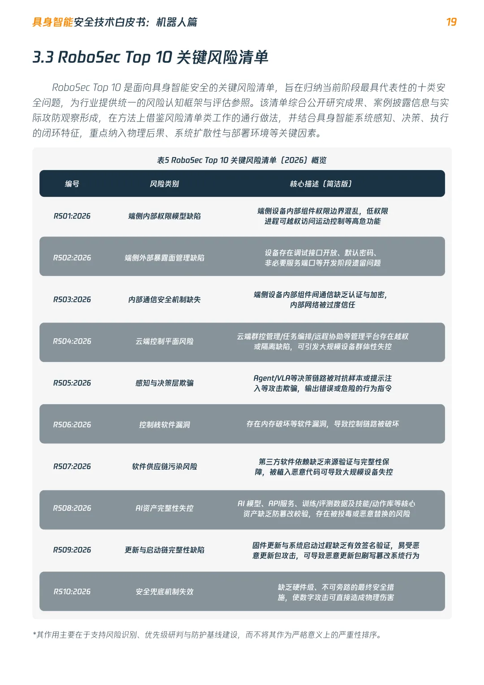

+++
title = 'DARKNAVY 联合发布首篇具身智能机器人安全技术白皮书'
date = 2026-04-20T12:07:45+08:00
draft = false
images = ["attachments/b9ae695a-d3b8-4a0f-b056-fd5af4bf5fc9.png"]
+++

随着具身智能进入现实世界，AI智能体获得了物理实体与自主执行能力。与此同时，数字领域的安全缺陷，正开始跨越虚实边界，转化为可作用于现实环境的物理风险。

在 DARKNAVY 以攻击者视角开展的模拟测试中，多台市面在售的知名品牌具身智能机器人，从获取设备、识别漏洞到实现完全控制，整体攻击周期不足8小时。这一数据表明，当前具身智能能力快速演进的同时，安全体系建设仍明显滞后。

基于长期攻防研究与实证分析，DARKNAVY 联合 CIIPA 关键信息基础设施安全保护联盟、数说安全正式发布 **《具身智能安全技术白皮书：机器人篇》**。

作为具身智能系列安全白皮书的首篇，本白皮书围绕机器人场景，首次对具身智能系统的攻击面、风险传导链路与评估框架进行了系统性梳理。

**一、具身智能机器人的安全问题，当前处于什么阶段？**

相较于传统智能终端，具身智能系统的攻击面更广，风险传播路径也更为复杂。然而，根据白皮书对当前国内主流产品的调研结果，其安全能力尚未达到早期智能终端与物联网设备的基础防护水位。行业已经开始形成安全意识，但系统化能力建设仍处于起步阶段。

**二、从感知到执行，具身智能机器人的攻击面分布在哪里？**

具身智能系统具备感知-决策-执行的闭环特征。白皮书对其典型关键架构进行了系统性拆解，从而帮助还原真实攻击路径，分析威胁如何突破控制平面、干扰感知输入、影响决策过程，并最终作用于底层执行单元

**三、当数字风险可能演化为物理后果，应当如何建立有效的风险评估与治理框架？**

针对日益突出的物理现实风险，白皮书第三章首次提出具身智能机器人风险评估的基础参考框架，并正式发布 《RoboSec Top 10 ：具身智能机器人十大关键风险清单》，覆盖端侧内部权限、云端控制平面、感知与决策层欺骗、AI 资产完整性等关键环节，为行业建立风险评估框架与安全基线提供参考。

\
当具身智能系统的能力从信息处理延伸至物理执行，安全治理的对象与边界也随之改变。数字世界中的单点缺陷，可能沿着跨层级、跨组件的链路被持续放大，最终演化为现实场景中的失控后果。也正因此，具身智能机器人的安全能力应前置到系统架构设计阶段，成为与感知、决策、执行同等重要的基础能力。

本白皮书希望通过对关键风险、攻击路径与防护重点的系统梳理，为行业开展风险识别、能力建设与体系化防护提供参考。

[《具身智能安全技术白皮书：机器人篇》](https://www.darknavy.net/whitepaper/Embodied-AI-Security-Humanoid-Robots-2604.pdf)现已正式发布，点击链接即可下载。
