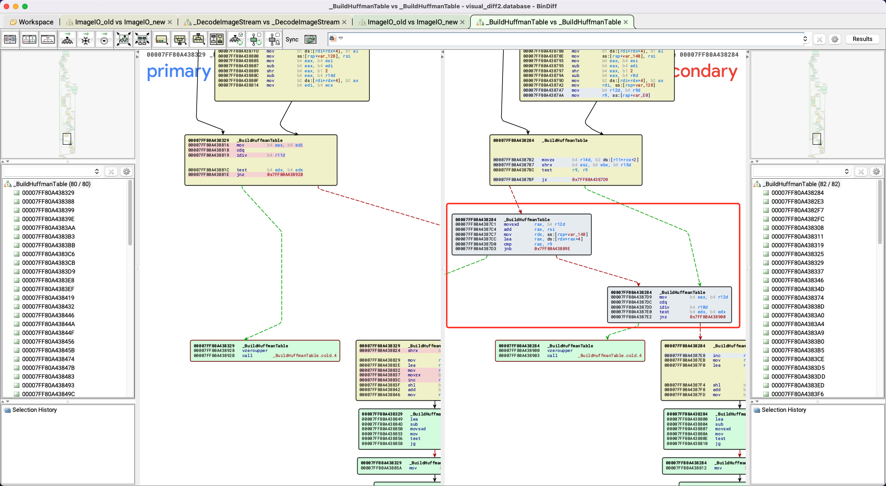
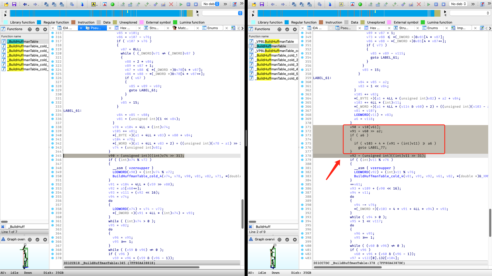
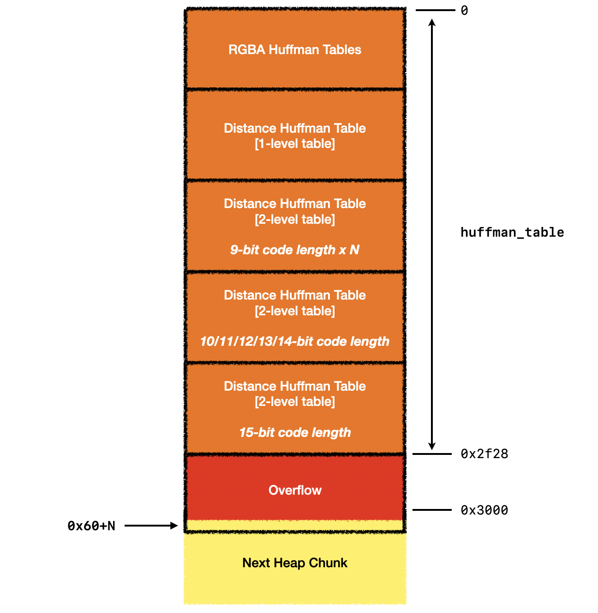

+++
title = 'Exploiting the libwebp Vulnerability, Part 1: Playing with Huffman Code'
date = 2023-11-03T14:10:24+08:00
draft = false
+++

## 漏洞定位

在初始的漏洞分析阶段，由于缺少现成的PoC或详细分析报告，我们首先尝试阅读并理解webmproject/libwebp上游仓库针对CVE-2023-4863的[修复代码](https://github.com/webmproject/libwebp/commit/902bc9190331343b2017211debcec8d2ab87e17a)。然而，WebM Project官方的修补过程相对复杂，这使得我们难以精确地锁定漏洞的原始触发点。

于是，我们将目光转向了Apple对CVE-2023-41064的官方补丁，并使用BinDiff对更新前后的ImageIO组件进行了对比。我们注意到Apple的补丁代码变更相对较少，易于理解，并且非常“简单粗暴”:





简而言之，Apple的修复方案是在WebP解码器中增加了一项检查：如果在构建霍夫曼编码表 (Huffman Table) 时越界，就会直接返回错误，而不是继续解码。

```diff
diff --git a/src/dec/vp8l_dec.c b/src/dec/vp8l_dec.c
index 45012162..06b142bc 100644
--- a/src/dec/vp8l_dec.c
+++ b/src/dec/vp8l_dec.c
@@ -438,6 +438,7 @@ static int ReadHuffmanCodes(VP8LDecoder* const dec, int xsize, int ysize,
     goto Error;
   }

+  bound = &huffman_tables[num_htree_groups * table_size];
   huffman_table = huffman_tables;
   for (i = 0; i < num_htree_groups_max; ++i) {
     // If the index "i" is unused in the Huffman image, just make sure the
diff --git a/src/utils/huffman_utils.c b/src/utils/huffman_utils.c
index 90c2fbf7..13054715 100644
--- a/src/utils/huffman_utils.c
+++ b/src/utils/huffman_utils.c
@@ -191,6 +191,7 @@ static int BuildHuffmanTable(HuffmanCode* const root_table, int root_bits,
         }
         code.bits = (uint8_t)(len - root_bits);
         code.value = (uint16_t)sorted[symbol++];
+        if (bound && &table[key >> root_bits + table_size] >= bound) return 0;
         ReplicateValue(&table[key >> root_bits], step, table_size, code);
         key = GetNextKey(key, len);
       }
```

因此，漏洞很可能是由于在构建Huffman Table时，没有对输入的数据进行有效性检查，从而导致分配给表的内存区域被溢写，即出现了缓冲区溢出。

## 漏洞分析

漏洞根源位于WebP图片的处理代码逻辑中。在解析一个无损WebP图片时，解码器会采用顺序数据压缩算法 (LZ77)、范式霍夫曼编码算法 (Canonical Huffman Coding) 和颜色缓存 (Color Cache) 来压缩图像的ARGB数据，有关这一过程的具体细节，Google在其[技术文档](https://developers.google.com/speed/webp/docs/webp_lossless_bitstream_specification)中有详尽的描述，并提供了WebP文件格式的清晰结构规范。

在这一处理流程中，解码器首先会从图片数据流中读取前缀编码的数据，并基于这些数据构建完整的霍夫曼编码表。接着，解码器会根据该表对数据流中的压缩数据进行解码，还原出原始图像。对于霍夫曼编码的算法设计细节，由于已有众多相关介绍性文章，本文不再赘述。

按照规范霍夫曼编码算法，在构建霍夫曼编码表时，首先会使用一级表，该表用于查询长度小于N位（默认为8位）的霍夫曼编码；如果出现长度超过N位的编码，则解码器会分配二级表来查询这部分超长编码。

解码器在分配霍夫曼编码表的内存空间时，会一次性预留足够容纳所有一级表和二级表的空间，**其内存大小是固定的**：

```c
// Memory needed for lookup tables of one Huffman tree group. Red, blue, alpha
// and distance alphabets are constant (256 for red, blue and alpha, 40 for
// distance) and lookup table sizes for them in worst case are 630 and 410
// respectively. Size of green alphabet depends on color cache size and is equal
// to 256 (green component values) + 24 (length prefix values)
// + color_cache_size (between 0 and 2048).
// All values computed for 8-bit first level lookup with Mark Adler's tool:
// https://github.com/madler/zlib/blob/v1.2.5/examples/enough.c
#define FIXED_TABLE_SIZE (630 * 3 + 410)
static const uint16_t kTableSize[12] = {
  FIXED_TABLE_SIZE + 654,
  FIXED_TABLE_SIZE + 656,
  FIXED_TABLE_SIZE + 658,
  FIXED_TABLE_SIZE + 662,
  FIXED_TABLE_SIZE + 670,
  FIXED_TABLE_SIZE + 686,
  FIXED_TABLE_SIZE + 718,
  FIXED_TABLE_SIZE + 782,
  FIXED_TABLE_SIZE + 912,
  FIXED_TABLE_SIZE + 1168,
  FIXED_TABLE_SIZE + 1680,
  FIXED_TABLE_SIZE + 2704
};

const int table_size = kTableSize[color_cache_bits];
huffman_tables = (HuffmanCode*)WebPSafeMalloc(num_htree_groups * table_size, sizeof(*huffman_tables));
```

从这段代码可以看出，编码表由五个部分组成，分别对应红色、绿色、蓝色、alpha和distance通道的编码表。其中，红色、蓝色、alpha通道的编码表大小固定为630，distance通道的编码表大小固定为410，而绿色通道的编码表大小则取决于颜色缓存的大小，这些大小加在一起便构成了整个编码表的总大小。此外，作者也提供了一个来自zlib库的工具enough.c，可以在指定编码长度和颜色缓存大小的情况下计算编码表的最大可能大小。

问题在于，解码器默认图片中保存的霍夫曼编码表数据是合理的，因此它会基于这一假设提前计算最大内存长度。**这里的核心前提是编码数据必须符合范式霍夫曼编码的规范，即霍夫曼树应该是完整的二叉树，每个叶节点都对应一个前缀编码，不存在未使用的悬挂叶节点**。但由于霍夫曼编码表数据来自不受信任的源，且可能被攻击者任意构造，解码器在没有对这些数据进行有效性检查的情况下解析了一个不完整的二叉树，可能会**分配过多的二级表**，导致**总内存占用超出了预分配的大小**，发生堆缓冲区溢出。

以绿色通道为例，在color cache大小为0的情况下，其编码表的最大大小为654。结合enough工具，我们可以得到其霍夫曼表的结构可能为（参考[lifthrasiir](https://news.ycombinator.com/item?id=37483981)的可视化表达）：

```text
    Len  Code range                            #         Root entry         Overhead  #
    ---  ------------------------------------  ---       -----------------  --------  ---
    1    0                                     1         0xxxxxxx           0         128
    9    10000000:0 .. 11110110:1              238       10000000-11110110  2^1       119
         11110111:0                            1         11110111           2^2       1
    10   11110111:10 .. 11110111:11            2
         11111000:00 .. 11111110:11            28        11111000-11111110  2^2       7
         11111111:00 .. 11111111:10            3         11111111           2^7       1
    11   11111111:110                          1
    12   11111111:1110                         1
    13   11111111:11110                        1
    15   11111111:1111100 .. 11111111:1111111  4
```

在这一情况下，霍夫曼编码表的空间大小为 256(一级表) + 2\*119 + 4\*8 + 128 = 654，恰好与硬编码中的最大值相吻合。

然而，如果我们构造一个不完整的霍夫曼树，包含大量的长编码，解码器在没有进行越界检查的情况下，将不受限制地分配二级表：

```text
    Len  Code range                            #         Root entry         Overhead  #
    ---  ------------------------------------  ---       -----------------  --------  ---
    9    00000000:0                            1         00000000           2^7       1
    10   00000000:10                           1
    11   00000000:110                          1
    12   00000000:1110                         1
    13   00000000:11110                        1
    14   00000000:111110                       1
    15   00000000:1111110 .. 00000000:1111111  2
         00000001:0000000 .. 00000010:1111111  256       00000001-00000010  2^7       2
         00000011:0000000 .. 00000011:0001111  1         00000011           2^7       1
```

在这一情况下，霍夫曼编码表的空间大小应为 256(一级表) + 128*4 = 768，这无疑超过了硬编码中的最大大小。

随后，解码器将调用BuildHuffmanTable函数，在初始分配的内存空间中构建霍夫曼表，通过ReplicateValue函数向内存中写入倒序前缀码。**由于分配的二级表数量超过预期，那么就会发生越界写入，进而可能允许攻击者执行任意代码。**

```c
    // Fill in 2nd level tables and add pointers to root table.
    for (len = root_bits + 1, step = 2; len <= MAX_ALLOWED_CODE_LENGTH;
         ++len, step <<= 1) {
      // ... snip ...
      for (; count[len] > 0; --count[len]) {
        // ... snip ...
        code.bits = (uint8_t)(len - root_bits);
        code.value = (uint16_t)sorted[symbol++];
        ReplicateValue(&table[key >> root_bits], step, table_size, code); // overflow here
        key = GetNextKey(key, len);
      }
    }
```

## 漏洞利用

### 如何构造PoC并绕过检查？

我们很自然地想到，如果能够直接构造一个足够大的霍夫曼表，是否就能够溢出程序分配的内存空间了呢？

答案是否定的。因为**单个霍夫曼表的溢出长度受到限制**，不足以覆盖整个huffman_tables。此外，每次在构建完霍夫曼表后，程序都会检查霍夫曼树的完整性，不完整的树会导致解码过程的中断：

```c
    // Check if tree is full.
    if (num_nodes != 2 * offset[MAX_ALLOWED_CODE_LENGTH] - 1) {
      return 0;
    }
```

因此，一个可行的方法是：在保证WebP图片格式合规的情况下，先构建四个正常的霍夫曼表，分别对应绿色、红色、蓝色和alpha通道，并保证它们能够到达各自最大的分配空间。随后，在distance通道构造一个不完整的霍夫曼树，使得所有霍夫曼表的累积大小超出了预定的内存容量，从而导致内存溢出。

### 如何触发crash？

我们发现，尽管PoC能触发ASAN的错误报告或造成基于glibc的`dwebp`工具崩溃，但它并不影响Safari、Chrome等主流浏览器。

经过一番调试，我们发现，默认的霍夫曼表大小为2954个表条目，所分配的空间为2954\*4=11816 (0x2e28) 个字节。而在Chromium和WebKit中，malloc(0x2e28)最终会分配出0x3000的内存空间，而样本的溢出长度在0x190字节左右，这导致了我们的溢出并不足以越过分配的内存边界，因此不会触发崩溃。

因此，我们需要使分配出来的霍夫曼表的大小尽可能接近0x3000，这如何做到呢？在漏洞分析章节中，我们提到kTableSize中的绿色通道空间是可变长的，其大小会受到color cache的影响。如果我们设置color cache的大小为6，霍夫曼表的大小就会变成 (630 \* 3 + 410 + 718) \* 4 = 12072 = 0x2f28 个字节，这样我们就能够覆盖相邻堆块的内容了。

### 如何构建利用原语？

为了能够实现可控且稳定的堆越界写，我们需要构建一个强大的利用原语，该原语需要达到的效果是：**攻击者能够在任意指定的堆偏移 (Offset) 上写入可控数据 (Value)**。

然而，实现这两点在WebP漏洞中都存在一定的困难。一方面，霍夫曼表写入的单位是HuffmanCode，其中只有部分的数据是攻击者可控的；另一方面，HuffmanCode并不是顺序写入霍夫曼表的，其索引是依据倒序哈夫曼编码的规则计算得到的，因此无法直接控制其写入的位置。

#### 如何控制写入的数据？

我们首先关注写入的数据解构，霍夫曼表实际上是包含多个HuffmanCode的数组，其中每个HuffmanCode的结构如下：

```c
typedef struct {
  uint8_t bits;     // number of bits used for this symbol
  uint16_t value;   // symbol value or table offset
} HuffmanCode;
```

该结构体的内存分布如下：

```text
| bits (1 byte) | padding (1 byte) | value (2 bytes) |
```

其中，bits字段表示当前HuffmanCode的编码长度，value字段表示当前HuffmanCode的值，每个HuffmanCode占4-bytes大小的内存空间。其中，bits的取值是受到前缀码长度限制的，其取值范围为[1, 15]；而value是当前HuffmanCode的实际编码值，该编码值是可以由攻击者控制的，其取值范围取决于编码对象的取值范围，例如对于RGB颜色编码，其取值范围为[0, 255]。

由于我们是在distance通道构造溢出样本，其编码编码符号数为40，因此，我们可以做到写入一个4字节的对象，其中高地址的2字节可控，取值范围是[0, 39]。

#### 如何控制写入的位置？

阅读代码，我们发现HuffmanCode在ReplicateValue函数中被写入到内存中，而其写入的位置是在GetNextKey函数中计算的：

```c
// Returns reverse(reverse(key, len) + 1, len), where reverse(key, len) is the
// bit-wise reversal of the len least significant bits of key.
static WEBP_INLINE uint32_t GetNextKey(uint32_t key, int len) {
  uint32_t step = 1 << (len - 1);
  while (key & step) {
    step >>= 1;
  }
  return step ? (key & (step - 1)) + step : key;
}

code.bits = (uint8_t)(len - root_bits);
code.value = (uint16_t)sorted[symbol++];
ReplicateValue(&table[key >> root_bits], step, table_size, code);
```

可以发现，HuffmanCode并非是以顺序写入霍夫曼表，其index是通过reversed prefix code计算得到的。为了能够控制写入的index，我们计算了在15 bits的前缀码长度下（编码域为`2^(15-8)=128`），其二级霍夫曼表中每个HuffmanCode的index顺序为：

```text
0x0 0x40 0x20 0x60 0x10 0x50 0x30 0x70 0x8 0x48 0x28 0x68 0x18 0x58 0x38 0x78
0x4 0x44 0x24 0x64 0x14 0x54 0x34 0x74 0xc 0x4c 0x2c 0x6c 0x1c 0x5c 0x3c 0x7c
0x2 0x42 0x22 0x62 0x12 0x52 0x32 0x72 0xa 0x4a 0x2a 0x6a 0x1a 0x5a 0x3a 0x7a
0x6 0x46 0x26 0x66 0x16 0x56 0x36 0x76 0xe 0x4e 0x2e 0x6e 0x1e 0x5e 0x3e 0x7e
0x1 0x41 0x21 0x61 0x11 0x51 0x31 0x71 0x9 0x49 0x29 0x69 0x19 0x59 0x39 0x79
0x5 0x45 0x25 0x65 0x15 0x55 0x35 0x75 0xd 0x4d 0x2d 0x6d 0x1d 0x5d 0x3d 0x7d
0x3 0x43 0x23 0x63 0x13 0x53 0x33 0x73 0xb 0x4b 0x2b 0x6b 0x1b 0x5b 0x3b 0x7b
0x7 0x47 0x27 0x67 0x17 0x57 0x37 0x77 0xf 0x4f 0x2f 0x6f 0x1f 0x5f 0x3f 0x7f
```

我们的想法是：**在溢出的霍夫曼表中构造4个15-bit的编码，使得其第4个HuffmanCode写入到0x60的index上，使其能够覆盖下一个堆块的数据。另外，我们还可以构造多个9-bit的编码（其二级霍夫曼表的大小为2），使得该index能够以2为单位进行调整，从而实现index可控**。如下图所示：



因此，我们最终实现的原语效果为：**攻击者能够以8字节倍数的可控偏移，写入一个部分可控的4字节数据**。
