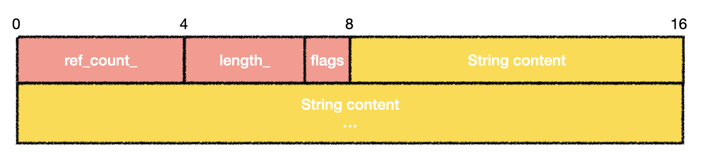

+++
title = 'Exploiting the libwebp Vulnerability, Part 2: Diving into Chrome Blink'
date = 2023-11-03T14:10:29+08:00
draft = false
+++

# 前言

当我们把这样一个在三方库中的漏洞放到真实的环境中再看时，会发现漏洞所处的环境往往有很多复杂的变量，想要利用这个漏洞并非想象般那么容易。

我们所已知的信息有：

- 我们溢出的变量[huffman_tables](https://source.chromium.org/chromium/chromium/src/+/d53886d694334f194b267db3af165e5cd61ef489:third_party/libwebp/src/src/dec/vp8l_dec.c;l=437)，大小为0x2f28
- 该堆块在renderer的ThreadPool中分配，而大多数对象在主线程中分配
- 我们可以以8字节倍数的offset，写入一个部分可控的4字节int

Chrome中不同大小的堆块被存储在不同的bucket当中，不同大小的对象因为这个机制被安全地隔离开。通常来说，在chrome中的堆利用需要找到同样大小的对象进行布局，再通过UAF或是OOB篡改其他的对象，从而造成信息泄露或者控制流劫持。接下来我们会分享我们所发现的对象，同时试图去绕过这个机制。

# 信息泄露

## 寻找对象

我们首先想要寻找的是一个合适的对象能够被OOB所改写，由于我们的越界写并不能很好地控制值，所以写指针基本被排除，最好的情况是能够改掉类似length这样的字段，对于值没有精确的要求，但是能够引发进一步更好利用的内存问题。

`HuffmanCode`在libwebp中是用`malloc`分配的，在chrome中实际是被PartitionAlloc最终接管分配。在renderer中一共有四个[partition](https://source.chromium.org/chromium/chromium/src/+/d53886d694334f194b267db3af165e5cd61ef489:third_party/blink/renderer/platform/wtf/allocator/Allocator.md)，`LayoutObject partition`, `Buffer partition`, `ArrayBuffer partition`, `FastMalloc partition`。FastMalloc实际上最终调用的就是`malloc`，因此我们想要找的对象可以用FastMalloc来分配。

我们首先用了Man Yue Mo在[博客](https://securitylab.github.com/research/one_day_short_of_a_fullchain_renderer/)中提到的codeql查询，由于溢出在0x3000的bucket当中，可以选择的对象大小范围为0x2800 - 0x3000。但非常遗憾的是，查询结果为空，这个size下的对象几乎完全不存在。另一个思路是用溢出对象本身，但是这个对象被改掉后不会产生特别的破坏效果，libwebp中也没有其他好的候选对象。到了这里似乎令人觉得有些绝望，利用的第一步就被卡住了。

那么我们还有什么思路呢，一个想法是使用可变长的对象，如Man Yue Mo提到过的`AudioArray`，但是这个对象是纯数据，被改掉也没有用。查看所有FastMalloc的调用，最终我们发现了这个[对象](https://source.chromium.org/chromium/chromium/src/+/main:third_party/blink/renderer/core/css/css_variable_data.h;drc=d53886d694334f194b267db3af165e5cd61ef489;l=22)

```c++
class CORE_EXPORT CSSVariableData : public RefCounted<CSSVariableData> {
  USING_FAST_MALLOC(CSSVariableData);
```

此对象的大小为动态的

```c++
    wtf_size_t bytes_needed =
        sizeof(CSSVariableData) + (original_text.Is8Bit()
                                       ? original_text.length()
                                       : 2 * original_text.length());
    // ... snip ...
    void* buf = WTF::Partitions::FastMalloc(
        bytes_needed, WTF::GetStringWithTypeName<CSSVariableData>());
```

该对象代表了[CSS中的变量](https://developer.mozilla.org/en-US/docs/Web/CSS/Using_CSS_custom_properties)，可以通过以下方式来定义

```css
element {
  foo: var(--my-var, bar);
}
```

blink会根据CSS变量的内容动态分配`CSSVariableData`的内存。还有一个好消息是，JavaScript中也可以便捷地操作CSS变量。

```javascript
// add a CSS variable
element.style.setProperty('foo', 'bar');
// remove a CSS variable
element.style.removeProperty('foo');
// get the value of a CSS variable
getComputedStyle(element).getPropertyValue('foo');
```

## Cross-Thread堆占位

我们可以控制`CSSVariableData`的大小，使其分配至与`HuffmanCode`同样大小的bucket中。一个自然而然的计划是，分配一堆`CSSVariableData`，然后free其中一个，再用`HuffmanCode`占位，如下图所示。


然而设想很美好，实际上PartitionAlloc中使用了[ThreadCache](https://source.chromium.org/chromium/chromium/src/+/main:base/allocator/partition_allocator/src/partition_alloc/thread_cache.h;drc=9fc872d7a2507b4685051bd6a0d93349f668e6f8;l=241)，对象的分配和释放都会优先在ThreadCache中进行。由于两个对象不在同一个线程中分配，我们需要想办法将`CSSVariableData`从ThreadCache中移出。阅读[ThreadCache的源码](https://source.chromium.org/chromium/chromium/src/+/main:base/allocator/partition_allocator/src/partition_alloc/thread_cache.h;drc=9fc872d7a2507b4685051bd6a0d93349f668e6f8;l=519)，我们找到了一个途径

```C++
  uint8_t limit = bucket.limit.load(std::memory_order_relaxed);
  // Batched deallocation, amortizing lock acquisitions.
  if (PA_UNLIKELY(bucket.count > limit)) {
    ClearBucket(bucket, limit / 2);
  }
```

当bucket被填满时，有一半的slot会被移出至原来的SlotSpan中。对于0x3000大小的bucket，limit为16。因此我们在释放16个`CSSVariableData`触发`ClearBucket`后，再分配`HuffmanCode`即可占到`CSSVariableData`的空位，为了保证`HuffmanCode`后面为想要改的`CSSVariableData`，需要隔几个释放一次，示意图如下（实际利用中为每7个释放一个）。


## 从OOB到UAF

至此我们可以成功分配`HuffmanCode`至被free的`CSSVariableData`处，我们需要探究该对象有什么值得更改的字段。

`CSSVariableData`的内存布局：



回想一下我们漏洞的原语——以8字节倍数的偏移写入4字节。对象中的string改掉也没有意义，那么我们能改的东西就只剩下`ref_count_`字段了。围绕`ref_count_`能做的文章有什么？一个自然的想法就是将此原语转化为UAF来进行后续利用。通过OOB将`ref_count_`改小，再触发减少`ref_count_`的操作，即可造出一个UAF的对象。

但是OOB写入的值并非完全可控，我们需要先用某种方式增大`CSSVariableData`的`ref_count_`至某个特定的值

```javascript
  let rs = getComputedStyle(div0);
  // add ref_count with kOverwriteRef
  for (let i = 0; i < kOverwriteRef; i++) {
    rs.getPropertyValue(kTargetCSSVar);
  }
```

测试发现，调用`getPropertyValue`即可临时增加`CSSVariableData`的`ref_count_`。而经过GC之后，临时增加的`ref_count_`会被恢复。因此造出一个UAF的对象需要以下步骤：

1. 分配`CSSVariableData`，其初始的`ref_count_`为2
2. 调用`getPropertyValue` kOverwriteRef次，此时`ref_count_`为`kOverwriteRef + 2`。
3. 触发webp的漏洞，将`ref_count_`改为`kOverwriteRef`。
4. 触发GC，`CSSVariableData`被free。
5. 再次调用`getPropertyValue`即可触发UAF。

在`getPropertyValue`时，blink会根据`length_`构造string返回到js中。因此我们只需分配一个数据完全可控的对象（[AudioArray](https://source.chromium.org/chromium/chromium/src/+/main:third_party/blink/renderer/platform/audio/audio_array.h;drc=9fc872d7a2507b4685051bd6a0d93349f668e6f8;l=45)），伪造`CSSVariableData`的`length_`字段，即可达到在堆上越界读的效果。

# Cross-Bucket分配

我们将OOB转化成了UAF，但是这个UAF的对象仅能造成堆上越界读的效果，假设这样可以解决信息泄露的问题（其实此时还并未解决），但仍无法完成进一步的利用。

在以往的blink堆利用中，占位后往往将目光聚焦于同样大小的对象，因为他们天生被分配在一起。但是此刻，0x3000的bucket内已经没有其他更好的对象能够利用，那么我们能否攻击其他大小的对象？经过我们的研究，答案是肯定的。

PartitionAlloc将堆的metadata（`SlotSpanMetadata`）放在被隔离开的页上，在用户分配的堆块上唯一剩下的管理信息就是freelist指针，如果我们可以将此指针更改，即可达到任意地址分配的效果。在常规的SlotSpan中free时，有double free的检查

```C++
PA_ALWAYS_INLINE void SlotSpanMetadata::Free(uintptr_t slot_start,
                                             PartitionRoot* root)
  // ... snip ...
  auto* entry = static_cast<internal::EncodedNextFreelistEntry*>(
      SlotStartAddr2Ptr(slot_start));
  // Catches an immediate double free.
  PA_CHECK(entry != freelist_head);
```

在ThreadCache中，没有double free的检查，我们可以任意多次free相同地址。而分配时有检查，注释中说得很清楚

```C++
  PA_ALWAYS_INLINE static bool IsSane(const EncodedNextFreelistEntry* here,
                                      const EncodedNextFreelistEntry* next,
                                      bool for_thread_cache) {
    // Don't allow the freelist to be blindly followed to any location.
    // Checks two constraints:
    // - here and next must belong to the same superpage, unless this is in the
    //   thread cache (they even always belong to the same slot span).
    // - next cannot point inside the metadata area.
    //
    // Also, the lightweight UaF detection (pointer shadow) is checked.
```

我们想要任意分配的地方不能属于metadata（曾经用此手段可获得任意地址读写的能力，[参考](https://securelist.com/the-zero-day-exploits-of-operation-wizardopium/97086/)），且要和原来的slot处于同一个superpage内，而这两点都可以轻易满足。

因此，我们假设`CSSVariableData`为A，占位的`AudioArray`为B（A和B实际为相同的地址），我们做一个类似经典的fastbin attack，即可做到任意地址分配。

1. free(A)
2. free(B)
3. malloc(C)，修改freelist为地址0xdeadbeef
4. malloc(D)
5. malloc(E)，此时分配到的E即为地址0xdeadbeef

那么要分配到哪里呢？

PartitionAlloc不同大小的对象通过bucket来管理，bucket通过SlotSpan来管理同样大小的slot，SlotSpan的单位为partition page，具体的概念及策略可参考[官方文档](https://chromium.googlesource.com/chromium/src/+/refs/heads/main/base/allocator/partition_allocator/glossary.md#slots-and-spans)，如0x3000 slot size的SlotSpan由3个partition page组成，总大小0xc000，共可以分配4个0x3000的slot。

在内存中管理不同slot大小的SlotSpan实际可能是相邻的。那么我们只需要将我们感兴趣的对象所在的SlotSpan分配到0x3000 slot size的SlotSpan附近，即可完成信息泄露+对象劫持。我们参考Man Yue Mo的博客，最终选取了`HRTFPanner`（slot size为0x500）作为我们要攻击的对象。

我们在内存中以如下方式喷对象，更改freelist指针即可做到从0x3000的slot分配到0x500的slot上。


# RCE

结合之前所有的知识，我们串联一下最终的步骤

1. 堆喷大量0x3000和0x500的SlotSpan。
1. 触发webp漏洞，转化为`CSSVariableData`的UAF。
1. 使用`AudioArray`占上被free的`CSSVariableData`，利用UAF获得信息泄露。
1. Cross-Bucket分配到`HRTFPanner`上，伪造`HRTFPanner`对象。
1. 触发`HRTFPanner`的析构获得任意代码执行。

# 结论

在本篇博客中，我们详细讨论了如何在Chrome中利用一个品相并非那么好的OOB写漏洞。本次测试仅为了展示该漏洞的可利用性，并未对成功率做过多优化。完整的利用代码可以在[这里](https://github.com/DarkNavySecurity/PoC/tree/main/CVE-2023-4863)查看，测试环境为Ubuntu 22.04上基于[此commit](https://chromium.googlesource.com/chromium/src/+/b8b9a859ec2117b015d4ca440ab3483f99355f88)编译的Chromium。

这个漏洞如何在iOS环境下转化并在PAC等缓解机制下利用仍然是一个开放问题。从这个案例中明显可以看出，随着各种缓解机制的引入，漏洞严重性评判越来越复杂，单一尺度评级的局限性愈发明显。深蓝公开以上对libwebp漏洞定位、分析、预警、利用重现的闭环研究，是希望这种从攻击者视角出发、结合环境特性的对抗性研判研究，进一步推动漏洞科学研判的发展。
