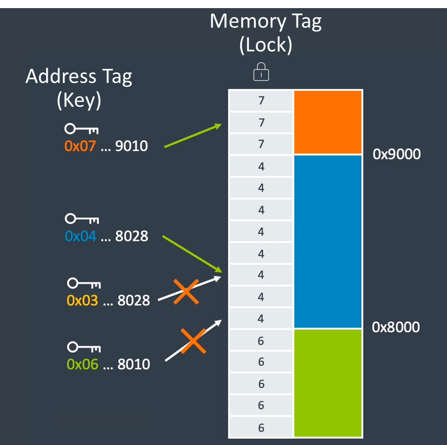
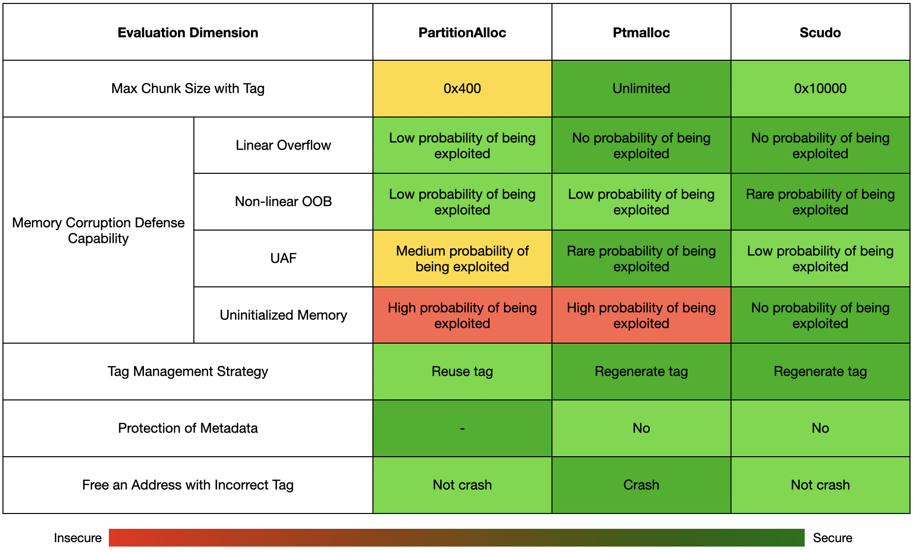

+++
title = '填补盾牌的裂缝：堆分配器中的MTE'
date = 2024-01-03T16:14:27+08:00
draft = false
+++

# 前言

2018年，随着ARMv8.5-A的发布，一个全新的芯片安全特性[MTE](https://developer.arm.com/-/media/Arm%20Developer%20Community/PDF/Arm_Memory_Tagging_Extension_Whitepaper.pdf)(Memory Tagging Extensions) 横空出世。时隔五年后的2023年，市场上第一款支持此特性的手机发布 —— [Google Pixel 8](https://blog.google/products/pixel/google-pixel-8-pro/)，宣告着MTE正式走入了消费者群体。虽然该特性在手机上还未默认启用，但开发者可以[自行开启体验](https://googleprojectzero.blogspot.com/2023/11/first-handset-with-mte-on-market.html)。

MTE作为一个强大的内存破坏防御手段，对于它的防御边界、防御能力，和它对性能的影响，目前网上还未有对其全面的分析。此前，Google Project Zero发表了一系列[关于MTE的文章](https://googleprojectzero.blogspot.com/2023/08/mte-as-implemented-part-1.html)，其聚焦于较为底层的MTE安全性。然而MTE对于真实的软件安全性究竟有多大的影响仍是个未解之谜。想要讨论这个话题，各大堆分配器是一个很好的切入点。堆上的内存破坏问题已经逐渐成为二进制漏洞中的主流类型，参考MSRC于CppCon2019的[议题](https://github.com/microsoft/MSRC-Security-Research/blob/master/presentations/2019_09_CppCon/CppCon2019%20-%20Killing%20Uninitialized%20Memory.pdf)内容：


通常普通开发者并不会直接使用MTE相关的汇编指令，而是依靠堆分配器自带的MTE支持间接使用，堆分配器就像盾牌一样，扛起了保护软件的任务。MTE提供了细颗粒管控内存的基础支持，如何基于硬件MTE能力实现高级安全功能的重任，留给了软件开发者。开源社区主流堆分配器积极响应，实现了基于MTE特性的安全增强，提高了堆空间的内存安全性。

本文将以MTE的三个主要玩家：Chrome中的PartitionAlloc、Glibc中的Ptmalloc、Android中的Scudo为目标，对其中MTE相关的实现分别进行讨论，并对它们进行对比。我们在研究中发现了PartitionAlloc中实现的问题，并将此问题报告给了Google，得到了Chrome团队的确认。

# MTE概述

> 已了解MTE原理的读者可跳过此章节。

MTE利用ARMv8的TBI (Top-Byte Ignore) 特性，使用指针的高4 bits存储tag，在每个进程中有一段专用的内存用于存储tag。当为内存指定了某个tag后，程序必须带上正确的tag访问内存，若tag错误，程序抛出错误信号SIGSEGV，如下图所示：



指令集提供了系列指令来操作tag，此处举例说明MTE的基本用法：

```assembly
; x0 is a pointer
irg  x1, x0
stg  x1, [x1]
ldr  x0, [x1]
```

1. IRG (Insert Random Tag) 指令为指针x0生成一个随机tag，将结果保存至x1中。
2. STG (Store Allocation Tag) 指令将tag应用至内存中，生效的长度取决于颗粒度，一般为16字节。
3. LDR (Load Register) 使用带有tag的指针读取内存。

可以看到指令集中提供了底层的支持，但各个指令的使用有很大的自由度，MTE具体如何使用，很大程度上仍然取决于软件开发者。

# Allocator

## Chrome - PartitionAlloc

### 分配

PartitionAlloc中的分配可以大致分为三种情况：


1. 从ThreadCache中分配，不变动tag直接返回。
2. 从空闲的SlotSpan中分配，不变动tag直接返回。
3. 若以上两种情况均不满足，分配一个新的SlotSpan，对其中所有空闲的堆块打上随机的tag

```cpp
    if (PA_LIKELY(use_tagging)) {
      // Ensure the MTE-tag of the memory pointed by other provisioned slot is
      // unguessable. They will be returned to the app as is, and the MTE-tag
      // will only change upon calling Free().
      next_slot_ptr =
          TagMemoryRangeRandomly(next_slot, TagSizeForSlot(root, slot_size));
```

### 释放

将堆块的tag加一。

```cpp
      void* retagged_slot_start = internal::TagMemoryRangeIncrement(
          ObjectToTaggedSlotStart(object), tag_size);
      // Incrementing the MTE-tag in the memory range invalidates the |object|'s
      // tag, so it must be retagged.
      object = TaggedSlotStartToObject(retagged_slot_start);
```

### (过去的) 潜在威胁

我们注意到释放时对tag加一的操作是个确定性的行为，而分配时很有可能不会改动tag，这两点使得PartitionAlloc中的tag管理相当脆弱，给了攻击者可乘之机。

设想攻击者有一个经典的UAF漏洞，并可以自由地控制触发UAF的时机，那么只需以下流程即可绕过MTE的检查：


1. 触发漏洞得到一个UAF的对象victim，但此时不触发UAF。
2. 连续分配并释放一个与victim大小相同的对象15次，此时攻击者控制的对象的tag与victim的tag相同。
3. 触发UAF。

在实际的攻击场景中，攻击者很容易获得以下两个漏洞利用原语：


1. 任意次数地分配任意大小的堆块。
2. 自由地释放自己分配的对象。

例如，browser进程中的[Blob](https://googleprojectzero.blogspot.com/2019/04/virtually-unlimited-memory-escaping.html)对象和renderer进程中的[AudioArray](https://securitylab.github.com/research/one_day_short_of_a_fullchain_renderer/)对象均满足上述两点。

更为详细的报告内容及示例PoC可于[Issue 1512538](https://bugs.chromium.org/p/chromium/issues/detail?id=1512538)查看。

### 分析

PartitionAlloc中的MTE支持并未如同想象般强大，其对tag的管理相对较少，最大程度地兼顾了效率，具体细节性的对比见下一章节。

## Glibc - Ptmalloc

Ptmalloc中的实现最为简单粗暴，其策略简单得用几句话即可概括。

### 分配

对于所有的分配，在获取到分配地址后，随机生成一个不为0的tag来标记整个分配出的chunk (代码中的实际逻辑为生成与chunk头不一样的tag值，而在我们所分析的版本2.38中，libc所管理的内存如chunk头tag为固定值0。本文后续不再对此特殊说明)。

```C
      victim = tcache_get (tc_idx);
      return tag_new_usable (victim);
  // ...
  victim = _int_malloc (ar_ptr, bytes);
  // ...
  victim = tag_new_usable (victim);
```

### 释放

将堆块的tag置为0。

```C
      /* Mark the chunk as belonging to the library again.  */
      (void)tag_region (chunk2mem (p), memsize (p));

      ar_ptr = arena_for_chunk (p);
      _int_free (ar_ptr, p, 0);
```

### 分析

对于这样的分配策略，大有一种一力降十会的感觉。在性能和安全的权衡之间Glibc选择了安全：无论是任何的分配大小、任何分配的来源 (tcache、fastbin、smallbin...)，都会被重新打上随机的tag。

libc中自己所管理的内存，如chunk头、被free的chunk、top chunk等，都使用了0作为tag。固定的tag 0乍一看令人觉得十分不安全，这是攻击者已知的信息，但是仔细重新审视，会发现其实不然，这一机制至少保证了以下两点：


1. 每两个chunk (tag非0) 之间一定存在着chunk头或free chunk (tag 0) 作为隔阂，扮演了类似Guard Page的存在，可以有效缓解线性溢出。
2. free后的chunk (tag 0) 和正在使用的chunk (tag非0) 拥有的tag一定不一样，可以有效缓解UAF。

## Android - Scudo

相较而言，Scudo中的实现最为复杂。

### 分配


1. Scudo只会给Primary类型 (大小 < 0x10000) 的堆块打上tag，对于更大的Secondary类型，其通过内存映射的方式分配空间，目前暂不支持给这类空间分配tag。
2. Scudo在重用被释放的堆块时，会直接保存并使用其在释放时打上的UAF tag；否则将分配一个随机tag。

### 释放

给堆块打上一个与之前不同的随机tag，防止UAF重用。

```cpp
      if (Header->ClassId) {
        if (!TSDRegistry.getDisableMemInit()) {
          uptr TaggedBegin, TaggedEnd;
          const uptr OddEvenMask = computeOddEvenMaskForPointerMaybe(
              Options, reinterpret_cast<uptr>(getBlockBegin(Ptr, Header)),
              Header->ClassId);
          // Exclude the previous tag so that immediate use after free is
          // detected 100% of the time.
          setRandomTag(Ptr, Size, OddEvenMask | (1UL << PrevTag), &TaggedBegin,
                       &TaggedEnd);
        }
      }
```

### 分析

在Scudo的实现中，存在一个独特的配置选项：UseOddEvenTags。当此选项激活时，Scudo在内存分配过程中会特别考虑每个堆块的tag的奇偶性。这意味着，它确保每个相邻的堆块的tag奇偶性是不同的。

为了实现这一功能，Scudo中的以下函数`computeOddEvenMaskForPointerMaybe`被用于计算奇偶标签掩码：

```cpp
  uptr computeOddEvenMaskForPointerMaybe(const Options &Options, uptr Ptr,
                                         uptr ClassId) {
    if (!Options.get(OptionBit::UseOddEvenTags))
      return 0;

    // If a chunk's tag is odd, we want the tags of the surrounding blocks to be
    // even, and vice versa. Blocks are laid out Size bytes apart, and adding
    // Size to Ptr will flip the least significant set bit of Size in Ptr, so
    // that bit will have the pattern 010101... for consecutive blocks, which we
    // can use to determine which tag mask to use.
    return 0x5555U << ((Ptr >> SizeClassMap::getSizeLSBByClassId(ClassId)) & 1);
  }
```

这种配置涉及到UAF检测和缓冲区溢出检测之间的权衡。启用UseOddEvenTags时，相邻堆块的tag奇偶性不同，这断绝了随机分配的tag恰好相同的可能性，从而提高了检测缓冲区溢出的可能性。然而，另一方面，这种情况下每次随机分配的tag的奇偶性是固定的，这导致其标记空间减半，使得UAF更加难以被检测出来。

这一设计凸显出Scudo在实现时的一个关键思考：如何在尽可能减少性能影响的同时，对不同类型内存漏洞的缓解策略进行平衡。这表明了堆管理器在处理内存安全性时的偏好性和取舍。

# 对比

声明：此表格仅对比了各个堆分配器中MTE的实现，并**不能**代表堆分配器整体的安全性。

 

* **带tag的最大堆块大小**

  Ptmalloc会给任意大小的堆块都打上tag；而出于性能考虑，Scudo和PartitionAlloc分别只能保护小于0x10000和0x400的堆块。
* **内存破坏防御能力**

  * Linear Overflow

    Ptmalloc和Scudo的chunk头都使用了0作为tag，因此两个堆块之间一定存在着一块red zone，可以有效缓解线性溢出；而PartitionAlloc的metadata不在堆块头部，因此有一定概率相邻堆块的tag恰好相同。
  * Non-linear OOB

    对于非线性的越界访问，Scudo的tag奇偶性可以保证相邻的堆块的tag必定不同，从而可以增加堆块周围的red zone的大小，使小范围的OOB更有可能被检测到。
  * UAF

    PartitionAlloc中对于UAF漏洞的潜在风险在上述章节已详细说明，此处需额外注明的是，PartitionAlloc并不（仅）依赖MTE来防御UAF漏洞，其借助[MiraclePtr](https://chromium.googlesource.com/chromium/src/+/main/base/memory/raw_ptr.md)本身已具备了极为强大的UAF防御能力；Scudo在开启tag奇偶性的情况下，tag的分配空间会减半，使得tag碰撞的概率上升。
  * Uninitialized Memory

    MTE并不能很好地改善内存未初始化的问题，诸如PartitionAlloc和Ptmalloc都不会对内存进行初始化操作。
* **tag管理策略**

  堆块的分配和释放作为一个整体在此项评估。PartitionAlloc在重用缓存中的堆块时，并不会重新生成新的tag，而是继续沿用旧的tag，而释放时仅将tag加一；而另外两个堆分配器都完成了对tag的重新生成。
* **对于metadata的保护**

  Ptmalloc和Scudo都没有使用tag来保护chunk头等metadata，其默认的tag为0，使其可以作为相邻堆块之间的隔离区域，但同时也可能存在着被恶意破坏的风险；值得一提的是，PartitionAlloc的metadata不会保存在堆块的头部，因此不容易被破坏。
* **释放一个带有错误tag的地址**

  在释放堆块时，PartitionAlloc和Scudo并不会检查tag的正确性，而是直接进行untag操作，因此可以成功释放一个带有错误tag的地址，但是这样的缺陷导致的攻击场景有限，需要结合其他的攻击手段一起利用，因此我们没有将其定为较高的风险程度；而Ptmalloc会检查tag是否正确，如果检查不符则产生异常。

  ```C
    /* Quickly check that the freed pointer matches the tag for the memory.
       This gives a useful double-free detection.  */
    if (__glibc_unlikely (mtag_enabled))
      *(volatile char *)mem;
  ```

# 结论

本文详细分析了三大堆分配器中MTE的落地实现，读者应对他们的安全性都有了直观的了解。MTE对于ARM平台上的内存安全无疑是一次大跨越，可以看出传统堆上的内存破坏问题在开启MTE后，几乎都得到了有效的缓解，有的甚至已再无利用的可能。然而内存安全经历了多年的发展，疑难杂症众多，仍有许多开放问题待解决：

* 内存未初始化的防御仍依赖于软件实现。
* 栈上的变量是否会得到MTE的加固，是否会因为性能原因难以落地。
* 对mmap出的内存打上tag缺乏kernel层的支持。
* 对于大块内存buffer，如ring buffer、共享内存等，很难得到MTE的有效保护。
* 程序的data段数据不受MTE的保护。

攻防演进至此，攻击者从多年前一个栈溢出即可攻破系统，至如今需要环环相扣的漏洞来突破系统防御的层层壁垒，攻守形势逆转。但我们也看到，即使像MTE这样先进的技术也存在盲点，内存安全仍道阻且长，我们期待未来更为精彩的发展。
