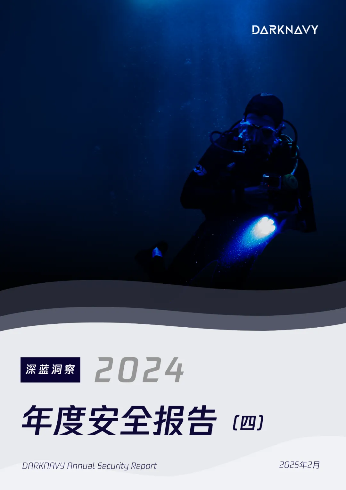
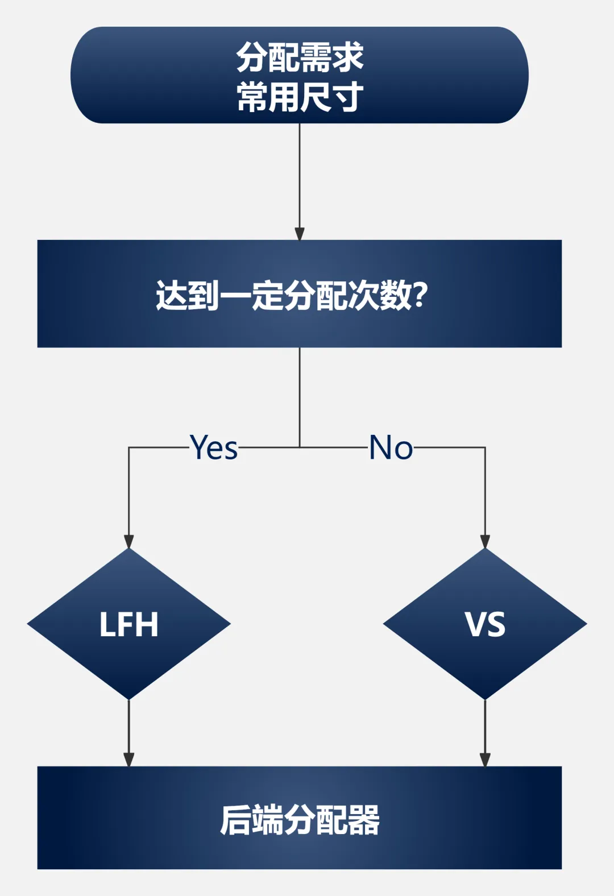

+++
title = '2024年度最狂躁不安的漏洞'
date = 2025-02-11T11:41:45+08:00
draft = true
images = ["attachments/970c2c86-bd62-4753-9cbc-87c8c0a5af7f.webp"]
+++

在安全研究人员的共同努力下，越发严格的安全缓解措施，已经把大部分内存漏洞扼杀在了摇篮之中。

是时候宣布内存漏洞成为过去式了？

2024年7月，一枚来自Windows阵营的"核弹"打破了安全的幻象。我们不禁发问：面对来自内存的威胁，眼前的城墙究竟能抵挡些什么？

以下为本期《深蓝洞察 | 2024 年度安全报告》的第四篇。

 

2024年5月，Lewis Lee、Chunyang Han和Zhiniang Peng向微软报告了一个存在于Windows Server RDL (Remote Desktop Licensing)服务中的漏洞。7月，该漏洞被修复并出现在公众视野。

一石激起千重浪，作为一个**无需认证、无需用户交互**即可触发**远程代码执行**的内存破坏漏洞，它一经出现便迅速激起各大安全厂商与从业者的高度关注，一度被称作"**核弹级漏洞"**。

这就是本篇的主角——**狂躁许可（MadLicense）**。

尽管该漏洞起初被认为是比肩"永恒之蓝"的存在，经调研发现，它的影响范围实际上相对有限。该漏洞存在于Windows Server上的RDL服务而非通常认为的RDP协议。该服务仅作为一个可选安装项，用于允许多个用户通过RDP连接到服务器，**与大部分个人用户关系不大**。此外该漏洞存在于用户态，单个漏洞对系统的威胁能力较为有限。

漏洞的成因是远程未授权用户能通过RPC远程调用RDL服务中的`TLSRpcTelephoneRegisterLKP`函数。该函数的子函数中对用户的部分输入进行base24到base10的解码，该功能并没有对输入长度进行限制，导致了一个**无长度限制的堆溢出漏洞**。

作为一个内存破坏漏洞，它的破坏力不容小觑。于是我们立即着手进行复现，并试图探究，在**内存漏洞式微、安全缓解措施愈发严格**的今天，要在最新Windows平台利用这样一个经典的堆溢出漏洞，会遇到哪些阻碍和挑战？

<video src="attachments/617e65a7-5214-477b-8e75-72b67899a97f.mp4" controls="controls" width="100%" height="auto"></video>

复现结果如图。攻击机（右侧）运行恶意脚本，在受害者主机未进行任何操作的情况下，可稳定地拿下远程主机的控制权（左侧shell）。

自Windows 10引入的**segment heap**堆实现机制，被广泛应用在系统进程中。对于常用尺寸内存的分配，使用VS(Variable Size)或LFH(Low Fragmentation Heap)分配器实现。

 

VS分配器对于溢出的防护机制较为完善。对于每个堆块，块首中的重要信息均被加密；空闲堆块间的连接也由安全性更高的数据结构代替。这些保护机制使得漏洞利用需要一定程度的信息泄露，大大提升了攻击门槛。

然而当某一尺寸达到一定分配次数时，堆块分配会转为使用效率更高的LFH进行实现。

相较VS，LFH的防护机制相对宽松。LFH堆块不存在块首，因此可以毫无阻碍地溢出到相邻堆块。为了缓解这一利用，LFH的分配采用了完全的随机化：堆块布局随机，且重用最近释放的堆块也不再可靠。这一点可以通过堆喷射的技巧进行绕过。

在狂躁许可漏洞造成的无限制堆溢出面前，segment heap的防御机制被轻易击穿了。我们依然可以轻易溢出到目标堆块，伪造对象以获取**任意地址读写/任意地址调用**的原语。

到这里利用还没有结束。接下来面对的通用内存缓解措施表现会如何？

微软在Windows 8.1 Update 3和Windows 10中引入了一项重量级的缓解措施——**控制流保护（CFG）**。在启用CFG后，间接调用会使用编译期间生成的位图进行验证，确保仅对进程中加载模块的函数入口处进行调用，从而有效阻断了传统的代码片段重用攻击。

另一个在Windows 10被引入的缓解措施是**任意代码防护（ACG）**。ACG可防止现有代码被修改，同时阻止了动态分配可执行内存。ACG与CFG同时开启的情况下，同时绕过这两大防护变得格外困难，几乎杜绝了传统的写入执行shellcode的可能性。

需要注意的是，这两个机制并不能防止攻击者调用`CreateProcessA`等可能被滥用的函数。在不绕过以上内存缓解措施的情况下，任意函数调用已经足够允许我们在目标机上执行任意命令。

而漏洞原作者之一，华中科技大学副教授彭峙酿向我们透露，他们能够**近100%稳定利用、执行任意shellcode**。这意味着以上内存缓解措施依然存在被绕过的可能。

为何在采用最新缓解措施的Windows Server 2025上，此内存漏洞依然能被完整利用？

> **彭峙酿这样回答**：目前在Windows众多最新缓解措施全开的情况下，由一个内存破坏漏洞实现远程利用，正常来说是极难的。很多漏洞已不存在被利用的路径，或路径极少极隐蔽。
>
> 但这并不代表目前的缓解措施杀死了所有的漏洞利用。能否完成利用往往取决于：攻击者为了完成利用所愿意投入的时间、对相关代码模块的熟悉程度、漏洞和具体模块的特殊情况。

---

## DeepSeek锐评

微软对狂躁许可漏洞"几乎不可能利用"的傲慢断言，折射出安全行业长期存在的评估悖论：当漏洞评级体系脱离攻击者视角，便沦为自欺欺人的技术乌托邦。

防御者用静态指标丈量动态攻防，用理论模型否定实战可能，恰是安全防御最大的盲区。此次漏洞利用链突破多重内存防护的实践证明，安全评估不应是厂商的"免责声明"，而应成为攻防对抗的动态标尺。若不能正视攻击者"技术暴力"的突破能力，再完美的缓解措施都将沦为数字时代的马奇诺防线。

---