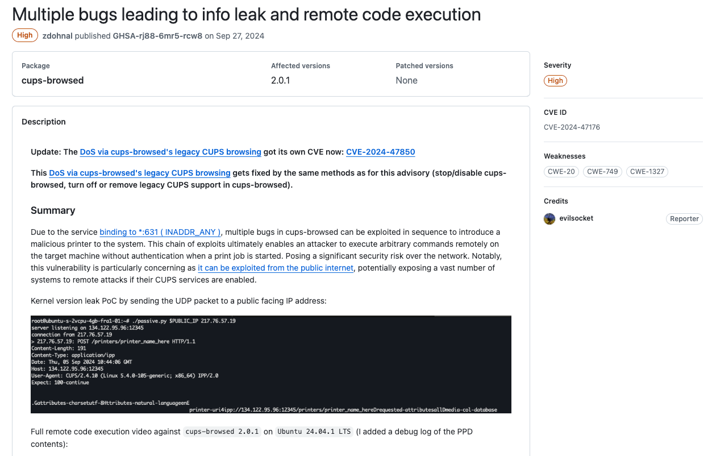

+++
title = '2024年度最憋屈的漏洞披露'
date = 2025-02-16T17:58:16+08:00
draft = false
images = ["attachments/ee58ddb8-f897-4757-95f6-f33cd9bdebe8.png"]
+++

在网络安全领域，漏洞披露一直被视为保护用户的重要环节，但在现实中，这一过程却充满了争议和矛盾。究竟什么才算得上"负责任的披露"？当厂商在信息公开和补丁发布上占据主导地位，而安全研究者则需要耗费大量精力进行沟通与博弈，这一模式是否还能真正实现保护用户安全的初衷？在技术快速演进、网络威胁不断升级的今天，传统的漏洞披露机制是否已跟不上时代的步伐？

本报告将以近期引发广泛讨论的漏洞披露事件为切入点，探讨当前责任披露过程中存在的问题，试图寻找一种更为公平、高效且能平衡各方利益的解决路径。

以下为本期《深蓝洞察 | 2024 年度安全报告》的第九篇。

 

对于一个严重的安全漏洞来说，通常只有在厂商率先发布漏洞的修复并将其推送给用户一段时间之后，漏洞发现者才会开始披露漏洞的细节，公开漏洞的PoC或者Exp，这也就是在计算机安全研究中所谓的CVD（coordinated vulnerability disclosure，协调漏洞披露）漏洞披露模型，也被称为负责任的漏洞披露。

24年9月末，在安全研究界发生了一件怪事，一个"足以影响所有Linux系统"的远程代码执行漏洞详细披露与各大Linux发行版厂商的安全声明在同一天内相继发布。而在这之前，漏洞的发现者还在社交媒体上抱怨Redhat等厂商已经给漏洞打了9.9分的评分，但是相关组件的开发人员毫不重视他所提交的漏洞。他在推文的最后抱怨道："responsible disclosure: no more"。

 

# 漏洞披露风波

这个故事的主人公是著名的安全研究员Simone Margaritelli，他在24年9月初开始研究Linux系统中的CUPS组件，并于9月5日将他发现的漏洞披露给了相关的厂商以及OpenPrinting开发人员，Redhat给予这个漏洞了9.9的评分，但是OpenPrinting的开发者并不理解Simon所进行的研究，Simone与OpenPrinting进行了长达22天的交流，直到3周之后，OpenPrinting方才承认evilsocket研究的正确性。

在这期间，9月23日，Simone在社交媒体上发表了那篇引起轩然大波的推文。Simone在推文中并没有指明漏洞所在的具体组件，令人啼笑皆非的是，仅仅在1天之后的9月24日，BreachForums黑客论坛就出现了Simone提交给CERT's VINCE的原始漏洞报告以及漏洞利用。

 

9月26日，OpenPrinting下的libppd、libcupsfilters、cups-browsed推送了漏洞的修复版本以及临时的漏洞修复方案，Ubuntu、Redhat等Linux发行厂商也开始推送漏洞公告以及漏洞修复方案。同一天，Simone在自己的博客上公开披露了漏洞细节与利用。最终这些漏洞被给予了最高9.0的CVSS漏洞评分。

 

# 漏洞披露：理想与现实

在安全研究漏洞披露的过程中，安全研究者一般会遵循CVD模型，即负责任的漏洞披露的准则，这一准则旨在为相关的组织或者机构留出足够的时间指定漏洞修复或者缓解方案，尽可能快的减少漏洞造成的影响，同时用户有权利对自己使用的产品中的漏洞知情。

但是，这种模型在现实实践中展现出了一定的局限性：**厂商在漏洞披露过程中占据主导权，安全研究者需要花费大量的时间与精力与厂商沟通漏洞的细节**。就本次事件而言，第三方安全研究人员即Simone与开发者OpenPrinting之间的沟通过程并不是那么顺利。在Simone的博客中提到双方的沟通记录内容多达50页，时间跨度长达3周，消耗了双方大量的时间与精力，最终Simone违反了"负责任的披露"的准则，提前进行了漏洞披露。

> 漏洞评价标准的缺失是厂商在漏洞披露过程中占据主导权的原因之一，目前常用的CVSS漏洞评价体系对于漏洞评价的指标过于单一，无法准确评估漏洞的攻击难度与影响范围，安全研究员与厂商很难通过这套体系达成一致。
>
>  

对于这种困境，P0、ZDI、CERT等组织在CVD模型的基础上加入了Deadline机制，以Google Project Zero为例，其提出了90天漏洞披露机制，即安全研究员第一时间将漏洞细节通报给厂商，并且在90天之后或者漏洞安全补丁发布之后，向公众公布漏洞细节以及缓解方案。

Deadline机制作为CVD模型的现实补充，有效的提高了漏洞修复的效率以及最终用户的安全性。但是Deadline机制终究只是一种被动的警告机制，并没有对漏洞披露过程中厂商的权力进行有效的限制，厂商仍然占据着绝对的主导权。事实上，即使一些安全研究员声明将在漏洞报告90天之后披露漏洞细节，部分厂商仍然没有积极推进漏洞修复的流程，从而导致在野漏洞流出，在P0的报告中不乏这样的例子。

 

---

# 深蓝洞察

在这个高度信息化的时代，在野的高危漏洞利用所造成的影响正在越来越广泛与复杂，安全研究者对于漏洞的披露、厂商的及时响应与推送、用户尽早的知悉与更新，才能共同缩小漏洞所带来的危害。

负责任的披露在这种背景下显得有些理想化，由于漏洞评价机制CVSS缺陷等原因，厂商/开发者占据了漏洞披露过程中的主导权，第三方安全研究者以及用户对漏洞修复的作用十分有限。安全研究员需要花大量的时间与精力与厂商就漏洞的评价达成一致。

Deadline机制的加入，有效的提高了漏洞修复的效率以及最终用户的安全性。但是这套机制对厂商仍然无法起到足够的约束作用，一套更加完善的漏洞披露制度仍然需要三方的共同努力。

---

# References

* <https://x.com/evilsocket/status/1838169889330135132>
* <https://www.akamai.com/blog/security-research/guidance-on-critical-cups-rce>
* <https://www.evilsocket.net/2024/09/26/Attacking-UNIX-systems-via-CUPS-Part-I>
* <https://googleprojectzero.blogspot.com/2015/02/feedback-and-data-driven-updates-to.html>
* <https://github.com/OpenPrinting/cups-browsed/security/advisories/GHSA-rj88-6mr5-rcw8>
* <https://github.com/OpenPrinting/cups-filters/security/advisories/GHSA-p9rh-jxmq-gq47>
* <https://project-zero.issues.chromium.org/issues/368695689>
* <https://x.com/guhe120/status/1856844617846817004>