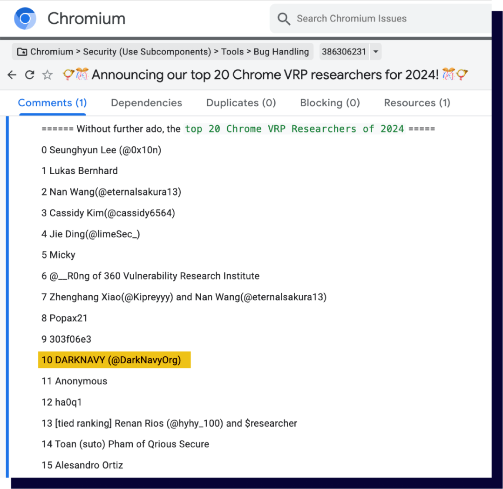

+++
title = '2024年最具含“金”量的绕过'
date = 2025-02-09T17:13:30+08:00
draft = false
images = ["attachments/640.png"]
+++

 

基于浏览器漏洞的攻击，自2000年代初出现以来直至今日，一直是一种主流、有效且场景丰富的攻击手段。以下为本期《深蓝洞察 | 2024 年度安全报告》的第二篇。

 

根据市场调查机构 Statcounter 公布的最新报告，Chrome浏览器无可争议地牢牢占据了市场占有率第一的宝座。

 

Chrome以其卓越的安全性而著称，Google安全团队一直致力于研究应用最前沿的漏洞缓解机制。MiraclePtr就是其中最为知名的缓解机制之一，旨在防止浏览器中的UAF漏洞被攻击者利用。

Chrome中的PartitionAlloc堆分配器在分配和释放对象时维护了一个用户无感知的refcount字段，简单概括MiraclePtr这一缓解机制就是：若对象在被释放时，对该对象的refcount并不是0，这意味着代码中存在危险的引用，这是一个潜在的UAF对象，此时堆管理器会将此危险的对象隔离，从而阻止了后续可能的漏洞利用。

* 2022年6月，全新的安全机制MiraclePtr正式地在Windows和Android平台下的browser进程中启用；
* 2022年9月，扩大启用范围，除renderer进程外的所有进程皆启用；
* 2023年6月，MiraclePtr在全平台启用（ChromeOS, macOS, 和Linux）；
* 2024年7月，Chrome VRP宣布：被MiraclePtr保护住的UAF漏洞将不再视为安全问题。

是什么给了Chrome安全团队如此底气，直接无视这一类严重的内存破坏问题？

想回答这个问题，就不得不提到24年的一例MiraclePtr绕过。在24年的5月，Chrome发布的一则巨额漏洞奖金格外引人注目，其数额高达**10万美元**，这正是Chrome VRP悬赏的MiraclePtr Bypass的赏金数字。

 

待issue完全公开后，大家才终于明白绕过的细节。PartitionAlloc中在进行refcount加一的操作后，代码中会检测refcount是否溢出，若发生溢出则会触发进程的主动崩溃。

```cpp
CountType old_count = count_.fetch_add(kPtrInc, std::memory_order_relaxed);
// Check overflow.
PA_CHECK((old_count & kPtrCountMask) != kPtrCountMask);
```

安全研究员Micky发现，在发生溢出后，这个CHECK并不会立即崩溃，进程处理崩溃相关的逻辑还需要一定的时间，在程序实际停止运行前，仍存在约180ms的时间（在测试环境中），这就给了攻击者生死竞速的机会，攻击者若能在这段时间内完成堆喷占位和后续控制PC等操作，则可以成功利用被MiraclePtr保护的UAF漏洞。

满足攻击成功需要诸多条件：

* 精准地溢出长度为29 bit的refcount字段。
* 释放对象的代码与其他攻击所需的代码**不**运行在同一线程，且都一定程度受攻击者控制。
* 攻击者自由地控制目标对象的refcount。
* 在极短的时间窗口内赢得race并完成利用。

综合了以上种种限制，这就使得这个绕过技术几乎只存在与理论中，但Chrome团队仍慷慨地奖励了这一发现。

除此之外，DARKNAVY与24年11月也发现了MiraclePtr实现上的缺陷，报告给了Chrome团队并得到了确认。

 

综合这一发现以及此前多个高质量漏洞报告，DARKNAVY位列Chrome VRP 2024年度top 20安全研究员/机构。

 

了解这般背景后，不难看出，历史上仅有的绕过方式存在诸多限制，且MiraclePtr缓解机制稳定运转了两年多，时间已经检验了它的有效性，相信Google是在深思熟虑后决定的"无视"大部分UAF漏洞。

Google历经两年多的时间终于基本根除了一个心头大患，这对消费者来说是可喜可贺的。在Chrome的Q3季度总结中还提到了数个对Chrome内存安全的加固，如移除C语言库libpng的依赖，改为使用Rust实现的PNG、JSON等解码；再如将图形渲染模块ANGLE移植到渲染进程中以获得更强大的沙箱保护。这方方面面的努力，无不预示着未来的Chrome将更难以使用内存破坏漏洞突破。

---

**深蓝洞察**

从MiraclePtr的部署到绕过案例的出现，再到其机制的不断完善，Chrome展现的不仅是技术防御的进化，更是一种安全哲学：

通过奖励机制激励发现潜在问题，通过技术迭代增强整体体系，而非仅关注单点漏洞。

这种模式体现了Chrome团队对"攻防对抗"的深刻认知——安全从不是一劳永逸的结果，而是一场拉锯战。

随着安全研究和技术手段的同步发展，Chrome的安全或许无法做到"绝对防御"，但却可以通过这种系统化的策略，将威胁持续降低至可接受的范围，赢取用户的信任，让安全成为产品的核心竞争力。

---

**References**

* \[1\] <https://gs.statcounter.com/browser-market-share#monthly-202412-202412-bar>
* \[2\] <https://chromereleases.googleblog.com/2024/06/stable-channel-update-for-desktop.html>
* \[3\] <https://issues.chromium.org/issues/386306231>