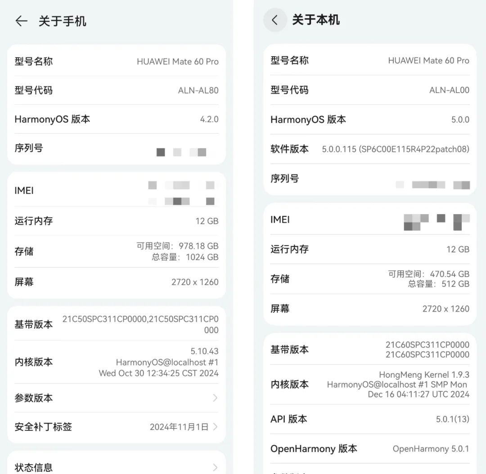
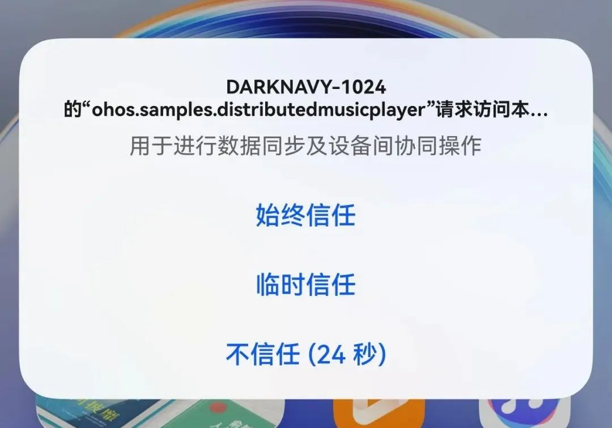
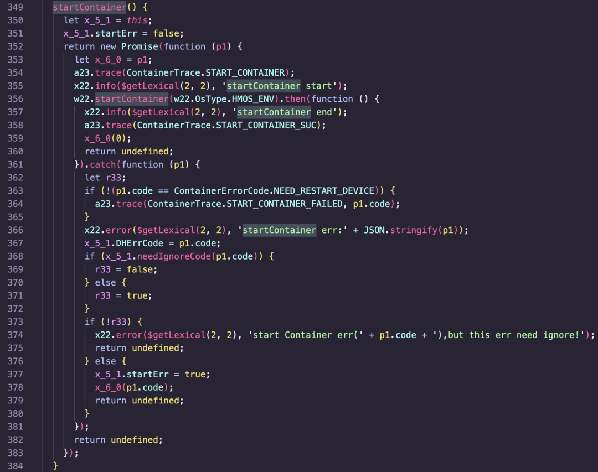
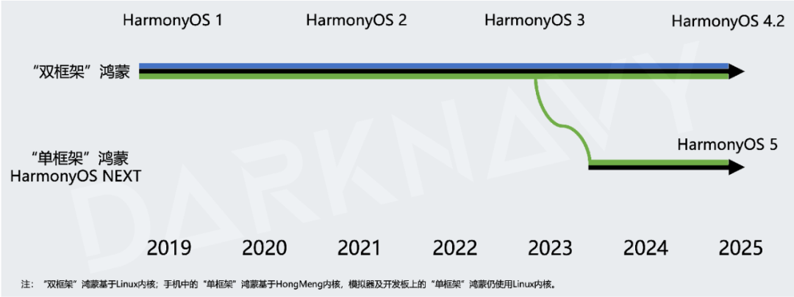
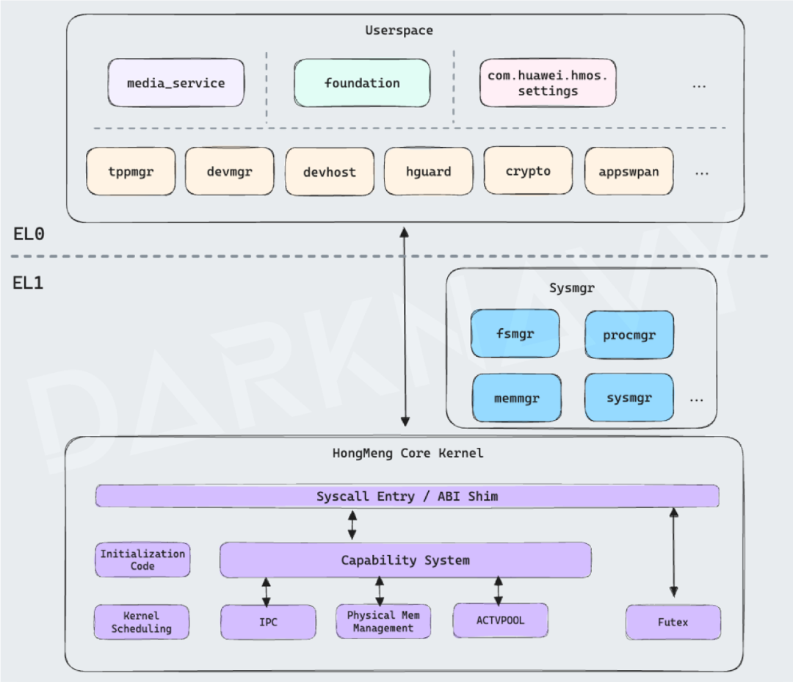
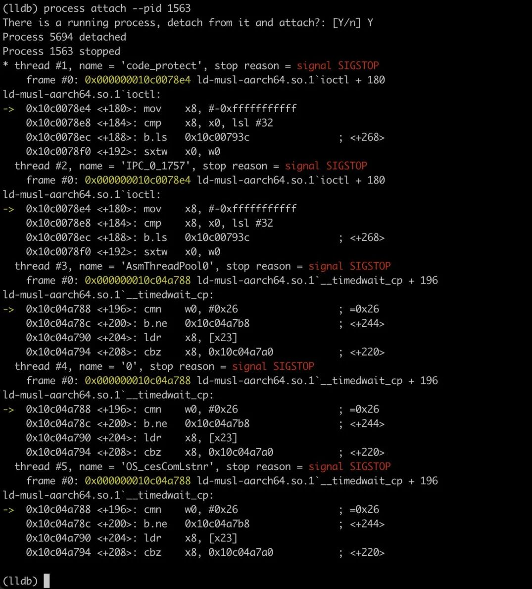

+++
title = '2024年度最别开生面的新生态'
date = 2025-02-08T17:10:13+08:00
draft = false
+++

在[《深蓝洞察 | 2023 年度安全报告》](https://mp.weixin.qq.com/s/FTbvsoSwGnbPzdM1DCopoA)中，我们曾提到："当我们站在下一个十年的悬崖边时，2023年注定将成为一个具有深刻转折意义的年份。新防御机制的落地和新型攻击技术的崛起，将深刻改变数字安全的格局。"

2024年，如一阵疾风而至，又如暴雨般迅速远去。我们在2023年中讨论的AI变革、移动操作系统的突破、供应链安全的挑战，已经在2024年**继续上演**，几乎无法让人有片刻喘息。

不断涌现的颠覆性变化，与传统安全市场如同冰窖般的低迷态势形成鲜明对比。在AI时代，**传统的内存安全研究**是否仍具意义？**新的攻击手段**又将走向何方？在不断变化的数字世界中，**用户隐私的保障**又该如何应对？

2024年的深蓝洞察，**我们已经迎接未来的到来**，诚邀您一同探讨与分享。

以下为本期《深蓝洞察 | 2024 年度安全报告》的第一篇。

 

**华**为于2019年发布了HarmonyOS 1.0版本，直到持续维护的HarmonyOS 4.2，虽然在应用框架层面上实现了对Android和鸿蒙的双重兼容，即所谓的"双框架"，但因为其操作系统底座仍基于Android内核，这一情况引发了业界广泛的质疑。

自2024年HarmonyOS NEXT版本起，到现在发布的5.0版本，HarmonyOS应用框架层已更新为鸿蒙"单框架"，内核也已完全转向使用华为自研的HongMeng内核。正式告别了对Android应用框架、内核的依赖。

 

早在6月2日，DARKNAVY就已经发布了在HarmonyOS NEXT Developer Preview2版本上完成的[全球第一个公开越狱视频](https://mp.weixin.qq.com/s/QjXGDmnmvHyxWzoESsADLg)，并在6月12号发布了该版本另一漏洞导致的[应用保活视频](https://mp.weixin.qq.com/s/Uc21sBCfW3H3snxepNYQAw)。依托获取的系统权限，我们对HarmonyOS NEXT从应用框架到内核都做了进一步的分析，研究发现无论是应用框架还是内核，HarmonyOS NEXT都与Android有着显著差异。下面我们从安全研究的角度出发，以"单框架"应用开发、权限管控、万物互联、内核架构以及系统调用几个维度为例将我们看到的真实的HarmonyOS NEXT操作系统揭示出来。

## 鸿蒙"单框架"

**鸿**蒙"单框架"意味着彻底与Android分手，系统不再支持APK安装包，也不再使用JAVA作为应用开发语言。"单框架"改用HAP安装包部署，应用开发语言采用eTS(extended TypeScript)。

为了避免重蹈传统Android系统中恶意应用横行的覆辙，鸿蒙"单框架"着手于对原有不足的机制进行改进。例如其通过应用签名等机制限制了应用只允许从应用市场安装，杜绝任何第三方非正式应用；更为严格地限制了应用后台保活的手段，即任何后台应用10s后都会被强制挂起；采用了敏感权限单次授权，以保障授权最小化，如应用只允许获取用户单次选择的相关图片而无法直接获取所有图库图片。

除了以上对原系统的优化外，鸿蒙"单框架"更有一些大刀阔斧的变革。

* "万物互联"的底层基石是分布式软总线(DSoftBus)，它实现了不同型号、种类的设备之间的互联互通，底层传输介质支持了WiFi、蓝牙等，协议层面覆盖了发现、鉴权、传输等不同阶段。从用户的角度，系统新增的服务如分布式文件系统、剪切板同步极大地便捷了使用。对于开发者来说，底层甚至支持远程调用其他设备的IPC，实现了分布式binder调用。在如此强大的功能下，此模块的安全性更显得尤为重要。

 

* 新增的XPM(eXecutable Permission Manager)模块确保了强制代码保护机制，应用仅可加载含合法签名的代码。在应用安装之后，代码文件(.abc和.so)无法被随意修改，否则将会被拒绝执行。同时还存在代码完整性保护，阻止应用篡改可执行代码。
* AccessToken机制实现了更细颗粒度的权限控制，它首先将token type分成Hap、Native、Shell等几个类别，分离了系统程序和APP的权限管理；一个应用的access token中包含了应用 ID、子用户 ID、应用分身索引、应用APL、授权状态等信息，有助于系统实现更为细致的鉴权。

以上这几项机制都从操作系统内核层面给予了支持，实现了从上到下的全流程控制。

> 值得一提的是，鸿蒙"单框架"虽不支持APK安装包，但"出境易"、"卓易通"应用使得在该系统上运行Android APP变得可能。实际分析时由于内核及TEE的加密支持，反编译这些应用市场的安装包异常困难。DARKNAVY基于前期积累实现了应用解密，使用自研反编译器，发现这些应用通过调用鸿蒙系统的容器接口实现了Android的应用和框架层模拟。

 

## 鸿蒙内核

 

鸿蒙内核（以下统称为HongMeng内核）基于微内核架构设计，将传统内核的各项功能拆分为一个精简的核心内核和多个独立的系统组件，并根据安全需求将部分或全部系统组件置于用户态运行，相较于Linux Kernel采用的宏内核架构，提供了更强的安全性。

> * 在宏内核架构中，所有模块紧密耦合在一起。例如，如果攻击者利用网络模块中的漏洞成功攻破网络模块，便可直接控制整个宏内核。
> * 而在微内核架构下，即使某一模块（如网络模块）被攻破，由于各模块间的隔离机制，攻击者无法轻易将攻击扩展至其他系统模块。

 

系统组件的隔离势必带来性能开销。对于组件间频繁上下文切换所带来的开销，HongMeng内核通过将文件系统管理(fsmgr)、内存管理(memmgr)、进程管理(procmgr)等频繁调用的功能移入内核态，并将网络通信、驱动(devhost)等存在较大攻击面的功能隔离于用户态，以牺牲较少量的性能换取了更高的安全性。

 

为了兼容Linux的软件开发生态，HongMeng内核实现了对Linux系统调用和驱动的支持。具体而言，HongMeng内核通过映射Linux系统调用号至自身调用号，并将Linux系统调用的相关功能在新的微内核架构下进行重构，实现了内核对应用的无感兼容。此外，它还引入了一个运行在用户空间的驱动容器，用于加载和执行各种Linux驱动程序。

因此，原本在Linux上运行的软件无需进行大量针对HongMeng内核的适配工作即可顺利运行。这也解释了为什么Android APP能够借助容器虚拟化技术，在鸿蒙系统中运行。

 

HongMeng内核中的系统调用主要分为两类：lsyscall和archsyscall。

* **lsyscall**即上文所述的用于兼容Linux的系统调用。但由于微内核架构的特点，这些功能被拆分为多个组件。具体来说，lsyscall根据功能被划分为9种不同类型，针对不同类型的系统调用，核心内核通过类RPC机制分发至相应的功能组件执行。
* **archsyscall**则是专门为支持微内核特性而设计的系统调用。它支撑了微内核中的关键功能，如IPC（进程间通信）、RPC（远程过程调用）等。此外，HongMeng内核在资源管控参考SEL4实现了基于capability的细粒度管控机制。例如，针对RPC机制的核心载体ACTV和ACTVPOOL等内核资源的访问，均需校验capability，进一步增加了攻击难度。

 

经过对HongMeng内核的深入分析，我们发现其在架构设计上付出了诸多努力，相较于 Linux内核，其在牺牲了少量性能的情况下显著地提升了安全性。

然而令人遗憾的是，与Android开放的生态相比，HongMeng内核不仅始终保持闭源状态，自2024年下半年起，HarmonyOS NEXT固件中的HongMeng内核还进行了加密处理，无疑增加了安全研究人员的分析难度。值得关注的是，这种封闭策略使得"纯血鸿蒙"的生态建设面临阶梯式挑战：首要前提在于系统核心能力是否向第三方手机和设备厂商开放——只有当底层真正开源，才存在讨论的起点；而后续在现有Android生态格局已然稳固的背景下，其他厂商是否愿意投入资源适配这套全新系统，也构成了生态建设的潜在挑战。

> 正如早期macOS被质疑是FreeBSD、Linux被质疑是UNIX一样，由于适配、借鉴等原因，初生的操作系统有其它操作系统的影子是必然的，但是可以看出，HarmonyOS NEXT与原生Android在发展方向存在较大的差异性，相信后续的呈现也会大相径庭。

---

## DeepSeek锐评

当鸿蒙用代码签名筑起高墙时，我们是否正见证着开放生态的黄昏？闭源内核与加密固件打造的"安全堡垒"，究竟是抵御攻击的盾牌，还是禁锢技术演进的牢笼？微内核架构用性能换取的安全承诺，在万物互联的洪流中是否经得起零日漏洞的暴雨冲刷？那些在容器里游荡的Android幽灵，是否暗示着生态割裂时代的双重人格？当分布式IPC打通设备疆界时，攻击面是否也在指数级扩张？号称"纯血"的鸿蒙，在兼容与创新的钢丝上，究竟走出了技术自主的康庄大道，还是陷入了生态孤立的死胡同？当每个权限都化作数字镣铐，我们究竟在守护用户隐私，还是在扼杀创新可能？这场操作系统的涅槃重生，最终会孕育出数字安全的方舟，还是沦为又一个封闭花园的标本？

---
