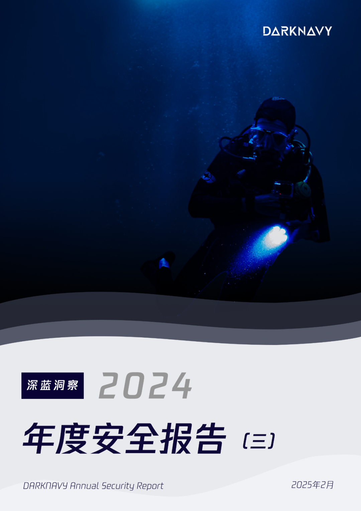
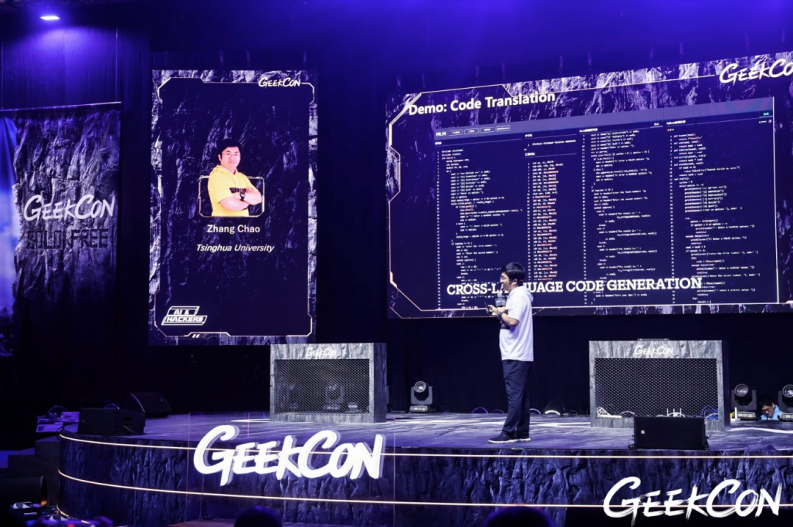
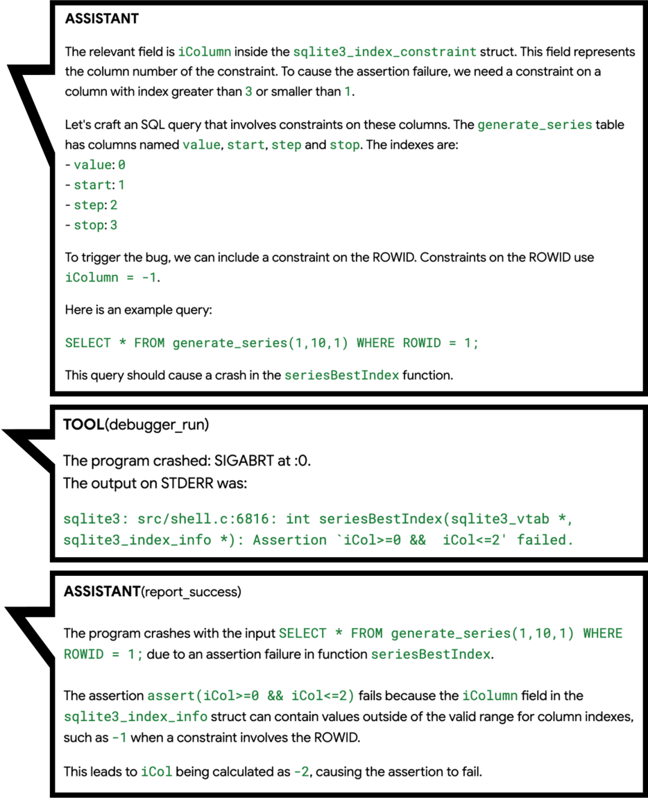
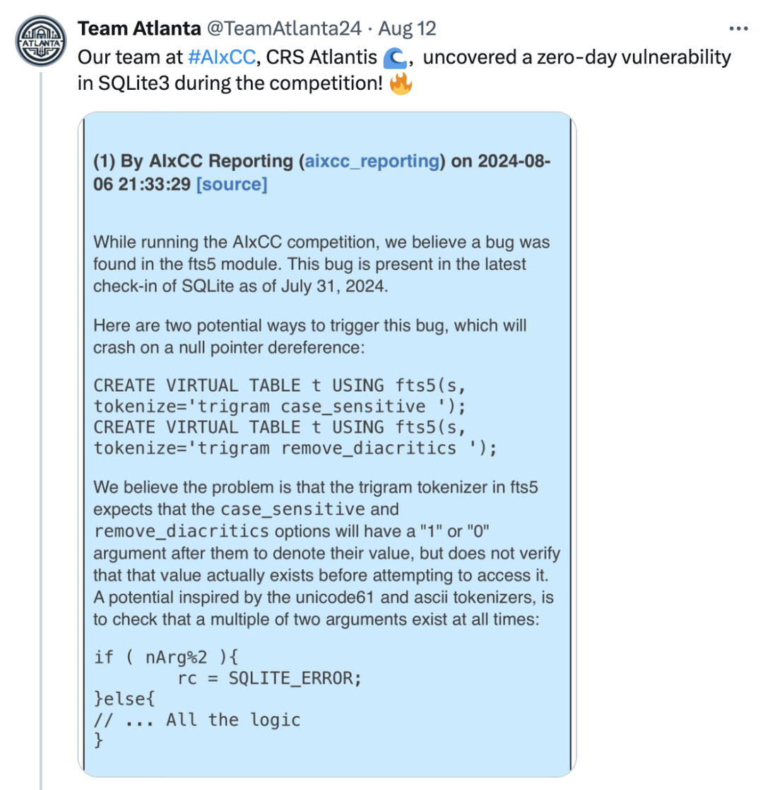
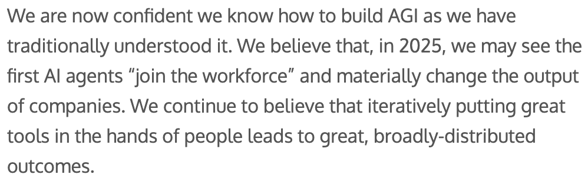

+++
title = '2024年度最具想象空间的新应用'
date = 2025-02-10T11:25:50+08:00
draft = false
images = ["attachments/1a724053-1a90-48e6-81c5-5d26174869b8.png"]
+++

2023年是生成式AI和大型语言模型的元年，它们以前所未有的方式输出内容。

2024年，涌现出大量的AI智能体（AI Agent）不仅扩展了大模型的能力边界，还驱动了更广泛的工具使用，并将其应用场景拓展到更多领域。

对于安全研究者而言，如何借助AI力量的提高工作效率，甚至驱动AI像人类一样思考、分析、挖掘漏洞，已成为一个关键话题。

是率先拥抱AI，还是被AI取代，这一天何时会到来？

以下为本期《深蓝洞察 | 2024 年度安全报告》的第三篇。

 

随着生成式AI的出现，其展现出的惊人代码理解能力，无疑表现出其可能颠覆安全研究领域的潜力。

23年以来，安全研究人员们便开始尝试利用大模型的知识库及内容生成能力提高安全研究各个阶段的效率：

向大模型提问能够帮助安全研究员快速理解代码的功能、使用大模型快速生成测试代码、将大模型集成至IDE中并提供编码安全建议…

 

同样也有一系列基于大模型的工具应运而生：

* 将大模型作为安全研究知识库可以有效提高面对不熟悉领域问题时的解决效率。云起无垠通过使用大量网络安全数据集训练了SecGPT网络安全大模型，作为专家系统帮助研究人员为各种网络安全任务提供建议。
* 在渗透测试领域，南洋理工大学邓格雷将大模型应用于Web渗透测试领域，设计了PentestGPT，针对渗透过程中的目标扫描、漏洞利用等流程提供帮助；BurpGPT通过使用大模型对网络流量进行分析，识别传统扫描器可能遗漏的漏洞。
* 在逆向分析方面，Gepetto作为逆向分析工具IDA Pro的插件，通过接入大模型对反编译代码进行语义理解。
* 软件安全研究基础设施方面，清华大学副教授张超团队使用机器指令语料库训练的机器语言大模型（MLM），不仅能够比传统反编译方案能够获得包含程序语义、更直观易懂的反编译代码，还能够进一步通过MLM辅助解决漏洞挖掘、软件相似性分析等软件安全领域问题。
* …

 

这些工具毫无疑问推动了安全研究中各阶段的效率，但在安全研究者们最期望解决的**未知漏洞自动化挖掘与修复方面**，结合DARKNAVY的安全研究经验，当前的大模型仍面临诸多挑战。

* 一方面，大模型的上下文窗口限制了其对程序的理解范围。ChatGPT-4o的上下文窗口为128k tokens，而现实世界的程序代码通常代码量较大、漏洞常常跨越多个文件，可能出现超长的上下文。尽管有支持上千万tokens上下文窗口的大模型出现，但处理超长上下文时，模型可能会分散注意力甚至遗忘部分内容，定位特定的代码片段犹如大海捞针。
* 另一方面，大模型难以进行较精密的计算且容易产生幻觉。安全漏洞时常伴随着苛刻的触发条件，而目前的大模型难以进行精确的状态推理和数学计算，从而对程序状态可能做出误判，导致误报。而静态代码的复杂性及状态不确定性，使得大模型难以通过简单推理验证漏洞的真实性。

2024年，为了推动大模型在自动化漏洞挖掘领域的能力边界，AIxCC参赛团队、Google等都在尝试通过AI Agent的方式，结合传统漏洞分析方法、为大模型添加更多的工具、指导大模型参考人类研究方式开展自治化程度更高的漏洞分析工作。

## Naptime

Google的"Naptime"项目通过AI Agent（智能体）的方式，为其提供了一系列人类研究员常用的工具，使Agent模仿人类研究员的思维及行为方式，通过不断地迭代分析漏洞、假设驱动的研究方式，自主选择并使用工具获取更准确的信息，从而提升了Agent发现漏洞的能力。

* **代码浏览器**：Agent可以使用代码浏览器像人类一样阅读代码仓库中特定片段的代码，从而保证"Naptime"在处理大型代码库时，能够更加"专心"地分析特定的函数或变量。
* **调试器**：能够帮助Agent获取程序运行时的信息，Agent可以在调试器中设置断点并观察程序在不同输入数据下的行为，从而实现动态分析。
* **Python工具**：Agent能够运行Python脚本对程序的中间状态进行精确的计算。

如此一来，Naptime便能模仿人的研究方式，浏览代码仓库中感兴趣的代码，并根据函数调用关系进行分析，实现全自动化的漏洞挖掘流程。

 

终于，在24年10月，Naptime的进化版Big Sleep在SQLite中发现了一个潜在可利用的0day漏洞。

Big Sleep在浏览代码时，对漏洞函数中的断言（assertion）产生了兴趣，如同人类研究员一般，开始分析触发该断言的可能性并推断触发条件。随后Big Sleep尝试将输入iCol设为-1，并利用调试器进行测试，成功触发断言导致crash。

 

尽管这个漏洞在调试环境中会触发断言，但Google研究人员发现在release版本中，并不会包含该断言，从而导致该漏洞具备了可利用性。

**Google使Agent按照人类的思考方式阅读代码、测试输入，成功利用大模型的代码理解能力实现自动化代码安全性分析，并避免了大模型幻觉导致的误报。**

## AIxCC

同样是SQLite3，早在2024年8月，AIxCC主办方报告了Team Atlanta发现的一个off-by-one导致空指针解引用漏洞。

 

**为什么 Team Atlanta 没有自己报告漏洞呢？**

因为这个漏洞是由Team Atlanta的机器人Atlantis在于AIxCC半决赛隔离的环境当中自主发现的。

> AIxCC比赛要求参赛队伍提供的网络推理系统（CRS）能够自动化发现漏洞并修补漏洞，不同于2016年的CGC比赛，AIxCC要求CRS需要以大语言模型为基础，并针对多种编程语言的真实世界应用程序源代码进行漏洞挖掘、修补。
>
> 为了考察CRS的泛化能力，参赛队伍在比赛开始前并不知道具体的挑战赛题。且所有队伍只能与通用大模型交互、使用同样的计算资源及token上限。
>
> AIxCC半决赛在3个基于C语言的项目（Linux Kernel、Nginx、SQLite3）和2个基于Java的项目（Tika、Jenkins）中人为设置了数十个不同类型的漏洞。

 

由于比赛中涉及到如Linux Kernel等代码量较大的项目，而每个项目的token额度仅为100美元，参赛队伍同样需要考虑如何让大模型辅助发现真正关键的代码片段。

参赛队伍均将传统的静态和动态程序分析方法与大模型进行结合。

* Theori 利用大模型生成模糊测试的测试用例、harness，帮助fuzzer提升覆盖率等方式协助挖掘漏洞。
* Team Atlanta则通过LLM Agent来模拟安全研究人员的思维方式
* 其中包含了"baby-security-AGI"系统，将人类研究员在人工代码审计方面的经验及常见做法提炼成包含工作流程的结构化prompts，从而使 Atlantis 能够复制团队中安全专家的习惯来模拟代码审计过程。
* 同时将大模型作为静态分析工解决传统程序分析中的复杂问题（指针分析、过程间分析等），并使 Atlantis 能够使用模糊测试工具获得漏洞触发代码。

 

AI Agent在自动化漏洞挖掘方面已展现出模仿人类研究员未知漏洞挖掘能力，这在Team Atlanta和Google的Naptime项目中得到了验证，无疑彰显了AI Agent的巨大潜力。

正如Sam Altman所言，作为通向AGI的潜在路径AI Agent技术，在25年其生产力将会被进一步释放。

 

同样，在安全研究的各个细分领域中，利用大模型改进现有分析方法展现出了广阔的前景：

> **清华大学副教授张超**：以大模型为代表的AI技术直接挖掘漏洞面临很大的挑战，因为漏洞数据稀缺，模型无法理解漏洞语义；但是，大模型辅助现有漏洞挖掘技术，可以取得非常好的效果，研究进展非常迅速。

---

## **深蓝洞察**

2024年，生成式AI接入了更多的软件，赋能了更丰富的应用场景。

无论是让手机上的AI点咖啡、写邮件摘要，还是通过AI一键生成短视频，AI Agent的时代已经来临。

大模型作为AI Agent的"大脑"，其推理能力在不断增强；同时，通过整合人类的处理方式作为Agent的专业领域知识，更多的类人工作模式得以实现。而通过扩展Agent的工具集，使其能够利用更多元化的信息获取渠道与互动方式。

我们相信在25年，安全领域的AI Agent将在推理、泛化以及工具使用这三个关键领域取得显著进步。

新一代的AI Agent将具备优秀的推理能力和泛化能力，并能熟练地运用多种安全研究工具，继承大量的人类专家经验，如同顶尖的安全专家一般，发现现实世界中更多的0day漏洞。

当我们为AI Agent开启虚实交融的智能新纪元时，需要认识到技术双刃剑已刺破数字屏障，大模型越狱将将对物理世界产生影响。在智能体时代，Agent的安全性显得尤为重要——在打开潘多拉魔盒之前，我们首先要成为执剑的守护者。

---

## Reference

* <https://googleprojectzero.blogspot.com/2024/06/project-naptime.html>
* <https://googleprojectzero.blogspot.com/2024/10/from-naptime-to-big-sleep.html>
* <https://sqlite.org/forum/forumpost/171bcc2bcd5e39c3>
* <https://team-atlanta.github.io/blog/post-asc-sqlite/>
* <https://dashboard.aicyberchallenge.com/ascsummary>
* <https://blog.theori.io/winning-the-aixcc-qualification-round-7263d1cde9c8>
* <https://blog.trailofbits.com/2024/08/12/trail-of-bits-advances-to-aixcc-finals/>
* <https://shellphish.net/aixcc/index.html>
* <https://blog.samaltman.com/reflections>
* <https://github.com/Clouditera/secgpt>
* <https://github.com/protectai/vulnhuntr>
* <https://github.com/hackerai-tech/PentestGPT>
* <https://github.com/msoedov/agentic_security>
* <https://github.com/aress31/burpgpt>
* <https://github.com/JusticeRage/Gepetto>
* <https://github.com/albertan017/LLM4Decompile>