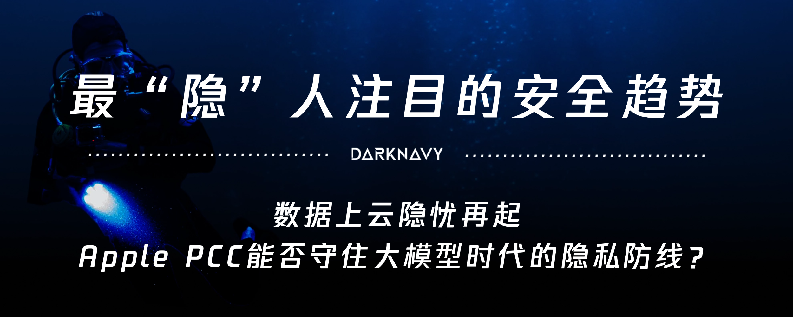

+++
title = '2024年度最“隐”人注目的安全趋势'
date = 2025-02-12T16:40:12+08:00
draft = false
images = ["attachments/970c2c86-bd62-4753-9cbc-87c8c0a5af7f.webp"]
+++

2025年伊始，持续五年的“Siri偷听门”事件终于迎来了终章。苹果公司以9500万美元的和解金，与原告达成了集体诉讼的和解。

这起备受瞩目的隐私争议案件起源于用户指控Siri在未经授权的情况下，意外捕获并录制日常对话，并将数据泄露给第三方广告商。

尽管苹果对此坚决否认，但公众对隐私安全的忧虑却与日俱增。**而如今，我们每天都在与AI共享海量的个人数据，这些隐私数据，真的足够安全吗？**

以下为本期《深蓝洞察 | 2024 年度安全报告》的第五篇。

 

设想这样一个场景：

清晨，你走进一家咖啡馆，手机已经为你点好了一杯拿铁。正当你享受咖啡带来的片刻宁静时，手机屏幕上正循环播放着那些自动生成的相册视频——每一帧仿佛都精确捕捉了你手机中珍藏的记忆。不久后，你接到一个境外来电，接通之后，屏幕上立刻弹出一则"反诈提醒"。

你不由自主地陷入沉思： 

为何咖啡馆能如此准确地推断出你偏爱的咖啡口味？

手机中自动生成相册的视频究竟是在本地处理，还是已被上传到云端？

那张记录助记词的照片，现在是不是也正悄然存放在某个不为人知的云端？

而突然出现的反诈提醒，是否意味着你的通话语音正被某个第三方实时监听？

…

如果说五年前的隐私问题源于智能助手技术的不成熟，那么五年后的今天，随着AI大模型的全面普及，隐私挑战正以更广泛的形式席卷而来。

万物皆AI的时代，意味着海量用户数据需要被采集、处理和利用，用户隐私数据价值更高；此外，由于终端算力的局限，绝大部分数据处理任务不得不依赖云端。用户的数据是否在云端能够真正得到安全保障？从语音助手到大模型，隐私问题并没有随技术的进步而消失，反而愈发凸显。口号式的隐私承诺早已不足以令人信服，只有通过技术上可证明、可验证的保障，才能真正守住隐私底线。

## 隐私计算：大模型时代的安全基石

隐私计算，是解决AI与隐私冲突的关键方案。

从金融到医疗，**数据孤岛现象**依旧如顽石横亘在前。竞争关系、隐私问题与技术障碍让不同机构之间的数据难以互通，数据价值也因此未能完全释放。而对于个人而言，每日与无数模型和应用交互时，如何确保自己的隐私不被泄露或滥用，更是当务之急。

隐私计算技术应运而生，其核心目标是在数据不可见的前提下，实现数据的最大化价值。

* 首先，通过**多方安全计算**\[1\]和**同态加密**\[2\]，隐私计算让敏感数据在加密状态下依旧可计算与分析，实现了数据的"可用不可见"。
* 其次，**联邦学习**\[3\]技术让"数据不动模型动"成为现实。在保障隐私安全的同时，多方数据可以协同计算，进一步提升数据的价值。
* 此外，**可信执行环境**\[4\]则为数据计算提供了硬件隔离的安全基石。通过隔离计算环境，隐私计算能够确保计算过程的安全可信。

随着大模型的爆发式增长，上云成为不可逆转的趋势。端侧算力的局限性让云端处理成为复杂任务的优选方案，端云协同成为模型应用的重要方向。Apple PCC (Private Cloud Compute)\[5\]等端云协同方案已经树立了标杆。

然而，用户上传至云端的数据是否真正安全，依然是悬而未决的问题：**数据上传后，是否会被窃取或滥用？如何让用户信任云端设施的安全性？**

\
 ![Apple PCC 的运行时安全架构\[6\]](attachments/254f2987-d595-4706-aaac-2e9ebb4235c7.png)

为了解决这些问题，隐私计算在云端的应用尤为重要，但这需要克服多方面的挑战：

**首先，云端与端侧需具备同等的安全能力**。为此，厂商需要通过可信执行环境和硬件隔离技术，确保用户数据在计算过程中不会被泄露。例如，Apple PCC 专门设计的Apple Silicon服务器和定制版iOS系统，从安全引导、代码签名，到运行时的各种软硬件保护层层把关，同时，端到端加密通信确保数据只有用户可见，推理完成后定期清空缓存数据。

**其次，云端环境必须对特权访问进行严格限制**。过去不乏拿用户隐私数据作恶的案例，例如Uber在 2016 年发生的5700万用户数据泄露，就源于内部员工利用特权访问窃取数据。因此，服务器和数据库的管理人员需要受到严格监控和权限约束，确保无法滥用访问权限。Apple PCC不仅不提供shell或调试接口，所有日志和事件也必须经过严格过滤后才能离开节点。

**最后，云端隐私计算能力的可信性需要透明化验证**，这也是推动模型应用的关键。然而，目前国内尚无统一的第三方验证标准，这在一定程度上阻碍了云端隐私计算的推广。Apple PCC将云端节点的二进制测量数据（包括操作系统、所有代码固件的测量值）公开在透明度日志中，接受第三方专家的验证，并建立高额的赏金计划，树立了信任标杆。

\
 

此外，即使云端硬件的安全特性能够确保软件的完整性，**但硬件本身的完整性又如何保证呢**？云端服务器硬件的制作过程往往是不完全公开，其上的硬件指令是否如记载的那样执行，也是难以验证的。

对于Apple PCC而言，每台服务器被密封前都会进行清点并拍照，并在数据中心被多方团队进行重新验证。然而，这一流程也并非完全的公开透明。如果深究到底，用户仍然无法完全信任硬件指令产生的透明度测量值是真实的，**甚至是否存在三角测量行动那样的硬件后门**。这仍然是现有厂商需要深入思考的问题。

 

为了验证Apple PCC是否如白皮书所宣称的那样具备绝对的安全性，DARKNAVY基于其发布的虚拟研究环境（VRE）和部分开源代码开展了深入研究。研究结果显示，得益于其软硬件一体化的独特安全机制，Apple PCC能够有效防止隐私泄露的风险，并显著降低远程攻击的可能性。然而，DARKNAVY的研究也发现了一些可能导致云端推理引擎发生崩溃的输入，这表明Apple PCC并非绝对安全。

## 国产探索与未来趋势

在大模型时代的云计算浪潮中，**隐私安全与机密计算已成为安全行业无法回避的关键话题**。个人、企业甚至国家都在寻找切实可行的方案来保障数据安全。试想，如果隐私数据随意裸奔于云端，AI功能再强大也会被画上巨大的问号。

在国内，蚂蚁集团开源的可信隐私计算框架「**隐语 SecretFlow**」\[7\]作为先驱者，以通用化方案整合可信执行环境、多方安全计算和联邦学习等多种技术，试图打破主流框架单一技术路线的局限。隐语通过将各种技术抽象为"密态设备"，并提供统一SDK接口，开发者无需深入底层即可快速实现具备隐私保护特性的算法应用。

 

与此同时，国产手机厂商也在探索大模型与隐私计算的结合。与Apple PCC的一体化生态不同，安卓阵营因品牌与系统版本的多样性而显得碎片化，其用户隐私安全问题更为复杂。

目前，安卓系统主要依赖虚拟化框架与芯片TEE实现数据隔离，但权限管控与用户交互中的隐私泄露问题依然存在。为此，**vivo蓝心大模型**、**OPPO的终端AI机密计算系统**等方案正在尝试填补这些空白。

在大模型时代的当下，用户隐私问题将是潘多拉的盒子，一旦打开而未加以妥善保护，可能释放出无尽的麻烦与威胁。Apple PCC无疑是做了一个好的先驱者，在端云协同模式中提出了多项关键安全标准，也为全球厂商提供了可资借鉴的思路。

虽说国内厂商没有苹果软硬件高度自研的先天优势，但可以通过借鉴PCC的成功经验，并结合自身技术积累，**为用户带来既高效又安心的大模型应用体验**，从而避免隐私安全成为阻碍大模型落地的掣肘。

> **行业专家见解**
>
> **蚂蚁集团副总裁兼首席技术安全官、GEEKCON组委 韦韬**：Apple PCC虽然提出了一套新颖的隐私保护方案，但其宣称的"绝对隐私安全"能否实现仍需进一步探讨，如何确保硬件完整性、保证安全边界收敛、用户端到端可验证等等，仍然是不小的挑战，要实现真正可靠的全链路隐私保护，整个行业仍需攻克诸多技术难关。

---

## 深蓝洞察

一个新的机密计算时代已经悄然拉开帷幕，隐私云安全必将成为下一场技术变革的核心焦点。在大模型释放前所未有的潜能之际，各类传统与新兴的攻防手段也随之潜伏于云端与边缘。

**曾经在操作系统、虚拟化和沙箱阶段历经淬炼的经验，如今在隐私云中将得到新的验证与升华。或许传统的攻防博弈依旧激烈，但机密计算的出现预示着更多创新式的安全理念与落地方式将接踵而至。**

无论是Apple PCC这样的硬核尝试，还是国内产业内的多种探索，安全与隐私正在以前所未有的紧迫性驱动技术进步。我们已经踏进了这一片全新的"机密计算"版图，正如当年移动互联网大潮与国产系统崛起的交叉口，又一次把握未来的关键契机，可能就在眼前。

---

## 参考

* \[1\] <https://en.wikipedia.org/wiki/Secure_multi-party_computation>
* \[2\] <https://en.wikipedia.org/wiki/Homomorphic_encryption>
* \[3\] <https://en.wikipedia.org/wiki/Federated_learning>
* \[4\] <https://en.wikipedia.org/wiki/Trusted_execution_environment>
* \[5\] <https://security.apple.com/blog/private-cloud-compute/>
* \[6\] <https://sensiblesecurity.xyz/p/apple-pcc-is-the-future-of-cloud >
* \[7\] <https://github.com/secretflow/secretflow>
* \[8\] <https://security.apple.com/documentation/private-cloud-compute>
* \[9\] <https://www.secrss.com/articles/68163>
* \[10\] <https://ironcorelabs.com/blog/2024/apple-confidential-ai/>