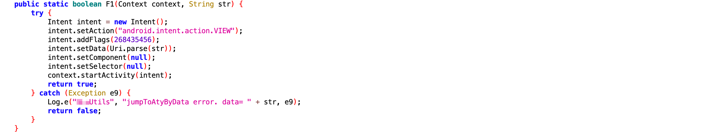

+++
title = '2024年度最隐蔽的黑手'
date = 2025-02-17T18:00:44+08:00
draft = false
images = ["attachments/95a32e80-a271-411d-a274-b116814043f1.png"]
+++

在移动互联网时代，用户流量代表着厂商的命脉。在这场流量争夺战中，手机厂商掌握着最具压倒性的优势——操作系统的终极权限。通过对安卓AOSP进行深度定制，厂商不仅可能有权精准掌控用户和应用的一举一动，甚至还能够操控、干预用户的选择。

通常，极少有企业会选择违法违规、滥用特权来侵害消费者。

然而2024年，国产某知名手机品牌突破商业伦理底线，利用非安全技术手段暗中操纵自产手机系统，让数百万用户沦为他们的牟利工具。

以下为本期《深蓝洞察 | 2024 年度安全报告》的第十·完结篇。

 

对于安卓游戏爱好者来说，或许遇到过这样的困扰：当你想从游戏官网下载安装一款游戏时，系统却不遗余力地推送内置应用市场的下载入口，显得格外"贴心"。

但如果你坚持从官网安装，流程却变得复杂繁琐冗长：不仅需要拒绝系统三番五次插入的应用市场推荐，还需要无视重重风险警告、等待系统完成额外的安全扫描等。

为什么选择官网需要繁琐的操作，而选择应用市场就能一键快捷安装？

背后的原因直指手机厂商的现实利益：如果成功引导用户使用应用市场安装游戏，手机厂商作为渠道方就可以从游戏流水中抽取2\~3成的分成，甚至有时分成比例高达五五开。但对于从游戏官网完成的安装，所有流水收入全由游戏开发商所有。

于是，厂商通过优化自家渠道的体验，巧妙提高了其他下载途径的难度，默默地引导用户流量，完成利益的最大化。

然而，这种流量引导还算明面上的商业竞争范畴，但某些厂商却暗地将系统权限用在了更隐蔽、更恶劣的领域，彻底突破了商业伦理的边界。

 

在GEEKCON 2024 上海站，两位选手为大家带来了特别披露议题[【买手机送木马？】](https://mp.weixin.qq.com/s/FegV2RuyNT0uwIb2QEnmWA)，披露了某国产手机厂商的恶行：该厂商利用系统权限，在用户不知情的情况下向多个第三方应用植入广告。数百万用户正常体验被破坏的同时，手机厂商却从应用方赚取了数千万的推广费用。

在该品牌的手机上，部分应用表现得极为异常：

用户从桌面点击图标启动应用，在等待开屏界面加载后，打开的并非应用首页，而是直接进入了一个"包含广告的页面"。用户需要额外点击返回键才能回到首页正常使用，体验打了折扣。

看似是**应用**投放了不会自动关闭的开屏广告，但真相是**该手机厂商在暗中作祟，劫持了用户的点击操作**！

被劫持的那些应用有一个共同特点：它们的商业模式包含推广返佣机制，即它们愿意为外界的推广行为付费。在常规合作中，外部推广者会在各类平台投放带追踪参数的推广链接。当用户点击这些链接时，会跳转到应用内与推广内容相关的落地页面。此时应用也能通过解析推广链接中的渠道代码，精准识别流量来源，并向推广者支付单笔报酬、或后续购买行为的酬金。

应用自动打开的"包含广告的页面"，实际上正是它们的推广页面。这意味着**该厂商把用户自主打开应用的行为替换成推广访问行为，从而通过应用的返佣机制牟利**！

 

按照安卓系统规范，当我们在桌面上点击应用图标时，启动的应该是应用在AndroidManifest.xml中注册有`android.intent.action.MAIN`和`android.intent.category.LAUNCHER`标志的Activity，推广页显然不符合条件。

仔细观察例图页面的顶端，在标题的两侧可以发现几个类似浏览器功能的按钮。推广页的本质其实是在应用内置浏览器中加载的网页，使用Deep Link启动应用可以很容易地做到这一点。

> **Deep Link**（**深链接**）是指一种特殊的URL，是实现应用间快速导航、内容分享以及推广转化的重要工具。使用Deep Link能够直接跳转到安卓应用内的特定页面或功能，而不是简单地打开应用的主界面。

那么该厂商是如何修改系统逻辑进行劫持的？通过对其桌面应用进行分析，可以得出结论：

该厂商的桌面应用基于AOSP源码定制，但向处理点击事件的`ItemClickHandler.onClick`插入了额外的处理逻辑。它根据正常应该启动的Activity名称去寻找劫持配置，如果存在匹配，就直接通过配置中的Deep Link启动应用、直达推广页；否则才继续进行正常的应用启动流程。

为了避免劫持反复触发，桌面还会移除已使用过的配置。仅第一次打开应用时触发，这样的劫持行为也更容易被用户误解为应用的开屏广告，让用户的矛头错指应用方。

 

 

 

这些行为破坏了公平竞争，还严重侵犯了用户与相关应用方的权益，可能违反相关法律法规。

> 《**反不正当竞争法**》第十二条明确规定：经营者不得利用技术手段，通过影响用户选择或者其他方式，实施下列妨碍、破坏其他经营者合法提供的网络产品或者服务正常运行的行为：（一）未经其他经营者同意，在其合法提供的网络产品或者服务中，插入链接、强制进行目标跳转……

和[「深蓝洞察」曾披露过的另一家违规巨头](https://mp.weixin.qq.com/s/P_EYQxOEupqdU0BJMRqWsw)类似，本案例中的厂商，也采用了一系列的技术手段来掩盖他们的违规行为：

含有Deep Link的配置并未事先存储在设备中，而是由厂商的服务器根据特定规则动态下发。GEEKCON选手指出，并非所有该品牌的设备都会接收到这些恶意劫持配置。这表明，厂商可能依据用户的画像、手机的地理位置等因素来决定是否下发这些配置，**从而将受影响的用户群体锁定为技术知识相对薄弱的二三线城市的中老年人群体**。

此外，该厂商再次滥用特权，下发的恶意配置文件被保存在桌面应用的私有数据目录中，由于安卓系统的应用沙箱隔离机制，每个应用的数据存储区域都受到严格保护，以此阻止第三方提取证据。动态下发的机制也赋予厂商远程销毁证据的能力，使得追踪与固证更加困难。

我们以为自己在自由地使用手机，实际上，每一步都可能是被精心设计的陷阱。

> **京东集团高级总监兼首席安全研究员、GEEKCON组委 flanker**：
>
> 内存破坏漏洞，凭借先进的技术手段，尚可不断予以消灭和预防；然而，业务模式所衍生出的安全与隐私风险，却犹如顽固的沉疴，最难根除。
>
> 正如古人云："破山中贼易，破心中贼难"。科技本身，纯净无瑕，不过是供人驱使的工具，其本质无善恶之分；然而人心的幽深复杂，恰似深不可测的万丈深渊，潜藏着难以分辨的善恶欲念。

---

## 深蓝洞察

数字技术的使命应是为人们带来便利与福祉，进而实现用户和厂商的共赢。而当技术被滥用甚至恶意使用成为谋取私利的工具时，受损的不仅是用户的权益，更是整个技术生态的信任基础。

iOS缘何成为人们心中安全与隐私的代名词，这不仅得益于其软硬结合、缜密完备的安全防御体系，更在于其生态环境中对隐私保护的高度重视，以及在商业化进程中所秉持的克制态度。诚然，苹果较高的硬件利润率或许是其能坚守隐私保护的因素之一，但换个角度看，这种克制又何尝不是铸就了人们对其品牌的高度认可，以及甘愿为之付出溢价的消费意愿？

如今，以HarmonyOS NEXT为代表的新一代操作系统正蓬勃崛起，在这充满挑战与机遇的进程中，它能否承受住各方压力，避免重蹈覆辙，切实守护用户的安全与隐私？各大厂商能否躬身自省，与iOS见贤思齐？这无疑是消费者与行业共同关注的焦点。

\* 本期深蓝洞察年度报告共十篇已发布完结，感谢您的支持、期待您的宝贵建议。

---