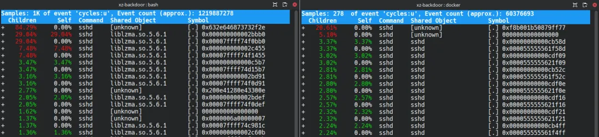
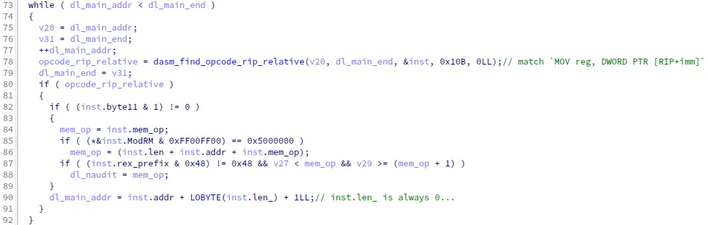

+++
title = '2024年度最悲剧的后门'
date = 2025-02-13T17:07:28+08:00
draft = true
images = ["attachments/8e1f8e07-a662-4ac7-aa92-5d6b11cd4d31.png"]
+++


> **看到了软件的源码，就意味着没有后门吗？**

1983年的图灵奖颁奖仪式上，Ken Thompson抛出了这个问题。作为历史上唯三在40岁以下获得图灵奖的传奇之一，他在获奖演讲中向听众展示了如何通过在编译器中植入后门来骇入由无害源码编译得到的Unix系统。Ken的演讲为整个开源世界敲响了信任的警钟，并且直至今日仍为年轻黑客们所津津乐道。

2024年，XZ backdoor事件横空出世，将Ken的问题重新拉回了大众的视野。开源社区众目睽睽之下，攻击者成功将带有后门程序的xz-utils 5.6.1软件包更新到了Debian(Sid)/Fedora(Rawhide)等发行版的官方软件源中。万幸的是，工程师Andres Freund及时发现了xz-utils 5.6.1的异常行为。尽管在社区共同努力下后门程序的传播被及时阻断，但这场惊心动魄的危机仍然在敲打着每一个开源软件的使用者，提醒我们重新审视开源世界中的开发模式和信任传递问题。

在本报告中，我们将试图从技术角度还原xz backdoor从植入到被发现的整个过程，希望能够帮助读者更好地理解和应对开源代码所面临的安全威胁。

以下为本期《深蓝洞察 | 2024 年度安全报告》的第六篇。


 


## XZ backdoor：开源世界的信任崩塌

xz项目由Lasse Collin等人于2005年发起，因其优异的性能和压缩比逐渐成为了Linux Kernel，FreeBSD等开源软件的默认压缩方式，并且以`liblzma`依赖库的方式被`openssh-server`（部分发行版，如Debian）等关键程序引用，使用极为广泛。然而，早在2013年的文档中\[1\]就有提到：Lasse因"个人原因"导致项目更新缓慢。这样一个应用极为广泛但欠缺维护的开源软件无疑是攻击者的首选目标。

锁定目标后，攻击者有组织地展开行动，试图获取XZ仓库代码修改权限并植入后门。

* 2021年10月，网名Jia Tan的开发者向xz-devel邮件列表提交补丁，积极参与讨论。Jia Tan在邮件中将自己包装成一个善意的帮助者（"a helper elf"）\[2\]，并同时在wasmtime，cpp-docs等项目中提交补丁，逐步取得了管理员Lasse的初步信任。
* 2022年5月，攻击者多次通过Dennis Ens和Jigar Kumar两个账号在邮件列表中抱怨项目进展缓慢，向Lasse施压，促使其将更多任务交给"乐于助人"的Jia Tan。
* 2022年12月，Jia Tan合并了一些补丁到xz仓库中，证明攻击者**已经取得了直接修改xz源码的权限**。
* 2023年6月，名为Hans Jansen的账号发送了使用glibc间接函数`IFUNC`机制来选择crc函数的补丁，为后续后门植入做了准备。
* 2024年2月，Jia Tan合并了藏有后门的二进制测试文件，并发布带触发脚本的xz-5.6.0版本，**被Debian纳入unstable版本软件源中**。同时Jia Tan向Fedora 40维护者发送邮件申请升级xz软件包。
* 2024年3月4日，RedHat社区报告\[3\]liblzma运行时异常，其中Valgrind提供的调试信息指向了后门入口函数`_get_cpuid`。攻击者迅速反应，在新的`xz-5.6.1`中添加了两个补丁来修复这一BUG，分别是声称修复BUG的伪装补丁和实际修复后门中BUG的二进制文件补丁。对于后者，Jia Tan声称修改理由是改用确定性的随机种子生成的新测试数据。
* 2024年3月28日，以Jia Tan为首的多名攻击者在Debian/Ubuntu bug list中发声，推动了Debian升级xz软件包到`xz-5.6.1`。同日，工程师Andres Freund发现该版本中`liblzma`的异常行为并向Debian社区报告。


从以上复盘可以看出，攻击者为了在XZ这样一个广泛使用的开源软件中植入后门而不被发现，在攻击的非技术层面做了精心设计和准备，包括：


1. 长期渗透：以半年为周期推进计划，降低怀疑与曝光概率。
2. 社会工程学攻击：利用Jia Tan的开源贡献者身份取得信任，同时以伪造多个用户身份对开源软件维护者维护者心理施压。
3. 分布式投毒：将恶意代码拆解为多个部分，不经意地夹杂在日常的无害代码贡献中，由不同身份分阶段提交。
4. 心理弱点利用：抓住了维护者长年以来的疲惫心理，也抓住了使用者对二进制文件与源码匹配性的疏忽心理。 可以看到，对以社区合作形式开展的开源项目的攻击，可能不仅仅局限在狭义的技术层面。无论是可重现构建还是零信任架构，我们不仅需要设计如何保护数据与系统，更需要思考人与人之间，人与技术之间，甚至技术与技术之间如何重新构建一种更有韧性，更可持续的信任体系。

> XZ backdoor攻击者的这盆冷水，并没有浇灭开源社区众人拾柴的火焰。然而，信任问题并没有得到根本解决的情况下，倘若未来第二个，第三个Jia Tan出现，我们还能否有现在的自信和乐观？

## 功败垂成——是运气使然还是skill issue？

时间过去9个月，网络上已经有大量深入的对XZ后门程序的逆向工程分析\[4,5\]。回过头来，我们想探究的问题是：**攻击者耗费了2年时间精心隐藏植入的后门，为什么会在如此短的时间内就被发现**？从攻击者的角度出发，这其中存在的缺陷是否还能够进一步优化？ 从防御者角度出发，又如何更好的及时发现和定位类似的问题？

Andres Freund在社交媒体上的评论表示，他一开始只是发现有恶意攻击者在**爆破服务器ssh密码**，但是造成了异常高的CPU占用。随后他对`sshd`进行了性能分析，发现更新过`liblzma.so`后其处理每个ssh连接的时间从0.3秒增加到了0.8秒。联想到之前偶然看到的Valgrind报错，Andres对`xz-5.6.1`中的`liblzma.so`和源码构建脚本进行了深入分析并得出了其内部被植入后门的结论。

 

然而，根据先前研究人员逆向工程的结果\[4\]，xz 5.6.1中后门程序的主要原理是拦截RSA解密函数后，根据ssh客户端发送证书中的字段进行解密，验签和执行命令操作。我们调试过程中发现，对于**通过密码来登录的方式，并不会触发到后门代码的执行**。也就是说按照现有的理解（或者说攻击者的设计思路），Andres应该无法从密码爆破这个现象观察到有明显的时间差异。

为了重现Andres的发现过程，我们使用`perf`对`sshd`进行了性能分析，显然带有后门的`liblzma.so`明显消耗了异常的计算资源。

 

经过进一步分析`perf`报告的热点指令`liblzma.so:0x2bbb0`处的代码，我们发现其位于后门代码中的一处x86_64指令反汇编器中。该反汇编器的主要作用是从给定地址处开始解析一条x86_64指令，配合其他上层函数实现基于汇编模式来匹配无符号的`sshd`和`ld`中的目标函数和结构体的偏移地址。

例如，在初始化阶段，XZ后门程序需要将`dl_audit`全局变量改为伪造的`audit_iface`结构体从而劫持`symbind64`函数调用，进而劫持`RSA_public_decrypt`等函数。为了找到`dl_audit`的地址，后门程序使用反汇编器扫描`ld`的内存，找到`dl_main`函数中满足模式`MOV reg，DWORD PTR [RIP+imm]`的指令，并进行解析其内存操作数。

 

我们进一步分析发现，在重复调用反汇编器进行汇编模式搜索时，攻击者在一些上层函数中会让搜索的内存地址向后移动解析出来的指令长度，从而直接反汇编下一条指令。

 

然而，在反汇编器的内部实现中，解析出的"指令长度"却永远是0。这导致了后门代码事实上是在**逐字节**对每一个目标代码区间进行反汇编。此外，还有一些上层函数调用反汇编器时直接逐字节扫描目标内存:

 

这无疑为后门代码的运行带来了大量运行时开销。动态分析表明，该反汇编器函数的调用次数多达**944万次**。而每次调用中，仅仅是函数开头初始化解析结果结构体的`liblzma.so:0x2bbb0: rep stosd`指令就会被重复执行22次，也就是说仅仅这一行代码就执行了超过**2亿次**，导致`liblzma.so`在`perf`的输出报告中鹤立鸡群。因此我们推定，该反汇编器和相关的汇编匹配函数的实现缺陷是导致这一后门程序在运行中消耗了大量资源的根本原因。我们大胆猜测，负责开发这部分代码的攻击者可能认为该反汇编器的大规模调用只会在ld运行期间发生一次，因此只会一次性地影响`sshd`服务初始化时的性能开销。然而，`openssh-server`从3.9版本开始便默认采取了`re-exec`模式，即每个`fork`得到的子进程都会调用execv来重新初始化进程地址空间\[6\]：

```c

static int rexec_flag = 1;
...
/* This is the child processing a new connection. */
setproctitle("%s", "[accepted]");

/*
 * Create a new session and process group since the 4.4BSD
 * setlogin() affects the entire process group.  We don't
 * want the child to be able to affect the parent.
 */
...

if (rexec_flag) {
...
    execv(rexec_argv[0], rexec_argv); // Make sshd(8) re-execute itself on accepting a new connection.
```

也就是说，每当有1个新的ssh连接, `sshd`都会重新执行整个后门代码的初始化过程，消耗0.5s的CPU时间。我们在本地分别对带有后门和没有后门的`sshd`进行了ssh爆破测试，发现后门版本的CPU使用率远远超过无后门版本(9.6% v.s. 0.7%)：

 

因此当Andres在使用期间有另外一组攻击者试图爆破其ssh密码时，sshd对于CPU资源的消耗便上升到了无法忽视的地步。

 

至此，我们才真正确认了XZ backdoor在短时间内被发现的根本原因。作为近年来最（接近）成功的开源供应链攻击，XZ后门的"翻车式"退场给所有潜在攻击者上了一课：后门代码植入，不光要藏得深，还得经得起"压力测试"。

> 这一次运气站在了我们这边，但如果攻击者有足够的耐心进一步测试和优化攻击代码，结果是否已经不同？我们又需要通过什么样的方法来发现它？


---

## 深蓝洞察

2024年，除XZ backdoor外，CrowdStrike的全球蓝屏事故，黎巴嫩寻呼机爆炸等事件也向我们传统认知里系统安全的定义和边界发起了挑战。

与往年的永恒之蓝、Log4j等安全大事件相比，这些"后起之秀"们并非起源于技术层面上的软件漏洞，而是在信任传播的供应链中最薄弱的一环悄然发生，便能轻易撬动整个生态系统的安全性。

另一方面，内存破坏等传统二进制漏洞的利用由于各种软硬件安全机制的普及而变得愈发困难，也进一步加强了安全研究向新的领域和形态迁移的进程。

在敌暗我明，攻守易势的时代，如何继续实现安全，保护价值，已成为每位安全研究人员面临的共同机遇与挑战。


---

## 参考

* \[1\] <https://github.com/kobolabs/liblzma/blob/87b7682ce4b1c849504e2b3641cebaad62aaef87/doc/history.txt>
* \[2\] <https://www.mail-archive.com/xz-devel@tukaani.org/msg00518.html>
* \[3\] <https://bugzilla.redhat.com/show_bug.cgi?id=2267598>
* \[4\] <https://securelist.com/xz-backdoor-story-part-1/112354/>
* \[5\] <https://gist.github.com/smx-smx/a6112d54777845d389bd7126d6e9f504>
* \[6\] <https://sources.debian.org/src/openssh/1%3A9.2p1-2%2Bdeb12u4/sshd.c/#L2200>
