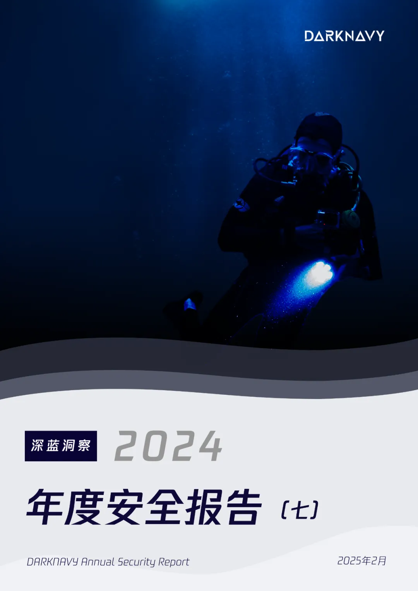

+++
title = '最难以阻挡的攻防趋势'
date = 2025-02-14T17:47:00+08:00
draft = true
images = ["attachments/66d62bdf-96d3-4786-9ee4-40f7f261947a.webp"]
+++

近年来，漏洞攻防不断演进。从多年前仅需一个栈溢出就能攻破系统，到如今需要运用各种精妙的手法来突破系统的层层防御。"盾"与"矛"始终处于动态对抗：每当新的防御措施出现，新的攻击手段随之而来。防御机制的升级促使攻击者寻找新的突破口，而攻击方法的创新又推动着防御技术的进一步发展。

以下为本期《深蓝洞察 | 2024 年度安全报告》的第七篇。

 

---

## 愈发坚韧的"盾"

每个防御机制的提出都是对内存漏洞利用的精准打击。多年前，ASLR的引入显著提高了漏洞利用的难度和复杂性。时至今日，绕过ASLR仍然是大多数漏洞利用的首要步骤。到了2024年，针对内存破坏的防御机制更是层出不穷。

2023年推出的Google Pixel 8支持了被称为"内存问题终极武器"的Memory Tagging Extension（MTE）特性，其是ARM v8.5新增的一个硬件特性，MTE将指针与其内存利用tag进行匹配，以此来阻止内存的非法访问。同时，这也是MTE首次走入消费者群体。**2024年的1月，DARKNAVY的安全研究员发布了关于MTE对软件安全性影响的研究**。研究表明，MTE有效缓解了堆内存漏洞（如UAF、堆越界读写等），在线性溢出场景下几乎完全消除了漏洞利用的可能性。作为UAF漏洞的长期受害者，Google也为Chrome提出了MiraclePtr机制，更是自信地宣称：受MiraclePtr保护的UAF不再视为安全漏洞。

Linux作为使用最广泛的操作系统之一，其内核近几年也引入了各种防御措施以阻止内存破坏的利用。为了缓解内核中的堆内存破坏问题，Linux Kernel中引入"SLAB VIRTUAL"、"RANDOM_KMALLOC_CACHES"、"AUTOSLAB"等一系列防御机制。为了加强用户态程序的安全性，Linux Kernel 6.10新增系统调用mseal（memory seal），允许开发人员在程序运行时保护内存区域免受非法修改。

那么如此多的防御机制是否阻止了某些利用呢？

2024年11月，苹果披露了两个针对WebKit的在野利用，但这些利用仅限于Intel芯片的Mac设备。 为什么2024年的漏洞只在较早的系统版本上被利用？这很可能与M系列芯片的先进防御机制有关，这些机制阻止了攻击者的利用。

 

从软件到硬件，从用户态到内核态，在防御机制的层层铁壁下，内存漏洞已难以突出重围。种种迹象表明，内存漏洞似乎正走向终结。

## 未来之"矛"

漏洞不会消失，安全问题依然存在，那么在内存漏洞式微的时代，一个"powerful"的漏洞及其利用又是什么样呢？

2024年6月，Meta Red Team披露了漏洞CVE-2024-31317，该漏洞允许攻击者以任意应用身份执行任意代码，并可在Android 9及更高版本上实现利用，实现Android通杀。

值得一提的是，CVE-2024-31317并不是一个内存破坏漏洞，而是发生在Zygote的命令注入漏洞。Zygote是Android系统上的核心组件之一，它会孵化出Android中Java世界的所有进程，system_server也不例外。

 

实际上，Zygote是通过command socket从system_server中接收指令，并根据指令孵化出子进程。然而，Zygote只是盲目地去解析从system_server接收到的buffer，而不做额外的二次校验。因此，如果能够通过某种方式操纵system_server在command socket中写入攻击者可控的内容，就可以实现命令注入！

研究人员分析发现，`denylistexemptions` 就提供这种能力。在该机制中，当`hidden_api_blacklist_exemptions` 被修改后，新写入的值会在解析后直接写入到Zygote command socket中。因此，只要控制该值即可实现命令注入。

下图展示了该漏洞的利用效果之一，启动一个可调试注入的settings进程：

 

可以看到该漏洞并不涉及内存破坏，依然影响了众多的安卓系统，这种漏洞本质是程序逻辑层面出现了问题，其影响力不亚于甚至超过传统的内存漏洞。随着内存漏洞利用门槛的持续攀升，非内存破坏类漏洞逐渐成为攻击者实现目标的"捷径"：

* 2024年2月，著名的"XZ Utils backdoor"事件曝光，一位别有用心的开发者在社区潜伏多年，最终成为核心维护者后在项目中植入了隐蔽后门。
* 2024年4月，全球知名防火墙软件PAN-OS被发现存在命令注入漏洞CVE-2024-3400，攻击者可对运行该系统的设备进行未授权RCE，并获取系统root权限。
* 2024年6月，DEVCORE披露了漏洞CVE-2024-4577，揭示Windows环境下运行的PHP-CGI存在参数注入漏洞。
* 2024年11月，watchTowr Labs披露了"FortiJump"漏洞，指出网络管理平台FortiManager存在命令注入漏洞。
* 2024年12月，DEVCORE的Orange Tsai在Black Hat EU 2024揭示了Windows ANSI API中潜藏的安全隐患。众多软件未能正确处理Windows的"Best-fit"特性，导致路径/文件名、命令行和环境变量的注入问题，并且几乎影响到全球所有Windows系统版本。

大胆猜测，内存漏洞难以利用后，未来之"矛"或许就隐藏在各种逻辑漏洞、供应链攻击之下。

---

## 深蓝洞察

当内存安全防御构建起层层壁垒，攻击者的"矛"已悄然转向更隐蔽的战场。"没有绝对安全的系统"，内存安全逐渐成为基础设施的"及格线"，安全防御面临更深层的体系化挑战：如何构建覆盖软件供应链的信任验证机制？如何实现业务逻辑的自动化安全建模？这些问题将是下一代安全对抗的重点。

安全对抗从未终结，只是在不断升级的维度中重塑对抗格局。安全研究者需要以更立体的视角审视安全边界——当内存漏洞走向黄昏时，逻辑漏洞的迷雾正在黎明中显现。

---

## 参考

* \[1\]: <https://en.wikipedia.org/wiki/Address_space_layout_randomization>
* \[2\]: <https://source.android.com/docs/security/test/memory-safety/arm-mte>
* \[3\]: <https://www.darknavy.org/blog/strengthening_the_shield_mte_in_memory_allocators/>
* \[4\]: <https://blog.trailofbits.com/2024/10/25/a-deep-dive-into-linuxs-new-mseal-syscall/>
* \[5\]: <https://lore.kernel.org/lkml/20230915105933.495735-15-matteorizzo@google.com/>
* \[6\]: <https://chromium.googlesource.com/chromium/src/+/ddc017f9569973a731a574be4199d8400616f5a5/base/memory/raw_ptr.md>
* \[7\]: <https://webkitgtk.org/security/WSA-2024-0007.html>
* \[8\]: <https://support.apple.com/en-us/121752>
* \[9\]: <https://en.wikipedia.org/wiki/XZ_Utils_backdoor>
* \[10\]: <https://security.paloaltonetworks.com/CVE-2024-3400>
* \[11\]: <https://rtx.meta.security/exploitation/2024/06/03/Android-Zygote-injection.html>
* \[12\]: <https://devco.re/blog/2024/06/06/security-alert-cve-2024-4577-php-cgi-argument-injection-vulnerability-en/>
* \[13\]: <https://labs.watchtowr.com/hop-skip-fortijump-fortijumphigher-cve-2024-23113-cve-2024-47575/>
* \[14\]: <https://worst.fit/>
* \[15\]: <https://blog.flanker017.me/the-new-mystique-bug-cve-2024-31317/>